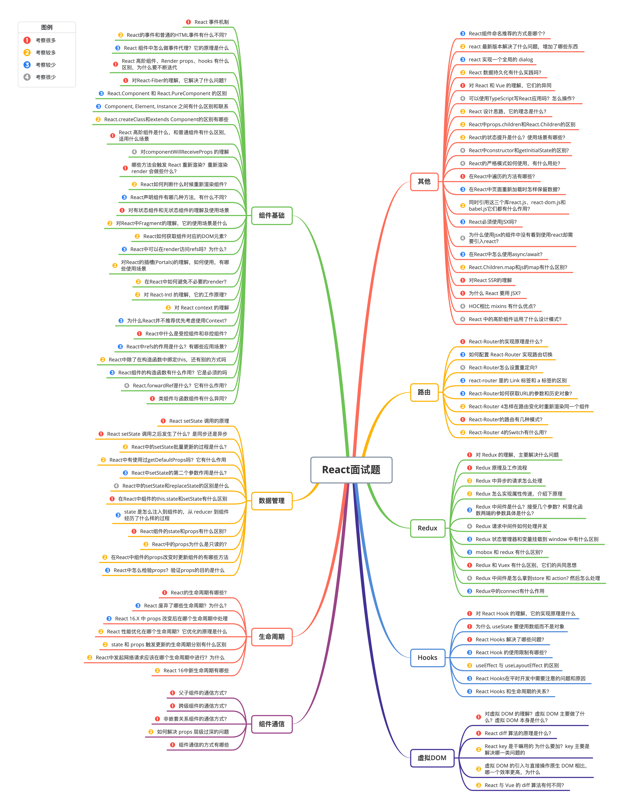
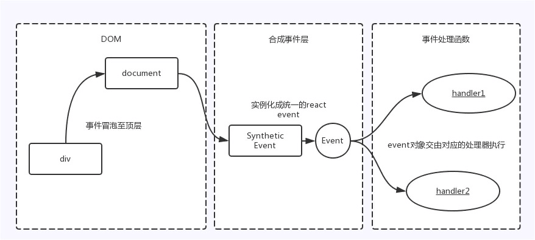
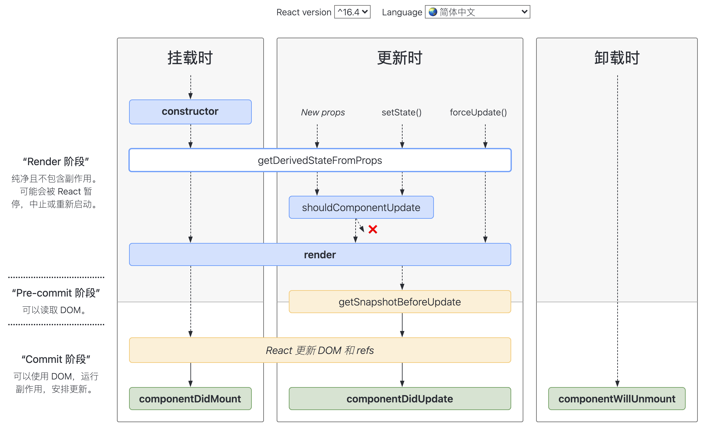
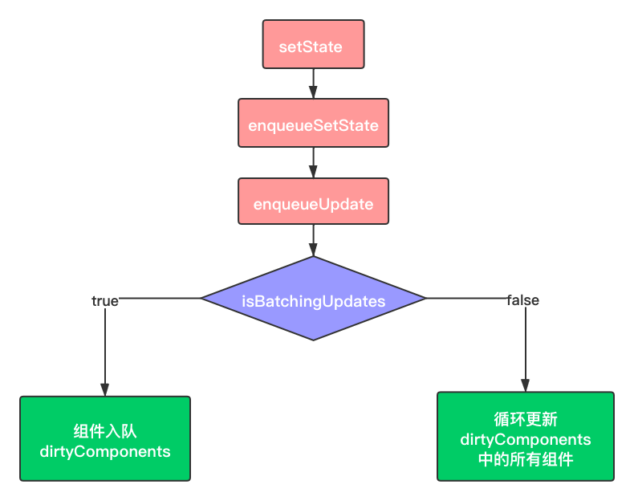
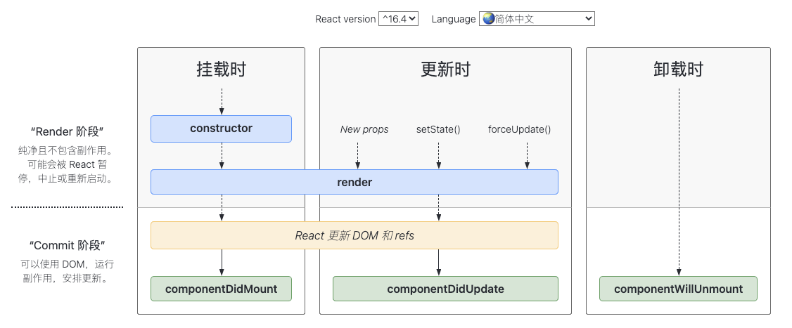
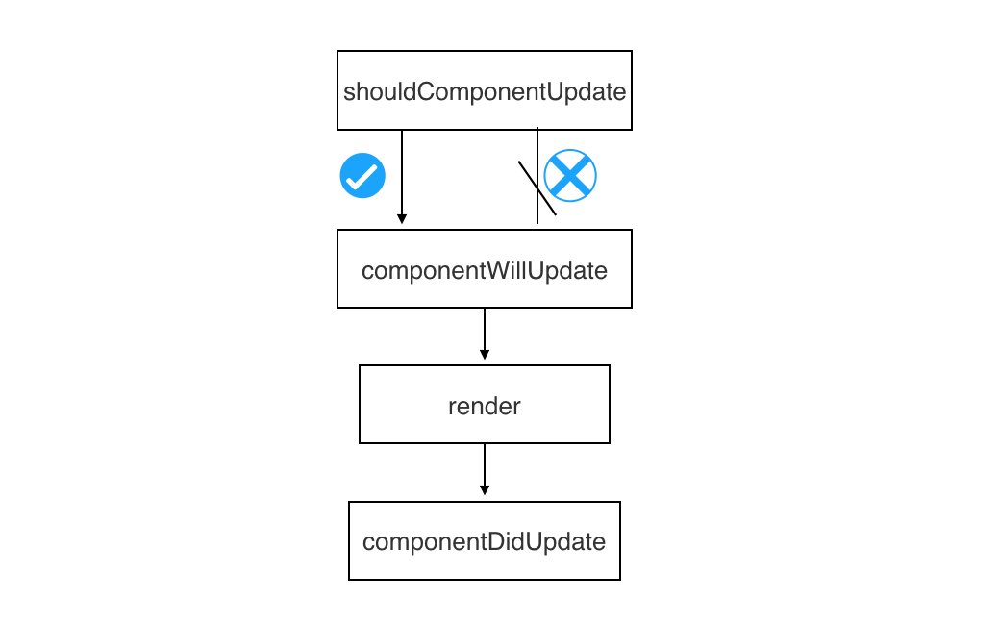
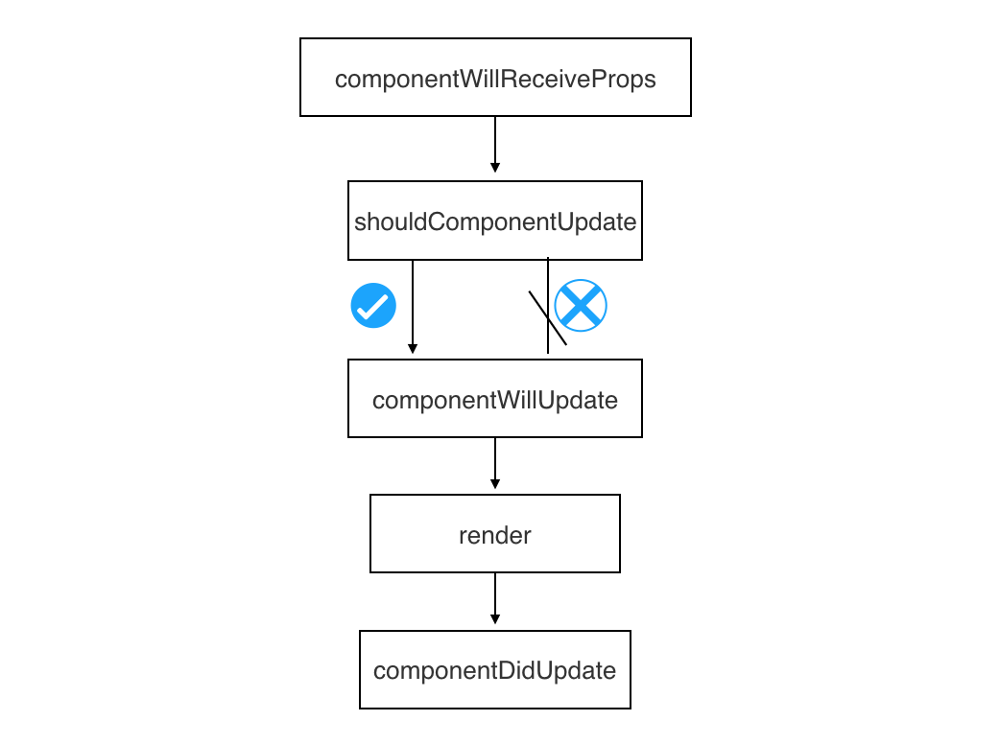
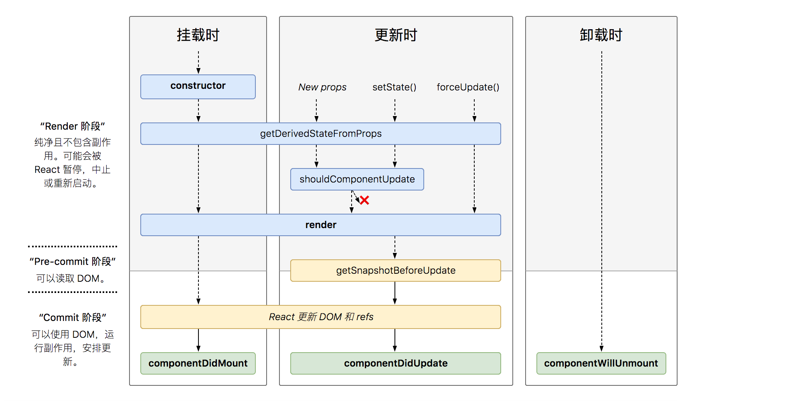

 


## 一、组件基础

### 1. React 事件机制

```javascript
<div onClick={this.handleClick.bind(this)}>点我</div>
```

React并不是将click事件绑定到了div的真实DOM上，而是在document处监听了所有的事件，当事件发生并且冒泡到document处的时候，React将事件内容封装并交由真正的处理函数运行。这样的方式不仅仅减少了内存的消耗，还能在组件挂在销毁时统一订阅和移除事件。


除此之外，冒泡到document上的事件也不是原生的浏览器事件，而是由react自己实现的合成事件（SyntheticEvent）。因此如果不想要是事件冒泡的话应该调用event.preventDefault()方法，而不是调用event.stopProppagation()方法。

JSX 上写的事件并没有绑定在对应的真实 DOM 上，而是通过事件代理的方式，将所有的事件都统一绑定在了 `document` 上。这样的方式不仅减少了内存消耗，还能在组件挂载销毁时统一订阅和移除事件。


另外冒泡到 `document` 上的事件也不是原生浏览器事件，而是 React 自己实现的合成事件（SyntheticEvent）。因此我们如果不想要事件冒泡的话，调用 `event.stopPropagation` 是无效的，而应该调用 `event.preventDefault`。


实现合成事件的目的如下：

- 合成事件首先抹平了浏览器之间的兼容问题，另外这是一个跨浏览器原生事件包装器，赋予了跨浏览器开发的能力；
- 对于原生浏览器事件来说，浏览器会给监听器创建一个事件对象。如果你有很多的事件监听，那么就需要分配很多的事件对象，造成高额的内存分配问题。但是对于合成事件来说，有一个事件池专门来管理它们的创建和销毁，当事件需要被使用时，就会从池子中复用对象，事件回调结束后，就会销毁事件对象上的属性，从而便于下次复用事件对象。

### 2. React的事件和普通的HTML事件有什么不同？

区别：

- 对于事件名称命名方式，原生事件为全小写，react 事件采用小驼峰；
- 对于事件函数处理语法，原生事件为字符串，react 事件为函数；
- react 事件不能采用 return false 的方式来阻止浏览器的默认行为，而必须要地明确地调用`preventDefault()`来阻止默认行为。


合成事件是 react 模拟原生 DOM 事件所有能力的一个事件对象，其优点如下：

- 兼容所有浏览器，更好的跨平台；
- 将事件统一存放在一个数组，避免频繁的新增与删除（垃圾回收）。
- 方便 react 统一管理和事务机制。


事件的执行顺序为原生事件先执行，合成事件后执行，合成事件会冒泡绑定到 document 上，所以尽量避免原生事件与合成事件混用，如果原生事件阻止冒泡，可能会导致合成事件不执行，因为需要冒泡到document 上合成事件才会执行。

### 3. React 组件中怎么做事件代理？它的原理是什么？

React基于Virtual DOM实现了一个SyntheticEvent层（合成事件层），定义的事件处理器会接收到一个合成事件对象的实例，它符合W3C标准，且与原生的浏览器事件拥有同样的接口，支持冒泡机制，所有的事件都自动绑定在最外层上。


在React底层，主要对合成事件做了两件事：

- **事件委派：** React会把所有的事件绑定到结构的最外层，使用统一的事件监听器，这个事件监听器上维持了一个映射来保存所有组件内部事件监听和处理函数。
- **自动绑定：** React组件中，每个方法的上下文都会指向该组件的实例，即自动绑定this为当前组件。

### 4. React 高阶组件、Render props、hooks 有什么区别，为什么要不断迭代

这三者是目前react解决代码复用的主要方式：

- 高阶组件（HOC）是 React 中用于复用组件逻辑的一种高级技巧。HOC 自身不是 React API 的一部分，它是一种基于 React 的组合特性而形成的设计模式。具体而言，高阶组件是参数为组件，返回值为新组件的函数。
- render props是指一种在 React 组件之间使用一个值为函数的 prop 共享代码的简单技术，更具体的说，render prop 是一个用于告知组件需要渲染什么内容的函数 prop。
- 通常，render props 和高阶组件只渲染一个子节点。让 Hook 来服务这个使用场景更加简单。这两种模式仍有用武之地，（例如，一个虚拟滚动条组件或许会有一个 renderltem 属性，或是一个可见的容器组件或许会有它自己的 DOM 结构）。但在大部分场景下，Hook 足够了，并且能够帮助减少嵌套。


**（1）HOC**
官方解释∶ 

> 高阶组件（HOC）是 React 中用于复用组件逻辑的一种高级技巧。HOC 自身不是 React API 的一部分，它是一种基于 React 的组合特性而形成的设计模式。

简言之，HOC是一种组件的设计模式，HOC接受一个组件和额外的参数（如果需要），返回一个新的组件。HOC 是纯函数，没有副作用。

```javascript
// hoc的定义
function withSubscription(WrappedComponent, selectData) {
  return class extends React.Component {
    constructor(props) {
      super(props);
      this.state = {
        data: selectData(DataSource, props)
      };
    }
    // 一些通用的逻辑处理
    render() {
      // ... 并使用新数据渲染被包装的组件!
      return <WrappedComponent data={this.state.data} {...this.props} />;
    }
  };

// 使用
const BlogPostWithSubscription = withSubscription(BlogPost,
  (DataSource, props) => DataSource.getBlogPost(props.id));
```

HOC的优缺点∶

- 优点∶ 逻辑服用、不影响被包裹组件的内部逻辑。 
- 缺点∶ hoc传递给被包裹组件的props容易和被包裹后的组件重名，进而被覆盖 


**（2）Render props**
官方解释∶

> "render prop"是指一种在 React 组件之间使用一个值为函数的 prop 共享代码的简单技术

具有render prop 的组件接受一个返回React元素的函数，将render的渲染逻辑注入到组件内部。在这里，"render"的命名可以是任何其他有效的标识符。

```javascript
// DataProvider组件内部的渲染逻辑如下
class DataProvider extends React.Components {
     state = {
    name: 'Tom'
  }

    render() {
    return (
        <div>
          <p>共享数据组件自己内部的渲染逻辑</p>
          { this.props.render(this.state) }
      </div>
    );
  }
}

// 调用方式
<DataProvider render={data => (
  <h1>Hello {data.name}</h1>
)}/>

```

由此可以看到，render props的优缺点也很明显∶

- 优点：数据共享、代码复用，将组件内的state作为props传递给调用者，将渲染逻辑交给调用者。
- 缺点：无法在 return 语句外访问数据、嵌套写法不够优雅


**（3）Hooks**
官方解释∶

> Hook是 React 16.8 的新增特性。它可以让你在不编写 class 的情况下使用 state 以及其他的 React 特性。通过自定义hook，可以复用代码逻辑。

```javascript
// 自定义一个获取订阅数据的hook
function useSubscription() {
  const data = DataSource.getComments();
  return [data];
}
// 
function CommentList(props) {
  const {data} = props;
  const [subData] = useSubscription();
    ...
}
// 使用
<CommentList data='hello' />
```

以上可以看出，hook解决了hoc的prop覆盖的问题，同时使用的方式解决了render props的嵌套地狱的问题。hook的优点如下∶ 

- 使用直观；
- 解决hoc的prop 重名问题；
- 解决render props 因共享数据 而出现嵌套地狱的问题；
- 能在return之外使用数据的问题。


需要注意的是：hook只能在组件顶层使用，不可在分支语句中使用。


**总结∶**
Hoc、render props和hook都是为了解决代码复用的问题，但是hoc和render props都有特定的使用场景和明显的缺点。hook是react16.8更新的新的API，让组件逻辑复用更简洁明了，同时也解决了hoc和render props的一些缺点。

### 5. 对React-Fiber的理解，它解决了什么问题？

React V15 在渲染时，会递归比对 VirtualDOM 树，找出需要变动的节点，然后同步更新它们， 一气呵成。这个过程期间， React 会占据浏览器资源，这会导致用户触发的事件得不到响应，并且会导致掉帧，**导致用户感觉到卡顿**。


为了给用户制造一种应用很快的“假象”，不能让一个任务长期霸占着资源。 可以将浏览器的渲染、布局、绘制、资源加载(例如 HTML 解析)、事件响应、脚本执行视作操作系统的“进程”，需要通过某些调度策略合理地分配 CPU 资源，从而提高浏览器的用户响应速率, 同时兼顾任务执行效率。


所以 React 通过Fiber 架构，让这个执行过程变成可被中断。“适时”地让出 CPU 执行权，除了可以让浏览器及时地响应用户的交互，还有其他好处:

- 分批延时对DOM进行操作，避免一次性操作大量 DOM 节点，可以得到更好的用户体验；
- 给浏览器一点喘息的机会，它会对代码进行编译优化（JIT）及进行热代码优化，或者对 reflow 进行修正。


**核心思想:** Fiber 也称协程或者纤程。它和线程并不一样，协程本身是没有并发或者并行能力的（需要配合线程），它只是一种控制流程的让出机制。让出 CPU 的执行权，让 CPU 能在这段时间执行其他的操作。渲染的过程可以被中断，可以将控制权交回浏览器，让位给高优先级的任务，浏览器空闲后再恢复渲染。

### 6. React.Component 和 React.PureComponent 的区别

PureComponent表示一个纯组件，可以用来优化React程序，减少render函数执行的次数，从而提高组件的性能。


在React中，当prop或者state发生变化时，可以通过在shouldComponentUpdate生命周期函数中执行return false来阻止页面的更新，从而减少不必要的render执行。React.PureComponent会自动执行 shouldComponentUpdate。


不过，pureComponent中的 shouldComponentUpdate() 进行的是**浅比较**，也就是说如果是引用数据类型的数据，只会比较不是同一个地址，而不会比较这个地址里面的数据是否一致。浅比较会忽略属性和或状态突变情况，其实也就是数据引用指针没有变化，而数据发生改变的时候render是不会执行的。如果需要重新渲染那么就需要重新开辟空间引用数据。PureComponent一般会用在一些纯展示组件上。


使用pureComponent的**好处**：当组件更新时，如果组件的props或者state都没有改变，render函数就不会触发。省去虚拟DOM的生成和对比过程，达到提升性能的目的。这是因为react自动做了一层浅比较。

### 7. Component, Element, Instance 之间有什么区别和联系？

- **元素：** 一个元素`element`是一个普通对象(plain object)，描述了对于一个DOM节点或者其他组件`component`，你想让它在屏幕上呈现成什么样子。元素`element`可以在它的属性`props`中包含其他元素(译注:用于形成元素树)。创建一个React元素`element`成本很低。元素`element`创建之后是不可变的。
- **组件：** 一个组件`component`可以通过多种方式声明。可以是带有一个`render()`方法的类，简单点也可以定义为一个函数。这两种情况下，它都把属性`props`作为输入，把返回的一棵元素树作为输出。
- **实例：** 一个实例`instance`是你在所写的组件类`component class`中使用关键字`this`所指向的东西(译注:组件实例)。它用来存储本地状态和响应生命周期事件很有用。


函数式组件(`Functional component`)根本没有实例`instance`。类组件(`Class component`)有实例`instance`，但是永远也不需要直接创建一个组件的实例，因为React帮我们做了这些。

### 8. React.createClass和extends Component的区别有哪些？

React.createClass和extends Component的bai区别主要在于：

**（1）语法区别**

- createClass本质上是一个工厂函数，extends的方式更加接近最新的ES6规范的class写法。两种方式在语法上的差别主要体现在方法的定义和静态属性的声明上。
- createClass方式的方法定义使用逗号，隔开，因为creatClass本质上是一个函数，传递给它的是一个Object；而class的方式定义方法时务必谨记不要使用逗号隔开，这是ES6 class的语法规范。


**（2）propType 和 getDefaultProps**

- React.createClass：通过proTypes对象和getDefaultProps()方法来设置和获取props.
- React.Component：通过设置两个属性propTypes和defaultProps


**（3）状态的区别**

- React.createClass：通过getInitialState()方法返回一个包含初始值的对象
- React.Component：通过constructor设置初始状态


**（4）this区别**

- React.createClass：会正确绑定this
- React.Component：由于使用了 ES6，这里会有些微不同，属性并不会自动绑定到 React 类的实例上。


**（5）Mixins**

- React.createClass：使用 React.createClass 的话，可以在创建组件时添加一个叫做 mixins 的属性，并将可供混合的类的集合以数组的形式赋给 mixins。
- 如果使用 ES6 的方式来创建组件，那么 `React mixins` 的特性将不能被使用了。

### 9. React 高阶组件是什么，和普通组件有什么区别，适用什么场景

官方解释∶ 

> 高阶组件（HOC）是 React 中用于复用组件逻辑的一种高级技巧。HOC 自身不是 React API 的一部分，它是一种基于 React 的组合特性而形成的设计模式。

高阶组件（HOC）就是一个函数，且该函数接受一个组件作为参数，并返回一个新的组件，它只是一种组件的设计模式，这种设计模式是由react自身的组合性质必然产生的。我们将它们称为纯组件，因为它们可以接受任何动态提供的子组件，但它们不会修改或复制其输入组件中的任何行为。

```javascript
// hoc的定义
function withSubscription(WrappedComponent, selectData) {
  return class extends React.Component {
    constructor(props) {
      super(props);
      this.state = {
        data: selectData(DataSource, props)
      };
    }
    // 一些通用的逻辑处理
    render() {
      // ... 并使用新数据渲染被包装的组件!
      return <WrappedComponent data={this.state.data} {...this.props} />;
    }
  };

// 使用
const BlogPostWithSubscription = withSubscription(BlogPost,
  (DataSource, props) => DataSource.getBlogPost(props.id));
```

**1）HOC的优缺点**

- 优点∶ 逻辑服用、不影响被包裹组件的内部逻辑。
- 缺点∶hoc传递给被包裹组件的props容易和被包裹后的组件重名，进而被覆盖


**2）适用场景**

- 代码复用，逻辑抽象 
- 渲染劫持 
- State 抽象和更改 
- Props 更改 


**3）具体应用例子**

- **权限控制：** 利用高阶组件的 **条件渲染** 特性可以对页面进行权限控制，权限控制一般分为两个维度：页面级别和 页面元素级别

```javascript
// HOC.js
function withAdminAuth(WrappedComponent) {
    return class extends React.Component {
        state = {
            isAdmin: false,
        }
        async UNSAFE_componentWillMount() {
            const currentRole = await getCurrentUserRole();
            this.setState({
                isAdmin: currentRole === 'Admin',
            });
        }
        render() {
            if (this.state.isAdmin) {
                return <WrappedComponent {...this.props} />;
            } else {
                return (<div>您没有权限查看该页面，请联系管理员！</div>);
            }
        }
    };
}

// pages/page-a.js
class PageA extends React.Component {
    constructor(props) {
        super(props);
        // something here...
    }
    UNSAFE_componentWillMount() {
        // fetching data
    }
    render() {
        // render page with data
    }
}
export default withAdminAuth(PageA);


// pages/page-b.js
class PageB extends React.Component {
    constructor(props) {
        super(props);
    // something here...
        }
    UNSAFE_componentWillMount() {
    // fetching data
    }
    render() {
    // render page with data
    }
}
export default withAdminAuth(PageB);
```

- **组件渲染性能追踪：** 借助父组件子组件生命周期规则捕获子组件的生命周期，可以方便的对某个组件的渲染时间进行记录∶

```javascript
class Home extends React.Component {
        render() {
            return (<h1>Hello World.</h1>);
        }
    }
    function withTiming(WrappedComponent) {
        return class extends WrappedComponent {
            constructor(props) {
                super(props);
                this.start = 0;
                this.end = 0;
            }
            UNSAFE_componentWillMount() {
                super.componentWillMount && super.componentWillMount();
                this.start = Date.now();
            }
            componentDidMount() {
                super.componentDidMount && super.componentDidMount();
                this.end = Date.now();
                console.log(`${WrappedComponent.name} 组件渲染时间为 ${this.end - this.start} ms`);
            }
            render() {
                return super.render();
            }
        };
    }

    export default withTiming(Home);   


```

注意：withTiming 是利用 反向继承 实现的一个高阶组件，功能是计算被包裹组件（这里是 Home 组件）的渲染时间。

- **页面复用**

```javascript
const withFetching = fetching => WrappedComponent => {
    return class extends React.Component {
        state = {
            data: [],
        }
        async UNSAFE_componentWillMount() {
            const data = await fetching();
            this.setState({
                data,
            });
        }
        render() {
            return <WrappedComponent data={this.state.data} {...this.props} />;
        }
    }
}

// pages/page-a.js
export default withFetching(fetching('science-fiction'))(MovieList);
// pages/page-b.js
export default withFetching(fetching('action'))(MovieList);
// pages/page-other.js
export default withFetching(fetching('some-other-type'))(MovieList);
```

### 10. 对componentWillReceiveProps 的理解

该方法当`props`发生变化时执行，初始化`render`时不执行，在这个回调函数里面，你可以根据属性的变化，通过调用`this.setState()`来更新你的组件状态，旧的属性还是可以通过`this.props`来获取,这里调用更新状态是安全的，并不会触发额外的`render`调用。


**使用好处：** 在这个生命周期中，可以在子组件的render函数执行前获取新的props，从而更新子组件自己的state。 可以将数据请求放在这里进行执行，需要传的参数则从componentWillReceiveProps(nextProps)中获取。而不必将所有的请求都放在父组件中。于是该请求只会在该组件渲染时才会发出，从而减轻请求负担。

componentWillReceiveProps在初始化render的时候不会执行，它会在Component接受到新的状态(Props)时被触发，一般用于父组件状态更新时子组件的重新渲染。

### 11. 哪些方法会触发 React 重新渲染？重新渲染 render 会做些什么？

**（1）哪些方法会触发 react 重新渲染?**

- **setState（）方法被调用**

setState 是 React 中最常用的命令，通常情况下，执行 setState 会触发 render。但是这里有个点值得关注，执行 setState 的时候不一定会重新渲染。当 setState 传入 null 时，并不会触发 render。

```javascript
class App extends React.Component {
  state = {
    a: 1
  };

  render() {
    console.log("render");
    return (
      <React.Fragement>
        <p>{this.state.a}</p>
        <button
          onClick={() => {
            this.setState({ a: 1 }); // 这里并没有改变 a 的值
          }}
        >
          Click me
        </button>
        <button onClick={() => this.setState(null)}>setState null</button>
        <Child />
      </React.Fragement>
    );
  }
}
```

- **父组件重新渲染**

只要父组件重新渲染了，即使传入子组件的 props 未发生变化，那么子组件也会重新渲染，进而触发 render


**（2）重新渲染 render 会做些什么?**

- 会对新旧 VNode 进行对比，也就是我们所说的Diff算法。
- 对新旧两棵树进行一个深度优先遍历，这样每一个节点都会一个标记，在到深度遍历的时候，每遍历到一和个节点，就把该节点和新的节点树进行对比，如果有差异就放到一个对象里面
- 遍历差异对象，根据差异的类型，根据对应对规则更新VNode


React 的处理 render 的基本思维模式是每次一有变动就会去重新渲染整个应用。在 Virtual DOM 没有出现之前，最简单的方法就是直接调用 innerHTML。Virtual DOM厉害的地方并不是说它比直接操作 DOM 快，而是说不管数据怎么变，都会尽量以最小的代价去更新 DOM。React 将 render 函数返回的虚拟 DOM 树与老的进行比较，从而确定 DOM 要不要更新、怎么更新。当 DOM 树很大时，遍历两棵树进行各种比对还是相当耗性能的，特别是在顶层 setState 一个微小的修改，默认会去遍历整棵树。尽管 React 使用高度优化的 Diff 算法，但是这个过程仍然会损耗性能.

### 12. React如何判断什么时候重新渲染组件？

组件状态的改变可以因为`props`的改变，或者直接通过`setState`方法改变。组件获得新的状态，然后React决定是否应该重新渲染组件。只要组件的state发生变化，React就会对组件进行重新渲染。这是因为React中的`shouldComponentUpdate`方法默认返回`true`，这就是导致每次更新都重新渲染的原因。


当React将要渲染组件时会执行`shouldComponentUpdate`方法来看它是否返回`true`（组件应该更新，也就是重新渲染）。所以需要重写`shouldComponentUpdate`方法让它根据情况返回`true`或者`false`来告诉React什么时候重新渲染什么时候跳过重新渲染。

### 13. React声明组件有哪几种方法，有什么不同？

React 声明组件的三种方式：

- 函数式定义的`无状态组件`
- ES5原生方式`React.createClass`定义的组件
- ES6形式的`extends React.Component`定义的组件


**（1）无状态函数式组件**
它是为了创建纯展示组件，这种组件只负责根据传入的props来展示，不涉及到state状态的操作
组件不会被实例化，整体渲染性能得到提升，不能访问this对象，不能访问生命周期的方法


**（2）ES5 原生方式 React.createClass // RFC**
React.createClass会自绑定函数方法，导致不必要的性能开销，增加代码过时的可能性。


**（3）E6继承形式 React.Component // RCC**
目前极为推荐的创建有状态组件的方式，最终会取代React.createClass形式；相对于 React.createClass可以更好实现代码复用。


**无状态组件相对于于后者的区别：**
与无状态组件相比，React.createClass和React.Component都是创建有状态的组件，这些组件是要被实例化的，并且可以访问组件的生命周期方法。


**React.createClass与React.Component区别：**

**① 函数this自绑定**

- React.createClass创建的组件，其每一个成员函数的this都有React自动绑定，函数中的this会被正确设置。
- React.Component创建的组件，其成员函数不会自动绑定this，需要开发者手动绑定，否则this不能获取当前组件实例对象。

**② 组件属性类型propTypes及其默认props属性defaultProps配置不同**

- React.createClass在创建组件时，有关组件props的属性类型及组件默认的属性会作为组件实例的属性来配置，其中defaultProps是使用getDefaultProps的方法来获取默认组件属性的
- React.Component在创建组件时配置这两个对应信息时，他们是作为组件类的属性，不是组件实例的属性，也就是所谓的类的静态属性来配置的。

**③ 组件初始状态state的配置不同**

- React.createClass创建的组件，其状态state是通过getInitialState方法来配置组件相关的状态；
- React.Component创建的组件，其状态state是在constructor中像初始化组件属性一样声明的。

### 14. 对有状态组件和无状态组件的理解及使用场景

**（1）有状态组件**

**特点：**

- 是类组件 
- 有继承 
- 可以使用this
- 可以使用react的生命周期
- 使用较多，容易频繁触发生命周期钩子函数，影响性能
- 内部使用 state，维护自身状态的变化，有状态组件根据外部组件传入的 props 和自身的 state进行渲染。


**使用场景：**

- 需要使用到状态的。 
- 需要使用状态操作组件的（无状态组件的也可以实现新版本react hooks也可实现）


**总结：**
类组件可以维护自身的状态变量，即组件的 state ，类组件还有不同的生命周期方法，可以让开发者能够在组件的不同阶段（挂载、更新、卸载），对组件做更多的控制。类组件则既可以充当无状态组件，也可以充当有状态组件。当一个类组件不需要管理自身状态时，也可称为无状态组件。


**（2）无状态组件**
**特点：**

- 不依赖自身的状态state
- 可以是类组件或者函数组件。
- 可以完全避免使用 this 关键字。（由于使用的是箭头函数事件无需绑定）
- 有更高的性能。当不需要使用生命周期钩子时，应该首先使用无状态函数组件
- 组件内部不维护 state ，只根据外部组件传入的 props 进行渲染的组件，当 props 改变时，组件重新渲染。


**使用场景：**

- 组件不需要管理 state，纯展示 


**优点：**

- 简化代码、专注于 render
- 组件不需要被实例化，无生命周期，提升性能。 输出（渲染）只取决于输入（属性），无副作用
- 视图和数据的解耦分离


**缺点：**

- 无法使用 ref 
- 无生命周期方法
- 无法控制组件的重渲染，因为无法使用shouldComponentUpdate 方法，当组件接受到新的属性时则会重渲染


**总结：**
组件内部状态且与外部无关的组件，可以考虑用状态组件，这样状态树就不会过于复杂，易于理解和管理。当一个组件不需要管理自身状态时，也就是无状态组件，应该优先设计为函数组件。比如自定义的 `<Button/>`、 `<Input />` 等组件。

### 15. 对React中Fragment的理解，它的使用场景是什么？

在React中，组件返回的元素只能有一个根元素。为了不添加多余的DOM节点，我们可以使用Fragment标签来包裹所有的元素，Fragment标签不会渲染出任何元素。React官方对Fragment的解释：

> React 中的一个常见模式是一个组件返回多个元素。Fragments 允许你将子列表分组，而无需向 DOM 添加额外节点。

```javascript
import React, { Component, Fragment } from 'react'

// 一般形式
render() {
  return (
    <React.Fragment>
      <ChildA />
      <ChildB />
      <ChildC />
    </React.Fragment>
  );
}
// 也可以写成以下形式
render() {
  return (
    <>
      <ChildA />
      <ChildB />
      <ChildC />
    </>
  );
}
```

### 16. React如何获取组件对应的DOM元素？

可以用ref来获取某个子节点的实例，然后通过当前class组件实例的一些特定属性来直接获取子节点实例。ref有三种实现方法:

- **字符串格式**：字符串格式，这是React16版本之前用得最多的，例如：`<p ref="info">span</p>`
- **函数格式**：ref对应一个方法，该方法有一个参数，也就是对应的节点实例，例如：`<p ref={ele => this.info = ele}></p>`
- **createRef方法**：React 16提供的一个API，使用React.createRef()来实现 　　　　　　  

### 17. React中可以在render访问refs吗？为什么？

```javascript
<>
  <span id="name" ref={this.spanRef}>{this.state.title}</span>
  <span>{
     this.spanRef.current ? '有值' : '无值'
  }</span>
</>
```

不可以，render 阶段 DOM 还没有生成，无法获取 DOM。DOM 的获取需要在 pre-commit 阶段和 commit 阶段：


### 18. 对React的插槽(Portals)的理解，如何使用，有哪些使用场景

React 官方对 Portals 的定义：

> Portal 提供了一种将子节点渲染到存在于父组件以外的 DOM 节点的优秀的方案

Portals 是React 16提供的官方解决方案，使得组件可以脱离父组件层级挂载在DOM树的任何位置。通俗来讲，就是我们 render 一个组件，但这个组件的 DOM 结构并不在本组件内。


Portals语法如下：

```javascript
ReactDOM.createPortal(child, container);
```

- 第一个参数 child 是可渲染的 React 子项，比如元素，字符串或者片段等;
- 第二个参数 container 是一个 DOM 元素。


一般情况下，组件的render函数返回的元素会被挂载在它的父级组件上：

```javascript
import DemoComponent from './DemoComponent';
render() {
  // DemoComponent元素会被挂载在id为parent的div的元素上
  return (
    <div id="parent">
        <DemoComponent />
    </div>
  );
}
```

然而，有些元素需要被挂载在更高层级的位置。最典型的应用场景：当父组件具有`overflow: hidden`或者`z-index`的样式设置时，组件有可能被其他元素遮挡，这时就可以考虑要不要使用Portal使组件的挂载脱离父组件。例如：对话框，模态窗。

```javascript
import DemoComponent from './DemoComponent';
render() {
  // DemoComponent元素会被挂载在id为parent的div的元素上
  return (
    <div id="parent">
        <DemoComponent />
    </div>
  );
}
```

### 19. 在React中如何避免不必要的render？

React 基于虚拟 DOM 和高效 Diff 算法的完美配合，实现了对 DOM 最小粒度的更新。大多数情况下，React 对 DOM 的渲染效率足以业务日常。但在个别复杂业务场景下，性能问题依然会困扰我们。此时需要采取一些措施来提升运行性能，其很重要的一个方向，就是避免不必要的渲染（Render）。这里提下优化的点：

- **shouldComponentUpdate 和 PureComponent**

在 React 类组件中，可以利用 shouldComponentUpdate或者 PureComponent 来减少因父组件更新而触发子组件的 render，从而达到目的。shouldComponentUpdate 来决定是否组件是否重新渲染，如果不希望组件重新渲染，返回 false 即可。

- **利用高阶组件**

在函数组件中，并没有 shouldComponentUpdate 这个生命周期，可以利用高阶组件，封装一个类似 PureComponet 的功能

- **使用 React.memo**

React.memo 是 React 16.6 新的一个 API，用来缓存组件的渲染，避免不必要的更新，其实也是一个高阶组件，与 PureComponent 十分类似，但不同的是， React.memo只能用于函数组件。

### 20. 对 React-Intl 的理解，它的工作原理？

React-intl是雅虎的语言国际化开源项目FormatJS的一部分，通过其提供的组件和API可以与ReactJS绑定。


React-intl提供了两种使用方法，一种是引用React组件，另一种是直接调取API，官方更加推荐在React项目中使用前者，只有在无法使用React组件的地方，才应该调用框架提供的API。它提供了一系列的React组件，包括数字格式化、字符串格式化、日期格式化等。


在React-intl中，可以配置不同的语言包，他的工作原理就是根据需要，在语言包之间进行切换。

### 21. 对 React context 的理解

在React中，数据传递一般使用props传递数据，维持单向数据流，这样可以让组件之间的关系变得简单且可预测，但是单项数据流在某些场景中并不适用。单纯一对的父子组件传递并无问题，但要是组件之间层层依赖深入，props就需要层层传递显然，这样做太繁琐了。


Context 提供了一种在组件之间共享此类值的方式，而不必显式地通过组件树的逐层传递 props。


可以把context当做是特定一个组件树内共享的store，用来做数据传递。**简单说就是，当你不想在组件树中通过逐层传递props或者state的方式来传递数据时，可以使用Context来实现跨层级的组件数据传递。**


JS的代码块在执行期间，会创建一个相应的作用域链，这个作用域链记录着运行时JS代码块执行期间所能访问的活动对象，包括变量和函数，JS程序通过作用域链访问到代码块内部或者外部的变量和函数。


假如以JS的作用域链作为类比，React组件提供的Context对象其实就好比一个提供给子组件访问的作用域，而 Context对象的属性可以看成作用域上的活动对象。由于组件 的 Context 由其父节点链上所有组件通 过 getChildContext（）返回的Context对象组合而成，所以，组件通过Context是可以访问到其父组件链上所有节点组件提供的Context的属性。

### 22. 为什么React并不推荐优先考虑使用Context？

- Context目前还处于实验阶段，可能会在后面的发行版本中有很大的变化，事实上这种情况已经发生了，所以为了避免给今后升级带来大的影响和麻烦，不建议在app中使用context。
- 尽管不建议在app中使用context，但是独有组件而言，由于影响范围小于app，如果可以做到高内聚，不破坏组件树之间的依赖关系，可以考虑使用context
- 对于组件之间的数据通信或者状态管理，有效使用props或者state解决，然后再考虑使用第三方的成熟库进行解决，以上的方法都不是最佳的方案的时候，在考虑context。
- context的更新需要通过setState()触发，但是这并不是很可靠的，Context支持跨组件的访问，但是如果中间的子组件通过一些方法不影响更新，比如 shouldComponentUpdate() 返回false 那么不能保证Context的更新一定可以使用Context的子组件，因此，Context的可靠性需要关注

### 23. React中什么是受控组件和非控组件？

**（1）受控组件**
在使用表单来收集用户输入时，例如`<input><select><textearea>`等元素都要绑定一个change事件，当表单的状态发生变化，就会触发onChange事件，更新组件的state。这种组件在React中被称为**受控组件**，在受控组件中，组件渲染出的状态与它的value或checked属性相对应，react通过这种方式消除了组件的局部状态，使整个状态可控。react官方推荐使用受控表单组件。


受控组件更新state的流程：

- 可以通过初始state中设置表单的默认值
- 每当表单的值发生变化时，调用onChange事件处理器
- 事件处理器通过事件对象e拿到改变后的状态，并更新组件的state
- 一旦通过setState方法更新state，就会触发视图的重新渲染，完成表单组件的更新


**受控组件缺陷：**
表单元素的值都是由React组件进行管理，当有多个输入框，或者多个这种组件时，如果想同时获取到全部的值就必须每个都要编写事件处理函数，这会让代码看着很臃肿，所以为了解决这种情况，出现了非受控组件。


**（2）非受控组件**
如果一个表单组件没有value props（单选和复选按钮对应的是checked props）时，就可以称为非受控组件。在非受控组件中，可以使用一个ref来从DOM获得表单值。而不是为每个状态更新编写一个事件处理程序。


React官方的解释：

> 要编写一个非受控组件，而不是为每个状态更新都编写数据处理函数，你可以使用 ref来从 DOM 节点中获取表单数据。
> 因为非受控组件将真实数据储存在 DOM 节点中，所以在使用非受控组件时，有时候反而更容易同时集成 React 和非 React 代码。如果你不介意代码美观性，并且希望快速编写代码，使用非受控组件往往可以减少你的代码量。否则，你应该使用受控组件。


例如，下面的代码在非受控组件中接收单个属性：

```javascript
class NameForm extends React.Component {
  constructor(props) {
    super(props);
    this.handleSubmit = this.handleSubmit.bind(this);
  }
  handleSubmit(event) {
    alert('A name was submitted: ' + this.input.value);
    event.preventDefault();
  }
  render() {
    return (
      <form onSubmit={this.handleSubmit}>
        <label>
          Name:
          <input type="text" ref={(input) => this.input = input} />
        </label>
        <input type="submit" value="Submit" />
      </form>
    );
  }
}
```

**总结：** 页面中所有输入类的DOM如果是现用现取的称为非受控组件，而通过setState将输入的值维护到了state中，需要时再从state中取出，这里的数据就受到了state的控制，称为受控组件。

### 24. React中refs的作用是什么？有哪些应用场景？

Refs 提供了一种方式，用于访问在 render 方法中创建的 React 元素或 DOM 节点。Refs 应该谨慎使用，如下场景使用 Refs 比较适合：

- 处理焦点、文本选择或者媒体的控制
- 触发必要的动画
- 集成第三方 DOM 库


Refs 是使用 `React.createRef()` 方法创建的，他通过 `ref` 属性附加到 React 元素上。要在整个组件中使用 Refs，需要将 `ref` 在构造函数中分配给其实例属性：

```javascript
class MyComponent extends React.Component {
  constructor(props) {
    super(props)
    this.myRef = React.createRef()
  }
  render() {
    return <div ref={this.myRef} />
  }
}
```

由于函数组件没有实例，因此不能在函数组件上直接使用 `ref`：

```javascript
function MyFunctionalComponent() {
  return <input />;
}
class Parent extends React.Component {
  constructor(props) {
    super(props);
    this.textInput = React.createRef();
  }
  render() {
    // 这将不会工作！
    return (
      <MyFunctionalComponent ref={this.textInput} />
    );
  }
}
```

但可以通过闭合的帮助在函数组件内部进行使用 Refs：

```javascript
function CustomTextInput(props) {
  // 这里必须声明 textInput，这样 ref 回调才可以引用它
  let textInput = null;
  function handleClick() {
    textInput.focus();
  }
  return (
    <div>
      <input
        type="text"
        ref={(input) => { textInput = input; }} />
      <input
        type="button"
        value="Focus the text input"
        onClick={handleClick}
      />
    </div>
  );  
}
```

**注意：**

- 不应该过度的使用 Refs
- `ref` 的返回值取决于节点的类型：    
  - 当 `ref` 属性被用于一个普通的 HTML 元素时，`React.createRef()` 将接收底层 DOM 元素作为他的 `current` 属性以创建 `ref`。
  - 当 `ref` 属性被用于一个自定义的类组件时，`ref` 对象将接收该组件已挂载的实例作为他的 `current`。
- 当在父组件中需要访问子组件中的 `ref` 时可使用传递 Refs 或回调 Refs。
### 26. React组件的构造函数有什么作用？它是必须的吗？

构造函数主要用于两个目的：

- 通过将对象分配给this.state来初始化本地状态 
- 将事件处理程序方法绑定到实例上


所以，当在React class中需要设置state的初始值或者绑定事件时，需要加上构造函数，官方Demo：

```javascript
class LikeButton extends React.Component {
  constructor() {
    super();
    this.state = {
      liked: false
    };
    this.handleClick = this.handleClick.bind(this);
  }
  handleClick() {
    this.setState({liked: !this.state.liked});
  }
  render() {
    const text = this.state.liked ? 'liked' : 'haven\'t liked';
    return (
      <div onClick={this.handleClick}>
        You {text} this. Click to toggle.
      </div>
    );
  }
}
ReactDOM.render(
  <LikeButton />,
  document.getElementById('example')
);
```

构造函数用来新建父类的this对象；子类必须在constructor方法中调用super方法；否则新建实例时会报错；因为子类没有自己的this对象，而是继承父类的this对象，然后对其进行加工。如果不调用super方法；子类就得不到this对象。


**注意：**

- constructor () 必须配上 super(), 如果要在constructor 内部使用 this.props 就要 传入props , 否则不用
- JavaScript中的 bind 每次都会返回一个新的函数, 为了性能等考虑, 尽量在constructor中绑定事件

### 27. React.forwardRef是什么？它有什么作用？

React.forwardRef 会创建一个React组件，这个组件能够将其接受的 ref 属性转发到其组件树下的另一个组件中。这种技术并不常见，但在以下两种场景中特别有用：

- 转发 refs 到 DOM 组件
- 在高阶组件中转发 refs

### 28. 类组件与函数组件有什么异同？

**相同点：**
组件是 React 可复用的最小代码片段，它们会返回要在页面中渲染的 React 元素。也正因为组件是 React 的最小编码单位，所以无论是函数组件还是类组件，在使用方式和最终呈现效果上都是完全一致的。


我们甚至可以将一个类组件改写成函数组件，或者把函数组件改写成一个类组件（虽然并不推荐这种重构行为）。从使用者的角度而言，很难从使用体验上区分两者，而且在现代浏览器中，闭包和类的性能只在极端场景下才会有明显的差别。所以，基本可认为两者作为组件是完全一致的。


**不同点：**

- 它们在开发时的心智模型上却存在巨大的差异。类组件是基于面向对象编程的，它主打的是继承、生命周期等核心概念；而函数组件内核是函数式编程，主打的是 immutable、没有副作用、引用透明等特点。
- 之前，在使用场景上，如果存在需要使用生命周期的组件，那么主推类组件；设计模式上，如果需要使用继承，那么主推类组件。但现在由于 React Hooks 的推出，生命周期概念的淡出，函数组件可以完全取代类组件。其次继承并不是组件最佳的设计模式，官方更推崇“组合优于继承”的设计概念，所以类组件在这方面的优势也在淡出。
- 性能优化上，类组件主要依靠 shouldComponentUpdate 阻断渲染来提升性能，而函数组件依靠 React.memo 缓存渲染结果来提升性能。
- 从上手程度而言，类组件更容易上手，从未来趋势上看，由于React Hooks 的推出，函数组件成了社区未来主推的方案。
- 类组件在未来时间切片与并发模式中，由于生命周期带来的复杂度，并不易于优化。而函数组件本身轻量简单，且在 Hooks 的基础上提供了比原先更细粒度的逻辑组织与复用，更能适应 React 的未来发展。

## 二、数据管理

### 1. React setState 调用的原理


具体的执行过程如下（源码级解析）：

- 首先调用了`setState` 入口函数，入口函数在这里就是充当一个分发器的角色，根据入参的不同，将其分发到不同的功能函数中去；

```javascript
ReactComponent.prototype.setState = function (partialState, callback) {
  this.updater.enqueueSetState(this, partialState);
  if (callback) {
    this.updater.enqueueCallback(this, callback, 'setState');
  }
};
```

- `enqueueSetState` 方法将新的 `state` 放进组件的状态队列里，并调用 `enqueueUpdate` 来处理将要更新的实例对象；

```javascript
enqueueSetState: function (publicInstance, partialState) {
  // 根据 this 拿到对应的组件实例
  var internalInstance = getInternalInstanceReadyForUpdate(publicInstance, 'setState');
  // 这个 queue 对应的就是一个组件实例的 state 数组
  var queue = internalInstance._pendingStateQueue || (internalInstance._pendingStateQueue = []);
  queue.push(partialState);
  //  enqueueUpdate 用来处理当前的组件实例
  enqueueUpdate(internalInstance);
}
```

-  在 `enqueueUpdate` 方法中引出了一个关键的对象——`batchingStrategy`，该对象所具备的`isBatchingUpdates` 属性直接决定了当下是要走更新流程，还是应该排队等待；如果轮到执行，就调用 `batchedUpdates` 方法来直接发起更新流程。由此可以推测，`batchingStrategy` 或许正是 React 内部专门用于管控批量更新的对象。

```javascript
function enqueueUpdate(component) {
  ensureInjected();
  // 注意这一句是问题的关键，isBatchingUpdates标识着当前是否处于批量创建/更新组件的阶段
  if (!batchingStrategy.isBatchingUpdates) {
    // 若当前没有处于批量创建/更新组件的阶段，则立即更新组件
    batchingStrategy.batchedUpdates(enqueueUpdate, component);
    return;
  }
  // 否则，先把组件塞入 dirtyComponents 队列里，让它“再等等”
  dirtyComponents.push(component);
  if (component._updateBatchNumber == null) {
    component._updateBatchNumber = updateBatchNumber + 1;
  }
}
```

**注意：**`batchingStrategy` 对象可以理解为“锁管理器”。这里的“锁”，是指 React 全局唯一的 `isBatchingUpdates` 变量，`isBatchingUpdates` 的初始值是 `false`，意味着“当前并未进行任何批量更新操作”。每当 React 调用 `batchedUpdate` 去执行更新动作时，会先把这个锁给“锁上”（置为 `true`），表明“现在正处于批量更新过程中”。当锁被“锁上”的时候，任何需要更新的组件都只能暂时进入 `dirtyComponents` 里排队等候下一次的批量更新，而不能随意“插队”。此处体现的“任务锁”的思想，是 React 面对大量状态仍然能够实现有序分批处理的基石。

### 2. React setState 调用之后发生了什么？是同步还是异步？

**（1）React中setState后发生了什么**

在代码中调用setState函数之后，React 会将传入的参数对象与组件当前的状态合并，然后触发调和过程(Reconciliation)。经过调和过程，React 会以相对高效的方式根据新的状态构建 React 元素树并且着手重新渲染整个UI界面。


在 React 得到元素树之后，React 会自动计算出新的树与老树的节点差异，然后根据差异对界面进行最小化重渲染。在差异计算算法中，React 能够相对精确地知道哪些位置发生了改变以及应该如何改变，这就保证了按需更新，而不是全部重新渲染。


如果在短时间内频繁setState。React会将state的改变压入栈中，在合适的时机，批量更新state和视图，达到提高性能的效果。


**（2）setState 是同步还是异步的**

假如所有setState是同步的，意味着每执行一次setState时（有可能一个同步代码中，多次setState），都重新vnode diff + dom修改，这对性能来说是极为不好的。如果是异步，则可以把一个同步代码中的多个setState合并成一次组件更新。所以默认是异步的，但是在一些情况下是同步的。


setState 并不是单纯同步/异步的，它的表现会因调用场景的不同而不同。在源码中，通过 isBatchingUpdates 来判断setState 是先存进 state 队列还是直接更新，如果值为 true 则执行异步操作，为 false 则直接更新。

- **异步：** 在 React 可以控制的地方，就为 true，比如在 React 生命周期事件和合成事件中，都会走合并操作，延迟更新的策略。
- **同步：** 在 React 无法控制的地方，比如原生事件，具体就是在 addEventListener 、setTimeout、setInterval 等事件中，就只能同步更新。


一般认为，做异步设计是为了性能优化、减少渲染次数：

- `setState`设计为异步，可以显著的提升性能。如果每次调用 `setState`都进行一次更新，那么意味着`render`函数会被频繁调用，界面重新渲染，这样效率是很低的；最好的办法应该是获取到多个更新，之后进行批量更新； 
- 如果同步更新了`state`，但是还没有执行`render`函数，那么`state`和`props`不能保持同步。`state`和`props`不能保持一致性，会在开发中产生很多的问题；

### 3. React中的setState批量更新的过程是什么？

调用 `setState` 时，组件的 `state` 并不会立即改变， `setState` 只是把要修改的 `state` 放入一个队列， `React` 会优化真正的执行时机，并出于性能原因，会将 `React` 事件处理程序中的多次`React` 事件处理程序中的多次 `setState` 的状态修改合并成一次状态修改。 最终更新只产生一次组件及其子组件的重新渲染，这对于大型应用程序中的性能提升至关重要。

```javascript
this.setState({
  count: this.state.count + 1    ===>    入队，[count+1的任务]
});
this.setState({
  count: this.state.count + 1    ===>    入队，[count+1的任务，count+1的任务]
});
                                          ↓
                                         合并 state，[count+1的任务]
                                          ↓
                                         执行 count+1的任务
```

需要注意的是，只要同步代码还在执行，“攒起来”这个动作就不会停止。（注：这里之所以多次 +1 最终只有一次生效，是因为在同一个方法中多次 setState 的合并动作不是单纯地将更新累加。比如这里对于相同属性的设置，React 只会为其保留最后一次的更新）。

### 4.  React中有使用过getDefaultProps吗？它有什么作用？

通过实现组件的getDefaultProps，对属性设置默认值（ES5的写法）：

```javascript
var ShowTitle = React.createClass({
  getDefaultProps:function(){
    return{
      title : "React"
    }
  },
  render : function(){
    return <h1>{this.props.title}</h1>
  }
});
```

### 5. React中setState的第二个参数作用是什么？

`setState` 的第二个参数是一个可选的回调函数。这个回调函数将在组件重新渲染后执行。等价于在 `componentDidUpdate` 生命周期内执行。通常建议使用 `componentDidUpdate` 来代替此方式。在这个回调函数中你可以拿到更新后 `state` 的值：

```javascript
this.setState({
    key1: newState1,
    key2: newState2,
    ...
}, callback) // 第二个参数是 state 更新完成后的回调函数
```

### 6. React中的setState和replaceState的区别是什么？

**（1）setState()**
setState()用于设置状态对象，其语法如下：

```javascript
setState(object nextState[, function callback])
```

- nextState，将要设置的新状态，该状态会和当前的state合并
- callback，可选参数，回调函数。该函数会在setState设置成功，且组件重新渲染后调用。


合并nextState和当前state，并重新渲染组件。setState是React事件处理函数中和请求回调函数中触发UI更新的主要方法。


**（2）replaceState()**
replaceState()方法与setState()类似，但是方法只会保留nextState中状态，原state不在nextState中的状态都会被删除。其语法如下：

```javascript
replaceState(object nextState[, function callback])
```

- nextState，将要设置的新状态，该状态会替换当前的state。
- callback，可选参数，回调函数。该函数会在replaceState设置成功，且组件重新渲染后调用。


**总结：** setState 是修改其中的部分状态，相当于 Object.assign，只是覆盖，不会减少原来的状态。而replaceState 是完全替换原来的状态，相当于赋值，将原来的 state 替换为另一个对象，如果新状态属性减少，那么 state 中就没有这个状态了。

### 7. 在React中组件的this.state和setState有什么区别？

this.state通常是用来初始化state的，this.setState是用来修改state值的。如果初始化了state之后再使用this.state，之前的state会被覆盖掉，如果使用this.setState，只会替换掉相应的state值。所以，如果想要修改state的值，就需要使用setState，而不能直接修改state，直接修改state之后页面是不会更新的。

### 8. state 是怎么注入到组件的，从 reducer 到组件经历了什么样的过程

通过connect和mapStateToProps将state注入到组件中：

```javascript
import { connect } from 'react-redux'
import { setVisibilityFilter } from '@/reducers/Todo/actions'
import Link from '@/containers/Todo/components/Link'

const mapStateToProps = (state, ownProps) => ({
    active: ownProps.filter === state.visibilityFilter
})

const mapDispatchToProps = (dispatch, ownProps) => ({
    setFilter: () => {
        dispatch(setVisibilityFilter(ownProps.filter))
    }
})

export default connect(
    mapStateToProps,
    mapDispatchToProps
)(Link)
```

上面代码中，active就是注入到Link组件中的状态。 mapStateToProps（state，ownProps）中带有两个参数，含义是∶

- state-store管理的全局状态对象，所有都组件状态数据都存储在该对象中。
- ownProps 组件通过props传入的参数。 


**reducer 到组件经历的过程：**

- reducer对action对象处理，更新组件状态，并将新的状态值返回store。
- 通过connect（mapStateToProps，mapDispatchToProps）（Component）对组件 Component进行升级，此时将状态值从store取出并作为props参数传递到组件。


**高阶组件实现源码∶**

```javascript
import React from 'react'
import PropTypes from 'prop-types'

// 高阶组件 contect 
export const connect = (mapStateToProps, mapDispatchToProps) => (WrappedComponent) => {
    class Connect extends React.Component {
        // 通过对context调用获取store
        static contextTypes = {
            store: PropTypes.object
        }

        constructor() {
            super()
            this.state = {
                allProps: {}
            }
        }

        // 第一遍需初始化所有组件初始状态
        componentWillMount() {
            const store = this.context.store
            this._updateProps()
            store.subscribe(() => this._updateProps()); // 加入_updateProps()至store里的监听事件列表
        }

        // 执行action后更新props，使组件可以更新至最新状态（类似于setState）
        _updateProps() {
            const store = this.context.store;
            let stateProps = mapStateToProps ?
                mapStateToProps(store.getState(), this.props) : {} // 防止 mapStateToProps 没有传入
            let dispatchProps = mapDispatchToProps ?
                mapDispatchToProps(store.dispatch, this.props) : {
                                    dispatch: store.dispatch
                                } // 防止 mapDispatchToProps 没有传入
            this.setState({
                allProps: {
                    ...stateProps,
                    ...dispatchProps,
                    ...this.props
                }
            })
        }

        render() {
            return <WrappedComponent {...this.state.allProps} />
        }
    }
    return Connect
}
```

### 9. React组件的state和props有什么区别？

**（1）props**

props是一个从外部传进组件的参数，主要作为就是从父组件向子组件传递数据，它具有可读性和不变性，只能通过外部组件主动传入新的props来重新渲染子组件，否则子组件的props以及展现形式不会改变。

**（2）state**

state的主要作用是用于组件保存、控制以及修改自己的状态，它只能在constructor中初始化，它算是组件的私有属性，不可通过外部访问和修改，只能通过组件内部的this.setState来修改，修改state属性会导致组件的重新渲染。

**（3）区别**

- props 是传递给组件的（类似于函数的形参），而state 是在组件内被组件自己管理的（类似于在一个函数内声明的变量）。
- props 是不可修改的，所有 React 组件都必须像纯函数一样保护它们的 props 不被更改。
- state 是在组件中创建的，一般在 constructor中初始化 state。state 是多变的、可以修改，每次setState都异步更新的。

### 10. React中的props为什么是只读的？

`this.props`是组件之间沟通的一个接口，原则上来讲，它只能从父组件流向子组件。React具有浓重的函数式编程的思想。


提到函数式编程就要提一个概念：纯函数。它有几个特点：

- 给定相同的输入，总是返回相同的输出。
- 过程没有副作用。
- 不依赖外部状态。


`this.props`就是汲取了纯函数的思想。props的不可以变性就保证的相同的输入，页面显示的内容是一样的，并且不会产生副作用

### 11. 在React中组件的props改变时更新组件的有哪些方法？

在一个组件传入的props更新时重新渲染该组件常用的方法是在`componentWillReceiveProps`中将新的props更新到组件的state中（这种state被成为派生状态（Derived State）），从而实现重新渲染。React 16.3中还引入了一个新的钩子函数`getDerivedStateFromProps`来专门实现这一需求。


**（1）componentWillReceiveProps（已废弃）**

在react的componentWillReceiveProps(nextProps)生命周期中，可以在子组件的render函数执行前，通过this.props获取旧的属性，通过nextProps获取新的props，对比两次props是否相同，从而更新子组件自己的state。


这样的好处是，可以将数据请求放在这里进行执行，需要传的参数则从componentWillReceiveProps(nextProps)中获取。而不必将所有的请求都放在父组件中。于是该请求只会在该组件渲染时才会发出，从而减轻请求负担。

**（2）getDerivedStateFromProps（16.3引入）**

这个生命周期函数是为了替代`componentWillReceiveProps`存在的，所以在需要使用`componentWillReceiveProps`时，就可以考虑使用`getDerivedStateFromProps`来进行替代。


两者的参数是不相同的，而`getDerivedStateFromProps`是一个静态函数，也就是这个函数不能通过this访问到class的属性，也并不推荐直接访问属性。而是应该通过参数提供的nextProps以及prevState来进行判断，根据新传入的props来映射到state。


需要注意的是，**如果props传入的内容不需要影响到你的state，那么就需要返回一个null**，这个返回值是必须的，所以尽量将其写到函数的末尾：

```javascript
static getDerivedStateFromProps(nextProps, prevState) {
    const {type} = nextProps;
    // 当传入的type发生变化的时候，更新state
    if (type !== prevState.type) {
        return {
            type,
        };
    }
    // 否则，对于state不进行任何操作
    return null;
}
```

### 12. React中怎么检验props？验证props的目的是什么？

**React**为我们提供了**PropTypes**以供验证使用。当我们向**Props**传入的数据无效（向Props传入的数据类型和验证的数据类型不符）就会在控制台发出警告信息。它可以避免随着应用越来越复杂从而出现的问题。并且，它还可以让程序变得更易读。

```javascript
import PropTypes from 'prop-types';

class Greeting extends React.Component {
  render() {
    return (
      <h1>Hello, {this.props.name}</h1>
    );
  }
}

Greeting.propTypes = {
  name: PropTypes.string
};
```

当然，如果项目汇中使用了TypeScript，那么就可以不用PropTypes来校验，而使用TypeScript定义接口来校验props。

## 三、生命周期

### 1. React的生命周期有哪些？

 React 通常将组件生命周期分为三个阶段：

- 装载阶段（Mount），组件第一次在DOM树中被渲染的过程；
- 更新过程（Update），组件状态发生变化，重新更新渲染的过程；
- 卸载过程（Unmount），组件从DOM树中被移除的过程；


#### 1）组件挂载阶段

挂载阶段组件被创建，然后组件实例插入到 DOM 中，完成组件的第一次渲染，该过程只会发生一次，在此阶段会依次调用以下这些方法：

- constructor
- getDerivedStateFromProps
- render
- componentDidMount

##### （1）constructor

组件的构造函数，第一个被执行，若没有显式定义它，会有一个默认的构造函数，但是若显式定义了构造函数，我们必须在构造函数中执行 `super(props)`，否则无法在构造函数中拿到this。


如果不初始化 state 或不进行方法绑定，则不需要为 React 组件实现构造函数**Constructor**。


constructor中通常只做两件事： 

- 初始化组件的 state
- 给事件处理方法绑定 this

```javascript
constructor(props) {
  super(props);
  // 不要在构造函数中调用 setState，可以直接给 state 设置初始值
  this.state = { counter: 0 }
  this.handleClick = this.handleClick.bind(this)
}
```

##### （2）getDerivedStateFromProps

```javascript
static getDerivedStateFromProps(props, state)
```

这是个静态方法，所以不能在这个函数里使用 `this`，有两个参数 `props` 和 `state`，分别指接收到的新参数和当前组件的 `state` 对象，这个函数会返回一个对象用来更新当前的 `state` 对象，如果不需要更新可以返回 `null`。


该函数会在装载时，接收到新的 `props` 或者调用了 `setState` 和 `forceUpdate` 时被调用。如当接收到新的属性想修改 `state` ，就可以使用。

```javascript
// 当 props.counter 变化时，赋值给 state 
class App extends React.Component {
  constructor(props) {
    super(props)
    this.state = {
      counter: 0
    }
  }
  static getDerivedStateFromProps(props, state) {
    if (props.counter !== state.counter) {
      return {
        counter: props.counter
      }
    }
    return null
  }
  
  handleClick = () => {
    this.setState({
      counter: this.state.counter + 1
    })
  }
  render() {
    return (
      <div>
        <h1 onClick={this.handleClick}>Hello, world!{this.state.counter}</h1>
      </div>
    )
  }
}
```

现在可以显式传入 `counter` ，但是这里有个问题，如果想要通过点击实现 `state.counter` 的增加，但这时会发现值不会发生任何变化，一直保持 `props` 传进来的值。这是由于在 React 16.4^ 的版本中 `setState` 和 `forceUpdate` 也会触发这个生命周期，所以当组件内部 `state` 变化后，就会重新走这个方法，同时会把 `state` 值赋值为 `props` 的值。因此需要多加一个字段来记录之前的 `props` 值，这样就会解决上述问题。具体如下：

```javascript
// 这里只列出需要变化的地方
class App extends React.Component {
  constructor(props) {
    super(props)
    this.state = {
      // 增加一个 preCounter 来记录之前的 props 传来的值
      preCounter: 0,
      counter: 0
    }
  }
  static getDerivedStateFromProps(props, state) {
    // 跟 state.preCounter 进行比较
    if (props.counter !== state.preCounter) {
      return {
        counter: props.counter,
        preCounter: props.counter
      }
    }
    return null
  }
  handleClick = () => {
    this.setState({
      counter: this.state.counter + 1
    })
  }
  render() {
    return (
      <div>
        <h1 onClick={this.handleClick}>Hello, world!{this.state.counter}</h1>
      </div>
    )
  }
}
```

##### （3）render

render是React 中最核心的方法，一个组件中必须要有这个方法，它会根据状态 `state` 和属性 `props` 渲染组件。这个函数只做一件事，就是返回需要渲染的内容，所以不要在这个函数内做其他业务逻辑，通常调用该方法会返回以下类型中一个：

- **React 元素**：这里包括原生的 DOM 以及 React 组件；
- **数组和 Fragment（片段）**：可以返回多个元素；
- **Portals（插槽）**：可以将子元素渲染到不同的 DOM 子树种；
- **字符串和数字**：被渲染成 DOM 中的 text 节点；
- **布尔值或 null**：不渲染任何内容。

##### （4）componentDidMount() 

componentDidMount()会在组件挂载后（插入 DOM 树中）立即调。该阶段通常进行以下操作：

- 执行依赖于DOM的操作；
- 发送网络请求；（官方建议）
- 添加订阅消息（会在componentWillUnmount取消订阅）；


如果在 `componentDidMount` 中调用 `setState` ，就会触发一次额外的渲染，多调用了一次 `render` 函数，由于它是在浏览器刷新屏幕前执行的，所以用户对此是没有感知的，但是我应当避免这样使用，这样会带来一定的性能问题，尽量是在 `constructor` 中初始化 `state` 对象。


在组件装载之后，将计数数字变为1：

```javascript
class App extends React.Component  {
  constructor(props) {
    super(props)
    this.state = {
      counter: 0
    }
  }
  componentDidMount () {
    this.setState({
      counter: 1
    })
  }
  render ()  {
    return (
      <div className="counter">
        counter值: { this.state.counter }
      </div>
    )
  }
}
```

#### 2）组件更新阶段

当组件的 `props` 改变了，或组件内部调用了 `setState/forceUpdate`，会触发更新重新渲染，这个过程可能会发生多次。这个阶段会依次调用下面这些方法：

- getDerivedStateFromProps
- shouldComponentUpdate
- render
- getSnapshotBeforeUpdate
- componentDidUpdate

##### （1）shouldComponentUpdate

```javascript
shouldComponentUpdate(nextProps, nextState)
```

在说这个生命周期函数之前，来看两个问题：

- **setState 函数在任何情况下都会导致组件重新渲染吗？例如下面这种情况：**

```javascript
this.setState({number: this.state.number})
```

- **如果没有调用 setState，props 值也没有变化，是不是组件就不会重新渲染？**


第一个问题答案是 **会** ，第二个问题如果是父组件重新渲染时，不管传入的 props 有没有变化，都会引起子组件的重新渲染。


那么有没有什么方法解决在这两个场景下不让组件重新渲染进而提升性能呢？这个时候 `shouldComponentUpdate` 登场了，这个生命周期函数是用来提升速度的，它是在重新渲染组件开始前触发的，默认返回 `true`，可以比较 `this.props` 和 `nextProps` ，`this.state` 和 `nextState` 值是否变化，来确认返回 true 或者 `false`。当返回 `false` 时，组件的更新过程停止，后续的 `render`、`componentDidUpdate` 也不会被调用。


**注意：** 添加 `shouldComponentUpdate` 方法时，不建议使用深度相等检查（如使用 `JSON.stringify()`），因为深比较效率很低，可能会比重新渲染组件效率还低。而且该方法维护比较困难，建议使用该方法会产生明显的性能提升时使用。

##### （2）getSnapshotBeforeUpdate

```javascript
getSnapshotBeforeUpdate(prevProps, prevState)
```

这个方法在 `render` 之后，`componentDidUpdate` 之前调用，有两个参数 `prevProps` 和 `prevState`，表示更新之前的 `props` 和 `state`，这个函数必须要和 `componentDidUpdate` 一起使用，并且要有一个返回值，默认是 `null`，这个返回值作为第三个参数传给 `componentDidUpdate`。

##### （3）componentDidUpdate

componentDidUpdate() 会在更新后会被立即调用，首次渲染不会执行此方法。 该阶段通常进行以下操作：

- 当组件更新后，对 DOM 进行操作； 
- 如果你对更新前后的 props 进行了比较，也可以选择在此处进行网络请求；（例如，当 props 未发生变化时，则不会执行网络请求）。 

```javascript
componentDidUpdate(prevProps, prevState, snapshot){}
```

该方法有三个参数：

- prevProps: 更新前的props
- prevState: 更新前的state
- snapshot: getSnapshotBeforeUpdate()生命周期的返回值

#### 3）组件卸载阶段

卸载阶段只有一个生命周期函数，componentWillUnmount() 会在组件卸载及销毁之前直接调用。在此方法中执行必要的清理操作：

- 清除 timer，取消网络请求或清除
- 取消在 componentDidMount() 中创建的订阅等；

这个生命周期在一个组件被卸载和销毁之前被调用，因此你不应该再这个方法中使用 `setState`，因为组件一旦被卸载，就不会再装载，也就不会重新渲染。

#### 4）错误处理阶段

componentDidCatch(error, info)，此生命周期在后代组件抛出错误后被调用。 它接收两个参数∶

- error：抛出的错误。
- info：带有 componentStack key 的对象，其中包含有关组件引发错误的栈信息


React常见的生命周期如下：

**React常见生命周期的过程大致如下：**

- 挂载阶段，首先执行constructor构造方法，来创建组件
- 创建完成之后，就会执行render方法，该方法会返回需要渲染的内容
- 随后，React会将需要渲染的内容挂载到DOM树上
- **挂载完成之后就会执行componentDidMount生命周期函数**
- 如果我们给组件创建一个props（用于组件通信）、调用setState（更改state中的数据）、调用forceUpdate（强制更新组件）时，都会重新调用render函数
- render函数重新执行之后，就会重新进行DOM树的挂载
- **挂载完成之后就会执行componentDidUpdate生命周期函数**
- **当移除组件时，就会执行componentWillUnmount生命周期函数**


**React主要生命周期总结：**

1. **getDefaultProps**：这个函数会在组件创建之前被调用一次（有且仅有一次），它被用来初始化组件的 Props；
1. **getInitialState**：用于初始化组件的 state 值；
1. **componentWillMount**：在组件创建后、render 之前，会走到 componentWillMount 阶段。这个阶段我个人一直没用过、非常鸡肋。后来React 官方已经不推荐大家在 componentWillMount 里做任何事情、到现在 **React16 直接废弃了这个生命周期**，足见其鸡肋程度了；
1. **render**：这是所有生命周期中唯一一个你必须要实现的方法。一般来说需要返回一个 jsx 元素，这时 React 会根据 props 和 state 来把组件渲染到界面上；不过有时，你可能不想渲染任何东西，这种情况下让它返回 null 或者 false 即可；
1. **componentDidMount**：会在组件挂载后（插入 DOM 树中后）立即调用，标志着组件挂载完成。一些操作如果依赖获取到 DOM 节点信息，我们就会放在这个阶段来做。此外，这还是 React 官方推荐的发起 ajax 请求的时机。该方法和 componentWillMount 一样，有且仅有一次调用。

### 2. React 废弃了哪些生命周期？为什么？

被废弃的三个函数都是在render之前，因为fber的出现，很可能因为高优先级任务的出现而打断现有任务导致它们会被执行多次。另外的一个原因则是，React想约束使用者，好的框架能够让人不得已写出容易维护和扩展的代码，这一点又是从何谈起，可以从新增加以及即将废弃的生命周期分析入手

**1) componentWillMount**

首先这个函数的功能完全可以使用componentDidMount和 constructor来代替，异步获取的数据的情况上面已经说明了，而如果抛去异步获取数据，其余的即是初始化而已，这些功能都可以在constructor中执行，除此之外，如果在 willMount 中订阅事件，但在服务端这并不会执行 willUnMount事件，也就是说服务端会导致内存泄漏所以componentWilIMount完全可以不使用，但使用者有时候难免因为各 种各样的情况在 componentWilMount中做一些操作，那么React为了约束开发者，干脆就抛掉了这个API 

**2) componentWillReceiveProps**

在老版本的 React 中，如果组件自身的某个 state 跟其 props 密切相关的话，一直都没有一种很优雅的处理方式去更新 state，而是需要在 componentWilReceiveProps 中判断前后两个 props 是否相同，如果不同再将新的 props更新到相应的 state 上去。这样做一来会破坏 state 数据的单一数据源，导致组件状态变得不可预测，另一方面也会增加组件的重绘次数。类似的业务需求也有很多，如一个可以横向滑动的列表，当前高亮的 Tab 显然隶属于列表自身的时，根据传入的某个值，直接定位到某个 Tab。为了解决这些问题，React引入了第一个新的生命周期：getDerivedStateFromProps。它有以下的优点∶

- getDSFP是静态方法，在这里不能使用this，也就是一个纯函数，开发者不能写出副作用的代码
- 开发者只能通过prevState而不是prevProps来做对比，保证了state和props之间的简单关系以及不需要处理第一次渲染时prevProps为空的情况
- 基于第一点，将状态变化（setState）和昂贵操作（tabChange）区分开，更加便于 render 和 commit 阶段操作或者说优化。 

**3) componentWillUpdate**

与 componentWillReceiveProps 类似，许多开发者也会在 componentWillUpdate 中根据 props 的变化去触发一些回调 。 但不论是 componentWilReceiveProps 还 是 componentWilUpdate，都有可能在一次更新中被调用多次，也就是说写在这里的回调函数也有可能会被调用多次，这显然是不可取的。与 componentDidMount 类 似， componentDidUpdate 也不存在这样的问题，一次更新中 componentDidUpdate 只会被调用一次，所以将原先写在 componentWillUpdate 中 的 回 调 迁 移 至 componentDidUpdate 就可以解决这个问题。


另外一种情况则是需要获取DOM元素状态，但是由于在fber中，render可打断，可能在wilMount中获取到的元素状态很可能与实际需要的不同，这个通常可以使用第二个新增的生命函数的解决 getSnapshotBeforeUpdate(prevProps, prevState)

**4) getSnapshotBeforeUpdate(prevProps, prevState)**

返回的值作为componentDidUpdate的第三个参数。与willMount不同的是，getSnapshotBeforeUpdate会在最终确定的render执行之前执行，也就是能保证其获取到的元素状态与didUpdate中获取到的元素状态相同。官方参考代码：

```javascript
class ScrollingList extends React.Component {
  constructor(props) {
    super(props);
    this.listRef = React.createRef();
  }

  getSnapshotBeforeUpdate(prevProps, prevState) {
    // 我们是否在 list 中添加新的 items ？
    // 捕获滚动​​位置以便我们稍后调整滚动位置。
    if (prevProps.list.length < this.props.list.length) {
      const list = this.listRef.current;
      return list.scrollHeight - list.scrollTop;
    }
    return null;
  }

  componentDidUpdate(prevProps, prevState, snapshot) {
    // 如果我们 snapshot 有值，说明我们刚刚添加了新的 items，
    // 调整滚动位置使得这些新 items 不会将旧的 items 推出视图。
    //（这里的 snapshot 是 getSnapshotBeforeUpdate 的返回值）
    if (snapshot !== null) {
      const list = this.listRef.current;
      list.scrollTop = list.scrollHeight - snapshot;
    }
  }

  render() {
    return (
      <div ref={this.listRef}>{/* ...contents... */}</div>
    );
  }
}
```

### 3. React 16.X 中 props 改变后在哪个生命周期中处理

**在getDerivedStateFromProps中进行处理。**


这个生命周期函数是为了替代`componentWillReceiveProps`存在的，所以在需要使用`componentWillReceiveProps`时，就可以考虑使用`getDerivedStateFromProps`来进行替代。


两者的参数是不相同的，而`getDerivedStateFromProps`是一个静态函数，也就是这个函数不能通过this访问到class的属性，也并不推荐直接访问属性。而是应该通过参数提供的nextProps以及prevState来进行判断，根据新传入的props来映射到state。


需要注意的是，**如果props传入的内容不需要影响到你的state，那么就需要返回一个null**，这个返回值是必须的，所以尽量将其写到函数的末尾：

```javascript
static getDerivedStateFromProps(nextProps, prevState) {
    const {type} = nextProps;
    // 当传入的type发生变化的时候，更新state
    if (type !== prevState.type) {
        return {
            type,
        };
    }
    // 否则，对于state不进行任何操作
    return null;
}
```

### 4. React 性能优化在哪个生命周期？它优化的原理是什么？

react的父级组件的render函数重新渲染会引起子组件的render方法的重新渲染。但是，有的时候子组件的接受父组件的数据没有变动。子组件render的执行会影响性能，这时就可以使用shouldComponentUpdate来解决这个问题。


使用方法如下：

```javascript
shouldComponentUpdate(nexrProps) {
    if (this.props.num === nexrProps.num) {
        return false
    }
    return true;
}
```

shouldComponentUpdate提供了两个参数nextProps和nextState，表示下一次props和一次state的值，当函数返回false时候，render()方法不执行，组件也就不会渲染，返回true时，组件照常重渲染。此方法就是拿当前props中值和下一次props中的值进行对比，数据相等时，返回false，反之返回true。


需要注意，在进行新旧对比的时候，是**浅对比，**也就是说如果比较的数据时引用数据类型，只要数据的引用的地址没变，即使内容变了，也会被判定为true。


面对这个问题，可以使用如下方法进行解决：
（1）使用setState改变数据之前，先采用ES6中assgin进行拷贝，但是assgin只深拷贝的数据的第一层，所以说不是最完美的解决办法：

```javascript
const o2 = Object.assign({},this.state.obj)
    o2.student.count = '00000';
    this.setState({
        obj: o2,
    })
```

（2）使用JSON.parse(JSON.stringfy())进行深拷贝，但是遇到数据为undefined和函数时就会错。

```javascript
const o2 = JSON.parse(JSON.stringify(this.state.obj))
    o2.student.count = '00000';
    this.setState({
        obj: o2,
    })
```

### 5. state 和 props 触发更新的生命周期分别有什么区别？

**state 更新流程：**

这个过程当中涉及的函数：

1. shouldComponentUpdate: 当组件的 state 或 props 发生改变时，都会首先触发这个生命周期函数。它会接收两个参数：nextProps, nextState——它们分别代表传入的新 props 和新的 state 值。拿到这两个值之后，我们就可以通过一些对比逻辑来决定是否有 re-render（重渲染）的必要了。如果该函数的返回值为 false，则生命周期终止，反之继续；

> 注意：此方法仅作为**性能优化的方式**而存在。不要企图依靠此方法来“阻止”渲染，因为这可能会产生 bug。应该**考虑使用内置的 PureComponent 组件**，而不是手动编写 `shouldComponentUpdate()`

2. componentWillUpdate：当组件的 state 或 props 发生改变时，会在渲染之前调用 componentWillUpdate。componentWillUpdate **是 React16 废弃的三个生命周期之一**。过去，我们可能希望能在这个阶段去收集一些必要的信息（比如更新前的 DOM 信息等等），现在我们完全可以在 React16 的 getSnapshotBeforeUpdate 中去做这些事；
2. componentDidUpdate：componentDidUpdate() 会在UI更新后会被立即调用。它接收 prevProps（上一次的 props 值）作为入参，也就是说在此处我们仍然可以进行 props 值对比（再次说明 componentWillUpdate 确实鸡肋哈）。

**​**

**props 更新流程：**

相对于 state 更新，props 更新后唯一的区别是增加了对 componentWillReceiveProps 的调用。关于 componentWillReceiveProps，需要知道这些事情：

- componentWillReceiveProps：它在Component接受到新的 props 时被触发。componentWillReceiveProps 会接收一个名为 nextProps 的参数（对应新的 props 值）。**该生命周期是 React16 废弃掉的三个生命周期之一**。在它被废弃前，可以用它来比较 this.props 和 nextProps 来重新setState。在 React16 中，用一个类似的新生命周期 getDerivedStateFromProps 来代替它。

### 6. React中发起网络请求应该在哪个生命周期中进行？为什么？

对于异步请求，最好放在componentDidMount中去操作，对于同步的状态改变，可以放在componentWillMount中，一般用的比较少。


如果认为在componentWillMount里发起请求能提早获得结果，这种想法其实是错误的，通常componentWillMount比componentDidMount早不了多少微秒，网络上任何一点延迟，这一点差异都可忽略不计。


**react的生命周期：** constructor() -> componentWillMount() -> render() -> componentDidMount()


上面这些方法的调用是有次序的，由上而下依次调用。

- constructor被调用是在组件准备要挂载的最开始，此时组件尚未挂载到网页上。
- componentWillMount方法的调用在constructor之后，在render之前，在这方法里的代码调用setState方法不会触发重新render，所以它一般不会用来作加载数据之用。
- componentDidMount方法中的代码，是在组件已经完全挂载到网页上才会调用被执行，所以可以保证数据的加载。此外，在这方法中调用setState方法，会触发重新渲染。所以，官方设计这个方法就是用来加载外部数据用的，或处理其他的副作用代码。与组件上的数据无关的加载，也可以在constructor里做，但constructor是做组件state初绐化工作，并不是做加载数据这工作的，constructor里也不能setState，还有加载的时间太长或者出错，页面就无法加载出来。所以有副作用的代码都会集中在componentDidMount方法里。


总结：

- 跟服务器端渲染（同构）有关系，如果在componentWillMount里面获取数据，fetch data会执行两次，一次在服务器端一次在客户端。在componentDidMount中可以解决这个问题，componentWillMount同样也会render两次。
- 在componentWillMount中fetch data，数据一定在render后才能到达，如果忘记了设置初始状态，用户体验不好。
- react16.0以后，componentWillMount可能会被执行多次。

### 7. React 16中新生命周期有哪些

关于 React16 开始应用的新生命周期：

可以看出，React16 自上而下地对生命周期做了另一种维度的解读：

- **Render 阶段**：用于计算一些必要的状态信息。这个阶段可能会被 React 暂停，这一点和 React16 引入的 Fiber 架构（我们后面会重点讲解）是有关的；
- **Pre-commit阶段**：所谓“commit”，这里指的是“更新真正的 DOM 节点”这个动作。所谓 Pre-commit，就是说我在这个阶段其实还并没有去更新真实的 DOM，不过 DOM 信息已经是可以读取的了；
- **Commit 阶段**：在这一步，React 会完成真实 DOM 的更新工作。Commit 阶段，我们可以拿到真实 DOM（包括 refs）。


与此同时，新的生命周期在流程方面，仍然遵循“挂载”、“更新”、“卸载”这三个广义的划分方式。它们分别对应到：

- 挂载过程：
  - **constructor**
  - **getDerivedStateFromProps**
  - **render**
  - **componentDidMount**
- 更新过程：
  - **getDerivedStateFromProps**
  - **shouldComponentUpdate**
  - **render**
  - **getSnapshotBeforeUpdate**
  - **componentDidUpdate**
- 卸载过程：
  - **componentWillUnmount**

## 四、组件通信

React组件间通信常见的几种情况:

- 父组件向子组件通信
- 子组件向父组件通信
- 跨级组件通信
- 非嵌套关系的组件通信

### 1. 父子组件的通信方式？

**父组件向子组件通信**：父组件通过 props 向子组件传递需要的信息。

```javascript
// 子组件: Child
const Child = props =>{
  return <p>{props.name}</p>
}
// 父组件 Parent
const Parent = ()=>{
    return <Child name="react"></Child>
}
```

**子组件向父组件通信**：: props+回调的方式。

```javascript
// 子组件: Child
const Child = props =>{
  const cb = msg =>{
      return ()=>{
          props.callback(msg)
      }
  }
  return (
      <button onClick={cb("你好!")}>你好</button>
  )
}
// 父组件 Parent
class Parent extends Component {
    callback(msg){
        console.log(msg)
    }
    render(){
        return <Child callback={this.callback.bind(this)}></Child>    
    }
}
```

### 2. 跨级组件的通信方式？

父组件向子组件的子组件通信，向更深层子组件通信：

- 使用props，利用中间组件层层传递,但是如果父组件结构较深，那么中间每一层组件都要去传递props，增加了复杂度，并且这些props并不是中间组件自己需要的。
- 使用context，context相当于一个大容器，可以把要通信的内容放在这个容器中，这样不管嵌套多深，都可以随意取用，对于跨越多层的全局数据可以使用context实现。

```javascript
// context方式实现跨级组件通信 
// Context 设计目的是为了共享那些对于一个组件树而言是“全局”的数据
const BatteryContext = createContext();
//  子组件的子组件 
class GrandChild extends Component {
    render(){
        return (
            <BatteryContext.Consumer>
                {
                    color => <h1 style={{"color":color}}>我是红色的:{color}</h1>
                }
            </BatteryContext.Consumer>
        )
    }
}
//  子组件
const Child = () =>{
    return (
        <GrandChild/>
    )
}
// 父组件
class Parent extends Component {
      state = {
          color:"red"
      }
      render(){
          const {color} = this.state
          return (
          <BatteryContext.Provider value={color}>
              <Child></Child>
          </BatteryContext.Provider>
          )
      }
}
```

### 
### 3. 非嵌套关系组件的通信方式？

即没有任何包含关系的组件，包括兄弟组件以及不在同一个父级中的非兄弟组件。

- 可以使用自定义事件通信（发布订阅模式）
- 可以通过redux等进行全局状态管理
- 如果是兄弟组件通信，可以找到这两个兄弟节点共同的父节点, 结合父子间通信方式进行通信。

### 4. 如何解决 props 层级过深的问题

- 使用Context API：提供一种组件之间的状态共享，而不必通过显式组件树逐层传递props；
- 使用Redux等状态库。

### 5. 组件通信的方式有哪些

- **⽗组件向⼦组件通讯**: ⽗组件可以向⼦组件通过传 props 的⽅式，向⼦组件进⾏通讯 
- **⼦组件向⽗组件通讯**: props+回调的⽅式，⽗组件向⼦组件传递props进⾏通讯，此props为作⽤域为⽗组件⾃身的函 数，⼦组件调⽤该函数，将⼦组件想要传递的信息，作为参数，传递到⽗组件的作⽤域中 
- **兄弟组件通信**: 找到这两个兄弟节点共同的⽗节点,结合上⾯两种⽅式由⽗节点转发信息进⾏通信 
- **跨层级通信**: Context 设计⽬的是为了共享那些对于⼀个组件树⽽⾔是“全局”的数据，例如当前认证的⽤户、主题或⾸选语⾔，对于跨越多层的全局数据通过 Context 通信再适合不过 
- **发布订阅模式**: 发布者发布事件，订阅者监听事件并做出反应,我们可以通过引⼊event模块进⾏通信 
- **全局状态管理⼯具**: 借助Redux或者Mobx等全局状态管理⼯具进⾏通信,这种⼯具会维护⼀个全局状态中⼼Store,并根据不同的事件产⽣新的状态

## 五、路由

### 1. React-Router的实现原理是什么？

客户端路由实现的思想：

- 基于 hash 的路由：通过监听`hashchange`事件，感知 hash 的变化
  - 改变 hash 可以直接通过 location.hash=xxx
- 基于 H5 history 路由：
  - 改变 url 可以通过 history.pushState 和 resplaceState 等，会将URL压入堆栈，同时能够应用 `history.go()` 等 API
  - 监听 url 的变化可以通过自定义事件触发实现


**react-router 实现的思想：**

- 基于 `history` 库来实现上述不同的客户端路由实现思想，并且能够保存历史记录等，磨平浏览器差异，上层无感知
- 通过维护的列表，在每次 URL 发生变化的回收，通过配置的 路由路径，匹配到对应的 Component，并且 render

### 2. 如何配置 React-Router 实现路由切换

**（1）使用`<Route>` 组件**

路由匹配是通过比较 `<Route>` 的 path 属性和当前地址的 pathname 来实现的。当一个 `<Route>` 匹配成功时，它将渲染其内容，当它不匹配时就会渲染 null。没有路径的 `<Route>` 将始终被匹配。

```javascript
// when location = { pathname: '/about' }
<Route path='/about' component={About}/> // renders <About/>
<Route path='/contact' component={Contact}/> // renders null
<Route component={Always}/> // renders <Always/>
```

**（2）结合使用 `<Switch>` 组件和 `<Route>` 组件**

`<Switch>` 用于将 `<Route>` 分组。

```javascript
<Switch>
    <Route exact path="/" component={Home} />
    <Route path="/about" component={About} />
    <Route path="/contact" component={Contact} />
</Switch>
```

`<Switch>` 不是分组 `<Route>` 所必须的，但他通常很有用。 一个 `<Switch>` 会遍历其所有的子 `<Route>`元素，并仅渲染与当前地址匹配的第一个元素。

**（3）使用 `<Link>、 <NavLink>、<Redirect>` 组件**

`<Link>` 组件来在你的应用程序中创建链接。无论你在何处渲染一个`<Link>` ，都会在应用程序的 HTML 中渲染锚（`<a>`）。

```javascript
<Link to="/">Home</Link>   
// <a href='/'>Home</a>
```

<NavLink> 是一种特殊类型的 <Link> 当它的 to属性与当前地址匹配时，可以将其定义为"活跃的"。

```javascript
// location = { pathname: '/react' }
<NavLink to="/react" activeClassName="hurray">
    React
</NavLink>
// <a href='/react' className='hurray'>React</a>
```

当我们想强制导航时，可以渲染一个`<Redirect>`，当一个`<Redirect>`渲染时，它将使用它的to属性进行定向。

### 3. React-Router怎么设置重定向？

使用`<Redirect>`组件实现路由的重定向：

```javascript
<Switch>
  <Redirect from='/users/:id' to='/users/profile/:id'/>
  <Route path='/users/profile/:id' component={Profile}/>
</Switch>
```

当请求 `/users/:id` 被重定向去 `'/users/profile/:id'`：

- 属性 `from: string`：需要匹配的将要被重定向路径。
- 属性 `to: string`：重定向的 URL 字符串
- 属性 `to: object`：重定向的 location 对象
- 属性 `push: bool`：若为真，重定向操作将会把新地址加入到访问历史记录里面，并且无法回退到前面的页面。

### 4. react-router 里的 Link 标签和 a 标签的区别

从最终渲染的 DOM 来看，这两者都是链接，都是 标签，区别是∶ 
`<Link>`是react-router 里实现路由跳转的链接，一般配合`<Route>` 使用，react-router接管了其默认的链接跳转行为，区别于传统的页面跳转，`<Link>` 的“跳转”行为只会触发相匹配的`<Route>`对应的页面内容更新，而不会刷新整个页面。


`<Link>`做了3件事情:

- 有onclick那就执行onclick
- click的时候阻止a标签默认事件
- 根据跳转href(即是to)，用history (web前端路由两种方式之一，history & hash)跳转，此时只是链接变了，并没有刷新页面而`<a>`标签就是普通的超链接了，用于从当前页面跳转到href指向的另一 个页面(非锚点情况)。


a标签默认事件禁掉之后做了什么才实现了跳转?

```javascript
let domArr = document.getElementsByTagName('a')
[...domArr].forEach(item=>{
    item.addEventListener('click',function () {
        location.href = this.href
    })
})
```

### 5. React-Router如何获取URL的参数和历史对象？

**（1）获取URL的参数**

- **get传值**

路由配置还是普通的配置，如：`'admin'`，传参方式如：`'admin?id='1111''`。通过`this.props.location.search`获取url获取到一个字符串`'?id='1111'`
可以用url，qs，querystring，浏览器提供的api URLSearchParams对象或者自己封装的方法去解析出id的值。

- **动态路由传值**

路由需要配置成动态路由：如`path='/admin/:id'`，传参方式，如`'admin/111'`。通过`this.props.match.params.id` 取得url中的动态路由id部分的值，除此之外还可以通过`useParams（Hooks）`来获取

- **通过query或state传值**

传参方式如：在Link组件的to属性中可以传递对象`{pathname:'/admin',query:'111',state:'111'};`。通过`this.props.location.state`或`this.props.location.query`来获取即可，传递的参数可以是对象、数组等，但是存在缺点就是只要刷新页面，参数就会丢失。

**（2）获取历史对象**

- 如果React >= 16.8 时可以使用 React Router中提供的Hooks

```javascript
import { useHistory } from "react-router-dom";
let history = useHistory();
```

2.使用this.props.history获取历史对象

```javascript
let history = this.props.history;
```

### 6. React-Router 4怎样在路由变化时重新渲染同一个组件？

当路由变化时，即组件的props发生了变化，会调用componentWillReceiveProps等生命周期钩子。那需要做的只是： 当路由改变时，根据路由，也去请求数据：

```javascript
class NewsList extends Component {
  componentDidMount () {
     this.fetchData(this.props.location);
  }
  
  fetchData(location) {
    const type = location.pathname.replace('/', '') || 'top'
    this.props.dispatch(fetchListData(type))
  }
  componentWillReceiveProps(nextProps) {
     if (nextProps.location.pathname != this.props.location.pathname) {
         this.fetchData(nextProps.location);
     } 
  }
  render () {
    ...
  }
}
```

利用生命周期componentWillReceiveProps，进行重新render的预处理操作。

### 7. React-Router的路由有几种模式？

React-Router 支持使用 hash（对应 HashRouter）和 browser（对应 BrowserRouter） 两种路由规则， react-router-dom 提供了 BrowserRouter 和 HashRouter 两个组件来实现应用的 UI 和 URL 同步：

- BrowserRouter 创建的 URL 格式：[http://xxx.com/path](http://xxx.com/path)
- HashRouter 创建的 URL 格式：[http://xxx.com/#/path](http://xxx.com/#/path)


**（1）BrowserRouter**

它使用 HTML5 提供的 history API（pushState、replaceState 和 popstate 事件）来保持 UI 和 URL 的同步。由此可以看出，**BrowserRouter 是使用 HTML 5 的 history API 来控制路由跳转的：**

```javascript
<BrowserRouter
    basename={string}
    forceRefresh={bool}
    getUserConfirmation={func}
    keyLength={number}
/>
```

**其中的属性如下：**

- basename 所有路由的基准 URL。basename 的正确格式是前面有一个前导斜杠，但不能有尾部斜杠；

```javascript
<BrowserRouter basename="/calendar">
    <Link to="/today" />
</BrowserRouter>
```

等同于

```javascript
<a href="/calendar/today" />
```

- forceRefresh 如果为 true，在导航的过程中整个页面将会刷新。一般情况下，只有在不支持 HTML5 history API 的浏览器中使用此功能；
- getUserConfirmation 用于确认导航的函数，默认使用 window.confirm。例如，当从 /a 导航至 /b 时，会使用默认的 confirm 函数弹出一个提示，用户点击确定后才进行导航，否则不做任何处理；

```javascript
// 这是默认的确认函数
const getConfirmation = (message, callback) => {
  const allowTransition = window.confirm(message);
  callback(allowTransition);
}
<BrowserRouter getUserConfirmation={getConfirmation} />
```

> 需要配合`<Prompt>` 一起使用。

- KeyLength 用来设置 Location.Key 的长度。


**（2）HashRouter**

使用 URL 的 hash 部分（即 window.location.hash）来保持 UI 和 URL 的同步。由此可以看出，**HashRouter 是通过 URL 的 hash 属性来控制路由跳转的：**

```javascript
<HashRouter
    basename={string}
    getUserConfirmation={func}
    hashType={string}  
/>
```

**其参数如下**：

- basename, getUserConfirmation 和 `BrowserRouter` 功能一样；
- hashType window.location.hash 使用的 hash 类型，有如下几种：
  - slash - 后面跟一个斜杠，例如 #/ 和 #/sunshine/lollipops；
  - noslash - 后面没有斜杠，例如 # 和 #sunshine/lollipops；
  - hashbang - Google 风格的 ajax crawlable，例如 #!/ 和 #!/sunshine/lollipops。

### 8. React-Router 4的Switch有什么用？

Switch 通常被用来包裹 Route，用于渲染与路径匹配的第一个子 `<Route>` 或 `<Redirect>`，它里面不能放其他元素。


假如不加 `<Switch>` ：

```javascript
import { Route } from 'react-router-dom'

<Route path="/" component={Home}></Route>
<Route path="/login" component={Login}></Route>
```

Route 组件的 path 属性用于匹配路径，因为需要匹配 `/` 到 `Home`，匹配 `/login` 到 `Login`，所以需要两个 Route，但是不能这么写。这样写的话，当 URL 的 path 为 “/login” 时，`<Route path="/" />`和`<Route path="/login" />` 都会被匹配，因此页面会展示 Home 和 Login 两个组件。这时就需要借助 `<Switch>` 来做到只显示一个匹配组件：

```javascript
import { Switch, Route} from 'react-router-dom'
    
<Switch>
    <Route path="/" component={Home}></Route>
    <Route path="/login" component={Login}></Route>
</Switch>
```

此时，再访问 “/login” 路径时，却只显示了 Home 组件。这是就用到了exact属性，它的作用就是精确匹配路径，经常与`<Switch>` 联合使用。只有当 URL 和该 `<Route>` 的 path 属性完全一致的情况下才能匹配上：

```javascript
import { Switch, Route} from 'react-router-dom'
   
<Switch>
   <Route exact path="/" component={Home}></Route>
   <Route exact path="/login" component={Login}></Route>
</Switch>
```
 