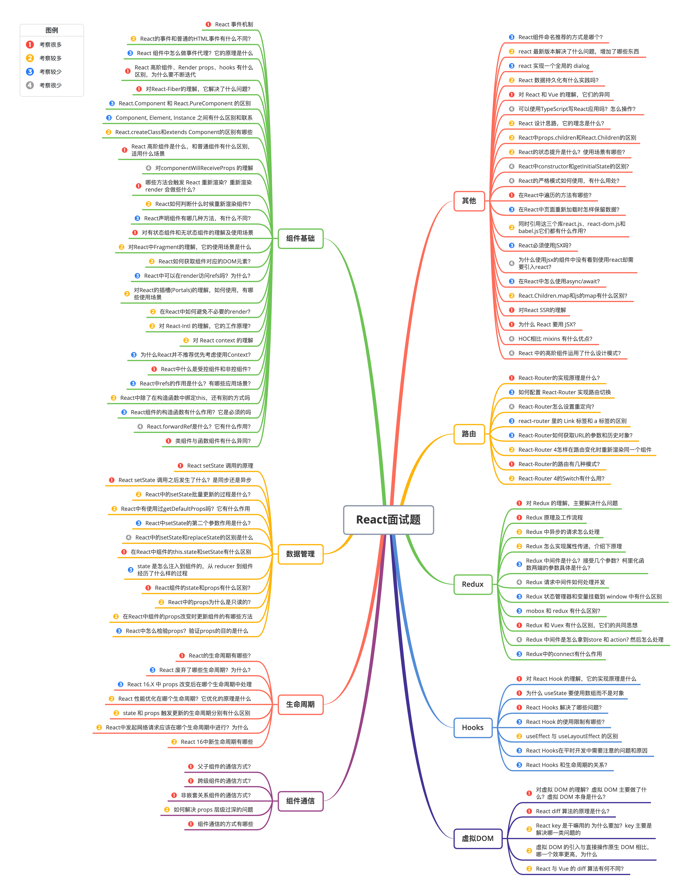
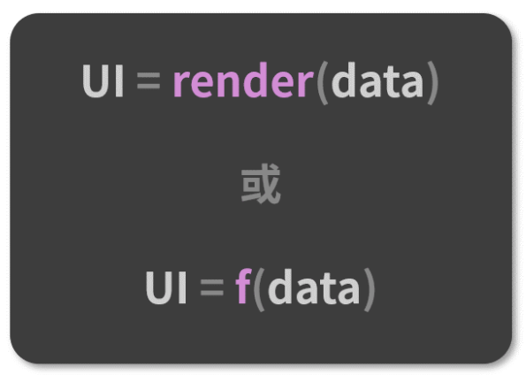
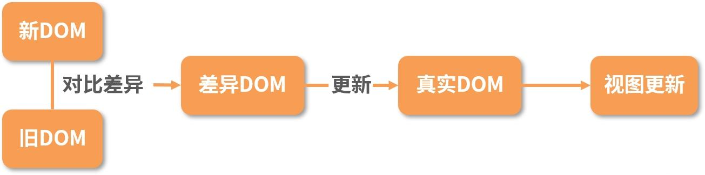
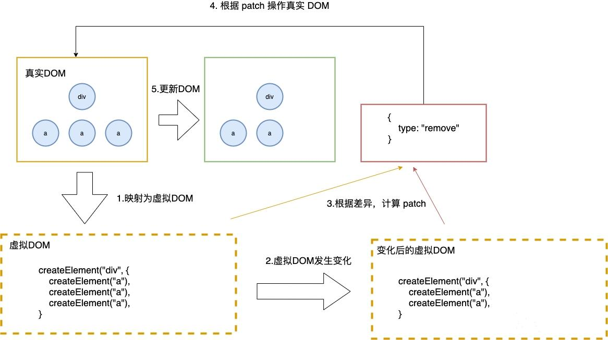
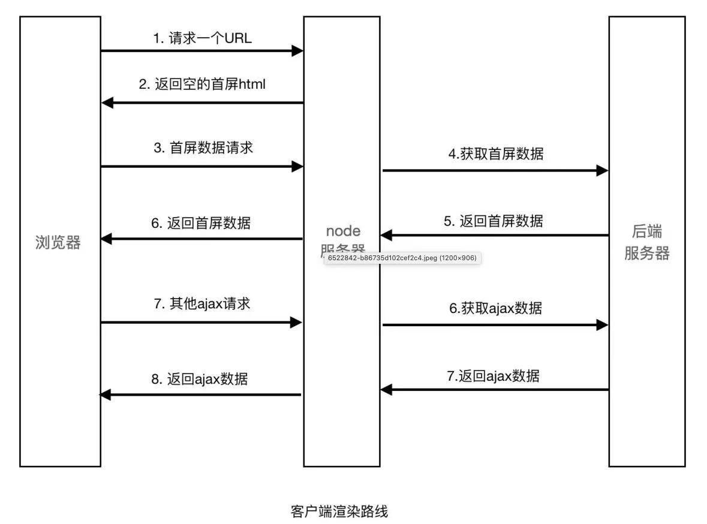
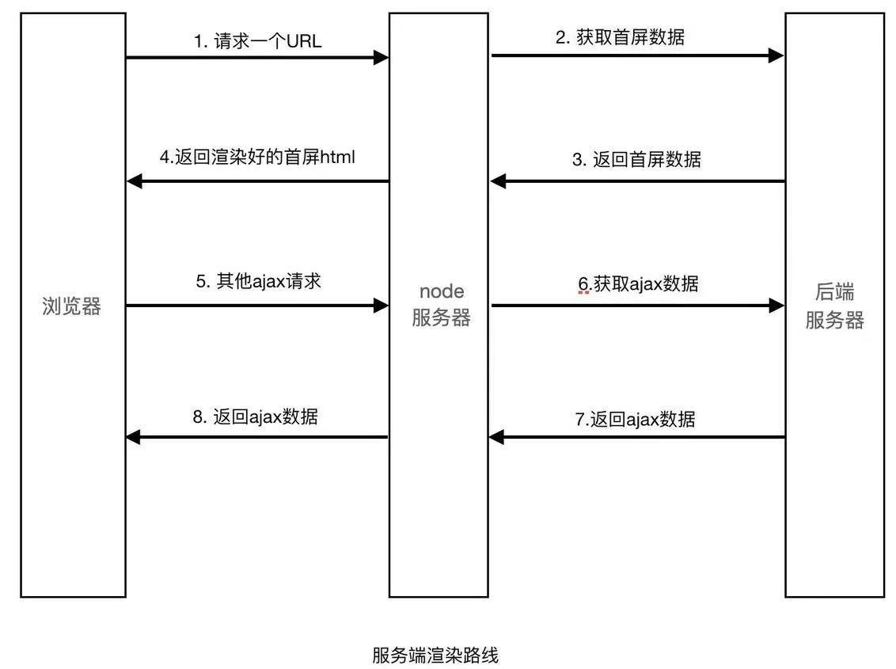
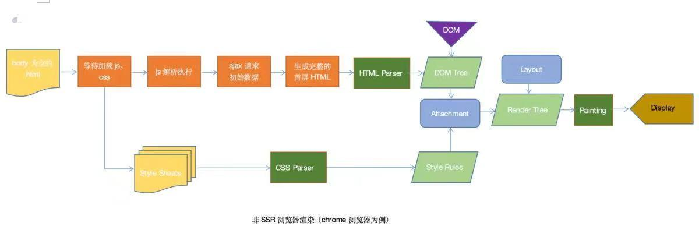
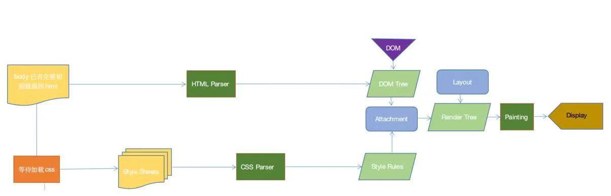

 



## 六、Redux

### 1. 对 Redux 的理解，主要解决什么问题

React是视图层框架。Redux是一个用来管理数据状态和UI状态的JavaScript应用工具。随着JavaScript单页应用（SPA）开发日趋复杂， JavaScript需要管理比任何时候都要多的state（状态）， Redux就是降低管理难度的。（Redux支持React、Angular、jQuery甚至纯JavaScript）。


在 React 中，UI 以组件的形式来搭建，组件之间可以嵌套组合。但 React 中组件间通信的数据流是单向的，顶层组件可以通过 props 属性向下层组件传递数据，而下层组件不能向上层组件传递数据，兄弟组件之间同样不能。这样简单的单向数据流支撑起了 React 中的数据可控性。


当项目越来越大的时候，管理数据的事件或回调函数将越来越多，也将越来越不好管理。管理不断变化的 state 非常困难。如果一个 model 的变化会引起另一个 model 变化，那么当 view 变化时，就可能引起对应 model 以及另一个 model 的变化，依次地，可能会引起另一个 view 的变化。直至你搞不清楚到底发生了什么。state 在什么时候，由于什么原因，如何变化已然不受控制。 当系统变得错综复杂的时候，想重现问题或者添加新功能就会变得举步维艰。如果这还不够糟糕，考虑一些来自前端开发领域的新需求，如更新调优、服务端渲染、路由跳转前请求数据等。state 的管理在大项目中相当复杂。


Redux 提供了一个叫 store 的统一仓储库，组件通过 dispatch 将 state 直接传入store，不用通过其他的组件。并且组件通过 subscribe 从 store获取到 state 的改变。使用了 Redux，所有的组件都可以从 store 中获取到所需的 state，他们也能从store 获取到 state 的改变。这比组件之间互相传递数据清晰明朗的多。


**主要解决的问题：**
单纯的Redux只是一个状态机，是没有UI呈现的，react- redux作用是将Redux的状态机和React的UI呈现绑定在一起，当你dispatch action改变state的时候，会自动更新页面。

### 2. Redux 原理及工作流程

**（1）原理**
Redux源码主要分为以下几个模块文件

- compose.js 提供从右到左进行函数式编程
- createStore.js 提供作为生成唯一store的函数
- combineReducers.js 提供合并多个reducer的函数，保证store的唯一性
- bindActionCreators.js 可以让开发者在不直接接触dispacth的前提下进行更改state的操作
- applyMiddleware.js 这个方法通过中间件来增强dispatch的功能

```javascript
const actionTypes = {
    ADD: 'ADD',
    CHANGEINFO: 'CHANGEINFO',
}

const initState = {
    info: '初始化',
}

export default function initReducer(state=initState, action) {
    switch(action.type) {
        case actionTypes.CHANGEINFO:
            return {
                ...state,
                info: action.preload.info || '',
            }
        default:
            return { ...state };
    }
}

export default function createStore(reducer, initialState, middleFunc) {

    if (initialState && typeof initialState === 'function') {
        middleFunc = initialState;
        initialState = undefined;
    }

    let currentState = initialState;

    const listeners = [];

    if (middleFunc && typeof middleFunc === 'function') {
        // 封装dispatch 
        return middleFunc(createStore)(reducer, initialState);
    }

    const getState = () => {
        return currentState;
    }

    const dispatch = (action) => {
        currentState = reducer(currentState, action);

        listeners.forEach(listener => {
            listener();
        })
    }

    const subscribe = (listener) => {
        listeners.push(listener);
    }

    return {
        getState,
        dispatch,
        subscribe
    }
}
```

**（2）工作流程**

- const store= createStore（fn）生成数据; 
- action: {type: Symble('action01), payload:'payload' }定义行为; 
- dispatch发起action：store.dispatch(doSomething('action001')); 
- reducer：处理action，返回新的state;


通俗点解释：

- 首先，用户（通过View）发出Action，发出方式就用到了dispatch方法
- 然后，Store自动调用Reducer，并且传入两个参数：当前State和收到的Action，Reducer会返回新的State
- State—旦有变化，Store就会调用监听函数，来更新View


以 store 为核心，可以把它看成数据存储中心，但是他要更改数据的时候不能直接修改，数据修改更新的角色由Reducers来担任，store只做存储，中间人，当Reducers的更新完成以后会通过store的订阅来通知react component，组件把新的状态重新获取渲染，组件中也能主动发送action，创建action后这个动作是不会执行的，所以要dispatch这个action，让store通过reducers去做更新React Component 就是react的每个组件。

### 3. Redux 中异步的请求怎么处理

可以在 componentDidmount 中直接进⾏请求⽆须借助redux。但是在⼀定规模的项⽬中,上述⽅法很难进⾏异步流的管理,通常情况下我们会借助redux的异步中间件进⾏异步处理。redux异步流中间件其实有很多，当下主流的异步中间件有两种redux-thunk、redux-saga。

**（1）使用react-thunk中间件**

**redux-thunk**优点: 

- 体积⼩: redux-thunk的实现⽅式很简单,只有不到20⾏代码 
- 使⽤简单: redux-thunk没有引⼊像redux-saga或者redux-observable额外的范式,上⼿简单 

**redux-thunk**缺陷: 

- 样板代码过多: 与redux本身⼀样,通常⼀个请求需要⼤量的代码,⽽且很多都是重复性质的 
- 耦合严重: 异步操作与redux的action偶合在⼀起,不⽅便管理 
- 功能孱弱: 有⼀些实际开发中常⽤的功能需要⾃⼰进⾏封装 


使用步骤：

- 配置中间件，在store的创建中配置

```javascript
import {createStore, applyMiddleware, compose} from 'redux';
import reducer from './reducer';
import thunk from 'redux-thunk'

// 设置调试工具
const composeEnhancers = window.__REDUX_DEVTOOLS_EXTENSION_COMPOSE__ ? window.__REDUX_DEVTOOLS_EXTENSION_COMPOSE__({}) : compose;
// 设置中间件
const enhancer = composeEnhancers(
  applyMiddleware(thunk)
);

const store = createStore(reducer, enhancer);

export default store;
```

- 添加一个返回函数的actionCreator，将异步请求逻辑放在里面

```javascript
/**
  发送get请求，并生成相应action，更新store的函数
  @param url {string} 请求地址
  @param func {function} 真正需要生成的action对应的actionCreator
  @return {function} 
*/
// dispatch为自动接收的store.dispatch函数 
export const getHttpAction = (url, func) => (dispatch) => {
    axios.get(url).then(function(res){
        const action = func(res.data)
        dispatch(action)
    })
}
```

- 生成action，并发送action

```javascript
componentDidMount(){
    var action = getHttpAction('/getData', getInitTodoItemAction)
    // 发送函数类型的action时，该action的函数体会自动执行
    store.dispatch(action)
}
```

**（2）使用redux-saga中间件**

**redux-saga**优点: 

- 异步解耦: 异步操作被被转移到单独 saga.js 中，不再是掺杂在 action.js 或 component.js 中 
- action摆脱thunk function: dispatch 的参数依然是⼀个纯粹的 action (FSA)，⽽不是充满 “⿊魔法” thunk function 
- 异常处理: 受益于 generator function 的 saga 实现，代码异常/请求失败 都可以直接通过 try/catch 语法直接捕获处理
- 功能强⼤: redux-saga提供了⼤量的Saga 辅助函数和Effect 创建器供开发者使⽤,开发者⽆须封装或者简单封装即可使⽤ 
- 灵活: redux-saga可以将多个Saga可以串⾏/并⾏组合起来,形成⼀个⾮常实⽤的异步flow 
- 易测试，提供了各种case的测试⽅案，包括mock task，分⽀覆盖等等 


**redux-saga**缺陷: 

- 额外的学习成本: redux-saga不仅在使⽤难以理解的 generator function,⽽且有数⼗个API,学习成本远超redux-thunk,最重要的是你的额外学习成本是只服务于这个库的,与redux-observable不同,redux-observable虽然也有额外学习成本但是背后是rxjs和⼀整套思想 
- 体积庞⼤: 体积略⼤,代码近2000⾏，min版25KB左右 
- 功能过剩: 实际上并发控制等功能很难⽤到,但是我们依然需要引⼊这些代码 
- ts⽀持不友好: yield⽆法返回TS类型 


redux-saga可以捕获action，然后执行一个函数，那么可以把异步代码放在这个函数中，使用步骤如下：

- 配置中间件

```javascript
import {createStore, applyMiddleware, compose} from 'redux';
import reducer from './reducer';
import createSagaMiddleware from 'redux-saga'
import TodoListSaga from './sagas'

const composeEnhancers = window.__REDUX_DEVTOOLS_EXTENSION_COMPOSE__ ? window.__REDUX_DEVTOOLS_EXTENSION_COMPOSE__({}) : compose;
const sagaMiddleware = createSagaMiddleware()

const enhancer = composeEnhancers(
  applyMiddleware(sagaMiddleware)
);

const store = createStore(reducer, enhancer);
sagaMiddleware.run(TodoListSaga)

export default store;
```

- 将异步请求放在sagas.js中

```javascript
import {takeEvery, put} from 'redux-saga/effects'
import {initTodoList} from './actionCreator'
import {GET_INIT_ITEM} from './actionTypes'
import axios from 'axios'

function* func(){
    try{
        // 可以获取异步返回数据
        const res = yield axios.get('/getData')
        const action = initTodoList(res.data)
        // 将action发送到reducer
        yield put(action)
    }catch(e){
        console.log('网络请求失败')
    }
}

function* mySaga(){
    // 自动捕获GET_INIT_ITEM类型的action，并执行func
    yield takeEvery(GET_INIT_ITEM, func)
}

export default mySaga
```

- 发送action

```javascript
componentDidMount(){
  const action = getInitTodoItemAction()
  store.dispatch(action)
}
```

### 4. Redux 怎么实现属性传递，介绍下原理

react-redux 数据传输∶ view-->action-->reducer-->store-->view。看下点击事件的数据是如何通过redux传到view上：

- view 上的AddClick 事件通过mapDispatchToProps 把数据传到action ---> click:()=>dispatch(ADD)
- action 的ADD 传到reducer上
- reducer传到store上 const store = createStore(reducer);
- store再通过 mapStateToProps 映射穿到view上text:State.text


代码示例∶

```javascript
import React from 'react';
import ReactDOM from 'react-dom';
import { createStore } from 'redux';
import { Provider, connect } from 'react-redux';
class App extends React.Component{
    render(){
        let { text, click, clickR } = this.props;
        return(
            <div>
                <div>数据:已有人{text}</div>
                <div onClick={click}>加人</div>
                <div onClick={clickR}>减人</div>
            </div>
        )
    }
}
const initialState = {
    text:5
}
const reducer = function(state,action){
    switch(action.type){
        case 'ADD':
            return {text:state.text+1}
        case 'REMOVE':
            return {text:state.text-1}
        default:
            return initialState;
    }
}

let ADD = {
    type:'ADD'
}
let Remove = {
    type:'REMOVE'
}

const store = createStore(reducer);

let mapStateToProps = function (state){
    return{
        text:state.text
    }
}

let mapDispatchToProps = function(dispatch){
    return{
        click:()=>dispatch(ADD),
        clickR:()=>dispatch(Remove)
    }
}

const App1 = connect(mapStateToProps,mapDispatchToProps)(App);

ReactDOM.render(
    <Provider store = {store}>
        <App1></App1>
    </Provider>,document.getElementById('root')
)
```

### 5. Redux 中间件是什么？接受几个参数？柯里化函数两端的参数具体是什么？

Redux 的中间件提供的是位于 action 被发起之后，到达 reducer 之前的扩展点，换而言之，原本 view -→> action -> reducer -> store 的数据流加上中间件后变成了 view -> action -> middleware -> reducer -> store ，在这一环节可以做一些"副作用"的操作，如异步请求、打印日志等。


applyMiddleware源码：

```javascript
export default function applyMiddleware(...middlewares) {
    return createStore => (...args) => {
        // 利用传入的createStore和reducer和创建一个store
        const store = createStore(...args)
        let dispatch = () => {
            throw new Error()
        }
        const middlewareAPI = {
            getState: store.getState,
            dispatch: (...args) => dispatch(...args)
        }
        // 让每个 middleware 带着 middlewareAPI 这个参数分别执行一遍
        const chain = middlewares.map(middleware => middleware(middlewareAPI))
        // 接着 compose 将 chain 中的所有匿名函数，组装成一个新的函数，即新的 dispatch
        dispatch = compose(...chain)(store.dispatch)
        return {
            ...store,
            dispatch
        }
    }
}
```

从applyMiddleware中可以看出∶

- redux中间件接受一个对象作为参数，对象的参数上有两个字段 dispatch 和 getState，分别代表着 Redux Store 上的两个同名函数。
- 柯里化函数两端一个是 middewares，一个是store.dispatch

### 6. Redux 请求中间件如何处理并发

**使用redux-Saga**
redux-saga是一个管理redux应用异步操作的中间件，用于代替 redux-thunk 的。它通过创建 Sagas 将所有异步操作逻辑存放在一个地方进行集中处理，以此将react中的同步操作与异步操作区分开来，以便于后期的管理与维护。 redux-saga如何处理并发：

- **takeEvery**

可以让多个 saga 任务并行被 fork 执行。

```javascript
import {
    fork,
    take
} from "redux-saga/effects"

const takeEvery = (pattern, saga, ...args) => fork(function*() {
    while (true) {
        const action = yield take(pattern)
        yield fork(saga, ...args.concat(action))
    }
})
```

- **takeLatest**

takeLatest 不允许多个 saga 任务并行地执行。一旦接收到新的发起的 action，它就会取消前面所有 fork 过的任务（如果这些任务还在执行的话）。
在处理 AJAX 请求的时候，如果只希望获取最后那个请求的响应， takeLatest 就会非常有用。

```javascript
import {
    cancel,
    fork,
    take
} from "redux-saga/effects"

const takeLatest = (pattern, saga, ...args) => fork(function*() {
    let lastTask
    while (true) {
        const action = yield take(pattern)
        if (lastTask) {
            yield cancel(lastTask) // 如果任务已经结束，则 cancel 为空操作
        }
        lastTask = yield fork(saga, ...args.concat(action))
    }
})
```

### 7. Redux 状态管理器和变量挂载到 window 中有什么区别

两者都是存储数据以供后期使用。但是Redux状态更改可回溯——Time travel，数据多了的时候可以很清晰的知道改动在哪里发生，完整的提供了一套状态管理模式。


随着 JavaScript 单页应用开发日趋复杂，JavaScript 需要管理比任何时候都要多的 state （状态）。 这些 state 可能包括服务器响应、缓存数据、本地生成尚未持久化到服务器的数据，也包括 UI状态，如激活的路由，被选中的标签，是否显示加载动效或者分页器等等。


管理不断变化的 state 非常困难。如果一个 model 的变化会引起另一个 model 变化，那么当 view 变化时，就可能引起对应 model 以及另一个model 的变化，依次地，可能会引起另一个 view 的变化。直至你搞不清楚到底发生了什么。state 在什么时候，由于什么原因，如何变化已然不受控制。 当系统变得错综复杂的时候，想重现问题或者添加新功能就会变得举步维艰。
如果这还不够糟糕，考虑一些来自前端开发领域的新需求，如更新调优、服务端渲染、路由跳转前请求数据等等。前端开发者正在经受前所未有的复杂性，难道就这么放弃了吗?当然不是。


这里的复杂性很大程度上来自于：我们总是将两个难以理清的概念混淆在一起：变化和异步。 可以称它们为曼妥思和可乐。如果把二者分开，能做的很好，但混到一起，就变得一团糟。一些库如 React 视图在视图层禁止异步和直接操作 DOM来解决这个问题。美中不足的是，React 依旧把处理 state 中数据的问题留给了你。Redux就是为了帮你解决这个问题。

### 8. mobox 和 redux 有什么区别？

**（1）共同点**

- 为了解决状态管理混乱，无法有效同步的问题统一维护管理应用状态;
- 某一状态只有一个可信数据来源（通常命名为store，指状态容器）;
- 操作更新状态方式统一，并且可控（通常以action方式提供更新状态的途径）;
- 支持将store与React组件连接，如react-redux，mobx- react;

**（2）区别**
Redux更多的是遵循Flux模式的一种实现，是一个 JavaScript库，它关注点主要是以下几方面∶ 

- Action∶ 一个JavaScript对象，描述动作相关信息，主要包含type属性和payload属性∶ 

      o type∶ action 类型; o payload∶ 负载数据;

- Reducer∶ 定义应用状态如何响应不同动作（action），如何更新状态;

- Store∶ 管理action和reducer及其关系的对象，主要提供以下功能∶ 

      o 维护应用状态并支持访问状态(getState());
      o 支持监听action的分发，更新状态(dispatch(action)); 
      o 支持订阅store的变更(subscribe(listener));

- 异步流∶ 由于Redux所有对store状态的变更，都应该通过action触发，异步任务（通常都是业务或获取数据任务）也不例外，而为了不将业务或数据相关的任务混入React组件中，就需要使用其他框架配合管理异步任务流程，如redux-thunk，redux-saga等; 


Mobx是一个透明函数响应式编程的状态管理库，它使得状态管理简单可伸缩∶

-  Action∶定义改变状态的动作函数，包括如何变更状态;
-  Store∶ 集中管理模块状态（State）和动作(action)
-  Derivation（衍生）∶ 从应用状态中派生而出，且没有任何其他影响的数据


**对比总结：**

- redux将数据保存在单一的store中，mobx将数据保存在分散的多个store中
- redux使用plain object保存数据，需要手动处理变化后的操作;mobx适用observable保存数据，数据变化后自动处理响应的操作
- redux使用不可变状态，这意味着状态是只读的，不能直接去修改它，而是应该返回一个新的状态，同时使用纯函数;mobx中的状态是可变的，可以直接对其进行修改
- mobx相对来说比较简单，在其中有很多的抽象，mobx更多的使用面向对象的编程思维;redux会比较复杂，因为其中的函数式编程思想掌握起来不是那么容易，同时需要借助一系列的中间件来处理异步和副作用
- mobx中有更多的抽象和封装，调试会比较困难，同时结果也难以预测;而redux提供能够进行时间回溯的开发工具，同时其纯函数以及更少的抽象，让调试变得更加的容易

### 9. Redux 和 Vuex 有什么区别，它们的共同思想

**（1）Redux 和 Vuex区别**

- Vuex改进了Redux中的Action和Reducer函数，以mutations变化函数取代Reducer，无需switch，只需在对应的mutation函数里改变state值即可
- Vuex由于Vue自动重新渲染的特性，无需订阅重新渲染函数，只要生成新的State即可
- Vuex数据流的顺序是∶View调用store.commit提交对应的请求到Store中对应的mutation函数->store改变（vue检测到数据变化自动渲染）


通俗点理解就是，vuex 弱化 dispatch，通过commit进行 store状态的一次更变；取消了action概念，不必传入特定的 action形式进行指定变更；弱化reducer，基于commit参数直接对数据进行转变，使得框架更加简易; 


**（2）共同思想**

- 单—的数据源 
- 变化可以预测


本质上∶ redux与vuex都是对mvvm思想的服务，将数据从视图中抽离的一种方案。

### 10. Redux 中间件是怎么拿到store 和 action? 然后怎么处理?

redux中间件本质就是一个函数柯里化。redux applyMiddleware Api 源码中每个middleware 接受2个参数， Store 的getState 函数和dispatch 函数，分别获得store和action，最终返回一个函数。该函数会被传入 next 的下一个 middleware 的 dispatch 方法，并返回一个接收 action 的新函数，这个函数可以直接调用 next（action），或者在其他需要的时刻调用，甚至根本不去调用它。调用链中最后一个 middleware 会接受真实的 store的 dispatch 方法作为 next 参数，并借此结束调用链。所以，middleware 的函数签名是（{ getState，dispatch })=> next => action。

### 11. Redux中的connect有什么作用

connect负责连接React和Redux

**（1）获取state**

connect 通过 context获取 Provider 中的 store，通过` store.getState()` 获取整个store tree 上所有state 

**（2）包装原组件**

将state和action通过props的方式传入到原组件内部 wrapWithConnect 返回—个 ReactComponent 对 象 Connect，Connect 重 新 render 外部传入的原组件 WrappedComponent ，并把 connect 中传入的 mapStateToProps，mapDispatchToProps与组件上原有的 props合并后，通过属性的方式传给WrappedComponent 

**（3）监听store tree变化**

connect缓存了store tree中state的状态，通过当前state状态 和变更前 state 状态进行比较，从而确定是否调用 `this.setState()`方法触发Connect及其子组件的重新渲染

## 七、Hooks

### 1. 对 React Hook 的理解，它的实现原理是什么

React-Hooks 是 React 团队在 React 组件开发实践中，逐渐认知到的一个改进点，这背后其实涉及对**类组件**和**函数组件**两种组件形式的思考和侧重。


**（1）类组件：** 所谓类组件，就是基于 ES6 Class 这种写法，通过继承 React.Component 得来的 React 组件。以下是一个类组件：

```javascript
class DemoClass extends React.Component {
  state = {
    text: ""
  };
  componentDidMount() {
    //...
  }
  changeText = (newText) => {
    this.setState({
      text: newText
    });
  };

  render() {
    return (
      <div className="demoClass">
        <p>{this.state.text}</p>
        <button onClick={this.changeText}>修改</button>
      </div>
    );
  }
}

```

可以看出，React 类组件内部预置了相当多的“现成的东西”等着我们去调度/定制，state 和生命周期就是这些“现成东西”中的典型。要想得到这些东西，难度也不大，只需要继承一个 React.Component 即可。


当然，这也是类组件的一个不便，它太繁杂了，对于解决许多问题来说，编写一个类组件实在是一个过于复杂的姿势。复杂的姿势必然带来高昂的理解成本，这也是我们所不想看到的。除此之外，由于开发者编写的逻辑在封装后是和组件粘在一起的，这就使得**类组件内部的逻辑难以实现拆分和复用。**


**（2）函数组件**：函数组件就是以函数的形态存在的 React 组件。早期并没有 React-Hooks，函数组件内部无法定义和维护 state，因此它还有一个别名叫“无状态组件”。以下是一个函数组件：

```javascript
function DemoFunction(props) {
  const { text } = props
  return (
    <div className="demoFunction">
      <p>{`函数组件接收的内容：[${text}]`}</p>
    </div>
  );
}
```

相比于类组件，函数组件肉眼可见的特质自然包括轻量、灵活、易于组织和维护、较低的学习成本等。


通过对比，从形态上可以对两种组件做区分，它们之间的区别如下：

- 类组件需要继承 class，函数组件不需要；
- 类组件可以访问生命周期方法，函数组件不能；
- 类组件中可以获取到实例化后的 this，并基于这个 this 做各种各样的事情，而函数组件不可以；
- 类组件中可以定义并维护 state（状态），而函数组件不可以；


除此之外，还有一些其他的不同。通过上面的区别，我们不能说谁好谁坏，它们各有自己的优势。在 React-Hooks 出现之前，**类组件的能力边界明显强于函数组件。**


实际上，类组件和函数组件之间，是面向对象和函数式编程这两套不同的设计思想之间的差异。而函数组件更加契合 React 框架的设计理念：

React 组件本身的定位就是函数，一个输入数据、输出 UI 的函数。作为开发者，我们编写的是声明式的代码，而 React 框架的主要工作，就是及时地把声明式的代码转换为命令式的 DOM 操作，把数据层面的描述映射到用户可见的 UI 变化中去。这就意味着从原则上来讲，React 的数据应该总是紧紧地和渲染绑定在一起的，而类组件做不到这一点。**函数组件就真正地将数据和渲染绑定到了一起。函数组件是一个更加匹配其设计理念、也更有利于逻辑拆分与重用的组件表达形式。**


为了能让开发者更好的的去编写函数式组件。于是，React-Hooks 便应运而生。


React-Hooks 是一套能够使函数组件更强大、更灵活的“钩子”。


函数组件比起类组件少了很多东西，比如生命周期、对 state 的管理等。这就给函数组件的使用带来了非常多的局限性，导致我们并不能使用函数这种形式，写出一个真正的全功能的组件。而React-Hooks 的出现，就是为了帮助函数组件补齐这些（相对于类组件来说）缺失的能力。


如果说函数组件是一台轻巧的快艇，那么 React-Hooks 就是一个内容丰富的零部件箱。“重装战舰”所预置的那些设备，这个箱子里基本全都有，同时它还不强制你全都要，而是允许你自由地选择和使用你需要的那些能力，然后将这些能力以 Hook（钩子）的形式“钩”进你的组件里，从而定制出一个最适合你的“专属战舰”。

### 2. 为什么 useState 要使用数组而不是对象

useState 的用法：

```javascript
const [count, setCount] = useState(0)
```

可以看到 useState 返回的是一个数组，那么为什么是返回数组而不是返回对象呢？


这里用到了解构赋值，所以先来看一下ES6 的解构赋值：

##### 数组的解构赋值

```javascript
const foo = [1, 2, 3];
const [one, two, three] = foo;
console.log(one);	// 1
console.log(two);	// 2
console.log(three);	// 3
```

##### 对象的解构赋值

```javascript
const user = {
  id: 888,
  name: "xiaoxin"
};
const { id, name } = user;
console.log(id);	// 888
console.log(name);	// "xiaoxin"
```

看完这两个例子，答案应该就出来了：

- 如果 useState 返回的是数组，那么使用者可以对数组中的元素命名，代码看起来也比较干净
- 如果 useState 返回的是对象，在解构对象的时候必须要和 useState 内部实现返回的对象同名，想要使用多次的话，必须得设置别名才能使用返回值


下面来看看如果 useState 返回对象的情况：

```javascript
// 第一次使用
const { state, setState } = useState(false);
// 第二次使用
const { state: counter, setState: setCounter } = useState(0) 
```

这里可以看到，返回对象的使用方式还是挺麻烦的，更何况实际项目中会使用的更频繁。
**总结：**useState 返回的是 array 而不是 object 的原因就是为了**降低使用的复杂度**，返回数组的话可以直接根据顺序解构，而返回对象的话要想使用多次就需要定义别名了。

### 3. React Hooks 解决了哪些问题？

React Hooks 主要解决了以下问题：

**（1）在组件之间复用状态逻辑很难**

React 没有提供将可复用性行为“附加”到组件的途径（例如，把组件连接到 store）解决此类问题可以使用 render props 和 高阶组件。但是这类方案需要重新组织组件结构，这可能会很麻烦，并且会使代码难以理解。由 providers，consumers，高阶组件，render props 等其他抽象层组成的组件会形成“嵌套地狱”。尽管可以在 DevTools 过滤掉它们，但这说明了一个更深层次的问题：React 需要为共享状态逻辑提供更好的原生途径。


可以使用 Hook 从组件中提取状态逻辑，使得这些逻辑可以单独测试并复用。Hook 使我们在无需修改组件结构的情况下复用状态逻辑。 这使得在组件间或社区内共享 Hook 变得更便捷。

**（2）复杂组件变得难以理解**

在组件中，每个生命周期常常包含一些不相关的逻辑。例如，组件常常在 componentDidMount 和 componentDidUpdate 中获取数据。但是，同一个 componentDidMount 中可能也包含很多其它的逻辑，如设置事件监听，而之后需在 componentWillUnmount 中清除。相互关联且需要对照修改的代码被进行了拆分，而完全不相关的代码却在同一个方法中组合在一起。如此很容易产生 bug，并且导致逻辑不一致。


在多数情况下，不可能将组件拆分为更小的粒度，因为状态逻辑无处不在。这也给测试带来了一定挑战。同时，这也是很多人将 React 与状态管理库结合使用的原因之一。但是，这往往会引入了很多抽象概念，需要你在不同的文件之间来回切换，使得复用变得更加困难。


为了解决这个问题，Hook 将组件中相互关联的部分拆分成更小的函数（比如设置订阅或请求数据），而并非强制按照生命周期划分。你还可以使用 reducer 来管理组件的内部状态，使其更加可预测。

**（3）难以理解的 class**

除了代码复用和代码管理会遇到困难外，class 是学习 React 的一大屏障。我们必须去理解 JavaScript 中 this 的工作方式，这与其他语言存在巨大差异。还不能忘记绑定事件处理器。没有稳定的语法提案，这些代码非常冗余。大家可以很好地理解 props，state 和自顶向下的数据流，但对 class 却一筹莫展。即便在有经验的 React 开发者之间，对于函数组件与 class 组件的差异也存在分歧，甚至还要区分两种组件的使用场景。


为了解决这些问题，Hook 使你在非 class 的情况下可以使用更多的 React 特性。 从概念上讲，React 组件一直更像是函数。而 Hook 则拥抱了函数，同时也没有牺牲 React 的精神原则。Hook 提供了问题的解决方案，无需学习复杂的函数式或响应式编程技术

### 4. React Hook 的使用限制有哪些？

React Hooks 的限制主要有两条：

- 不要在循环、条件或嵌套函数中调用 Hook；
- 在 React 的函数组件中调用 Hook。


那为什么会有这样的限制呢？Hooks 的设计初衷是为了改进 React 组件的开发模式。在旧有的开发模式下遇到了三个问题。

- 组件之间难以复用状态逻辑。过去常见的解决方案是高阶组件、render props 及状态管理框架。
- 复杂的组件变得难以理解。生命周期函数与业务逻辑耦合太深，导致关联部分难以拆分。
- 人和机器都很容易混淆类。常见的有 this 的问题，但在 React 团队中还有类难以优化的问题，希望在编译优化层面做出一些改进。


这三个问题在一定程度上阻碍了 React 的后续发展，所以为了解决这三个问题，Hooks **基于函数组件**开始设计。然而第三个问题决定了 Hooks 只支持函数组件。


那为什么不要在循环、条件或嵌套函数中调用 Hook 呢？因为 Hooks 的设计是基于数组实现。在调用时按顺序加入数组中，如果使用循环、条件或嵌套函数很有可能导致数组取值错位，执行错误的 Hook。当然，实质上 React 的源码里不是数组，是链表。


这些限制会在编码上造成一定程度的心智负担，新手可能会写错，为了避免这样的情况，可以引入 ESLint 的 Hooks 检查插件进行预防。

### 5. useEffect 与 useLayoutEffect 的区别

**（1）共同点**

- **运用效果：** useEffect 与 useLayoutEffect 两者都是用于处理副作用，这些副作用包括改变 DOM、设置订阅、操作定时器等。在函数组件内部操作副作用是不被允许的，所以需要使用这两个函数去处理。
- **使用方式：** useEffect 与 useLayoutEffect 两者底层的函数签名是完全一致的，都是调用的 mountEffectImpl方法，在使用上也没什么差异，基本可以直接替换。


**（2）不同点**

- **使用场景：** useEffect 在 React 的渲染过程中是被异步调用的，用于绝大多数场景；而 useLayoutEffect 会在所有的 DOM 变更之后同步调用，主要用于处理 DOM 操作、调整样式、避免页面闪烁等问题。也正因为是同步处理，所以需要避免在 useLayoutEffect 做计算量较大的耗时任务从而造成阻塞。
- **使用效果：** useEffect是按照顺序执行代码的，改变屏幕像素之后执行（先渲染，后改变DOM），当改变屏幕内容时可能会产生闪烁；useLayoutEffect是改变屏幕像素之前就执行了（会推迟页面显示的事件，先改变DOM后渲染），不会产生闪烁。**useLayoutEffect总是比useEffect先执行。**


在未来的趋势上，两个 API 是会长期共存的，暂时没有删减合并的计划，需要开发者根据场景去自行选择。React 团队的建议非常实用，如果实在分不清，先用 useEffect，一般问题不大；如果页面有异常，再直接替换为 useLayoutEffect 即可。

### 6. React Hooks在平时开发中需要注意的问题和原因

（1）**不要在循环，条件或嵌套函数中调用Hook，必须始终在 React函数的顶层使用Hook**

这是因为React需要利用调用顺序来正确更新相应的状态，以及调用相应的钩子函数。一旦在循环或条件分支语句中调用Hook，就容易导致调用顺序的不一致性，从而产生难以预料到的后果。

**（2）使用useState时候，使用push，pop，splice等直接更改数组对象的坑**

使用push直接更改数组无法获取到新值，应该采用析构方式，但是在class里面不会有这个问题。代码示例：

```javascript
function Indicatorfilter() {
  let [num,setNums] = useState([0,1,2,3])
  const test = () => {
    // 这里坑是直接采用push去更新num
    // setNums(num)是无法更新num的
    // 必须使用num = [...num ,1]
    num.push(1)
    // num = [...num ,1]
    setNums(num)
  }
return (
    <div className='filter'>
      <div onClick={test}>测试</div>
        <div>
          {num.map((item,index) => (
              <div key={index}>{item}</div>
          ))}
      </div>
    </div>
  )
}

class Indicatorfilter extends React.Component<any,any>{
  constructor(props:any){
      super(props)
      this.state = {
          nums:[1,2,3]
      }
      this.test = this.test.bind(this)
  }

  test(){
      // class采用同样的方式是没有问题的
      this.state.nums.push(1)
      this.setState({
          nums: this.state.nums
      })
  }

  render(){
      let {nums} = this.state
      return(
          <div>
              <div onClick={this.test}>测试</div>
                  <div>
                      {nums.map((item:any,index:number) => (
                          <div key={index}>{item}</div>
                      ))}
                  </div>
          </div>

      )
  }
}
```


（3）**useState设置状态的时候，只有第一次生效，后期需要更新状态，必须通过useEffect**

TableDeail是一个公共组件，在调用它的父组件里面，我们通过set改变columns的值，以为传递给TableDeail 的 columns是最新的值，所以tabColumn每次也是最新的值，但是实际tabColumn是最开始的值，不会随着columns的更新而更新：

```javascript
const TableDeail = ({
    columns,
}:TableData) => {
    const [tabColumn, setTabColumn] = useState(columns) 
}

// 正确的做法是通过useEffect改变这个值
const TableDeail = ({
    columns,
}:TableData) => {
    const [tabColumn, setTabColumn] = useState(columns) 
    useEffect(() =>{setTabColumn(columns)},[columns])
}

```

**（4）善用useCallback**

父组件传递给子组件事件句柄时，如果我们没有任何参数变动可能会选用useMemo。但是每一次父组件渲染子组件即使没变化也会跟着渲染一次。 

**（5）不要滥用useContext**

可以使用基于 useContext 封装的状态管理工具。

### 7. React Hooks 和生命周期的关系？

**函数组件** 的本质是函数，没有 state 的概念的，因此**不存在生命周期**一说，仅仅是一个 **render 函数**而已。
但是引入 **Hooks** 之后就变得不同了，它能让组件在不使用 class 的情况下拥有 state，所以就有了生命周期的概念，所谓的生命周期其实就是 `useState`、 `useEffect()` 和 `useLayoutEffect()` 。


即：**Hooks 组件（使用了Hooks的函数组件）有生命周期，而函数组件（未使用Hooks的函数组件）是没有生命周期的**。


下面是具体的 class 与 Hooks 的**生命周期对应关系**：

- `constructor`：函数组件不需要构造函数，可以通过调用 `**useState 来初始化 state**`。如果计算的代价比较昂贵，也可以传一个函数给 `useState`。

```javascript
const [num, UpdateNum] = useState(0)
```

- `getDerivedStateFromProps`：一般情况下，我们不需要使用它，可以在**渲染过程中更新 state**，以达到实现 `getDerivedStateFromProps` 的目的。

```javascript
function ScrollView({row}) {
  let [isScrollingDown, setIsScrollingDown] = useState(false);
  let [prevRow, setPrevRow] = useState(null);
  if (row !== prevRow) {
    // Row 自上次渲染以来发生过改变。更新 isScrollingDown。
    setIsScrollingDown(prevRow !== null && row > prevRow);
    setPrevRow(row);
  }
  return `Scrolling down: ${isScrollingDown}`;
}
```

React 会立即退出第一次渲染并用更新后的 state 重新运行组件以避免耗费太多性能。

- `shouldComponentUpdate`：可以用 `**React.memo**` 包裹一个组件来对它的 `props` 进行浅比较

```javascript
const Button = React.memo((props) => {  // 具体的组件});
```

注意：`**React.memo 等效于 **``**PureComponent**`，它只浅比较 props。这里也可以使用 `useMemo` 优化每一个节点。

- `render`：这是函数组件体本身。
- `componentDidMount`, `componentDidUpdate`： `useLayoutEffect` 与它们两的调用阶段是一样的。但是，我们推荐你**一开始先用 useEffect**，只有当它出问题的时候再尝试使用 `useLayoutEffect`。`useEffect` 可以表达所有这些的组合。

```javascript
// componentDidMount
useEffect(()=>{
  // 需要在 componentDidMount 执行的内容
}, [])
useEffect(() => { 
  // 在 componentDidMount，以及 count 更改时 componentDidUpdate 执行的内容
  document.title = `You clicked ${count} times`; 
  return () => {
    // 需要在 count 更改时 componentDidUpdate（先于 document.title = ... 执行，遵守先清理后更新）
    // 以及 componentWillUnmount 执行的内容       
  } // 当函数中 Cleanup 函数会按照在代码中定义的顺序先后执行，与函数本身的特性无关
}, [count]); // 仅在 count 更改时更新
```

**请记得 React 会等待浏览器完成画面渲染之后才会延迟调用 ，因此会使得额外操作很方便**

- `componentWillUnmount`：相当于 `useEffect `里面返回的 `cleanup` 函数

```javascript
// componentDidMount/componentWillUnmount
useEffect(()=>{
  // 需要在 componentDidMount 执行的内容
  return function cleanup() {
    // 需要在 componentWillUnmount 执行的内容      
  }
}, [])
```

- `componentDidCatch` and `getDerivedStateFromError`：目前**还没有**这些方法的 Hook 等价写法，但很快会加上。

| **class 组件**           | **Hooks 组件**            |
| ------------------------ | ------------------------- |
| constructor              | useState                  |
| getDerivedStateFromProps | useState 里面 update 函数 |
| shouldComponentUpdate    | useMemo                   |
| render                   | 函数本身                  |
| componentDidMount        | useEffect                 |
| componentDidUpdate       | useEffect                 |
| componentWillUnmount     | useEffect 里面返回的函数  |
| componentDidCatch        | 无                        |
| getDerivedStateFromError | 无                        |

## 八、虚拟DOM

### 1. 对虚拟 DOM 的理解？虚拟 DOM 主要做了什么？虚拟 DOM 本身是什么？

从本质上来说，Virtual Dom是一个JavaScript对象，通过对象的方式来表示DOM结构。将页面的状态抽象为JS对象的形式，配合不同的渲染工具，使跨平台渲染成为可能。通过事务处理机制，将多次DOM修改的结果一次性的更新到页面上，从而有效的减少页面渲染的次数，减少修改DOM的重绘重排次数，提高渲染性能。


虚拟DOM是对DOM的抽象，这个对象是更加轻量级的对DOM的描述。它设计的最初目的，就是更好的跨平台，比如node.js就没有DOM，如果想实现SSR，那么一个方式就是借助虚拟dom，因为虚拟dom本身是js对象。 在代码渲染到页面之前，vue或者react会把代码转换成一个对象（虚拟DOM）。以对象的形式来描述真实dom结构，最终渲染到页面。在每次数据发生变化前，虚拟dom都会缓存一份，变化之时，现在的虚拟dom会与缓存的虚拟dom进行比较。在vue或者react内部封装了diff算法，通过这个算法来进行比较，渲染时修改改变的变化，原先没有发生改变的通过原先的数据进行渲染。


另外现代前端框架的一个基本要求就是无须手动操作DOM，一方面是因为手动操作DOM无法保证程序性能，多人协作的项目中如果review不严格，可能会有开发者写出性能较低的代码，另一方面更重要的是省略手动DOM操作可以大大提高开发效率。


**为什么要用 Virtual DOM：**

**（1）保证性能下限，在不进行手动优化的情况下，提供过得去的性能**

下面对比一下修改DOM时真实DOM操作和Virtual DOM的过程，来看一下它们重排重绘的性能消耗∶

- 真实DOM∶ 生成HTML字符串＋ 重建所有的DOM元素
- Virtual DOM∶ 生成vNode＋ DOMDiff＋必要的DOM更新


Virtual DOM的更新DOM的准备工作耗费更多的时间，也就是JS层面，相比于更多的DOM操作它的消费是极其便宜的。尤雨溪在社区论坛中说道∶ 框架给你的保证是，你不需要手动优化的情况下，我依然可以给你提供过得去的性能。
**（2）跨平台**
Virtual DOM本质上是JavaScript的对象，它可以很方便的跨平台操作，比如服务端渲染、uniapp等。

### 2. React diff 算法的原理是什么？

实际上，diff 算法探讨的就是虚拟 DOM 树发生变化后，生成 DOM 树更新补丁的方式。它通过对比新旧两株虚拟 DOM 树的变更差异，将更新补丁作用于真实 DOM，以最小成本完成视图更新。

具体的流程如下：

- 真实的 DOM 首先会映射为虚拟 DOM；
- 当虚拟 DOM 发生变化后，就会根据差距计算生成 patch，这个 patch 是一个结构化的数据，内容包含了增加、更新、移除等；
- 根据 patch 去更新真实的 DOM，反馈到用户的界面上。


一个简单的例子：

```javascript
import React from 'react'
export default class ExampleComponent extends React.Component {
  render() {
    if(this.props.isVisible) {
       return <div className="visible">visbile</div>;
    }
     return <div className="hidden">hidden</div>;
  }
}
```

这里，首先假定 ExampleComponent 可见，然后再改变它的状态，让它不可见 。映射为真实的 DOM 操作是这样的，React 会创建一个 div 节点。

```javascript
<div class="visible">visbile</div>
```

当把 visbile 的值变为 false 时，就会替换 class 属性为 hidden，并重写内部的 innerText 为 hidden。**这样一个生成补丁、更新差异的过程统称为 diff 算法。**


diff算法可以总结为三个策略，分别从树、组件及元素三个层面进行复杂度的优化：

**策略一：忽略节点跨层级操作场景，提升比对效率。（基于树进行对比）**

这一策略需要进行树比对，即对树进行分层比较。树比对的处理手法是非常“暴力”的，即两棵树只对同一层次的节点进行比较，如果发现节点已经不存在了，则该节点及其子节点会被完全删除掉，不会用于进一步的比较，这就提升了比对效率。


**策略二：如果组件的 class 一致，则默认为相似的树结构，否则默认为不同的树结构。（基于组件进行对比）**

在组件比对的过程中：

- 如果组件是同一类型则进行树比对；
- 如果不是则直接放入补丁中。

只要父组件类型不同，就会被重新渲染。这也就是为什么 shouldComponentUpdate、PureComponent 及 React.memo 可以提高性能的原因。


**策略三：同一层级的子节点，可以通过标记 key 的方式进行列表对比。（基于节点进行对比）**

元素比对主要发生在同层级中，通过标记节点操作生成补丁。节点操作包含了插入、移动、删除等。其中节点重新排序同时涉及插入、移动、删除三个操作，所以效率消耗最大，此时策略三起到了至关重要的作用。通过标记 key 的方式，React 可以直接移动 DOM 节点，降低内耗。

### 3. React key 是干嘛用的 为什么要加？key 主要是解决哪一类问题的

Keys 是 React 用于追踪哪些列表中元素被修改、被添加或者被移除的辅助标识。在开发过程中，我们需要保证某个元素的 key 在其同级元素中具有唯一性。


在 React Diff 算法中 React 会借助元素的 Key 值来判断该元素是新近创建的还是被移动而来的元素，从而减少不必要的元素重渲染此外，React 还需要借助 Key 值来判断元素与本地状态的关联关系。


注意事项：

- key值一定要和具体的元素—一对应；
- 尽量不要用数组的index去作为key；
- 不要在render的时候用随机数或者其他操作给元素加上不稳定的key，这样造成的性能开销比不加key的情况下更糟糕。

### 4. 虚拟 DOM 的引入与直接操作原生 DOM 相比，哪一个效率更高，为什么

虚拟DOM相对原生的DOM不一定是效率更高，如果只修改一个按钮的文案，那么虚拟 DOM 的操作无论如何都不可能比真实的 DOM 操作更快。在首次渲染大量DOM时，由于多了一层虚拟DOM的计算，虚拟DOM也会比innerHTML插入慢。它能保证性能下限，在真实DOM操作的时候进行针对性的优化时，还是更快的。所以要根据具体的场景进行探讨。


在整个 DOM 操作的演化过程中，其实主要矛盾并不在于性能，而在于开发者写得爽不爽，在于研发体验/研发效率。虚拟 DOM 不是别的，正是前端开发们为了追求更好的研发体验和研发效率而创造出来的高阶产物。虚拟 DOM 并不一定会带来更好的性能，React 官方也从来没有把虚拟 DOM 作为性能层面的卖点对外输出过。**虚拟 DOM 的优越之处在于，它能够在提供更爽、更高效的研发模式（也就是函数式的 UI 编程方式）的同时，仍然保持一个还不错的性能。**

### 5. React 与 Vue 的 diff 算法有何不同？

diff 算法是指生成更新补丁的方式，主要应用于虚拟 DOM 树变化后，更新真实 DOM。所以 diff 算法一定存在这样一个过程：触发更新 → 生成补丁 → 应用补丁。


React 的 diff 算法，触发更新的时机主要在 state 变化与 hooks 调用之后。此时触发虚拟 DOM 树变更遍历，采用了深度优先遍历算法。但传统的遍历方式，效率较低。为了优化效率，使用了分治的方式。将单一节点比对转化为了 3 种类型节点的比对，分别是树、组件及元素，以此提升效率。

- 树比对：由于网页视图中较少有跨层级节点移动，两株虚拟 DOM 树只对同一层次的节点进行比较。
- 组件比对：如果组件是同一类型，则进行树比对，如果不是，则直接放入到补丁中。
- 元素比对：主要发生在同层级中，通过标记节点操作生成补丁，节点操作对应真实的 DOM 剪裁操作。


以上是经典的 React diff 算法内容。自 React 16 起，引入了 Fiber 架构。为了使整个更新过程可随时暂停恢复，节点与树分别采用了 FiberNode 与 FiberTree 进行重构。fiberNode 使用了双链表的结构，可以直接找到兄弟节点与子节点。整个更新过程由 current 与 workInProgress 两株树双缓冲完成。workInProgress 更新完成后，再通过修改 current 相关指针指向新节点。


Vue 的整体 diff 策略与 React 对齐，虽然缺乏时间切片能力，但这并不意味着 Vue 的性能更差，因为在 Vue 3 初期引入过，后期因为收益不高移除掉了。除了高帧率动画，在 Vue 中其他的场景几乎都可以使用防抖和节流去提高响应性能。

## 九、其他

### 1. React组件命名推荐的方式是哪个？

通过引用而不是使用来命名组件displayName。


使用displayName命名组件：

```javascript
export default React.createClass({  displayName: 'TodoApp',  // ...})
```

React推荐的方法：

```javascript
export default class TodoApp extends React.Component {  // ...}
```

### 2. react 最新版本解决了什么问题，增加了哪些东西

React 16.x的三大新特性 Time Slicing、Suspense、 hooks

- **Time Slicing（解决CPU速度问题**）使得在执行任务的期间可以随时暂停，跑去干别的事情，这个特性使得react能在性能极其差的机器跑时，仍然保持有良好的性能
- **Suspense （解决网络IO问题）** 和lazy配合，实现异步加载组件。 能暂停当前组件的渲染， 当完成某件事以后再继续渲染，解决从react出生到现在都存在的「异步副作用」的问题，而且解决得非的优雅，使用的是 T异步但是同步的写法，这是最好的解决异步问题的方式
- 提供了一个**内置函数componentDidCatch**，当有错误发生时，可以友好地展示 fallback 组件; 可以捕捉到它的子元素（包括嵌套子元素）抛出的异常; 可以复用错误组件。


**（1）React16.8**
加入hooks，让React函数式组件更加灵活，hooks之前，React存在很多问题：

- 在组件间复用状态逻辑很难
- 复杂组件变得难以理解，高阶组件和函数组件的嵌套过深。
- class组件的this指向问题 
- 难以记忆的生命周期


hooks很好的解决了上述问题，hooks提供了很多方法

- useState 返回有状态值，以及更新这个状态值的函数
- useEffect 接受包含命令式，可能有副作用代码的函数。
- useContext 接受上下文对象（从 React.createContext返回的值）并返回当前上下文值，
- useReducer useState 的替代方案。接受类型为 （state，action）=> newState的reducer，并返回与dispatch方法配对的当前状态。
- useCalLback 返回一个回忆的memoized版本，该版本仅在其中一个输入发生更改时才会更改。纯函数的输入输出确定性 o useMemo 纯的一个记忆函数 o useRef 返回一个可变的ref对象，其Current 属性被初始化为传递的参数，返回的 ref 对象在组件的整个生命周期内保持不变。
- useImperativeMethods 自定义使用ref时公开给父组件的实例值
- useMutationEffect 更新兄弟组件之前，它在React执行其DOM改变的同一阶段同步触发
- useLayoutEffect DOM改变后同步触发。使用它来从DOM读取布局并同步重新渲染


**（2）React16.9**

- 重命名 Unsafe 的生命周期方法。新的 UNSAFE_前缀将有助于在代码 review 和 debug 期间，使这些有问题的字样更突出
- 废弃 javascrip:形式的 URL。以javascript:开头的URL 非常容易遭受攻击，造成安全漏洞。
- 废弃"Factory"组件。 工厂组件会导致 React 变大且变慢。
- act（）也支持异步函数，并且你可以在调用它时使用 await。
- 使用 <React.ProfiLer> 进行性能评估。在较大的应用中追踪性能回归可能会很方便 


**（3）React16.13.0**

- 支持在渲染期间调用setState，但仅适用于同一组件
- 可检测冲突的样式规则并记录警告
- 废弃 unstable_createPortal，使用CreatePortal
- 将组件堆栈添加到其开发警告中，使开发人员能够隔离bug并调试其程序，这可以清楚地说明问题所在，并更快地定位和修复错误。

### 3. react 实现一个全局的 dialog

```javascript
import React, { Component } from 'react';
import { is, fromJS } from 'immutable';
import ReactDOM from 'react-dom';
import ReactCSSTransitionGroup from 'react-addons-css-transition-group';
import './dialog.css';
let defaultState = {
  alertStatus:false,
  alertTip:"提示",
  closeDialog:function(){},
  childs:''
}
class Dialog extends Component{
  state = {
    ...defaultState
  };
  // css动画组件设置为目标组件
  FirstChild = props => {
    const childrenArray = React.Children.toArray(props.children);
    return childrenArray[0] || null;
  }
  //打开弹窗
  open =(options)=>{
    options = options || {};
    options.alertStatus = true;
    var props = options.props || {};
    var childs = this.renderChildren(props,options.childrens) || '';
    console.log(childs);
    this.setState({
      ...defaultState,
      ...options,
      childs
    })
  }
  //关闭弹窗
  close(){
    this.state.closeDialog();
    this.setState({
      ...defaultState
    })
  }
  renderChildren(props,childrens) {
    //遍历所有子组件
    var childs = [];
    childrens = childrens || [];
    var ps = {
        ...props,  //给子组件绑定props
        _close:this.close  //给子组件也绑定一个关闭弹窗的事件    
       };
    childrens.forEach((currentItem,index) => {
        childs.push(React.createElement(
            currentItem,
            {
                ...ps,
                key:index
            }
        ));
    })
    return childs;
  }
  shouldComponentUpdate(nextProps, nextState){
    return !is(fromJS(this.props), fromJS(nextProps)) || !is(fromJS(this.state), fromJS(nextState))
  }
   
  render(){
    return (
      <ReactCSSTransitionGroup
        component={this.FirstChild}
        transitionName='hide'
        transitionEnterTimeout={300}
        transitionLeaveTimeout={300}>
        <div className="dialog-con" style={this.state.alertStatus? {display:'block'}:{display:'none'}}>
            {this.state.childs}
        </div>
      </ReactCSSTransitionGroup>
    );
  }
}
let div = document.createElement('div');
let props = {
   
};
document.body.appendChild(div);
let Box = ReactD
```

子类：

```javascript
//子类jsx
import React, { Component } from 'react';
class Child extends Component {
    constructor(props){
        super(props);
        this.state = {date: new Date()};
  }
  showValue=()=>{
    this.props.showValue && this.props.showValue()
  }
  render() {
    return (
      <div className="Child">
        <div className="content">
           Child
           <button onClick={this.showValue}>调用父的方法</button>
        </div>
      </div>
    );
  }
}
export default Child;
```

css：

```css
.dialog-con{
    position: fixed;
    top: 0;
    left: 0;
    width: 100%;
    height: 100%;
    background: rgba(0, 0, 0, 0.3);
}
```

### 4. React 数据持久化有什么实践吗？

封装数据持久化组件：

```javascript
】let storage={
    // 增加
    set(key, value){
        localStorage.setItem(key, JSON.stringify(value));
    },
    // 获取
    get(key){
        return JSON.parse(localStorage.getItem(key));
    },
    // 删除
    remove(key){
        localStorage.removeItem(key);
    }
};
export default Storage;
```

在React项目中，通过redux存储全局数据时，会有一个问题，如果用户刷新了网页，那么通过redux存储的全局数据就会被全部清空，比如登录信息等。这时就会有全局数据持久化存储的需求。首先想到的就是localStorage，localStorage是没有时间限制的数据存储，可以通过它来实现数据的持久化存储。


但是在已经使用redux来管理和存储全局数据的基础上，再去使用localStorage来读写数据，这样不仅是工作量巨大，还容易出错。那么有没有结合redux来达到持久数据存储功能的框架呢？当然，它就是**redux-persist**。redux-persist会将redux的store中的数据缓存到浏览器的localStorage中。其使用步骤如下：


**（1）首先要安装redux-persist：**

```javascript
npm i redux-persist
```

**（2）对于reducer和action的处理不变，只需修改store的生成代码，修改如下：**

```javascript
import {createStore} from 'redux'
import reducers from '../reducers/index'
import {persistStore, persistReducer} from 'redux-persist';
import storage from 'redux-persist/lib/storage';
import autoMergeLevel2 from 'redux-persist/lib/stateReconciler/autoMergeLevel2';
const persistConfig = {
    key: 'root',
    storage: storage,
    stateReconciler: autoMergeLevel2 // 查看 'Merge Process' 部分的具体情况
};
const myPersistReducer = persistReducer(persistConfig, reducers)
const store = createStore(myPersistReducer)
export const persistor = persistStore(store)
export default store
```

**（3）在index.js中，将PersistGate标签作为网页内容的父标签：**

```javascript
import React from 'react';
import ReactDOM from 'react-dom';
import {Provider} from 'react-redux'
import store from './redux/store/store'
import {persistor} from './redux/store/store'
import {PersistGate} from 'redux-persist/lib/integration/react';
ReactDOM.render(<Provider store={store}>
            <PersistGate loading={null} persistor={persistor}>
                {/*网页内容*/}
            </PersistGate>
        </Provider>, document.getElementById('root'));
```

这就完成了通过redux-persist实现React持久化本地数据存储的简单应用。

### 5. 对 React 和 Vue 的理解，它们的异同

**相似之处：**

- 都将注意力集中保持在核心库，而将其他功能如路由和全局状态管理交给相关的库
- 都有自己的构建工具，能让你得到一个根据最佳实践设置的项目模板。
- 都使用了Virtual DOM（虚拟DOM）提高重绘性能
- 都有props的概念，允许组件间的数据传递
- 都鼓励组件化应用，将应用分拆成一个个功能明确的模块，提高复用性


**不同之处：**

**1）数据流**

Vue默认支持数据双向绑定，而React一直提倡单向数据流 

**2）虚拟DOM**

Vue2.x开始引入"Virtual DOM"，消除了和React在这方面的差异，但是在具体的细节还是有各自的特点。 

- Vue宣称可以更快地计算出Virtual DOM的差异，这是由于它在渲染过程中，会跟踪每一个组件的依赖关系，不需要重新渲染整个组件树。
- 对于React而言，每当应用的状态被改变时，全部子组件都会重新渲染。当然，这可以通过 PureComponent/shouldComponentUpdate这个生命周期方法来进行控制，但Vue将此视为默认的优化。

**3）组件化**

React与Vue最大的不同是模板的编写。

- Vue鼓励写近似常规HTML的模板。写起来很接近标准 HTML元素，只是多了一些属性。
- React推荐你所有的模板通用JavaScript的语法扩展——JSX书写。


具体来讲：React中render函数是支持闭包特性的，所以我们import的组件在render中可以直接调用。但是在Vue中，由于模板中使用的数据都必须挂在 this 上进行一次中转，所以 import 完组件之后，还需要在 components 中再声明下。

**4）监听数据变化的实现原理不同**

- Vue 通过 getter/setter 以及一些函数的劫持，能精确知道数据变化，不需要特别的优化就能达到很好的性能
- React 默认是通过比较引用的方式进行的，如果不优化（PureComponent/shouldComponentUpdate）可能导致大量不必要的vDOM的重新渲染。这是因为 Vue 使用的是可变数据，而React更强调数据的不可变。

**5）高阶组件**

react可以通过高阶组件（Higher Order Components-- HOC）来扩展，而vue需要通过mixins来扩展。


原因高阶组件就是高阶函数，而React的组件本身就是纯粹的函数，所以高阶函数对React来说易如反掌。相反Vue.js使用HTML模板创建视图组件，这时模板无法有效的编译，因此Vue不采用HOC来实现。

**6）构建工具**

两者都有自己的构建工具

- React ==> Create React APP
- Vue ==> vue-cli

**7）跨平台**

- React ==> React Native
- Vue ==> Weex

### 6. 可以使用TypeScript写React应用吗？怎么操作？

**（1）如果还未创建 Create React App 项目**

- 直接创建一个具有 typescript 的 Create React App 项目：

```javascript
 npx create-react-app demo --typescript
```

**（2）如果已经创建了 Create React App 项目，需要将 typescript 引入到已有项目中**

- 通过命令将 typescript 引入项目：

```javascript
npm install --save typescript @types/node @types/react @types/react-dom @types/jest
```

- 将项目中任何 后缀名为 ‘.js’ 的 JavaScript 文件重命名为 TypeScript 文件即后缀名为 ‘.tsx’（例如 src/index.js 重命名为 src/index.tsx ）

### 7. React 设计思路，它的理念是什么？

**（1）编写简单直观的代码**

React最大的价值不是高性能的虚拟DOM、封装的事件机制、服务器端渲染，而是声明式的直观的编码方式。react文档第一条就是声明式，React 使创建交互式 UI 变得轻而易举。为应用的每一个状态设计简洁的视图，当数据改变时 React 能有效地更新并正确地渲染组件。 以声明式编写 UI，可以让代码更加可靠，且方便调试。


**（2）简化可复用的组件**

React框架里面使用了简化的组件模型，但更彻底地使用了组件化的概念。React将整个UI上的每一个功能模块定义成组件，然后将小的组件通过组合或者嵌套的方式构成更大的组件。React的组件具有如下的特性∶

- 可组合：简单组件可以组合为复杂的组件
- 可重用：每个组件都是独立的，可以被多个组件使用 
- 可维护：和组件相关的逻辑和UI都封装在了组件的内部，方便维护
- 可测试：因为组件的独立性，测试组件就变得方便很多。


**（3) Virtual DOM**

真实页面对应一个 DOM 树。在传统页面的开发模式中，每次需要更新页面时，都要手动操作 DOM 来进行更新。 DOM 操作非常昂贵。在前端开发中，性能消耗最大的就是 DOM 操作，而且这部分代码会让整体项目的代码变得难 以维护。React 把真实 DOM 树转换成 JavaScript 对象树，也就是 Virtual DOM，每次数据更新后，重新计算 Virtual DOM，并和上一次生成的 Virtual DOM 做对比，对发生变化的部分做批量更新。React 也提供了直观的 shouldComponentUpdate 生命周期回调，来减少数据变化后不必要的 Virtual DOM 对比过程，以保证性能。


**（4）函数式编程**

React 把过去不断重复构建 UI 的过程抽象成了组件，且在给定参数的情况下约定渲染对应的 UI 界面。React 能充分利用很多函数式方法去减少冗余代码。此外，由于它本身就是简单函数，所以易于测试。


**（5）一次学习，随处编写**

无论现在正在使用什么技术栈，都可以随时引入 React来开发新特性，而不需要重写现有代码。

React 还可以使用 Node 进行服务器渲染，或使用 React Native 开发原生移动应用。因为 React 组件可以映射为对应的原生控件。在输出的时候，是输出 Web DOM，还是 Android 控件，还是 iOS 控件，就由平台本身决定了。所以，react很方便和其他平台集成

### 8. React中props.children和React.Children的区别

在React中，当涉及组件嵌套，在父组件中使用`props.children`把所有子组件显示出来。如下：

```javascript
function ParentComponent(props){
	return (
		<div>
			{props.children}
		</div>
	)
}
```

如果想把父组件中的属性传给所有的子组件，需要使用`React.Children`方法。


比如，把几个Radio组合起来，合成一个RadioGroup，这就要求所有的Radio具有同样的name属性值。可以这样：把Radio看做子组件，RadioGroup看做父组件，name的属性值在RadioGroup这个父组件中设置。


首先是子组件：

```javascript
//子组件
function RadioOption(props) {
  return (
    <label>
      <input type="radio" value={props.value} name={props.name} />
      {props.label}
    </label>
  )
}
```

然后是父组件，不仅需要把它所有的子组件显示出来，还需要为每个子组件赋上name属性和值：

```javascript
//父组件用,props是指父组件的props
function renderChildren(props) {
    
  //遍历所有子组件
  return React.Children.map(props.children, child => {
    if (child.type === RadioOption)
      return React.cloneElement(child, {
        //把父组件的props.name赋值给每个子组件
        name: props.name
      })
    else
      return child
  })
}
//父组件
function RadioGroup(props) {
  return (
    <div>
      {renderChildren(props)}
    </div>
  )
}
function App() {
  return (
    <RadioGroup name="hello">
      <RadioOption label="选项一" value="1" />
      <RadioOption label="选项二" value="2" />
      <RadioOption label="选项三" value="3" />
    </RadioGroup>
  )
}
export default App;
```

以上，`React.Children.map`让我们对父组件的所有子组件又更灵活的控制。

### 9. React的状态提升是什么？使用场景有哪些？

React的状态提升就是用户对子组件操作，子组件不改变自己的状态，通过自己的props把这个操作改变的数据传递给父组件，改变父组件的状态，从而改变受父组件控制的所有子组件的状态，这也是React单项数据流的特性决定的。官方的原话是：共享 state(状态) 是通过将其移动到需要它的组件的最接近的共同祖先组件来实现的。 这被称为“状态提升(Lifting State Up)”。


概括来说就是**将多个组件需要共享的状态提升到它们最近的父组件上**，**在父组件上改变这个状态然后通过props分发给子组件。**


一个简单的例子，父组件中有两个input子组件，如果想在第一个输入框输入数据，来改变第二个输入框的值，这就需要用到状态提升。

```javascript
class Father extends React.Component {
    constructor(props) {
        super(props)
        this.state = {
            Value1: '',
            Value2: ''
        }
    }
    value1Change(aa) {
        this.setState({
            Value1: aa
        })
    }
    value2Change(bb) {
        this.setState({
            Value2: bb
        })
    }
    render() {
        return (
            <div style={{ padding: "100px" }}>
                <Child1 value1={this.state.Value1} onvalue1Change={this.value1Change.bind(this)} />
                

                <Child2 value2={this.state.Value1} />
            </div>
        )
    }
}
class Child1 extends React.Component {
    constructor(props) {
        super(props)
    }
    changeValue(e) {
        this.props.onvalue1Change(e.target.value)
    }
    render() {
        return (
            <input value={this.props.Value1} onChange={this.changeValue.bind(this)} />
        )
    }
}
class Child2 extends React.Component {
    constructor(props) {
        super(props)
    }
    render() {
        return (
            <input value={this.props.value2} />
        )
    }
}
 
ReactDOM.render(
    <Father />,
    document.getElementById('root')
)
```

### 10. React中constructor和getInitialState的区别?

两者都是用来初始化state的。前者是ES6中的语法，后者是ES5中的语法，新版本的React中已经废弃了该方法。


getInitialState是ES5中的方法，如果使用createClass方法创建一个Component组件，可以自动调用它的getInitialState方法来获取初始化的State对象，

```javascript
var APP = React.creatClass ({
  getInitialState() {
    return { 
        userName: 'hi',
        userId: 0
     };
　}
})
```

React在ES6的实现中去掉了getInitialState这个hook函数，规定state在constructor中实现，如下：

```javascript
Class App extends React.Component{
    constructor(props){
      super(props);
      this.state={};
    }
  }
```

### 11. React的严格模式如何使用，有什么用处？

`StrictMode` 是一个用来突出显示应用程序中潜在问题的工具。与 `Fragment` 一样，`StrictMode` 不会渲染任何可见的 UI。它为其后代元素触发额外的检查和警告。
可以为应用程序的任何部分启用严格模式。例如：

```javascript
import React from 'react';
function ExampleApplication() {
  return (
    <div>
      <Header />
      <React.StrictMode>        
        <div>
          <ComponentOne />
          <ComponentTwo />
        </div>
      </React.StrictMode>      
      <Footer />
    </div>
  );
}
```

在上述的示例中，不会对 `Header` 和 `Footer` 组件运行严格模式检查。但是，`ComponentOne` 和 `ComponentTwo` 以及它们的所有后代元素都将进行检查。


`StrictMode` 目前有助于：

- 识别不安全的生命周期
- 关于使用过时字符串 ref API 的警告
- 关于使用废弃的 findDOMNode 方法的警告
- 检测意外的副作用
- 检测过时的 context API

### 12. 在React中遍历的方法有哪些？

**（1）遍历数组：map && forEach**

```javascript
import React from 'react';

class App extends React.Component {
  render() {
    let arr = ['a', 'b', 'c', 'd'];
    return (
      <ul>
        {
          arr.map((item, index) => {
            return <li key={index}>{item}</li>
          })
        }
      </ul>
    )
  }
}

class App extends React.Component {
  render() {
    let arr = ['a', 'b', 'c', 'd'];
    return (
      <ul>
        {
          arr.forEach((item, index) => {
            return <li key={index}>{item}</li>
          })
        }
      </ul>
    )
  }
}
```

**（2）遍历对象：map && for in**

```javascript
class App extends React.Component {
  render() {
    let obj = {
      a: 1,
      b: 2,
      c: 3
    }
    return (
      <ul>
        {
          (() => {
            let domArr = [];
            for(const key in obj) {
              if(obj.hasOwnProperty(key)) {
                const value = obj[key]
                domArr.push(<li key={key}>{value}</li>)
              }
            }
            return domArr;
          })()
        }
      </ul>
    )
  }
}

// Object.entries() 把对象转换成数组
class App extends React.Component {
  render() {
    let obj = {
      a: 1,
      b: 2,
      c: 3
    }
    return (
      <ul>
        {
          Object.entries(obj).map(([key, value], index) => {   // item是一个数组，把item解构，写法是[key, value]
            return <li key={key}>{value}</li>
          }) 
        }
      </ul>
    )
  }
}
```

### 13. 在React中页面重新加载时怎样保留数据？

这个问题就设计到了**数据持久化，** 主要的实现方式有以下几种：

- **Redux：** 将页面的数据存储在redux中，在重新加载页面时，获取Redux中的数据；
- **data.js：** 使用webpack构建的项目，可以建一个文件，data.js，将数据保存data.js中，跳转页面后获取；
- **sessionStorge：** 在进入选择地址页面之前，componentWillUnMount的时候，将数据存储到sessionStorage中，每次进入页面判断sessionStorage中有没有存储的那个值，有，则读取渲染数据；没有，则说明数据是初始化的状态。返回或进入除了选择地址以外的页面，清掉存储的sessionStorage，保证下次进入是初始化的数据
- **history API：** History API 的 `pushState` 函数可以给历史记录关联一个任意的可序列化 `state`，所以可以在路由 `push` 的时候将当前页面的一些信息存到 `state` 中，下次返回到这个页面的时候就能从 `state` 里面取出离开前的数据重新渲染。react-router 直接可以支持。这个方法适合一些需要临时存储的场景。

### 14. 同时引用这三个库react.js、react-dom.js和babel.js它们都有什么作用？

- react：包含react所必须的核心代码
- react-dom：react渲染在不同平台所需要的核心代码
- babel：将jsx转换成React代码的工具 

### 15. React必须使用JSX吗？

React 并不强制要求使用 JSX。当不想在构建环境中配置有关 JSX 编译时，不在 React 中使用 JSX 会更加方便。


每个 JSX 元素只是调用 `React.createElement(component, props, ...children)` 的语法糖。因此，使用 JSX 可以完成的任何事情都可以通过纯 JavaScript 完成。


例如，用 JSX 编写的代码：

```javascript
class Hello extends React.Component {
  render() {
    return <div>Hello {this.props.toWhat}</div>;
  }
}
ReactDOM.render(
  <Hello toWhat="World" />,
  document.getElementById('root')
);
```

可以编写为不使用 JSX 的代码：

```javascript
class Hello extends React.Component {
  render() {
    return React.createElement('div', null, `Hello ${this.props.toWhat}`);
  }
}
ReactDOM.render(
  React.createElement(Hello, {toWhat: 'World'}, null),
  document.getElementById('root')
);
```

### 16. 为什么使用jsx的组件中没有看到使用react却需要引入react？

本质上来说JSX是`React.createElement(component, props, ...children)`方法的语法糖。在React 17之前，如果使用了JSX，其实就是在使用React， `babel` 会把组件转换为 `CreateElement` 形式。在React 17之后，就不再需要引入，因为 `babel` 已经可以帮我们自动引入react。

### 17. 在React中怎么使用async/await？

async/await是ES7标准中的新特性。如果是使用React官方的脚手架创建的项目，就可以直接使用。如果是在自己搭建的webpack配置的项目中使用，可能会遇到 **regeneratorRuntime is not defined** 的异常错误。那么我们就需要引入babel，并在babel中配置使用async/await。可以利用babel的 transform-async-to-module-method 插件来转换其成为浏览器支持的语法，虽然没有性能的提升，但对于代码编写体验要更好。

### 18. React.Children.map和js的map有什么区别？

JavaScript中的map不会对为null或者undefined的数据进行处理，而React.Children.map中的map可以处理React.Children为null或者undefined的情况。

### 19. 对React SSR的理解

服务端渲染是数据与模版组成的html，即 HTML = 数据 ＋ 模版。将组件或页面通过服务器生成html字符串，再发送到浏览器，最后将静态标记"混合"为客户端上完全交互的应用程序。页面没使用服务渲染，当请求页面时，返回的body里为空，之后执行js将html结构注入到body里，结合css显示出来;


**SSR的优势：**

- 对SEO友好
- 所有的模版、图片等资源都存在服务器端 
- 一个html返回所有数据 
- 减少HTTP请求
- 响应快、用户体验好、首屏渲染快 


**1）更利于SEO**
 
 不同爬虫工作原理类似，只会爬取源码，不会执行网站的任何脚本使用了React或者其它MVVM框架之后，页面大多数DOM元素都是在客户端根据js动态生成，可供爬虫抓取分析的内容大大减少。另外，浏览器爬虫不会等待我们的数据完成之后再去抓取页面数据。服务端渲染返回给客户端的是已经获取了异步数据并执行JavaScript脚本的最终HTML，网络爬中就可以抓取到完整页面的信息。

**2）更利于首屏渲染**

首屏的渲染是node发送过来的html字符串，并不依赖于js文件了，这就会使用户更快的看到页面的内容。尤其是针对大型单页应用，打包后文件体积比较大，普通客户端渲染加载所有所需文件时间较长，首页就会有一个很长的白屏等待时间。


**SSR的局限：**

**1）服务端压力较大**

本来是通过客户端完成渲染，现在统一到服务端node服务去做。尤其是高并发访问的情况，会大量占用服务端CPU资源;

**2）开发条件受限**

在服务端渲染中，只会执行到componentDidMount之前的生命周期钩子，因此项目引用的第三方的库也不可用其它生命周期钩子，这对引用库的选择产生了很大的限制; 

**3）学习成本相对较高**
除了对webpack、MVVM框架要熟悉，还需要掌握node、 Koa2等相关技术。相对于客户端渲染，项目构建、部署过程更加复杂。


**时间耗时比较：**

**1）数据请求**

由服务端请求首屏数据，而不是客户端请求首屏数据，这是"快"的一个主要原因。服务端在内网进行请求，数据响应速度快。客户端在不同网络环境进行数据请求，且外网http请求开销大，导致时间差 

- 客户端数据请求




- 服务端数据请求


**2）html渲染**
服务端渲染是先向后端服务器请求数据，然后生成完整首屏 html返回给浏览器；而客户端渲染是等js代码下载、加载、解析完成后再请求数据渲染，等待的过程页面是什么都没有的，就是用户看到的白屏。就是服务端渲染不需要等待js代码下载完成并请求数据，就可以返回一个已有完整数据的首屏页面。

- 非ssr html渲染



- ssr html渲染



### 20. 为什么 React 要用 JSX？

JSX 是一个 JavaScript 的语法扩展，或者说是一个类似于 XML 的 ECMAScript 语法扩展。它本身没有太多的语法定义，也不期望引入更多的标准。


其实 React 本身并不强制使用 JSX。在没有 JSX 的时候，React 实现一个组件依赖于使用 React.createElement 函数。代码如下：

```javascript
class Hello extends React.Component {
  render() {
    return React.createElement(
        'div',
        null, 
        `Hello ${this.props.toWhat}`
      );
  }
}
ReactDOM.render(
  React.createElement(Hello, {toWhat: 'World'}, null),
  document.getElementById('root')
);
```

而 JSX 更像是一种语法糖，通过类似 XML 的描述方式，描写函数对象。在采用 JSX 之后，这段代码会这样写：

```javascript
class Hello extends React.Component {
  render() {
    return <div>Hello {this.props.toWhat}</div>;
  }
}
ReactDOM.render(
  <Hello toWhat="World" />,
  document.getElementById('root')
);
```

通过对比，可以清晰地发现，代码变得更为简洁，而且代码结构层次更为清晰。


因为 React 需要将组件转化为虚拟 DOM 树，所以在编写代码时，实际上是在手写一棵结构树。而**XML 在树结构的描述上天生具有可读性强的优势。**


但这样可读性强的代码仅仅是给写程序的同学看的，实际上在运行的时候，会使用 Babel 插件将 JSX 语法的代码还原为 React.createElement 的代码。


**总结：**
JSX 是一个 JavaScript 的语法扩展，结构类似 XML。JSX 主要用于声明 React 元素，但 React 中并不强制使用 JSX。即使使用了 JSX，也会在构建过程中，通过 Babel 插件编译为 React.createElement。所以 JSX 更像是 React.createElement 的一种语法糖。


React 团队并不想引入 JavaScript 本身以外的开发体系。而是希望通过合理的关注点分离保持组件开发的纯粹性。

### 21. HOC相比 mixins 有什么优点？

HOC 和 Vue 中的 mixins 作用是一致的，并且在早期 React 也是使用 mixins 的方式。但是在使用 class 的方式创建组件以后，mixins 的方式就不能使用了，并且其实 mixins 也是存在一些问题的，比如：

- 隐含了一些依赖，比如我在组件中写了某个 `state` 并且在 `mixin` 中使用了，就这存在了一个依赖关系。万一下次别人要移除它，就得去 `mixin` 中查找依赖
- 多个 `mixin` 中可能存在相同命名的函数，同时代码组件中也不能出现相同命名的函数，否则就是重写了，其实我一直觉得命名真的是一件麻烦事。。
- 雪球效应，虽然我一个组件还是使用着同一个 `mixin`，但是一个 `mixin` 会被多个组件使用，可能会存在需求使得 `mixin` 修改原本的函数或者新增更多的函数，这样可能就会产生一个维护成本


HOC 解决了这些问题，并且它们达成的效果也是一致的，同时也更加的政治正确（毕竟更加函数式了）。

### 22. React 中的高阶组件运用了什么设计模式？

使用了装饰模式，高阶组件的运用：

```javascript
function withWindowWidth(BaseComponent) {
  class DerivedClass extends React.Component {
    state = {
      windowWidth: window.innerWidth,
    }
    onResize = () => {
      this.setState({
        windowWidth: window.innerWidth,
      })
    }
    componentDidMount() {
      window.addEventListener('resize', this.onResize)
    }
    componentWillUnmount() {
      window.removeEventListener('resize', this.onResize);
    }
    render() {
      return <BaseComponent {...this.props} {...this.state}/>
    }
  }
  return DerivedClass;
}
const MyComponent = (props) => {
  return <div>Window width is: {props.windowWidth}</div>
};
export default withWindowWidth(MyComponent);
```

装饰模式的特点是不需要改变 被装饰对象 本身，而只是在外面套一个外壳接口。JavaScript 目前已经有了原生装饰器的提案，其用法如下：

```javascript
@testable
   class MyTestableClass {
}
```

