 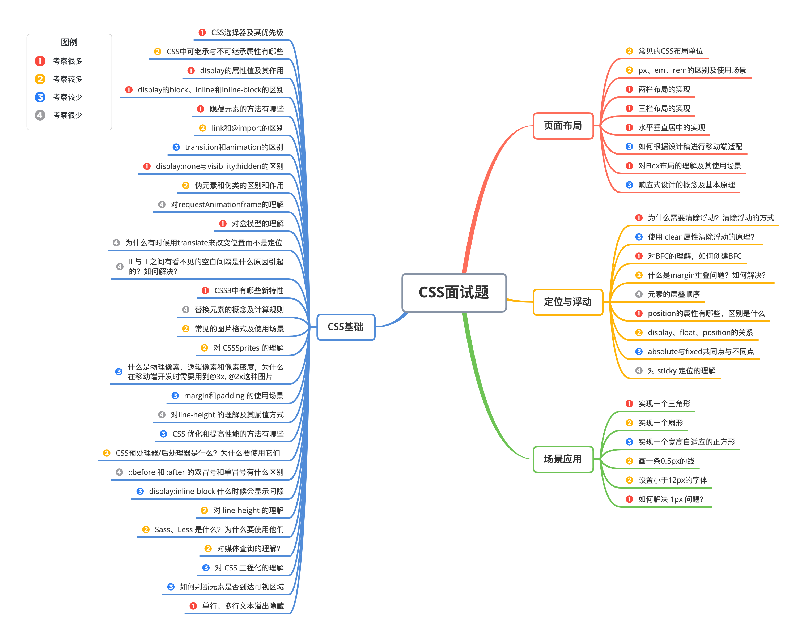

## 一、CSS基础

### 1. CSS选择器及其优先级

| **选择器**     | **格式**      | **优先级权重** |
| -------------- | ------------- | -------------- |
| id选择器       | #id           | 100            |
| 类选择器       | #classname    | 10             |
| 属性选择器     | a[ref=“eee”]  | 10             |
| 伪类选择器     | li:last-child | 10             |
| 标签选择器     | div           | 1              |
| 伪元素选择器   | li:after      | 1              |
| 相邻兄弟选择器 | h1+p          | 0              |
| 子选择器       | ul>li         | 0              |
| 后代选择器     | li a          | 0              |
| 通配符选择器   | *             | 0              |

对于选择器的**优先级**：

- 标签选择器、伪元素选择器：1
- 类选择器、伪类选择器、属性选择器：10
- id 选择器：100
- 内联样式：1000


**注意事项：**

- !important声明的样式的优先级最高；
- 如果优先级相同，则最后出现的样式生效；
- 继承得到的样式的优先级最低；
- 通用选择器（*）、子选择器（>）和相邻同胞选择器（+）并不在这四个等级中，所以它们的权值都为 0 ；
- 样式表的来源不同时，优先级顺序为：内联样式 > 内部样式 > 外部样式 > 浏览器用户自定义样式 > 浏览器默认样式。

### 2. CSS中可继承与不可继承属性有哪些

**一、无继承性的属性**

1. **display**：规定元素应该生成的框的类型
1. **文本属性**：

- vertical-align：垂直文本对齐
- text-decoration：规定添加到文本的装饰
- text-shadow：文本阴影效果
- white-space：空白符的处理
- unicode-bidi：设置文本的方向

3. **盒子模型的属性**：width、height、margin、border、padding
3. **背景属性**：background、background-color、background-image、background-repeat、background-position、background-attachment
3. **定位属性**：float、clear、position、top、right、bottom、left、min-width、min-height、max-width、max-height、overflow、clip、z-index
3. **生成内容属性**：content、counter-reset、counter-increment
3. **轮廓样式属性**：outline-style、outline-width、outline-color、outline
3. **页面样式属性**：size、page-break-before、page-break-after
3. **声音样式属性**：pause-before、pause-after、pause、cue-before、cue-after、cue、play-during


**二、有继承性的属性**

1. **字体系列属性**

- font-family：字体系列
- font-weight：字体的粗细
- font-size：字体的大小
- font-style：字体的风格

2. **文本系列属性**

- text-indent：文本缩进
- text-align：文本水平对齐
- line-height：行高
- word-spacing：单词之间的间距
- letter-spacing：中文或者字母之间的间距
- text-transform：控制文本大小写（就是uppercase、lowercase、capitalize这三个）
- color：文本颜色

3. **元素可见性**

- visibility：控制元素显示隐藏

4. **列表布局属性**

- list-style：列表风格，包括list-style-type、list-style-image等

5. **光标属性**

- cursor：光标显示为何种形态

### 3. display的属性值及其作用

| **属性值**   | **作用**                                                   |
| ------------ | ---------------------------------------------------------- |
| none         | 元素不显示，并且会从文档流中移除。                         |
| block        | 块类型。默认宽度为父元素宽度，可设置宽高，换行显示。       |
| inline       | 行内元素类型。默认宽度为内容宽度，不可设置宽高，同行显示。 |
| inline-block | 默认宽度为内容宽度，可以设置宽高，同行显示。               |
| list-item    | 像块类型元素一样显示，并添加样式列表标记。                 |
| table        | 此元素会作为块级表格来显示。                               |
| inherit      | 规定应该从父元素继承display属性的值。                      |

### 4. display的block、inline和inline-block的区别

（1）**block：** 会独占一行，多个元素会另起一行，可以设置width、height、margin和padding属性；

（2）**inline：** 元素不会独占一行，设置width、height属性无效。但可以设置水平方向的margin和padding属性，不能设置垂直方向的padding和margin；

（3）**inline-block：** 将对象设置为inline对象，但对象的内容作为block对象呈现，之后的内联对象会被排列在同一行内。


对于行内元素和块级元素，其特点如下：

**（1）行内元素**

- 设置宽高无效；
- 可以设置水平方向的margin和padding属性，不能设置垂直方向的padding和margin；
- 不会自动换行；

**（2）块级元素**

- 可以设置宽高；
- 设置margin和padding都有效；
- 可以自动换行；
- 多个块状，默认排列从上到下。

### 5. 隐藏元素的方法有哪些

- **display: none**：渲染树不会包含该渲染对象，因此该元素不会在页面中占据位置，也不会响应绑定的监听事件。
- **visibility: hidden**：元素在页面中仍占据空间，但是不会响应绑定的监听事件。
- **opacity: 0**：将元素的透明度设置为 0，以此来实现元素的隐藏。元素在页面中仍然占据空间，并且能够响应元素绑定的监听事件。
- **position: absolute**：通过使用绝对定位将元素移除可视区域内，以此来实现元素的隐藏。
- **z-index: 负值**：来使其他元素遮盖住该元素，以此来实现隐藏。
- **clip/clip-path** ：使用元素裁剪的方法来实现元素的隐藏，这种方法下，元素仍在页面中占据位置，但是不会响应绑定的监听事件。
- **transform: scale(0,0)**：将元素缩放为 0，来实现元素的隐藏。这种方法下，元素仍在页面中占据位置，但是不会响应绑定的监听事件。

### 6. link和@import的区别

两者都是外部引用CSS的方式，它们的区别如下：

- link是XHTML标签，除了加载CSS外，还可以定义RSS等其他事务；@import属于CSS范畴，只能加载CSS。
- link引用CSS时，在页面载入时同时加载；@import需要页面网页完全载入以后加载。
- link是XHTML标签，无兼容问题；@import是在CSS2.1提出的，低版本的浏览器不支持。
- link支持使用Javascript控制DOM去改变样式；而@import不支持。

### 7. transition和animation的区别

- **transition是过度属性**，强调过度，它的实现需要触发一个事件（比如鼠标移动上去，焦点，点击等）才执行动画。它类似于flash的补间动画，设置一个开始关键帧，一个结束关键帧。
- **animation是动画属性**，它的实现不需要触发事件，设定好时间之后可以自己执行，且可以循环一个动画。它也类似于flash的补间动画，但是它可以设置多个关键帧（用@keyframe定义）完成动画。

### 8. display:none与visibility:hidden的区别

这两个属性都是让元素隐藏，不可见。**两者区别如下：**

（1）**在渲染树中**

- `display:none`会让元素完全从渲染树中消失，渲染时不会占据任何空间；
- `visibility:hidden`不会让元素从渲染树中消失，渲染的元素还会占据相应的空间，只是内容不可见。

（2）**是否是继承属性**

- `display:none`是非继承属性，子孙节点会随着父节点从渲染树消失，通过修改子孙节点的属性也无法显示；
- `visibility:hidden`是继承属性，子孙节点消失是由于继承了`hidden`，通过设置`visibility:visible`可以让子孙节点显示；
（3）修改常规文档流中元素的 `display` 通常会造成文档的重排，但是修改`visibility`属性只会造成本元素的重绘；

（4）如果使用读屏器，设置为`display:none`的内容不会被读取，设置为`visibility:hidden`的内容会被读取。

### 9. **伪元素和伪类的区别和作用？**

- 伪元素：在内容元素的前后插入额外的元素或样式，但是这些元素实际上并不在文档中生成。它们只在外部显示可见，但不会在文档的源代码中找到它们，因此，称为“伪”元素。例如：

```css
p::before {content:"第一章：";}
p::after {content:"Hot!";}
p::first-line {background:red;}
p::first-letter {font-size:30px;}
```

- 伪类：将特殊的效果添加到特定选择器上。它是已有元素上添加类别的，不会产生新的元素。例如：

```css
a:hover {color: #FF00FF}
p:first-child {color: red}
```

**总结：** 伪类是通过在元素选择器上加⼊伪类改变元素状态，⽽伪元素通过对元素的操作进⾏对元素的改变。 

### 10. 对requestAnimationframe的理解

实现动画效果的方法比较多，Javascript 中可以通过定时器 setTimeout 来实现，CSS3 中可以使用 transition 和 animation 来实现，HTML5 中的 canvas 也可以实现。除此之外，HTML5 提供一个专门用于请求动画的API，那就是 requestAnimationFrame，顾名思义就是**请求动画帧**。


MDN对该方法的描述：

> window.requestAnimationFrame() 告诉浏览器——你希望执行一个动画，并且要求浏览器在下次重绘之前调用指定的回调函数更新动画。该方法需要传入一个回调函数作为参数，该回调函数会在浏览器下一次重绘之前执行。


**语法：** `window.requestAnimationFrame(callback);`  其中，callback是**下一次重绘之前更新动画帧所调用的函数**(即上面所说的回调函数)。该回调函数会被传入DOMHighResTimeStamp参数，它表示requestAnimationFrame() 开始去执行回调函数的时刻。该方法属于**宏任务**，所以会在执行完微任务之后再去执行。


**取消动画：** 使用cancelAnimationFrame()来取消执行动画，该方法接收一个参数——requestAnimationFrame默认返回的id，只需要传入这个id就可以取消动画了。


**优势：**

- **CPU节能**：使用SetTinterval 实现的动画，当页面被隐藏或最小化时，SetTinterval 仍然在后台执行动画任务，由于此时页面处于不可见或不可用状态，刷新动画是没有意义的，完全是浪费CPU资源。而RequestAnimationFrame则完全不同，当页面处理未激活的状态下，该页面的屏幕刷新任务也会被系统暂停，因此跟着系统走的RequestAnimationFrame也会停止渲染，当页面被激活时，动画就从上次停留的地方继续执行，有效节省了CPU开销。
- **函数节流**：在高频率事件( resize, scroll 等)中，为了防止在一个刷新间隔内发生多次函数执行，RequestAnimationFrame可保证每个刷新间隔内，函数只被执行一次，这样既能保证流畅性，也能更好的节省函数执行的开销，一个刷新间隔内函数执行多次时没有意义的，因为多数显示器每16.7ms刷新一次，多次绘制并不会在屏幕上体现出来。
- **减少DOM操作**：requestAnimationFrame 会把每一帧中的所有DOM操作集中起来，在一次重绘或回流中就完成，并且重绘或回流的时间间隔紧紧跟随浏览器的刷新频率，一般来说，这个频率为每秒60帧。


**setTimeout执行动画的缺点**：它通过设定间隔时间来不断改变图像位置，达到动画效果。但是容易出现卡顿、抖动的现象；原因是：

- settimeout任务被放入异步队列，只有当主线程任务执行完后才会执行队列中的任务，因此实际执行时间总是比设定时间要晚；
- settimeout的固定时间间隔不一定与屏幕刷新间隔时间相同，会引起丢帧。

### 11. 对盒模型的理解

CSS3中的盒模型有以下两种：标准盒子模型、IE盒子模型

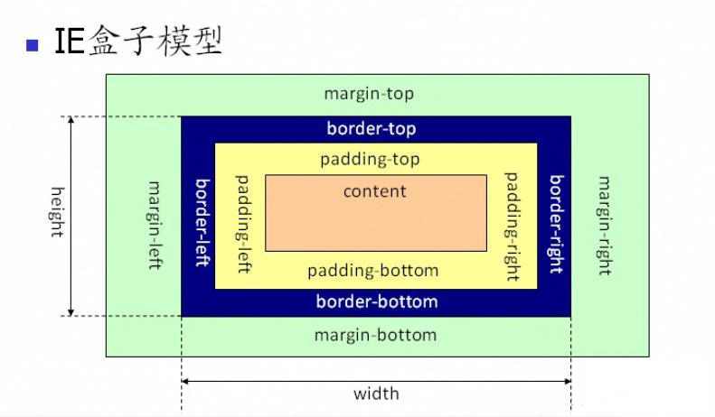
盒模型都是由四个部分组成的，分别是margin、border、padding和content。


标准盒模型和IE盒模型的区别在于设置width和height时，所对应的范围不同：

- 标准盒模型的width和height属性的范围只包含了content，
- IE盒模型的width和height属性的范围包含了border、padding和content。


可以通过修改元素的box-sizing属性来改变元素的盒模型：

- `box-sizeing: content-box`表示标准盒模型（默认值）
- `box-sizeing: border-box`表示IE盒模型（怪异盒模型）

### 12. 为什么有时候⽤**translate**来改变位置⽽不是定位？ 

translate 是 transform 属性的⼀个值。改变transform或opacity不会触发浏览器重新布局（reflow）或重绘（repaint），只会触发复合（compositions）。⽽改变绝对定位会触发重新布局，进⽽触发重绘和复合。transform使浏览器为元素创建⼀个 GPU 图层，但改变绝对定位会使⽤到 CPU。 因此translate()更⾼效，可以缩短平滑动画的绘制时间。 ⽽translate改变位置时，元素依然会占据其原始空间，绝对定位就不会发⽣这种情况。

### 13. li 与 li 之间有看不见的空白间隔是什么原因引起的？如何解决？

浏览器会把inline内联元素间的空白字符（空格、换行、Tab等）渲染成一个空格。为了美观，通常是一个`<li>`放在一行，这导致`<li>`换行后产生换行字符，它变成一个空格，占用了一个字符的宽度。


**解决办法：**

（1）为`<li>`设置float:left。不足：有些容器是不能设置浮动，如左右切换的焦点图等。

（2）将所有`<li>`写在同一行。不足：代码不美观。

（3）将`<ul>`内的字符尺寸直接设为0，即font-size:0。不足：`<ul>`中的其他字符尺寸也被设为0，需要额外重新设定其他字符尺寸，且在Safari浏览器依然会出现空白间隔。

（4）消除`<ul>`的字符间隔letter-spacing:-8px，不足：这也设置了`<li>`内的字符间隔，因此需要将`<li>`内的字符间隔设为默认letter-spacing:normal。

### 14. CSS3中有哪些新特性

- 新增各种CSS选择器 （: not(.input)：所有 class 不是“input”的节点）
- 圆角 （border-radius:8px）
- 多列布局 （multi-column layout）
- 阴影和反射 （Shadoweflect）
- 文字特效 （text-shadow）
- 文字渲染 （Text-decoration）
- 线性渐变 （gradient）
- 旋转 （transform）
- 增加了旋转,缩放,定位,倾斜,动画,多背景

### 15. 替换元素的概念及计算规则

通过修改某个属性值呈现的内容就可以被替换的元素就称为“替换元素”。


替换元素除了内容可替换这一特性以外，还有以下特性：

- **内容的外观不受页面上的CSS的影响**：用专业的话讲就是在样式表现在CSS作用域之外。如何更改替换元素本身的外观需要类似appearance属性，或者浏览器自身暴露的一些样式接口。
- **有自己的尺寸**：在Web中，很多替换元素在没有明确尺寸设定的情况下，其默认的尺寸（不包括边框）是300像素×150像素，如
- **在很多CSS属性上有自己的一套表现规则**：比较具有代表性的就是vertical-align属性，对于替换元素和非替换元素，vertical-align属性值的解释是不一样的。比方说vertical-align的默认值的baseline，很简单的属性值，基线之意，被定义为字符x的下边缘，而替换元素的基线却被硬生生定义成了元素的下边缘。
- **所有的替换元素都是内联水平元素**：也就是替换元素和替换元素、替换元素和文字都是可以在一行显示的。但是，替换元素默认的display值却是不一样的，有的是inline，有的是inline-block。


替换元素的尺寸从内而外分为三类：

- **固有尺寸：** 指的是替换内容原本的尺寸。例如，图片、视频作为一个独立文件存在的时候，都是有着自己的宽度和高度的。
- **HTML尺寸：** 只能通过HTML原生属性改变，这些HTML原生属性包括的width和height属性、的size属性。
- **CSS尺寸：** 特指可以通过CSS的width和height或者max-width/min-width和max-height/min-height设置的尺寸，对应盒尺寸中的content box。


这三层结构的计算规则具体如下：
（1）如果没有CSS尺寸和HTML尺寸，则使用固有尺寸作为最终的宽高。
（2）如果没有CSS尺寸，则使用HTML尺寸作为最终的宽高。
（3）如果有CSS尺寸，则最终尺寸由CSS属性决定。
（4）如果“固有尺寸”含有固有的宽高比例，同时仅设置了宽度或仅设置了高度，则元素依然按照固有的宽高比例显示。
（5）如果上面的条件都不符合，则最终宽度表现为300像素，高度为150像素。
（6）内联替换元素和块级替换元素使用上面同一套尺寸计算规则。

### 16. 常见的图片格式及使用场景

（1）**BMP**，是无损的、既支持索引色也支持直接色的点阵图。这种图片格式几乎没有对数据进行压缩，所以BMP格式的图片通常是较大的文件。


（2）**GIF**是无损的、采用索引色的点阵图。采用LZW压缩算法进行编码。文件小，是GIF格式的优点，同时，GIF格式还具有支持动画以及透明的优点。但是GIF格式仅支持8bit的索引色，所以GIF格式适用于对色彩要求不高同时需要文件体积较小的场景。


（3）**JPEG**是有损的、采用直接色的点阵图。JPEG的图片的优点是采用了直接色，得益于更丰富的色彩，JPEG非常适合用来存储照片，与GIF相比，JPEG不适合用来存储企业Logo、线框类的图。因为有损压缩会导致图片模糊，而直接色的选用，又会导致图片文件较GIF更大。


（4）**PNG-8**是无损的、使用索引色的点阵图。PNG是一种比较新的图片格式，PNG-8是非常好的GIF格式替代者，在可能的情况下，应该尽可能的使用PNG-8而不是GIF，因为在相同的图片效果下，PNG-8具有更小的文件体积。除此之外，PNG-8还支持透明度的调节，而GIF并不支持。除非需要动画的支持，否则没有理由使用GIF而不是PNG-8。


（5）**PNG-24**是无损的、使用直接色的点阵图。PNG-24的优点在于它压缩了图片的数据，使得同样效果的图片，PNG-24格式的文件大小要比BMP小得多。当然，PNG24的图片还是要比JPEG、GIF、PNG-8大得多。


（6）**SVG**是无损的矢量图。SVG是矢量图意味着SVG图片由直线和曲线以及绘制它们的方法组成。当放大SVG图片时，看到的还是线和曲线，而不会出现像素点。SVG图片在放大时，不会失真，所以它适合用来绘制Logo、Icon等。


（7）**WebP**是谷歌开发的一种新图片格式，WebP是同时支持有损和无损压缩的、使用直接色的点阵图。从名字就可以看出来它是为Web而生的，什么叫为Web而生呢？就是说相同质量的图片，WebP具有更小的文件体积。现在网站上充满了大量的图片，如果能够降低每一个图片的文件大小，那么将大大减少浏览器和服务器之间的数据传输量，进而降低访问延迟，提升访问体验。目前只有Chrome浏览器和Opera浏览器支持WebP格式，兼容性不太好。

- 在无损压缩的情况下，相同质量的WebP图片，文件大小要比PNG小26%；
- 在有损压缩的情况下，具有相同图片精度的WebP图片，文件大小要比JPEG小25%~34%；
- WebP图片格式支持图片透明度，一个无损压缩的WebP图片，如果要支持透明度只需要22%的格外文件大小。

### 17. 对 CSSSprites 的理解

CSSSprites（精灵图），将一个页面涉及到的所有图片都包含到一张大图中去，然后利用CSS的 background-image，background-repeat，background-position属性的组合进行背景定位。


**优点：**

- 利用`CSS Sprites`能很好地减少网页的http请求，从而大大提高了页面的性能，这是`CSS Sprites`最大的优点；
- `CSS Sprites`能减少图片的字节，把3张图片合并成1张图片的字节总是小于这3张图片的字节总和。


**缺点：**

- 在图片合并时，要把多张图片有序的、合理的合并成一张图片，还要留好足够的空间，防止板块内出现不必要的背景。在宽屏及高分辨率下的自适应页面，如果背景不够宽，很容易出现背景断裂；
- `CSSSprites`在开发的时候相对来说有点麻烦，需要借助`photoshop`或其他工具来对每个背景单元测量其准确的位置。
- 维护方面：`CSS Sprites`在维护的时候比较麻烦，页面背景有少许改动时，就要改这张合并的图片，无需改的地方尽量不要动，这样避免改动更多的`CSS`，如果在原来的地方放不下，又只能（最好）往下加图片，这样图片的字节就增加了，还要改动`CSS`。

### 18. 什么是物理像素，逻辑像素和像素密度，为什么在移动端开发时需要用到@3x, @2x这种图片？

以 iPhone XS 为例，当写 CSS 代码时，针对于单位 px，其宽度为 414px & 896px，也就是说当赋予一个 DIV元素宽度为 414px，这个 DIV 就会填满手机的宽度；


而如果有一把尺子来实际测量这部手机的物理像素，实际为 1242*2688 物理像素；经过计算可知，1242/414=3，也就是说，在单边上，一个逻辑像素=3个物理像素，就说这个屏幕的像素密度为 3，也就是常说的 3 倍屏。


对于图片来说，为了保证其不失真，1 个图片像素至少要对应一个物理像素，假如原始图片是 500300 像素，那么在 3 倍屏上就要放一个 1500900 像素的图片才能保证 1 个物理像素至少对应一个图片像素，才能不失真。

当然，也可以针对所有屏幕，都只提供最高清图片。虽然低密度屏幕用不到那么多图片像素，而且会因为下载多余的像素造成带宽浪费和下载延迟，但从结果上说能保证图片在所有屏幕上都不会失真。


还可以使用 CSS 媒体查询来判断不同的像素密度，从而选择不同的图片:

```javascript
my-image { background: (low.png); }
@media only screen and (min-device-pixel-ratio: 1.5) {
  #my-image { background: (high.png); }
}
```

### 19. **margin 和 padding 的使用场景**

- 需要在border外侧添加空白，且空白处不需要背景（色）时，使用 margin；
- 需要在border内测添加空白，且空白处需要背景（色）时，使用 padding。

### 20. 对**line-height 的理解及其赋值方式**

**（1）line-height的概念：**

- line-height 指一行文本的高度，包含了字间距，实际上是下一行基线到上一行基线距离；
- 如果一个标签没有定义 height 属性，那么其最终表现的高度由 line-height 决定；
- 一个容器没有设置高度，那么撑开容器高度的是 line-height，而不是容器内的文本内容；
- 把 line-height 值设置为 height 一样大小的值可以实现单行文字的垂直居中；
- line-height 和 height 都能撑开一个高度；

**（2）line-height 的赋值方式：**

- 带单位：px 是固定值，而 em 会参考父元素 font-size 值计算自身的行高
- 纯数字：会把比例传递给后代。例如，父级行高为 1.5，子元素字体为 18px，则子元素行高为 1.5 * 18 = 27px
- 百分比：将计算后的值传递给后代

### 21. CSS 优化和提高性能的方法有哪些？

**加载性能：**

（1）css压缩：将写好的css进行打包压缩，可以减小文件体积。


（2）css单一样式：当需要下边距和左边距的时候，很多时候会选择使用 margin:top 0 bottom 0；但margin-bottom:bottom;margin-left:left;执行效率会更高。


（3）减少使用@import，建议使用link，因为后者在页面加载时一起加载，前者是等待页面加载完成之后再进行加载。


**选择器性能：**

（1）关键选择器（key selector）。选择器的最后面的部分为关键选择器（即用来匹配目标元素的部分）。CSS选择符是从右到左进行匹配的。当使用后代选择器的时候，浏览器会遍历所有子元素来确定是否是指定的元素等等；


（2）如果规则拥有ID选择器作为其关键选择器，则不要为规则增加标签。过滤掉无关的规则（这样样式系统就不会浪费时间去匹配它们了）。


（3）避免使用通配规则，如*{}计算次数惊人，只对需要用到的元素进行选择。


（4）尽量少的去对标签进行选择，而是用class。


（5）尽量少的去使用后代选择器，降低选择器的权重值。后代选择器的开销是最高的，尽量将选择器的深度降到最低，最高不要超过三层，更多的使用类来关联每一个标签元素。


（6）了解哪些属性是可以通过继承而来的，然后避免对这些属性重复指定规则。


**渲染性能：**

（1）慎重使用高性能属性：浮动、定位。


（2）尽量减少页面重排、重绘。


（3）去除空规则：｛｝。空规则的产生原因一般来说是为了预留样式。去除这些空规则无疑能减少css文档体积。


（4）属性值为0时，不加单位。


（5）属性值为浮动小数0.**，可以省略小数点之前的0。


（6）标准化各种浏览器前缀：带浏览器前缀的在前。标准属性在后。


（7）不使用@import前缀，它会影响css的加载速度。


（8）选择器优化嵌套，尽量避免层级过深。


（9）css雪碧图，同一页面相近部分的小图标，方便使用，减少页面的请求次数，但是同时图片本身会变大，使用时，优劣考虑清楚，再使用。


（10）正确使用display的属性，由于display的作用，某些样式组合会无效，徒增样式体积的同时也影响解析性能。


（11）不滥用web字体。对于中文网站来说WebFonts可能很陌生，国外却很流行。web fonts通常体积庞大，而且一些浏览器在下载web fonts时会阻塞页面渲染损伤性能。


**可维护性、健壮性：**

（1）将具有相同属性的样式抽离出来，整合并通过class在页面中进行使用，提高css的可维护性。


（2）样式与内容分离：将css代码定义到外部css中。

### 22. CSS预处理器/后处理器是什么？为什么要使用它们？

**预处理器，** 如：`less`，`sass`，`stylus`，用来预编译`sass`或者`less`，增加了`css`代码的复用性。层级，`mixin`， 变量，循环， 函数等对编写以及开发UI组件都极为方便。


**后处理器，** 如： `postCss`，通常是在完成的样式表中根据`css`规范处理`css`，让其更加有效。目前最常做的是给`css`属性添加浏览器私有前缀，实现跨浏览器兼容性的问题。


`css`预处理器为`css`增加一些编程特性，无需考虑浏览器的兼容问题，可以在`CSS`中使用变量，简单的逻辑程序，函数等在编程语言中的一些基本的性能，可以让`css`更加的简洁，增加适应性以及可读性，可维护性等。


其它`css`预处理器语言：`Sass（Scss）`, `Less`, `Stylus`, `Turbine`, `Swithch css`, `CSS Cacheer`, `DT Css`。


使用原因：

- 结构清晰， 便于扩展
- 可以很方便的屏蔽浏览器私有语法的差异
- 可以轻松实现多重继承
- 完美的兼容了`CSS`代码，可以应用到老项目中

### 23. ::before 和 :after 的双冒号和单冒号有什么区别？

（1）冒号(`:`)用于`CSS3`伪类，双冒号(`::`)用于`CSS3`伪元素。
（2）`::before`就是以一个子元素的存在，定义在元素主体内容之前的一个伪元素。并不存在于`dom`之中，只存在在页面之中。


**注意：** `:before `和 `:after` 这两个伪元素，是在`CSS2.1`里新出现的。起初，伪元素的前缀使用的是单冒号语法，但随着`Web`的进化，在`CSS3`的规范里，伪元素的语法被修改成使用双冒号，成为`::before`、`::after`。

### 24. display:inline-block 什么时候会显示间隙？

- 有空格时会有间隙，可以删除空格解决；
- `margin`正值时，可以让`margin`使用负值解决；
- 使用`font-size`时，可通过设置`font-size:0`、`letter-spacing`、`word-spacing`解决；

### 25. 单行、多行文本溢出隐藏

- 单行文本溢出

```css
overflow: hidden;            // 溢出隐藏
text-overflow: ellipsis;      // 溢出用省略号显示
white-space: nowrap;         // 规定段落中的文本不进行换行
```

- 多行文本溢出

```css
overflow: hidden;            // 溢出隐藏
text-overflow: ellipsis;     // 溢出用省略号显示
display:-webkit-box;         // 作为弹性伸缩盒子模型显示。
-webkit-box-orient:vertical; // 设置伸缩盒子的子元素排列方式：从上到下垂直排列
-webkit-line-clamp:3;        // 显示的行数
```

注意：由于上面的三个属性都是 CSS3 的属性，没有浏览器可以兼容，所以要在前面加一个`-webkit-` 来兼容一部分浏览器。

### 26. Sass、Less 是什么？为什么要使用他们？ 

他们都是 CSS 预处理器，是 CSS 上的一种抽象层。他们是一种特殊的语法/语言编译成 CSS。 例如 Less 是一种动态样式语言，将 CSS 赋予了动态语言的特性，如变量，继承，运算， 函数，LESS 既可以在客户端上运行 (支持 IE 6+, Webkit, Firefox)，也可以在服务端运行 (借助 Node.js)。 


**为什么要使用它们？**

- 结构清晰，便于扩展。 可以方便地屏蔽浏览器私有语法差异。封装对浏览器语法差异的重复处理， 减少无意义的机械劳动。 
- 可以轻松实现多重继承。 完全兼容 CSS 代码，可以方便地应用到老项目中。LESS 只是在 CSS 语法上做了扩展，所以老的 CSS 代码也可以与 LESS 代码一同编译。

### 27. 对媒体查询的理解？

媒体查询由⼀个可选的媒体类型和零个或多个使⽤媒体功能的限制了样式表范围的表达式组成，例如宽度、⾼度和颜⾊。媒体查询，添加⾃CSS3，允许内容的呈现针对⼀个特定范围的输出设备⽽进⾏裁剪，⽽不必改变内容本身，适合web⽹⻚应对不同型号的设备⽽做出对应的响应适配。 


媒体查询包含⼀个可选的媒体类型和满⾜CSS3规范的条件下，包含零个或多个表达式，这些表达式描述了媒体特征，最终会被解析为true或false。如果媒体查询中指定的媒体类型匹配展示⽂档所使⽤的设备类型，并且所有的表达式的值都是true，那么该媒体查询的结果为true。那么媒体查询内的样式将会⽣效。 

```javascript
<!-- link元素中的CSS媒体查询 --> 
<link rel="stylesheet" media="(max-width: 800px)" href="example.css" /> 
<!-- 样式表中的CSS媒体查询 --> 
<style> 
@media (max-width: 600px) { 
  .facet_sidebar { 
    display: none; 
  } 
}
</style>
```

简单来说，使用 @media 查询，可以针对不同的媒体类型定义不同的样式。@media 可以针对不同的屏幕尺寸设置不同的样式，特别是需要设置设计响应式的页面，@media 是非常有用的。当重置浏览器大小的过程中，页面也会根据浏览器的宽度和高度重新渲染页面。

### 28. 对 CSS 工程化的理解

CSS 工程化是为了解决以下问题：

1. **宏观设计**：CSS 代码如何组织、如何拆分、模块结构怎样设计？
1. **编码优化**：怎样写出更好的 CSS？
1. **构建**：如何处理我的 CSS，才能让它的打包结果最优？
1. **可维护性**：代码写完了，如何最小化它后续的变更成本？如何确保任何一个同事都能轻松接手？


以下三个方向都是时下比较流行的、普适性非常好的 CSS 工程化实践：

- 预处理器：Less、 Sass 等；
- 重要的工程化插件： PostCss；
- Webpack loader 等 。


基于这三个方向，可以衍生出一些具有典型意义的子问题，这里我们逐个来看：

**（1）预处理器：为什么要用预处理器？它的出现是为了解决什么问题？**

预处理器，其实就是 CSS 世界的“轮子”。预处理器支持我们写一种类似 CSS、但实际并不是 CSS 的语言，然后把它编译成 CSS 代码：
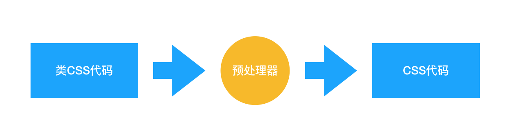
那为什么写 CSS 代码写得好好的，偏偏要转去写“类 CSS”呢？这就和本来用 JS 也可以实现所有功能，但最后却写 React 的 jsx 或者 Vue 的模板语法一样——为了爽！要想知道有了预处理器有多爽，首先要知道的是传统 CSS 有多不爽。随着前端业务复杂度的提高，前端工程中对 CSS 提出了以下的诉求：

1. 宏观设计上：我们希望能优化 CSS 文件的目录结构，对现有的 CSS 文件实现复用；
1. 编码优化上：我们希望能写出结构清晰、简明易懂的 CSS，需要它具有一目了然的嵌套层级关系，而不是无差别的一铺到底写法；我们希望它具有变量特征、计算能力、循环能力等等更强的可编程性，这样我们可以少写一些无用的代码；
1. 可维护性上：更强的可编程性意味着更优质的代码结构，实现复用意味着更简单的目录结构和更强的拓展能力，这两点如果能做到，自然会带来更强的可维护性。


这三点是传统 CSS 所做不到的，也正是预处理器所解决掉的问题。预处理器普遍会具备这样的特性：

- 嵌套代码的能力，通过嵌套来反映不同 css 属性之间的层级关系 ；
- 支持定义 css 变量；
- 提供计算函数；
- 允许对代码片段进行 extend 和 mixin；
- 支持循环语句的使用；
- 支持将 CSS 文件模块化，实现复用。

**（2）PostCss：PostCss 是如何工作的？我们在什么场景下会使用 PostCss？**

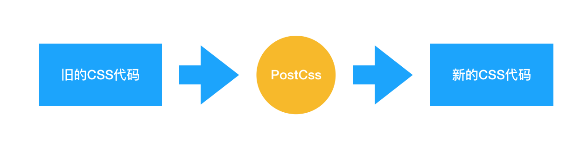
它和预处理器的不同就在于，预处理器处理的是 类CSS，而 PostCss 处理的就是 CSS 本身。Babel 可以将高版本的 JS 代码转换为低版本的 JS 代码。PostCss 做的是类似的事情：它可以编译尚未被浏览器广泛支持的先进的 CSS 语法，还可以自动为一些需要额外兼容的语法增加前缀。更强的是，由于 PostCss 有着强大的插件机制，支持各种各样的扩展，极大地强化了 CSS 的能力。


PostCss 在业务中的使用场景非常多：

- 提高 CSS 代码的可读性：PostCss 其实可以做类似预处理器能做的工作；
- 当我们的 CSS 代码需要适配低版本浏览器时，PostCss 的 [Autoprefixer](https://github.com/postcss/autoprefixer) 插件可以帮助我们自动增加浏览器前缀；
- 允许我们编写面向未来的 CSS：PostCss 能够帮助我们编译 CSS next 代码；

**（3）Webpack 能处理 CSS 吗？如何实现？**
Webpack 能处理 CSS 吗：

- **Webpack 在裸奔的状态下，是不能处理 CSS 的**，Webpack 本身是一个面向 JavaScript 且只能处理 JavaScript 代码的模块化打包工具；
- Webpack 在 loader 的辅助下，是可以处理 CSS 的。


如何用 Webpack 实现对 CSS 的处理：

- Webpack 中操作 CSS 需要使用的两个关键的 loader：css-loader 和 style-loader
- 注意，答出“用什么”有时候可能还不够，面试官会怀疑你是不是在背答案，所以你还需要了解每个 loader 都做了什么事情：
  - css-loader：导入 CSS 模块，对 CSS 代码进行编译处理；
  - style-loader：创建style标签，把 CSS 内容写入标签。


在实际使用中，**css-loader 的执行顺序一定要安排在 style-loader 的前面**。因为只有完成了编译过程，才可以对 css 代码进行插入；若提前插入了未编译的代码，那么 webpack 是无法理解这坨东西的，它会无情报错。

### 29. 如何判断元素是否到达可视区域 

以图片显示为例：

- `window.innerHeight` 是浏览器可视区的高度；
- `document.body.scrollTop || document.documentElement.scrollTop` 是浏览器滚动的过的距离；
- `imgs.offsetTop` 是元素顶部距离文档顶部的高度（包括滚动条的距离）；
- 内容达到显示区域的：`img.offsetTop < window.innerHeight + document.body.scrollTop;`

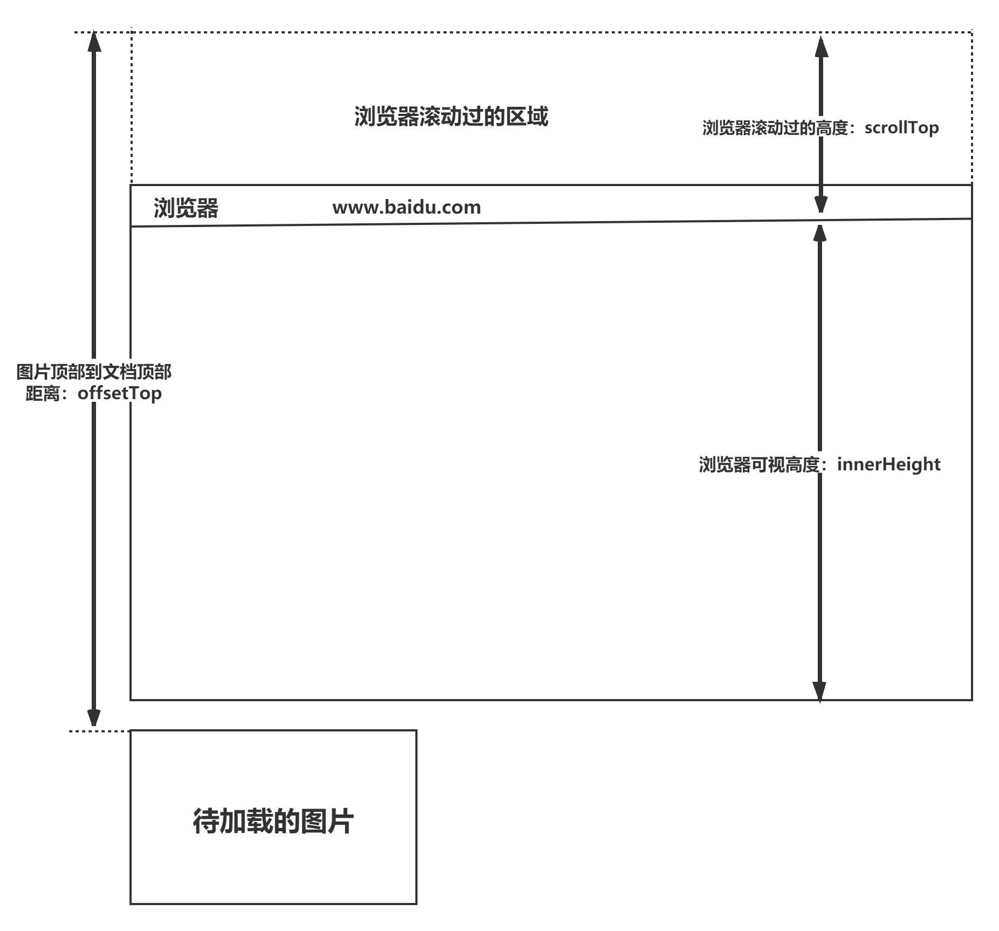

### 30. z-index属性在什么情况下会失效

通常 z-index 的使用是在有两个重叠的标签，在一定的情况下控制其中一个在另一个的上方或者下方出现。z-index值越大就越是在上层。z-index元素的position属性需要是relative，absolute或是fixed。

z-index属性在下列情况下会失效：

- 父元素position为relative时，子元素的z-index失效。解决：父元素position改为absolute或static；
- 元素没有设置position属性为非static属性。解决：设置该元素的position属性为relative，absolute或是fixed中的一种；
- 元素在设置z-index的同时还设置了float浮动。解决：float去除，改为display：inline-block；

### 31. CSS3中的transform有哪些属性

## 二、页面布局

### 1. 常见的CSS布局单位

常用的布局单位包括像素（`px`），百分比（`%`），`em`，`rem`，`vw/vh`。


**（1）像素**（`px`）是页面布局的基础，一个像素表示终端（电脑、手机、平板等）屏幕所能显示的最小的区域，像素分为两种类型：CSS像素和物理像素：

- **CSS像素**：为web开发者提供，在CSS中使用的一个抽象单位；
- **物理像素**：只与设备的硬件密度有关，任何设备的物理像素都是固定的。


**（2）百分比**（`%`），当浏览器的宽度或者高度发生变化时，通过百分比单位可以使得浏览器中的组件的宽和高随着浏览器的变化而变化，从而实现响应式的效果。一般认为子元素的百分比相对于直接父元素。


**（3）em和rem**相对于px更具灵活性，它们都是相对长度单位，它们之间的区别：**em相对于父元素，rem相对于根元素。**

- **em：** 文本相对长度单位。相对于当前对象内文本的字体尺寸。如果当前行内文本的字体尺寸未被人为设置，则相对于浏览器的默认字体尺寸(默认16px)。(相对父元素的字体大小倍数)。
- **rem：** rem是CSS3新增的一个相对单位，相对于根元素（html元素）的font-size的倍数。**作用**：利用rem可以实现简单的响应式布局，可以利用html元素中字体的大小与屏幕间的比值来设置font-size的值，以此实现当屏幕分辨率变化时让元素也随之变化。


**（4）vw/vh**是与视图窗口有关的单位，vw表示相对于视图窗口的宽度，vh表示相对于视图窗口高度，除了vw和vh外，还有vmin和vmax两个相关的单位。

- vw：相对于视窗的宽度，视窗宽度是100vw；
- vh：相对于视窗的高度，视窗高度是100vh；
- vmin：vw和vh中的较小值；
- vmax：vw和vh中的较大值；


**vw/vh** 和百分比很类似，两者的区别：

- 百分比（`%`）：大部分相对于祖先元素，也有相对于自身的情况比如（border-radius、translate等)
- vw/vm：相对于视窗的尺寸

### 2. px、em、rem的区别及使用场景

**三者的区别：**

- px是固定的像素，一旦设置了就无法因为适应页面大小而改变。
- em和rem相对于px更具有灵活性，他们是相对长度单位，其长度不是固定的，更适用于响应式布局。
- em是相对于其父元素来设置字体大小，这样就会存在一个问题，进行任何元素设置，都有可能需要知道他父元素的大小。而rem是相对于根元素，这样就意味着，只需要在根元素确定一个参考值。


**使用场景：**

- 对于只需要适配少部分移动设备，且分辨率对页面影响不大的，使用px即可 。
- 对于需要适配各种移动设备，使用rem，例如需要适配iPhone和iPad等分辨率差别比较挺大的设备。

### 3. 两栏布局的实现

一般两栏布局指的是**左边一栏宽度固定，右边一栏宽度自适应**，两栏布局的具体实现：

- 利用浮动，将左边元素宽度设置为200px，并且设置向左浮动。将右边元素的margin-left设置为200px，宽度设置为auto（默认为auto，撑满整个父元素）。

```css
.outer {
  height: 100px;
}
.left {
  float: left;
  width: 200px;
  background: tomato;
}
.right {
  margin-left: 200px;
  width: auto;
  background: gold;
}
```

- 利用浮动，左侧元素设置固定大小，并左浮动，右侧元素设置overflow: hidden; 这样右边就触发了BFC，BFC的区域不会与浮动元素发生重叠，所以两侧就不会发生重叠。

```css
.left{
     width: 100px;
     height: 200px;
     background: red;
     float: left;
 }
 .right{
     height: 300px;
     background: blue;
     overflow: hidden;
 }
```

- 利用flex布局，将左边元素设置为固定宽度200px，将右边的元素设置为flex:1。

```css
.outer {
  display: flex;
  height: 100px;
}
.left {
  width: 200px;
  background: tomato;
}
.right {
  flex: 1;
  background: gold;
}
```

- 利用绝对定位，将父级元素设置为相对定位。左边元素设置为absolute定位，并且宽度设置为200px。将右边元素的margin-left的值设置为200px。

```css
.outer {
  position: relative;
  height: 100px;
}
.left {
  position: absolute;
  width: 200px;
  height: 100px;
  background: tomato;
}
.right {
  margin-left: 200px;
  background: gold;
}
```

- 利用绝对定位，将父级元素设置为相对定位。左边元素宽度设置为200px，右边元素设置为绝对定位，左边定位为200px，其余方向定位为0。

```css
.outer {
  position: relative;
  height: 100px;
}
.left {
  width: 200px;
  background: tomato;
}
.right {
  position: absolute;
  top: 0;
  right: 0;
  bottom: 0;
  left: 200px;
  background: gold;
}
```

### 4. 三栏布局的实现

三栏布局一般指的是页面中一共有三栏，**左右两栏宽度固定，中间自适应的布局**，三栏布局的具体实现：

- 利用**绝对定位**，左右两栏设置为绝对定位，中间设置对应方向大小的margin的值。

```css
.outer {
  position: relative;
  height: 100px;
}

.left {
  position: absolute;
  width: 100px;
  height: 100px;
  background: tomato;
}

.right {
  position: absolute;
  top: 0;
  right: 0;
  width: 200px;
  height: 100px;
  background: gold;
}

.center {
  margin-left: 100px;
  margin-right: 200px;
  height: 100px;
  background: lightgreen;
}
```

- 利用flex布局，左右两栏设置固定大小，中间一栏设置为flex:1。

```css
.outer {
  display: flex;
  height: 100px;
}

.left {
  width: 100px;
  background: tomato;
}

.right {
  width: 100px;
  background: gold;
}

.center {
  flex: 1;
  background: lightgreen;
}
```

- 利用浮动，左右两栏设置固定大小，并设置对应方向的浮动。中间一栏设置左右两个方向的margin值，注意这种方式**，中间一栏必须放到最后：**

```css
.outer {
  height: 100px;
}

.left {
  float: left;
  width: 100px;
  height: 100px;
  background: tomato;
}

.right {
  float: right;
  width: 200px;
  height: 100px;
  background: gold;
}

.center {
  height: 100px;
  margin-left: 100px;
  margin-right: 200px;
  background: lightgreen;
}
```

- 圣杯布局，利用浮动和负边距来实现。父级元素设置左右的 padding，三列均设置向左浮动，中间一列放在最前面，宽度设置为父级元素的宽度，因此后面两列都被挤到了下一行，通过设置 margin 负值将其移动到上一行，再利用相对定位，定位到两边。

```css
.outer {
  height: 100px;
  padding-left: 100px;
  padding-right: 200px;
}

.left {
  position: relative;
  left: -100px;

  float: left;
  margin-left: -100%;

  width: 100px;
  height: 100px;
  background: tomato;
}

.right {
  position: relative;
  left: 200px;

  float: right;
  margin-left: -200px;

  width: 200px;
  height: 100px;
  background: gold;
}

.center {
  float: left;

  width: 100%;
  height: 100px;
  background: lightgreen;
}
```

- 双飞翼布局，双飞翼布局相对于圣杯布局来说，左右位置的保留是通过中间列的 margin 值来实现的，而不是通过父元素的 padding 来实现的。本质上来说，也是通过浮动和外边距负值来实现的。

```css
.outer {
  height: 100px;
}

.left {
  float: left;
  margin-left: -100%;

  width: 100px;
  height: 100px;
  background: tomato;
}

.right {
  float: left;
  margin-left: -200px;

  width: 200px;
  height: 100px;
  background: gold;
}

.wrapper {
  float: left;

  width: 100%;
  height: 100px;
  background: lightgreen;
}

.center {
  margin-left: 100px;
  margin-right: 200px;
  height: 100px;
}
```

### 5. 水平垂直居中的实现

- 利用绝对定位，先将元素的左上角通过top:50%和left:50%定位到页面的中心，然后再通过translate来调整元素的中心点到页面的中心。该方法需要**考虑浏览器兼容问题。**

```css
.parent {    position: relative;} .child {    position: absolute;    left: 50%;    top: 50%;    transform: translate(-50%,-50%);}
```

- 利用绝对定位，设置四个方向的值都为0，并将margin设置为auto，由于宽高固定，因此对应方向实现平分，可以实现水平和垂直方向上的居中。该方法适用于**盒子有宽高**的情况：

```css
.parent {
    position: relative;
}
 
.child {
    position: absolute;
    top: 0;
    bottom: 0;
    left: 0;
    right: 0;
    margin: auto;
}
```

- 利用绝对定位，先将元素的左上角通过top:50%和left:50%定位到页面的中心，然后再通过margin负值来调整元素的中心点到页面的中心。该方法适用于**盒子宽高已知**的情况

```css
.parent {
    position: relative;
}
 
.child {
    position: absolute;
    top: 50%;
    left: 50%;
    margin-top: -50px;     /* 自身 height 的一半 */
    margin-left: -50px;    /* 自身 width 的一半 */
}
```

- 使用flex布局，通过align-items:center和justify-content:center设置容器的垂直和水平方向上为居中对齐，然后它的子元素也可以实现垂直和水平的居中。该方法要**考虑兼容的问题**，该方法在移动端用的较多：

```css
.parent {
    display: flex;
    justify-content:center;
    align-items:center;
}
```

### 6. 如何根据设计稿进行移动端适配？

移动端适配主要有两个维度：

- **适配不同像素密度，** 针对不同的像素密度，使用 CSS 媒体查询，选择不同精度的图片，以保证图片不会失真；
- **适配不同屏幕大小，** 由于不同的屏幕有着不同的逻辑像素大小，所以如果直接使用 px 作为开发单位，会使得开发的页面在某一款手机上可以准确显示，但是在另一款手机上就会失真。为了适配不同屏幕的大小，应按照比例来还原设计稿的内容。


为了能让页面的尺寸自适应，可以使用 rem，em，vw，vh 等相对单位。

### 7. 对Flex布局的理解及其使用场景

Flex是FlexibleBox的缩写，意为"弹性布局"，用来为盒状模型提供最大的灵活性。任何一个容器都可以指定为Flex布局。行内元素也可以使用Flex布局。注意，设为Flex布局以后，**子元素的float、clear和vertical-align属性将失效**。采用Flex布局的元素，称为Flex容器（flex container），简称"容器"。它的所有子元素自动成为容器成员，称为Flex项目（flex item），简称"项目"。容器默认存在两根轴：水平的主轴（main axis）和垂直的交叉轴（cross axis），项目默认沿水平主轴排列。


以下6个属性设置在**容器上**：

- flex-direction属性决定主轴的方向（即项目的排列方向）。
- flex-wrap属性定义，如果一条轴线排不下，如何换行。
- flex-flow属性是flex-direction属性和flex-wrap属性的简写形式，默认值为row nowrap。
- justify-content属性定义了项目在主轴上的对齐方式。
- align-items属性定义项目在交叉轴上如何对齐。
- align-content属性定义了多根轴线的对齐方式。如果项目只有一根轴线，该属性不起作用。


以下6个属性设置在**项目上**：

- order属性定义项目的排列顺序。数值越小，排列越靠前，默认为0。
- flex-grow属性定义项目的放大比例，默认为0，即如果存在剩余空间，也不放大。
- flex-shrink属性定义了项目的缩小比例，默认为1，即如果空间不足，该项目将缩小。
- flex-basis属性定义了在分配多余空间之前，项目占据的主轴空间。浏览器根据这个属性，计算主轴是否有多余空间。它的默认值为auto，即项目的本来大小。
- flex属性是flex-grow，flex-shrink和flex-basis的简写，默认值为0 1 auto。
- align-self属性允许单个项目有与其他项目不一样的对齐方式，可覆盖align-items属性。默认值为auto，表示继承父元素的align-items属性，如果没有父元素，则等同于stretch。


**简单来说：**
flex布局是CSS3新增的一种布局方式，可以通过将一个元素的display属性值设置为flex从而使它成为一个flex容器，它的所有子元素都会成为它的项目。一个容器默认有两条轴：一个是水平的主轴，一个是与主轴垂直的交叉轴。可以使用flex-direction来指定主轴的方向。可以使用justify-content来指定元素在主轴上的排列方式，使用align-items来指定元素在交叉轴上的排列方式。还可以使用flex-wrap来规定当一行排列不下时的换行方式。对于容器中的项目，可以使用order属性来指定项目的排列顺序，还可以使用flex-grow来指定当排列空间有剩余的时候，项目的放大比例，还可以使用flex-shrink来指定当排列空间不足时，项目的缩小比例。

### 8. 响应式设计的概念及基本原理

响应式网站设计`（Responsive Web design`）是一个网站能够兼容多个终端，而不是为每一个终端做一个特定的版本。


关于原理： 基本原理是通过媒体查询`（@media）`查询检测不同的设备屏幕尺寸做处理。
关于兼容： 页面头部必须有mate声明的`viewport`。

```html
<meta name="’viewport’" content="”width=device-width," initial-scale="1." maximum-scale="1,user-scalable=no”"/>
```

## 三、定位与浮动

### 1. 为什么需要清除浮动？清除浮动的方式

**浮动的定义：** 非IE浏览器下，容器不设高度且子元素浮动时，容器高度不能被内容撑开。 此时，内容会溢出到容器外面而影响布局。这种现象被称为浮动（溢出）。


**浮动的工作原理：**

- 浮动元素脱离文档流，不占据空间（引起“高度塌陷”现象）
- 浮动元素碰到包含它的边框或者其他浮动元素的边框停留


浮动元素可以左右移动，直到遇到另一个浮动元素或者遇到它外边缘的包含框。浮动框不属于文档流中的普通流，当元素浮动之后，不会影响块级元素的布局，只会影响内联元素布局。此时文档流中的普通流就会表现得该浮动框不存在一样的布局模式。当包含框的高度小于浮动框的时候，此时就会出现“高度塌陷”。


**浮动元素引起的问题？**

- 父元素的高度无法被撑开，影响与父元素同级的元素
- 与浮动元素同级的非浮动元素会跟随其后
- 若浮动的元素不是第一个元素，则该元素之前的元素也要浮动，否则会影响页面的显示结构


**清除浮动的方式如下：**

- 给父级div定义`height`属性
- 最后一个浮动元素之后添加一个空的div标签，并添加`clear:both`样式
- 包含浮动元素的父级标签添加`overflow:hidden`或者`overflow:auto`
- 使用 :after 伪元素。由于IE6-7不支持 :after，使用 zoom:1 触发 hasLayout**

```css
.clearfix:after{
    content: "\200B";
    display: table; 
    height: 0;
    clear: both;
  }
  .clearfix{
    *zoom: 1;
  }
```

### 2. 使用 clear 属性清除浮动的原理？

使用clear属性清除浮动，其语法如下：

```css
clear:none|left|right|both
```

如果单看字面意思，clear:left 是“清除左浮动”，clear:right 是“清除右浮动”，实际上，这种解释是有问题的，因为浮动一直还在，并没有清除。


官方对clear属性解释：“**元素盒子的边不能和前面的浮动元素相邻**”，对元素设置clear属性是为了避免浮动元素对该元素的影响，而不是清除掉浮动。


还需要注意 clear 属性指的是元素盒子的边不能和前面的浮动元素相邻，注意这里“**前面的**”3个字，也就是clear属性对“后面的”浮动元素是不闻不问的。考虑到float属性要么是left，要么是right，不可能同时存在，同时由于clear属性对“后面的”浮动元素不闻不问，因此，当clear:left有效的时候，clear:right必定无效，也就是此时clear:left等同于设置clear:both；同样地，clear:right如果有效也是等同于设置clear:both。由此可见，clear:left和clear:right这两个声明就没有任何使用的价值，至少在CSS世界中是如此，直接使用clear:both吧。


一般使用伪元素的方式清除浮动：

```css
.clear::after{  content:'';  display: block;   clear:both;}
```

clear属性只有块级元素才有效的，而::after等伪元素默认都是内联水平，这就是借助伪元素清除浮动影响时需要设置display属性值的原因。

### 3. 对BFC的理解，如何创建BFC

先来看两个相关的概念：

- Box: Box 是 CSS 布局的对象和基本单位，⼀个⻚⾯是由很多个 Box 组成的，这个Box就是我们所说的盒模型。 
- Formatting context：块级上下⽂格式化，它是⻚⾯中的⼀块渲染区域，并且有⼀套渲染规则，它决定了其⼦元素将如何定位，以及和其他元素的关系和相互作⽤。 


块格式化上下文（Block Formatting Context，BFC）是Web页面的可视化CSS渲染的一部分，是布局过程中生成块级盒子的区域，也是浮动元素与其他元素的交互限定区域。


通俗来讲：BFC是一个独立的布局环境，可以理解为一个容器，在这个容器中按照一定规则进行物品摆放，并且不会影响其它环境中的物品。如果一个元素符合触发BFC的条件，则BFC中的元素布局不受外部影响。


**创建BFC的条件：**

- 根元素：body；
- 元素设置浮动：float 除 none 以外的值；
- 元素设置绝对定位：position (absolute、fixed)；
- display 值为：inline-block、table-cell、table-caption、flex等；
- overflow 值为：hidden、auto、scroll；


**BFC的特点：**

- 垂直方向上，自上而下排列，和文档流的排列方式一致。
- 在BFC中上下相邻的两个容器的margin会重叠
- 计算BFC的高度时，需要计算浮动元素的高度
- BFC区域不会与浮动的容器发生重叠
- BFC是独立的容器，容器内部元素不会影响外部元素
- 每个元素的左margin值和容器的左border相接触


**BFC的作用：**

- **解决margin的重叠问题**：由于BFC是一个独立的区域，内部的元素和外部的元素互不影响，将两个元素变为两个BFC，就解决了margin重叠的问题。
- **解决高度塌陷的问题**：在对子元素设置浮动后，父元素会发生高度塌陷，也就是父元素的高度变为0。解决这个问题，只需要把父元素变成一个BFC。常用的办法是给父元素设置`overflow:hidden`。
- **创建自适应两栏布局**：可以用来创建自适应两栏布局：左边的宽度固定，右边的宽度自适应。

```css
.left{
     width: 100px;
     height: 200px;
     background: red;
     float: left;
 }
 .right{
     height: 300px;
     background: blue;
     overflow: hidden;
 }
 
<div class="left"></div>
<div class="right"></div>
```

左侧设置`float:left`，右侧设置`overflow: hidden`。这样右边就触发了BFC，BFC的区域不会与浮动元素发生重叠，所以两侧就不会发生重叠，实现了自适应两栏布局。

### 4. 什么是margin重叠问题？如何解决？

**问题描述：**
两个块级元素的上外边距和下外边距可能会合并（折叠）为一个外边距，其大小会取其中外边距值大的那个，这种行为就是外边距折叠。需要注意的是，**浮动的元素和绝对定位**这种脱离文档流的元素的外边距不会折叠。重叠只会出现在**垂直方向**。


**计算原则：**
折叠合并后外边距的计算原则如下：

- 如果两者都是正数，那么就去最大者
- 如果是一正一负，就会正值减去负值的绝对值
- 两个都是负值时，用0减去两个中绝对值大的那个


**解决办法：**
对于折叠的情况，主要有两种：**兄弟之间重叠**和**父子之间重叠**
（1）兄弟之间重叠

- 底部元素变为行内盒子：`display: inline-block`
- 底部元素设置浮动：`float`
- 底部元素的position的值为`absolute/fixed`

（2）父子之间重叠

- 父元素加入：`overflow: hidden`
- 父元素添加透明边框：`border:1px solid transparent`
- 子元素变为行内盒子：`display: inline-block`
- 子元素加入浮动属性或定位

### 5. 元素的层叠顺序

层叠顺序，英文称作 stacking order，表示元素发生层叠时有着特定的垂直显示顺序。下面是盒模型的层叠规则：
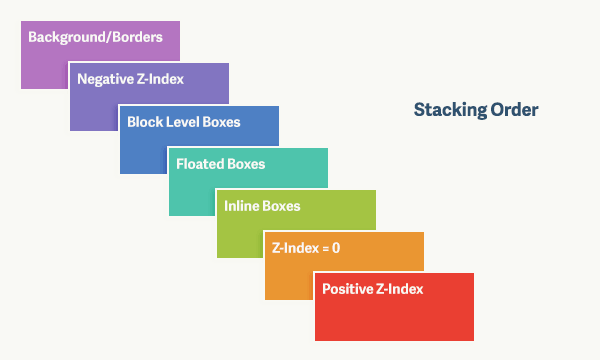
对于上图，由上到下分别是：
（1）背景和边框：建立当前层叠上下文元素的背景和边框。
（2）负的z-index：当前层叠上下文中，z-index属性值为负的元素。
（3）块级盒：文档流内非行内级非定位后代元素。
（4）浮动盒：非定位浮动元素。
（5）行内盒：文档流内行内级非定位后代元素。
（6）z-index:0：层叠级数为0的定位元素。
（7）正z-index：z-index属性值为正的定位元素。


**注意:** 当定位元素z-index:auto，生成盒在当前层叠上下文中的层级为 0，不会建立新的层叠上下文，除非是根元素。

### 6. position的属性有哪些，区别是什么

position有以下属性值：

| 属性值   | 概述                                                         |
| -------- | ------------------------------------------------------------ |
| absolute | 生成绝对定位的元素，相对于static定位以外的一个父元素进行定位。元素的位置通过left、top、right、bottom属性进行规定。 |
| relative | 生成相对定位的元素，相对于其原来的位置进行定位。元素的位置通过left、top、right、bottom属性进行规定。 |
| fixed    | 生成绝对定位的元素，指定元素相对于屏幕视⼝（viewport）的位置来指定元素位置。元素的位置在屏幕滚动时不会改变，⽐如回到顶部的按钮⼀般都是⽤此定位⽅式。 |
| static   | 默认值，没有定位，元素出现在正常的文档流中，会忽略 top, bottom, left, right 或者 z-index 声明，块级元素从上往下纵向排布，⾏级元素从左向右排列。 |
| inherit  | 规定从父元素继承position属性的值                             |

前面三者的定位方式如下：

- **relative：** 元素的定位永远是相对于元素自身位置的，和其他元素没关系，也不会影响其他元素。

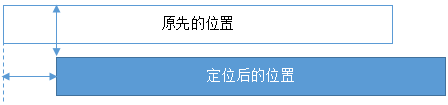

- **fixed：** 元素的定位是相对于 window （或者 iframe）边界的，和其他元素没有关系。但是它具有破坏性，会导致其他元素位置的变化。

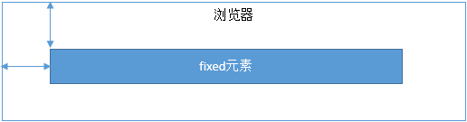

- **absolute：** 元素的定位相对于前两者要复杂许多。如果为 absolute 设置了 top、left，浏览器会根据什么去确定它的纵向和横向的偏移量呢？答案是浏览器会递归查找该元素的所有父元素，如果找到一个设置了`position:relative/absolute/fixed`的元素，就以该元素为基准定位，如果没找到，就以浏览器边界定位。如下两个图所示：

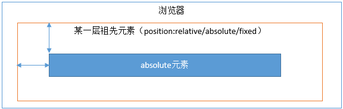
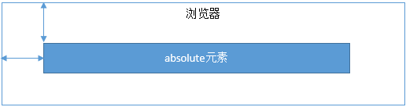

### 7. **display、float、position的关系**

（1）首先判断display属性是否为none，如果为none，则position和float属性的值不影响元素最后的表现。


（2）然后判断position的值是否为absolute或者fixed，如果是，则float属性失效，并且display的值应该被设置为table或者block，具体转换需要看初始转换值。


（3）如果position的值不为absolute或者fixed，则判断float属性的值是否为none，如果不是，则display的值则按上面的规则转换。注意，如果position的值为relative并且float属性的值存在，则relative相对于浮动后的最终位置定位。


（4）如果float的值为none，则判断元素是否为根元素，如果是根元素则display属性按照上面的规则转换，如果不是，则保持指定的display属性值不变。


总的来说，可以把它看作是一个类似优先级的机制，"position:absolute"和"position:fixed"优先级最高，有它存在的时候，浮动不起作用，'display'的值也需要调整；其次，元素的'float'特性的值不是"none"的时候或者它是根元素的时候，调整'display'的值；最后，非根元素，并且非浮动元素，并且非绝对定位的元素，'display'特性值同设置值。

### 8. absolute与fixed共同点与不同点

**共同点：**

- 改变行内元素的呈现方式，将display置为inline-block  
- 使元素脱离普通文档流，不再占据文档物理空间
- 覆盖非定位文档元素


**不同点：**

- abuselute与fixed的根元素不同，abuselute的根元素可以设置，fixed根元素是浏览器。
- 在有滚动条的页面中，absolute会跟着父元素进行移动，fixed固定在页面的具体位置。

### 9. 对 sticky 定位的理解

sticky 英文字面意思是粘贴，所以可以把它称之为粘性定位。语法：**position: sticky;** 基于用户的滚动位置来定位。


粘性定位的元素是依赖于用户的滚动，在 **position:relative** 与 **position:fixed** 定位之间切换。它的行为就像 **position:relative;** 而当页面滚动超出目标区域时，它的表现就像 **position:fixed;**，它会固定在目标位置。元素定位表现为在跨越特定阈值前为相对定位，之后为固定定位。这个特定阈值指的是 top, right, bottom 或 left 之一，换言之，指定 top, right, bottom 或 left 四个阈值其中之一，才可使粘性定位生效。否则其行为与相对定位相同。

## 四、场景应用

### 1. 实现一个三角形

CSS绘制三角形主要用到的是border属性，也就是边框。


平时在给盒子设置边框时，往往都设置很窄，就可能误以为边框是由矩形组成的。实际上，border属性是右三角形组成的，下面看一个例子：

```css
div {
    width: 0;
    height: 0;
    border: 100px solid;
    border-color: orange blue red green;
}
```

将元素的长宽都设置为0，显示出来的效果是这样的：
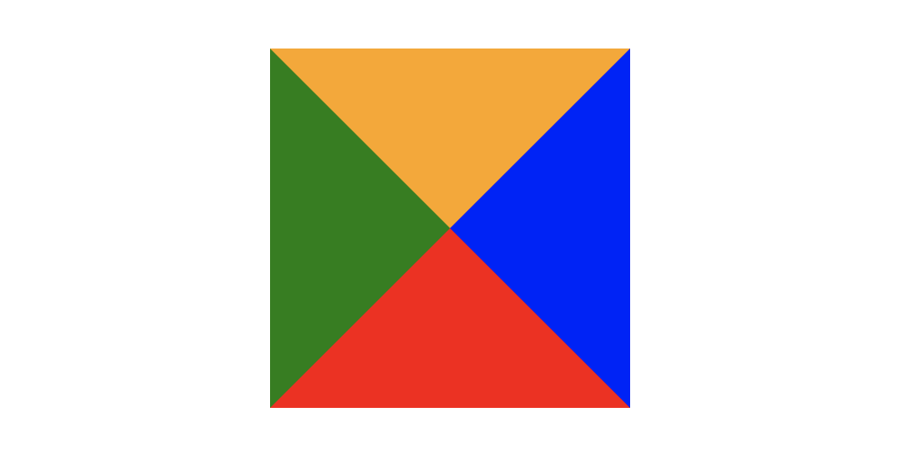
所以可以根据border这个特性来绘制三角形：
**（1）三角1**

```css
div {    width: 0;    height: 0;    border-top: 50px solid red;    border-right: 50px solid transparent;    border-left: 50px solid transparent;}
```

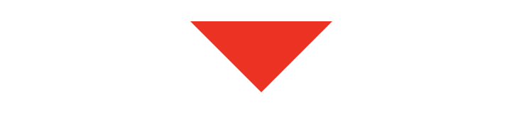
**（2）三角2**

```css
div {
    width: 0;
    height: 0;
    border-bottom: 50px solid red;
    border-right: 50px solid transparent;
    border-left: 50px solid transparent;
}
```

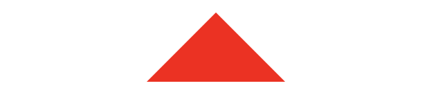
**（3）三角3**

```css
div {
    width: 0;
    height: 0;
    border-left: 50px solid red;
    border-top: 50px solid transparent;
    border-bottom: 50px solid transparent;
}
```

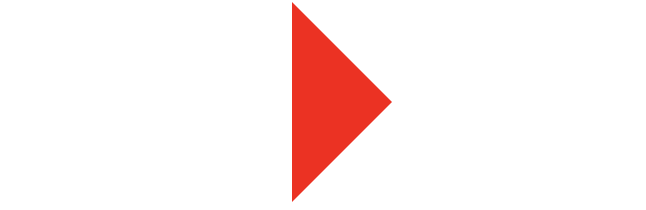
**（4）三角4**

```css
div {
    width: 0;
    height: 0;
    border-right: 50px solid red;
    border-top: 50px solid transparent;
    border-bottom: 50px solid transparent;
}
```

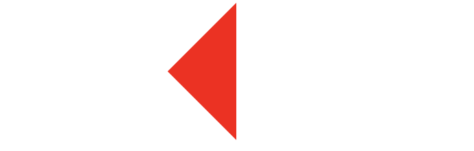
**（5）三角5**

```css
div {
    width: 0;
    height: 0;
    border-top: 100px solid red;
    border-right: 100px solid transparent;
}
```

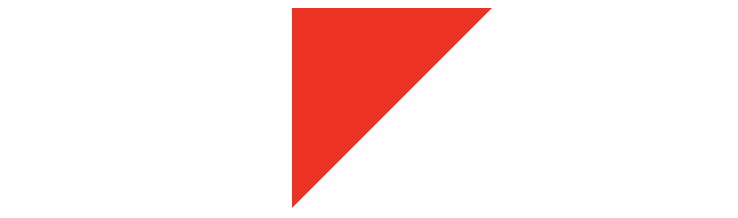
还有很多，就不一一实现了，总体的原则就是通过上下左右边框来控制三角形的方向，用边框的宽度比来控制三角形的角度。

### 2. 实现一个扇形

用CSS实现扇形的思路和三角形基本一致，就是多了一个圆角的样式，实现一个90°的扇形：

```css
div{
    border: 100px solid transparent;
    width: 0;
    heigt: 0;
    border-radius: 100px;
    border-top-color: red;
}
```

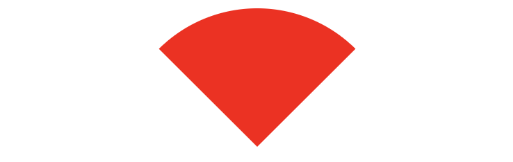

### 3. 实现一个宽高自适应的正方形

- 利用vw来实现：

```css
.square {
  width: 10%;
  height: 10vw;
  background: tomato;
}
```

- 利用元素的margin/padding百分比是相对父元素width的性质来实现：

```css
.square {
  width: 20%;
  height: 0;
  padding-top: 20%;
  background: orange;
}
```

- 利用子元素的margin-top的值来实现：

```css
.square {
  width: 30%;
  overflow: hidden;
  background: yellow;
}
.square::after {
  content: '';
  display: block;
  margin-top: 100%;
}
```

### 4. 画一条0.5px的线

- **采用transform: scale()的方式**，该方法用来定义元素的2D 缩放转换：

```css
transform: scale(0.5,0.5);
```

- **采用meta viewport的方式**

```css
<meta name="viewport" content="width=device-width, initial-scale=0.5, minimum-scale=0.5, maximum-scale=0.5"/>
```

这样就能缩放到原来的0.5倍，如果是1px那么就会变成0.5px。viewport只针对于移动端，只在移动端上才能看到效果

### 5. 设置小于12px的字体

在谷歌下css设置字体大小为12px及以下时，显示都是一样大小，都是默认12px。


**解决办法：**

- 使用Webkit的内核的-webkit-text-size-adjust的私有CSS属性来解决，只要加了-webkit-text-size-adjust:none;字体大小就不受限制了。但是chrome更新到27版本之后就不可以用了。所以高版本chrome谷歌浏览器已经不再支持-webkit-text-size-adjust样式，所以要使用时候慎用。
- 使用css3的transform缩放属性-webkit-transform:scale(0.5); 注意-webkit-transform:scale(0.75);收缩的是整个元素的大小，这时候，如果是内联元素，必须要将内联元素转换成块元素，可以使用display：block/inline-block/...；
- 使用图片：如果是内容固定不变情况下，使用将小于12px文字内容切出做图片，这样不影响兼容也不影响美观。

### 6. 如何解决 1px 问题？

1px 问题指的是：在一些 `Retina屏幕` 的机型上，移动端页面的 1px 会变得很粗，呈现出不止 1px 的效果。原因很简单——CSS 中的 1px 并不能和移动设备上的 1px 划等号。它们之间的比例关系有一个专门的属性来描述：

```html
window.devicePixelRatio = 设备的物理像素 / CSS像素。
```

打开 Chrome 浏览器，启动移动端调试模式，在控制台去输出这个 `devicePixelRatio` 的值。这里选中 iPhone6/7/8 这系列的机型，输出的结果就是2：
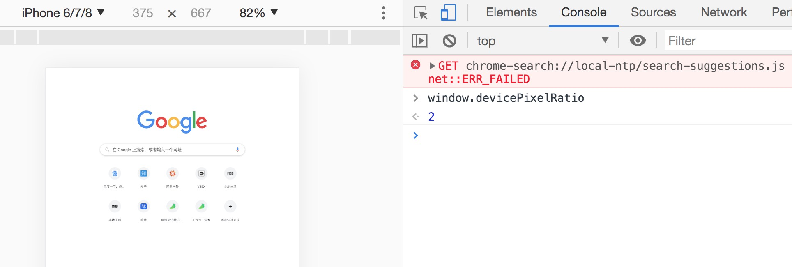
这就意味着设置的 1px CSS 像素，在这个设备上实际会用 2 个物理像素单元来进行渲染，所以实际看到的一定会比 1px 粗一些。
**解决1px 问题的三种思路：**

#### 思路一：直接写 0.5px

如果之前 1px 的样式这样写：

```css
border:1px solid #333
```

可以先在 JS 中拿到 window.devicePixelRatio 的值，然后把这个值通过 JSX 或者模板语法给到 CSS 的 data 里，达到这样的效果（这里用 JSX 语法做示范）：

```javascript
<div id="container" data-device={{window.devicePixelRatio}}></div>
```

然后就可以在 CSS 中用属性选择器来命中 devicePixelRatio 为某一值的情况，比如说这里尝试命中 devicePixelRatio 为2的情况：

```css
#container[data-device="2"] {
  border:0.5px solid #333
}
```

直接把 1px 改成 1/devicePixelRatio 后的值，这是目前为止最简单的一种方法。这种方法的缺陷在于兼容性不行，IOS 系统需要8及以上的版本，安卓系统则直接不兼容。

#### 思路二：伪元素先放大后缩小

这个方法的可行性会更高，兼容性也更好。唯一的缺点是代码会变多。


思路是**先放大、后缩小：在目标元素的后面追加一个 ::after 伪元素，让这个元素布局为 absolute 之后、整个伸展开铺在目标元素上，然后把它的宽和高都设置为目标元素的两倍，border值设为 1px。接着借助 CSS 动画特效中的放缩能力，把整个伪元素缩小为原来的 50%。此时，伪元素的宽高刚好可以和原有的目标元素对齐，而 border 也缩小为了 1px 的二分之一，间接地实现了 0.5px 的效果。**


代码如下：

```css
#container[data-device="2"] {
    position: relative;
}
#container[data-device="2"]::after{
      position:absolute;
      top: 0;
      left: 0;
      width: 200%;
      height: 200%;
      content:"";
      transform: scale(0.5);
      transform-origin: left top;
      box-sizing: border-box;
      border: 1px solid #333;
    }
}
```

#### 思路三：viewport 缩放来解决

这个思路就是对 meta 标签里几个关键属性下手：

```html
<meta name="viewport" content="initial-scale=0.5, maximum-scale=0.5, minimum-scale=0.5, user-scalable=no">
```

这里针对像素比为2的页面，把整个页面缩放为了原来的1/2大小。这样，本来占用2个物理像素的 1px 样式，现在占用的就是标准的一个物理像素。根据像素比的不同，这个缩放比例可以被计算为不同的值，用 js 代码实现如下：

```javascript
const scale = 1 / window.devicePixelRatio;
// 这里 metaEl 指的是 meta 标签对应的 Dom
metaEl.setAttribute('content', `width=device-width,user-scalable=no,initial-scale=${scale},maximum-scale=${scale},minimum-scale=${scale}`);
```

这样解决了，但这样做的副作用也很大，整个页面被缩放了。这时 1px 已经被处理成物理像素大小，这样的大小在手机上显示边框很合适。但是，一些原本不需要被缩小的内容，比如文字、图片等，也被无差别缩小掉了。
