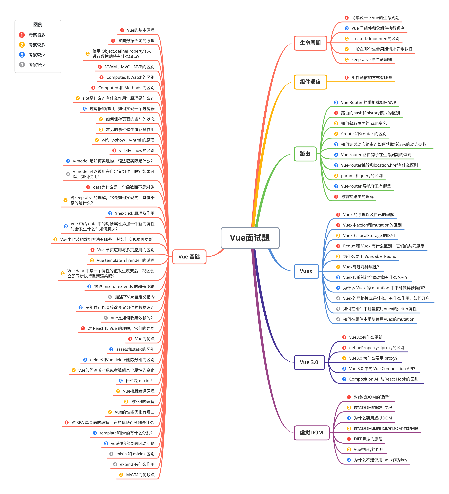
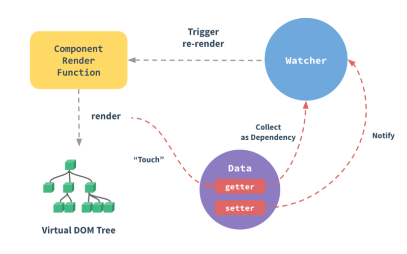
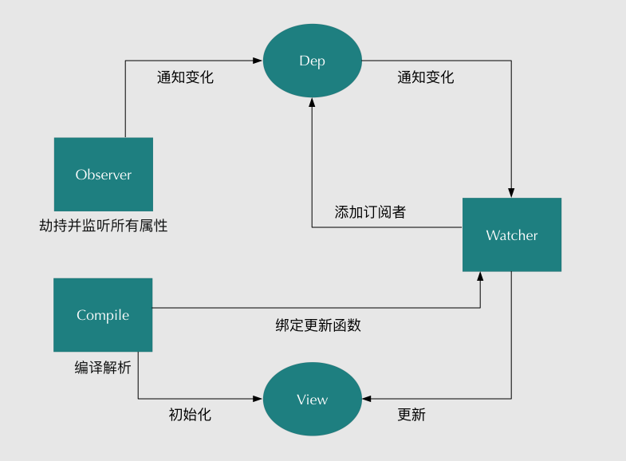
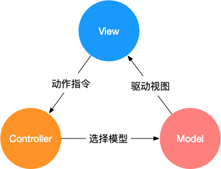
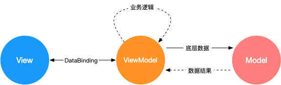
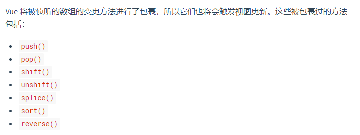
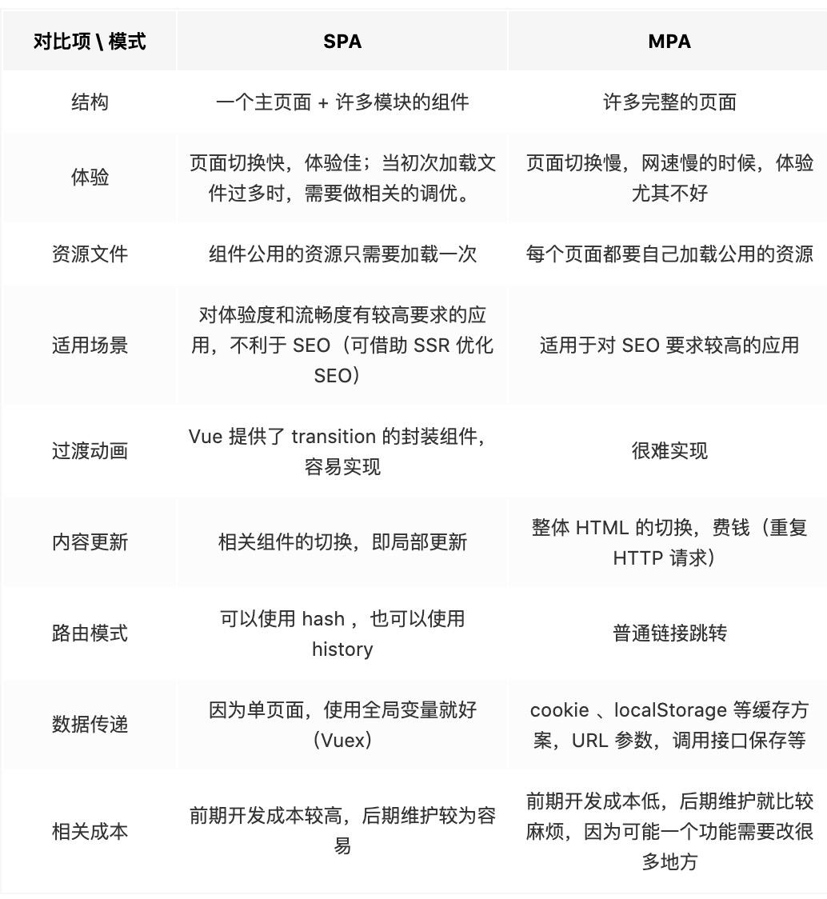
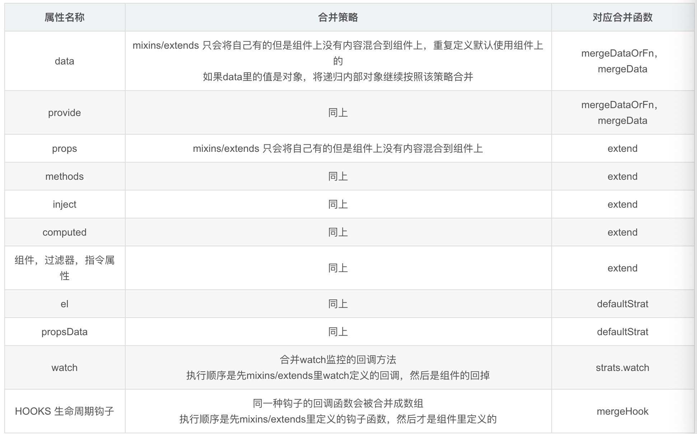

## 一、Vue 基础

### 1. Vue的基本原理

当一个Vue实例创建时，Vue会遍历data中的属性，用 Object.defineProperty（vue3.0使用proxy ）将它们转为 getter/setter，并且在内部追踪相关依赖，在属性被访问和修改时通知变化。 每个组件实例都有相应的 watcher 程序实例，它会在组件渲染的过程中把属性记录为依赖，之后当依赖项的setter被调用时，会通知watcher重新计算，从而致使它关联的组件得以更新。


### 2. 双向数据绑定的原理

Vue.js 是采用**数据劫持**结合**发布者-订阅者模式**的方式，通过Object.defineProperty()来劫持各个属性的setter，getter，在数据变动时发布消息给订阅者，触发相应的监听回调。主要分为以下几个步骤：

1. 需要observe的数据对象进行递归遍历，包括子属性对象的属性，都加上setter和getter这样的话，给这个对象的某个值赋值，就会触发setter，那么就能监听到了数据变化
1. compile解析模板指令，将模板中的变量替换成数据，然后初始化渲染页面视图，并将每个指令对应的节点绑定更新函数，添加监听数据的订阅者，一旦数据有变动，收到通知，更新视图
1. Watcher订阅者是Observer和Compile之间通信的桥梁，主要做的事情是: ①在自身实例化时往属性订阅器(dep)里面添加自己 ②自身必须有一个update()方法 ③待属性变动dep.notice()通知时，能调用自身的update()方法，并触发Compile中绑定的回调，则功成身退。
1. MVVM作为数据绑定的入口，整合Observer、Compile和Watcher三者，通过Observer来监听自己的model数据变化，通过Compile来解析编译模板指令，最终利用Watcher搭起Observer和Compile之间的通信桥梁，达到数据变化 -> 视图更新；视图交互变化(input) -> 数据model变更的双向绑定效果。



### 3. 使用 Object.defineProperty() 来进行数据劫持有什么缺点？

在对一些属性进行操作时，使用这种方法无法拦截，比如通过下标方式修改数组数据或者给对象新增属性，这都不能触发组件的重新渲染，因为 Object.defineProperty 不能拦截到这些操作。更精确的来说，对于数组而言，大部分操作都是拦截不到的，只是 Vue 内部通过重写函数的方式解决了这个问题。


在 Vue3.0 中已经不使用这种方式了，而是通过使用 Proxy 对对象进行代理，从而实现数据劫持。使用Proxy 的好处是它可以完美的监听到任何方式的数据改变，唯一的缺点是兼容性的问题，因为 Proxy 是 ES6 的语法。

### 4. MVVM、MVC、MVP的区别

MVC、MVP 和 MVVM 是三种常见的软件架构设计模式，主要通过分离关注点的方式来组织代码结构，优化开发效率。


在开发单页面应用时，往往一个路由页面对应了一个脚本文件，所有的页面逻辑都在一个脚本文件里。页面的渲染、数据的获取，对用户事件的响应所有的应用逻辑都混合在一起，这样在开发简单项目时，可能看不出什么问题，如果项目变得复杂，那么整个文件就会变得冗长、混乱，这样对项目开发和后期的项目维护是非常不利的。


**（1）MVC**

MVC 通过分离 Model、View 和 Controller 的方式来组织代码结构。其中 View 负责页面的显示逻辑，Model 负责存储页面的业务数据，以及对相应数据的操作。并且 View 和 Model 应用了观察者模式，当 Model 层发生改变的时候它会通知有关 View 层更新页面。Controller 层是 View 层和 Model 层的纽带，它主要负责用户与应用的响应操作，当用户与页面产生交互的时候，Controller 中的事件触发器就开始工作了，通过调用 Model 层，来完成对 Model 的修改，然后 Model 层再去通知 View 层更新。


（2）MVVM

MVVM 分为 Model、View、ViewModel：

- Model代表数据模型，数据和业务逻辑都在Model层中定义；
- View代表UI视图，负责数据的展示；
- ViewModel负责监听Model中数据的改变并且控制视图的更新，处理用户交互操作；


Model和View并无直接关联，而是通过ViewModel来进行联系的，Model和ViewModel之间有着双向数据绑定的联系。因此当Model中的数据改变时会触发View层的刷新，View中由于用户交互操作而改变的数据也会在Model中同步。


这种模式实现了 Model和View的数据自动同步，因此开发者只需要专注于数据的维护操作即可，而不需要自己操作DOM。


**（3）MVP**

MVP 模式与 MVC 唯一不同的在于 Presenter 和 Controller。在 MVC 模式中使用观察者模式，来实现当 Model 层数据发生变化的时候，通知 View 层的更新。这样 View 层和 Model 层耦合在一起，当项目逻辑变得复杂的时候，可能会造成代码的混乱，并且可能会对代码的复用性造成一些问题。MVP 的模式通过使用 Presenter 来实现对 View 层和 Model 层的解耦。MVC 中的Controller 只知道 Model 的接口，因此它没有办法控制 View 层的更新，MVP 模式中，View 层的接口暴露给了 Presenter 因此可以在 Presenter 中将 Model 的变化和 View 的变化绑定在一起，以此来实现 View 和 Model 的同步更新。这样就实现了对 View 和 Model 的解耦，Presenter 还包含了其他的响应逻辑。

### 5. Computed 和 Watch 的区别

**对于Computed：**

- 它支持缓存，只有依赖的数据发生了变化，才会重新计算
- 不支持异步，当Computed中有异步操作时，无法监听数据的变化
- computed的值会默认走缓存，计算属性是基于它们的响应式依赖进行缓存的，也就是基于data声明过，或者父组件传递过来的props中的数据进行计算的。
- 如果一个属性是由其他属性计算而来的，这个属性依赖其他的属性，一般会使用computed
- 如果computed属性的属性值是函数，那么默认使用get方法，函数的返回值就是属性的属性值；在computed中，属性有一个get方法和一个set方法，当数据发生变化时，会调用set方法。


**对于Watch：**

- 它不支持缓存，数据变化时，它就会触发相应的操作
- 支持异步监听
- 监听的函数接收两个参数，第一个参数是最新的值，第二个是变化之前的值
- 当一个属性发生变化时，就需要执行相应的操作
- 监听数据必须是data中声明的或者父组件传递过来的props中的数据，当发生变化时，会触发其他操作，函数有两个的参数：
  - immediate：组件加载立即触发回调函数
  - deep：深度监听，发现数据内部的变化，在复杂数据类型中使用，例如数组中的对象发生变化。需要注意的是，deep无法监听到数组和对象内部的变化。

当想要执行异步或者昂贵的操作以响应不断的变化时，就需要使用watch。


**总结：**

- computed 计算属性 : 依赖其它属性值，并且 computed 的值有缓存，只有它依赖的属性值发生改变，下一次获取 computed 的值时才会重新计算 computed 的值。 
- watch 侦听器 : 更多的是**观察**的作用，**无缓存性**，类似于某些数据的监听回调，每当监听的数据变化时都会执行回调进行后续操作。 


**运用场景：**

- 当需要进行数值计算,并且依赖于其它数据时，应该使用 computed，因为可以利用 computed 的缓存特性，避免每次获取值时都要重新计算。 
- 当需要在数据变化时执行异步或开销较大的操作时，应该使用 watch，使用 watch 选项允许执行异步操作 ( 访问一个 API )，限制执行该操作的频率，并在得到最终结果前，设置中间状态。这些都是计算属性无法做到的。 

### 6. Computed 和 Methods 的区别

可以将同一函数定义为一个 method 或者一个计算属性。对于最终的结果，两种方式是相同的 


**不同点：**

- computed: 计算属性是基于它们的依赖进行缓存的，只有在它的相关依赖发生改变时才会重新求值；
- method 调用总会执行该函数。

### 7. slot是什么？有什么作用？原理是什么？

slot又名插槽，是Vue的内容分发机制，组件内部的模板引擎使用slot元素作为承载分发内容的出口。插槽slot是子组件的一个模板标签元素，而这一个标签元素是否显示，以及怎么显示是由父组件决定的。slot又分三类，默认插槽，具名插槽和作用域插槽。

- 默认插槽：又名匿名查抄，当slot没有指定name属性值的时候一个默认显示插槽，一个组件内只有有一个匿名插槽。
- 具名插槽：带有具体名字的插槽，也就是带有name属性的slot，一个组件可以出现多个具名插槽。
- 作用域插槽：默认插槽、具名插槽的一个变体，可以是匿名插槽，也可以是具名插槽，该插槽的不同点是在子组件渲染作用域插槽时，可以将子组件内部的数据传递给父组件，让父组件根据子组件的传递过来的数据决定如何渲染该插槽。


实现原理：当子组件vm实例化时，获取到父组件传入的slot标签的内容，存放在`vm.$slot`中，默认插槽为`vm.$slot.default`，具名插槽为`vm.$slot.xxx`，xxx 为插槽名，当组件执行渲染函数时候，遇到slot标签，使用`$slot`中的内容进行替换，此时可以为插槽传递数据，若存在数据，则可称该插槽为作用域插槽。

### 8. 过滤器的作用，如何实现一个过滤器

根据过滤器的名称，过滤器是用来过滤数据的，在Vue中使用`filters`来过滤数据，`filters`不会修改数据，而是过滤数据，改变用户看到的输出（计算属性 `computed` ，方法 `methods` 都是通过修改数据来处理数据格式的输出显示）。


**使用场景：**

- 需要格式化数据的情况，比如需要处理时间、价格等数据格式的输出 / 显示。
- 比如后端返回一个 **年月日的日期字符串**，前端需要展示为 **多少天前** 的数据格式，此时就可以用`fliters`过滤器来处理数据。


过滤器是一个函数，它会把表达式中的值始终当作函数的第一个参数。过滤器用在**插值表达式 **`{{ }}` 和 `v-bind`** 表达式** 中，然后放在操作符“ `|` ”后面进行指示。


例如，在显示金额，给商品价格添加单位：

```javascript
<li>商品价格：{{item.price | filterPrice}}</li>

 filters: {
    filterPrice (price) {
      return price ? ('￥' + price) : '--'
    }
  }
```

### 9. 如何保存页面的当前的状态

既然是要保持页面的状态（其实也就是组件的状态），那么会出现以下两种情况：

- 前组件会被卸载
- 前组件不会被卸载

那么可以按照这两种情况分别得到以下方法：


**组件会被卸载：**

**（1）将状态存储在LocalStorage / SessionStorage**

只需要在组件即将被销毁的生命周期 `componentWillUnmount` （react）中在 LocalStorage / SessionStorage 中把当前组件的 state 通过 JSON.stringify() 储存下来就可以了。在这里面需要注意的是组件更新状态的时机。


比如从 B 组件跳转到 A 组件的时候，A 组件需要更新自身的状态。但是如果从别的组件跳转到 B 组件的时候，实际上是希望 B 组件重新渲染的，也就是不要从 Storage 中读取信息。所以需要在 Storage 中的状态加入一个 flag 属性，用来控制 A 组件是否读取 Storage 中的状态。

**优点：**

- 兼容性好，不需要额外库或工具。
- 简单快捷，基本可以满足大部分需求。

**缺点：**

- 状态通过 JSON 方法储存（相当于深拷贝），如果状态中有特殊情况（比如 Date 对象、Regexp 对象等）的时候会得到字符串而不是原来的值。（具体参考用 JSON 深拷贝的缺点）
- 如果 B 组件后退或者下一页跳转并不是前组件，那么 flag 判断会失效，导致从其他页面进入 A 组件页面时 A 组件会重新读取 Storage，会造成很奇怪的现象

**（2）路由传值**

通过 react-router 的 Link 组件的 prop —— to 可以实现路由间传递参数的效果。


在这里需要用到 state 参数，在 B 组件中通过 history.location.state 就可以拿到 state 值，保存它。返回 A 组件时再次携带 state 达到路由状态保持的效果。

**优点：**

- 简单快捷，不会污染 LocalStorage / SessionStorage。
- 可以传递 Date、RegExp 等特殊对象（不用担心 JSON.stringify / parse 的不足）

**缺点：**

- 如果 A 组件可以跳转至多个组件，那么在每一个跳转组件内都要写相同的逻辑。


**组件不会被卸载：**

**（1）单页面渲染**

要切换的组件作为子组件全屏渲染，父组件中正常储存页面状态。

**优点：**

- 代码量少
- 不需要考虑状态传递过程中的错误

**缺点：**

- 增加 A 组件维护成本
- 需要传入额外的 prop 到 B 组件
- 无法利用路由定位页面


除此之外，在Vue中，还可以是用keep-alive来缓存页面，当组件在keep-alive内被切换时组件的**activated、deactivated**这两个生命周期钩子函数会被执行
被包裹在keep-alive中的组件的状态将会被保留：

```javascript
<keep-alive>
	<router-view v-if="$route.meta.keepAlive"></router-view>
</kepp-alive>
```

**router.js**

```javascript
{
  path: '/',
  name: 'xxx',
  component: ()=>import('../src/views/xxx.vue'),
  meta:{
    keepAlive: true // 需要被缓存
  }
},
```

### 10. 常见的事件修饰符及其作用

- `.stop`：等同于 JavaScript 中的 `event.stopPropagation()` ，防止事件冒泡；
- `.prevent` ：等同于 JavaScript 中的 `event.preventDefault()` ，防止执行预设的行为（如果事件可取消，则取消该事件，而不停止事件的进一步传播）；
- `.capture` ：与事件冒泡的方向相反，事件捕获由外到内；
- `.self` ：只会触发自己范围内的事件，不包含子元素；
- `.once` ：只会触发一次。

### 11. v-if、v-show、v-html 的原理

- v-if会调用addIfCondition方法，生成vnode的时候会忽略对应节点，render的时候就不会渲染；
- v-show会生成vnode，render的时候也会渲染成真实节点，只是在render过程中会在节点的属性中修改show属性值，也就是常说的display； 
- v-html会先移除节点下的所有节点，调用html方法，通过addProp添加innerHTML属性，归根结底还是设置innerHTML为v-html的值。

### 13. v-if和v-show的区别

- **手段**：v-if是动态的向DOM树内添加或者删除DOM元素；v-show是通过设置DOM元素的display样式属性控制显隐；
- **编译过程**：v-if切换有一个局部编译/卸载的过程，切换过程中合适地销毁和重建内部的事件监听和子组件；v-show只是简单的基于css切换；
- **编译条件**：v-if是惰性的，如果初始条件为假，则什么也不做；只有在条件第一次变为真时才开始局部编译; v-show是在任何条件下，无论首次条件是否为真，都被编译，然后被缓存，而且DOM元素保留；
- **性能消耗**：v-if有更高的切换消耗；v-show有更高的初始渲染消耗；
- **使用场景**：v-if适合运营条件不大可能改变；v-show适合频繁切换。

### 14. v-model 是如何实现的，语法糖实际是什么？

**（1）作用在表单元素上**
动态绑定了 input 的 value 指向了 messgae 变量，并且在触发 input 事件的时候去动态把 message设置为目标值：

```javascript
<input v-model="sth" />
//  等同于
<input 
    v-bind:value="message" 
    v-on:input="message=$event.target.value"
>
//$event 指代当前触发的事件对象;
//$event.target 指代当前触发的事件对象的dom;
//$event.target.value 就是当前dom的value值;
//在@input方法中，value => sth;
//在:value中,sth => value;
```

**（2）作用在组件上**
在自定义组件中，v-model 默认会利用名为 value 的 prop和名为 input 的事件


**本质是一个父子组件通信的语法糖，通过prop和$.emit实现。** 因此父组件 v-model 语法糖本质上可以修改为：

```javascript
<child :value="message"  @input="function(e){message = e}"></child>
```

在组件的实现中，可以通过 v-model属性来配置子组件接收的prop名称，以及派发的事件名称。
例子：

```javascript
// 父组件
<aa-input v-model="aa"></aa-input>
// 等价于
<aa-input v-bind:value="aa" v-on:input="aa=$event.target.value"></aa-input>

// 子组件：
<input v-bind:value="aa" v-on:input="onmessage"></aa-input>

props:{value:aa,}
methods:{
    onmessage(e){
        $emit('input',e.target.value)
    }
}
```

默认情况下，一个组件上的v-model 会把 value 用作 prop且把 input 用作 event。但是一些输入类型比如单选框和复选框按钮可能想使用 value prop 来达到不同的目的。使用 model 选项可以回避这些情况产生的冲突。js 监听input 输入框输入数据改变，用oninput，数据改变以后就会立刻出发这个事件。通过input事件把数据\$emit 出去，在父组件接受。父组件设置v-model的值为input `$emit`过来的值。

### 15. v-model 可以被用在自定义组件上吗？如果可以，如何使用？

可以。v-model 实际上是一个语法糖，如：

```javascript
<input v-model="searchText">
```

实际上相当于：

```javascript
<input
  v-bind:value="searchText"
  v-on:input="searchText = $event.target.value"
>
```

用在自定义组件上也是同理：

```javascript
<custom-input v-model="searchText">
```

相当于：

```javascript
<custom-input
  v-bind:value="searchText"
  v-on:input="searchText = $event"
></custom-input>
```

显然，custom-input 与父组件的交互如下：

1. 父组件将`searchText`变量传入custom-input 组件，使用的 prop 名为`value`；
1. custom-input 组件向父组件传出名为`input`的事件，父组件将接收到的值赋值给`searchText`；

所以，custom-input 组件的实现应该类似于这样：

```javascript
Vue.component('custom-input', {
  props: ['value'],
  template: `
    <input
      v-bind:value="value"
      v-on:input="$emit('input', $event.target.value)"
    >
  `
})
```

### 16. data为什么是一个函数而不是对象

JavaScript中的对象是引用类型的数据，当多个实例引用同一个对象时，只要一个实例对这个对象进行操作，其他实例中的数据也会发生变化。


而在Vue中，更多的是想要复用组件，那就需要每个组件都有自己的数据，这样组件之间才不会相互干扰。


所以组件的数据不能写成对象的形式，而是要写成函数的形式。数据以函数返回值的形式定义，这样当每次复用组件的时候，就会返回一个新的data，也就是说每个组件都有自己的私有数据空间，它们各自维护自己的数据，不会干扰其他组件的正常运行。

### 17. 对keep-alive的理解，它是如何实现的，具体缓存的是什么？

如果需要在组件切换的时候，保存一些组件的状态防止多次渲染，就可以使用 keep-alive 组件包裹需要保存的组件。

**（1）keep-alive**

keep-alive有以下三个属性：

- include 字符串或正则表达式，只有名称匹配的组件会被匹配；
- exclude 字符串或正则表达式，任何名称匹配的组件都不会被缓存；
- max 数字，最多可以缓存多少组件实例。


注意：keep-alive 包裹动态组件时，会缓存不活动的组件实例。


**主要流程**

1. 判断组件 name ，不在 include 或者在 exclude 中，直接返回 vnode，说明该组件不被缓存。
1. 获取组件实例 key ，如果有获取实例的 key，否则重新生成。
1. key生成规则，cid +"∶∶"+ tag ，仅靠cid是不够的，因为相同的构造函数可以注册为不同的本地组件。
1. 如果缓存对象内存在，则直接从缓存对象中获取组件实例给 vnode ，不存在则添加到缓存对象中。 5.最大缓存数量，当缓存组件数量超过 max 值时，清除 keys 数组内第一个组件。


**（2）keep-alive 的实现**

```javascript
const patternTypes: Array<Function> = [String, RegExp, Array] // 接收：字符串，正则，数组

export default {
  name: 'keep-alive',
  abstract: true, // 抽象组件，是一个抽象组件：它自身不会渲染一个 DOM 元素，也不会出现在父组件链中。

  props: {
    include: patternTypes, // 匹配的组件，缓存
    exclude: patternTypes, // 不去匹配的组件，不缓存
    max: [String, Number], // 缓存组件的最大实例数量, 由于缓存的是组件实例（vnode），数量过多的时候，会占用过多的内存，可以用max指定上限
  },

  created() {
    // 用于初始化缓存虚拟DOM数组和vnode的key
    this.cache = Object.create(null)
    this.keys = []
  },

  destroyed() {
    // 销毁缓存cache的组件实例
    for (const key in this.cache) {
      pruneCacheEntry(this.cache, key, this.keys)
    }
  },

  mounted() {
    // prune 削减精简[v.]
    // 去监控include和exclude的改变，根据最新的include和exclude的内容，来实时削减缓存的组件的内容
    this.$watch('include', (val) => {
      pruneCache(this, (name) => matches(val, name))
    })
    this.$watch('exclude', (val) => {
      pruneCache(this, (name) => !matches(val, name))
    })
  },
}
```

**render函数：**

1. 会在 keep-alive 组件内部去写自己的内容，所以可以去获取默认 slot 的内容，然后根据这个去获取组件
1. keep-alive 只对第一个组件有效，所以获取第一个子组件。
1. 和 keep-alive 搭配使用的一般有：动态组件 和router-view

```javascript
render () {
  //
  function getFirstComponentChild (children: ?Array<VNode>): ?VNode {
    if (Array.isArray(children)) {
  for (let i = 0; i < children.length; i++) {
    const c = children[i]
    if (isDef(c) && (isDef(c.componentOptions) || isAsyncPlaceholder(c))) {
      return c
    }
  }
  }
  }
  const slot = this.$slots.default // 获取默认插槽
  const vnode: VNode = getFirstComponentChild(slot)// 获取第一个子组件
  const componentOptions: ?VNodeComponentOptions = vnode && vnode.componentOptions // 组件参数
  if (componentOptions) { // 是否有组件参数
    // check pattern
    const name: ?string = getComponentName(componentOptions) // 获取组件名
    const { include, exclude } = this
    if (
      // not included
      (include && (!name || !matches(include, name))) ||
      // excluded
      (exclude && name && matches(exclude, name))
    ) {
      // 如果不匹配当前组件的名字和include以及exclude
      // 那么直接返回组件的实例
      return vnode
    }

    const { cache, keys } = this

    // 获取这个组件的key
    const key: ?string = vnode.key == null
      // same constructor may get registered as different local components
      // so cid alone is not enough (#3269)
      ? componentOptions.Ctor.cid + (componentOptions.tag ? `::${componentOptions.tag}` : '')
      : vnode.key

    if (cache[key]) {
      // LRU缓存策略执行
      vnode.componentInstance = cache[key].componentInstance // 组件初次渲染的时候componentInstance为undefined

      // make current key freshest
      remove(keys, key)
      keys.push(key)
      // 根据LRU缓存策略执行，将key从原来的位置移除，然后将这个key值放到最后面
    } else {
      // 在缓存列表里面没有的话，则加入，同时判断当前加入之后，是否超过了max所设定的范围，如果是，则去除
      // 使用时间间隔最长的一个
      cache[key] = vnode
      keys.push(key)
      // prune oldest entry
      if (this.max && keys.length > parseInt(this.max)) {
        pruneCacheEntry(cache, keys[0], keys, this._vnode)
      }
    }
    // 将组件的keepAlive属性设置为true
    vnode.data.keepAlive = true // 作用：判断是否要执行组件的created、mounted生命周期函数
  }
  return vnode || (slot && slot[0])
}
```

keep-alive 具体是通过 cache 数组缓存所有组件的 vnode 实例。当 cache 内原有组件被使用时会将该组件 key 从 keys 数组中删除，然后 push 到 keys数组最后，以便清除最不常用组件。


**实现步骤：**

1. 获取 keep-alive 下第一个子组件的实例对象，通过他去获取这个组件的组件名
1. 通过当前组件名去匹配原来 include 和 exclude，判断当前组件是否需要缓存，不需要缓存，直接返回当前组件的实例vNode
1. 需要缓存，判断他当前是否在缓存数组里面：

- 存在，则将他原来位置上的 key 给移除，同时将这个组件的 key 放到数组最后面（LRU）
- 不存在，将组件 key 放入数组，然后判断当前 key数组是否超过 max 所设置的范围，超过，那么削减未使用时间最长的一个组件的 key 

4. 最后将这个组件的 keepAlive 设置为 true


**（3）keep-alive 本身的创建过程和 patch 过程**

缓存渲染的时候，会根据 vnode.componentInstance（首次渲染 vnode.componentInstance 为 undefined） 和 keepAlive 属性判断不会执行组件的 created、mounted 等钩子函数，而是对缓存的组件执行 patch 过程∶ 直接把缓存的 DOM 对象直接插入到目标元素中，完成了数据更新的情况下的渲染过程。


**首次渲染**

- 组件的首次渲染∶判断组件的 abstract 属性，才往父组件里面挂载 DOM

```javascript
// core/instance/lifecycle
function initLifecycle (vm: Component) {
  const options = vm.$options

  // locate first non-abstract parent
  let parent = options.parent
  if (parent && !options.abstract) { // 判断组件的abstract属性，才往父组件里面挂载DOM
    while (parent.$options.abstract && parent.$parent) {
      parent = parent.$parent
    }
    parent.$children.push(vm)
  }

  vm.$parent = parent
  vm.$root = parent ? parent.$root : vm

  vm.$children = []
  vm.$refs = {}

  vm._watcher = null
  vm._inactive = null
  vm._directInactive = false
  vm._isMounted = false
  vm._isDestroyed = false
  vm._isBeingDestroyed = false
}
```

- 判断当前 keepAlive 和 componentInstance 是否存在来判断是否要执行组件 prepatch 还是执行创建 componentlnstance

```javascript
// core/vdom/create-component
init (vnode: VNodeWithData, hydrating: boolean): ?boolean {
    if (
      vnode.componentInstance &&
      !vnode.componentInstance._isDestroyed &&
      vnode.data.keepAlive
    ) { // componentInstance在初次是undefined!!!
      // kept-alive components, treat as a patch
      const mountedNode: any = vnode // work around flow
      componentVNodeHooks.prepatch(mountedNode, mountedNode) // prepatch函数执行的是组件更新的过程
    } else {
      const child = vnode.componentInstance = createComponentInstanceForVnode(
        vnode,
        activeInstance
      )
      child.$mount(hydrating ? vnode.elm : undefined, hydrating)
    }
  },
```

prepatch 操作就不会在执行组件的 mounted 和 created 生命周期函数，而是直接将 DOM 插入


**（4）LRU （least recently used）缓存策略**

LRU 缓存策略∶ 从内存中找出最久未使用的数据并置换新的数据。
LRU（Least rencently used）算法根据数据的历史访问记录来进行淘汰数据，其核心思想是 **"如果数据最近被访问过，那么将来被访问的几率也更高"**。 最常见的实现是使用一个链表保存缓存数据，详细算法实现如下∶ 

- 新数据插入到链表头部
- 每当缓存命中（即缓存数据被访问），则将数据移到链表头部
- 链表满的时候，将链表尾部的数据丢弃。

### 18. $nextTick 原理及作用

Vue 的 nextTick 其本质是对 JavaScript 执行原理 EventLoop 的一种应用。


nextTick 的核心是利用了如 Promise 、MutationObserver、setImmediate、setTimeout的原生 JavaScript 方法来模拟对应的微/宏任务的实现，本质是为了利用 JavaScript 的这些异步回调任务队列来实现 Vue 框架中自己的异步回调队列。


nextTick 不仅是 Vue 内部的异步队列的调用方法，同时也允许开发者在实际项目中使用这个方法来满足实际应用中对 DOM 更新数据时机的后续逻辑处理


nextTick 是典型的将底层 JavaScript 执行原理应用到具体案例中的示例，引入异步更新队列机制的原因∶

- 如果是同步更新，则多次对一个或多个属性赋值，会频繁触发 UI/DOM 的渲染，可以减少一些无用渲染
- 同时由于 VirtualDOM 的引入，每一次状态发生变化后，状态变化的信号会发送给组件，组件内部使用 VirtualDOM 进行计算得出需要更新的具体的 DOM 节点，然后对 DOM 进行更新操作，每次更新状态后的渲染过程需要更多的计算，而这种无用功也将浪费更多的性能，所以异步渲染变得更加至关重要


Vue采用了数据驱动视图的思想，但是在一些情况下，仍然需要操作DOM。有时候，可能遇到这样的情况，DOM1的数据发生了变化，而DOM2需要从DOM1中获取数据，那这时就会发现DOM2的视图并没有更新，这时就需要用到了`nextTick`了。


由于Vue的DOM操作是异步的，所以，在上面的情况中，就要将DOM2获取数据的操作写在`$nextTick`中。

```javascript
this.$nextTick(() => {    // 获取数据的操作...})
```

所以，在以下情况下，会用到nextTick：

- 在数据变化后执行的某个操作，而这个操作需要使用随数据变化而变化的DOM结构的时候，这个操作就需要方法在`nextTick()`的回调函数中。
- 在vue生命周期中，如果在created()钩子进行DOM操作，也一定要放在`nextTick()`的回调函数中。


因为在created()钩子函数中，页面的DOM还未渲染，这时候也没办法操作DOM，所以，此时如果想要操作DOM，必须将操作的代码放在`nextTick()`的回调函数中。

### **19. Vue 中给 data 中的对象属性添加一个新的属性时会发生什么？如何解决？**

```javascript
<template> 
   <div>
      <ul>
         <li v-for="value in obj" :key="value"> {{value}} </li> 
      </ul> 
      <button @click="addObjB">添加 obj.b</button> 
   </div>
</template>

<script>
    export default { 
       data () { 
          return { 
              obj: { 
                  a: 'obj.a' 
              } 
          } 
       },
       methods: { 
          addObjB () { 
              this.obj.b = 'obj.b' 
              console.log(this.obj) 
          } 
      }
   }
</script>
```

点击 button 会发现，obj.b 已经成功添加，但是视图并未刷新。这是因为在Vue实例创建时，obj.b并未声明，因此就没有被Vue转换为响应式的属性，自然就不会触发视图的更新，这时就需要使用Vue的全局 api **$set()：**

```javascript
addObjB () (
   this.$set(this.obj, 'b', 'obj.b')
   console.log(this.obj)
}
```

$set()方法相当于手动的去把obj.b处理成一个响应式的属性，此时视图也会跟着改变了。

### 20. Vue中封装的数组方法有哪些，其如何实现页面更新

在Vue中，对响应式处理利用的是Object.defineProperty对数据进行拦截，而这个方法并不能监听到数组内部变化，数组长度变化，数组的截取变化等，所以需要对这些操作进行hack，让Vue能监听到其中的变化。

那Vue是如何实现让这些数组方法实现元素的实时更新的呢，下面是Vue中对这些方法的封装：

```javascript
// 缓存数组原型
const arrayProto = Array.prototype;
// 实现 arrayMethods.__proto__ === Array.prototype
export const arrayMethods = Object.create(arrayProto);
// 需要进行功能拓展的方法
const methodsToPatch = [
  "push",
  "pop",
  "shift",
  "unshift",
  "splice",
  "sort",
  "reverse"
];

/**
 * Intercept mutating methods and emit events
 */
methodsToPatch.forEach(function(method) {
  // 缓存原生数组方法
  const original = arrayProto[method];
  def(arrayMethods, method, function mutator(...args) {
    // 执行并缓存原生数组功能
    const result = original.apply(this, args);
    // 响应式处理
    const ob = this.__ob__;
    let inserted;
    switch (method) {
    // push、unshift会新增索引，所以要手动observer
      case "push":
      case "unshift":
        inserted = args;
        break;
      // splice方法，如果传入了第三个参数，也会有索引加入，也要手动observer。
      case "splice":
        inserted = args.slice(2);
        break;
    }
    // 
    if (inserted) ob.observeArray(inserted);// 获取插入的值，并设置响应式监听
    // notify change
    ob.dep.notify();// 通知依赖更新
    // 返回原生数组方法的执行结果
    return result;
  });
});
```

简单来说就是，重写了数组中的那些原生方法，首先获取到这个数组的__ob__，也就是它的Observer对象，如果有新的值，就调用observeArray继续对新的值观察变化（也就是通过`target__proto__ == arrayMethods`来改变了数组实例的型），然后手动调用notify，通知渲染watcher，执行update。

### 21. Vue 单页应用与多页应用的区别

**概念：**

- SPA单页面应用（SinglePage Web Application），指只有一个主页面的应用，一开始只需要加载一次js、css等相关资源。所有内容都包含在主页面，对每一个功能模块组件化。单页应用跳转，就是切换相关组件，仅仅刷新局部资源。
- MPA多页面应用 （MultiPage Application），指有多个独立页面的应用，每个页面必须重复加载js、css等相关资源。多页应用跳转，需要整页资源刷新。


**区别：**


### 22. Vue template 到 render 的过程

vue的模版编译过程主要如下：**template -> ast -> render函数**


vue 在模版编译版本的码中会执行 compileToFunctions 将template转化为render函数：

```javascript
// 将模板编译为render函数const { render, staticRenderFns } = compileToFunctions(template,options//省略}, this)
```

CompileToFunctions中的主要逻辑如下∶
**（1）调用parse方法将template转化为ast（抽象语法树）**

```javascript
constast = parse(template.trim(), options)
```

- **parse的目标**：把tamplate转换为AST树，它是一种用 JavaScript对象的形式来描述整个模板。
- **解析过程**：利用正则表达式顺序解析模板，当解析到开始标签、闭合标签、文本的时候都会分别执行对应的 回调函数，来达到构造AST树的目的。

AST元素节点总共三种类型：type为1表示普通元素、2为表达式、3为纯文本


**（2）对静态节点做优化**

```javascript
optimize(ast,options)
```

这个过程主要分析出哪些是静态节点，给其打一个标记，为后续更新渲染可以直接跳过静态节点做优化


深度遍历AST，查看每个子树的节点元素是否为静态节点或者静态节点根。如果为静态节点，他们生成的DOM永远不会改变，这对运行时模板更新起到了极大的优化作用。


**（3）生成代码**

```javascript
const code = generate(ast, options)
```

generate将ast抽象语法树编译成 render字符串并将静态部分放到 staticRenderFns 中，最后通过 `new Function(`` render``)` 生成render函数。

### 23. Vue data 中某一个属性的值发生改变后，视图会立即同步执行重新渲染吗？

不会立即同步执行重新渲染。Vue 实现响应式并不是数据发生变化之后 DOM 立即变化，而是按一定的策略进行 DOM 的更新。Vue 在更新 DOM 时是异步执行的。只要侦听到数据变化， Vue 将开启一个队列，并缓冲在同一事件循环中发生的所有数据变更。


如果同一个watcher被多次触发，只会被推入到队列中一次。这种在缓冲时去除重复数据对于避免不必要的计算和 DOM 操作是非常重要的。然后，在下一个的事件循环tick中，Vue 刷新队列并执行实际（已去重的）工作。

### 24. 简述 mixin、extends 的覆盖逻辑

**（1）mixin 和 extends**
mixin 和 extends均是用于合并、拓展组件的，两者均通过 mergeOptions 方法实现合并。

- mixins 接收一个混入对象的数组，其中混入对象可以像正常的实例对象一样包含实例选项，这些选项会被合并到最终的选项中。Mixin 钩子按照传入顺序依次调用，并在调用组件自身的钩子之前被调用。
- extends 主要是为了便于扩展单文件组件，接收一个对象或构造函数。


**（2）mergeOptions 的执行过程**

- 规范化选项（normalizeProps、normalizelnject、normalizeDirectives)
- 对未合并的选项，进行判断

```javascript
if(!child._base) {    if(child.extends) {        parent = mergeOptions(parent, child.extends, vm)    }    if(child.mixins) {        for(let i = 0, l = child.mixins.length; i < l; i++){            parent = mergeOptions(parent, child.mixins[i], vm)        }    }}
```

- 合并处理。根据一个通用 Vue 实例所包含的选项进行分类逐一判断合并，如 props、data、 methods、watch、computed、生命周期等，将合并结果存储在新定义的 options 对象里。
- 返回合并结果 options。

### 25. 描述下Vue自定义指令

在 Vue2.0 中，代码复用和抽象的主要形式是组件。然而，有的情况下，你仍然需要对普通 DOM 元素进行底层操作，这时候就会用到自定义指令。
一般需要对DOM元素进行底层操作时使用，尽量只用来操作 DOM展示，不修改内部的值。当使用自定义指令直接修改 value 值时绑定v-model的值也不会同步更新；如必须修改可以在自定义指令中使用keydown事件，在vue组件中使用 change事件，回调中修改vue数据; 


**（1）自定义指令基本内容**

- 全局定义：`Vue.directive("focus",{})`

- 局部定义：`directives:{focus:{}}`

- 钩子函数：指令定义对象提供钩子函数

     o bind：只调用一次，指令第一次绑定到元素时调用。在这里可以进行一次性的初始化设置。

     o inSerted：被绑定元素插入父节点时调用（仅保证父节点存在，但不一定已被插入文档中）。

     o update：所在组件的VNode更新时调用，但是可能发生在其子VNode更新之前调用。指令的值可能发生了改变，也可能没有。但是可以通过比较更新前后的值来忽略不必要的模板更新。

    o ComponentUpdate：指令所在组件的 VNode及其子VNode全部更新后调用。

    o unbind：只调用一次，指令与元素解绑时调用。

- 钩子函数参数
    o el：绑定元素
    
    o bing： 指令核心对象，描述指令全部信息属性
    
    o name
    
    o value
    
    o oldValue
    
    o expression
    
    o arg
    
    o modifers
   
    o vnode  虚拟节点

    o oldVnode：上一个虚拟节点（更新钩子函数中才有用）

 
**（2）使用场景**

- 普通DOM元素进行底层操作的时候，可以使用自定义指令

- 自定义指令是用来操作DOM的。尽管Vue推崇数据驱动视图的理念，但并非所有情况都适合数据驱动。自定义指令就是一种有效的补充和扩展，不仅可用于定义任何的DOM操作，并且是可复用的。

**（3）使用案例**

初级应用：

- 鼠标聚焦
- 下拉菜单
- 相对时间转换
- 滚动动画

高级应用：

- 自定义指令实现图片懒加载
- 自定义指令集成第三方插件

### 26. 子组件可以直接改变父组件的数据吗？

子组件不可以直接改变父组件的数据。这样做主要是为了维护父子组件的单向数据流。每次父级组件发生更新时，子组件中所有的 prop 都将会刷新为最新的值。如果这样做了，Vue 会在浏览器的控制台中发出警告。


Vue提倡单向数据流，即父级 props 的更新会流向子组件，但是反过来则不行。这是为了防止意外的改变父组件状态，使得应用的数据流变得难以理解，导致数据流混乱。如果破坏了单向数据流，当应用复杂时，debug 的成本会非常高。


**只能通过 **`$emit`** 派发一个自定义事件，父组件接收到后，由父组件修改。**

### 27. Vue是如何收集依赖的？

在初始化 Vue 的每个组件时，会对组件的 data 进行初始化，就会将由普通对象变成响应式对象，在这个过程中便会进行依赖收集的相关逻辑，如下所示∶

```javascript
function defieneReactive (obj, key, val){
  const dep = new Dep();
  ...
  Object.defineProperty(obj, key, {
    ...
    get: function reactiveGetter () {
      if(Dep.target){
        dep.depend();
        ...
      }
      return val
    }
    ...
  })
}
```

以上只保留了关键代码，主要就是 `const dep = new Dep()`实例化一个 Dep 的实例，然后在 get 函数中通过 `dep.depend()` 进行依赖收集。
**（1）Dep**
Dep是整个依赖收集的核心，其关键代码如下：

```javascript
class Dep {
  static target;
  subs;

  constructor () {
    ...
    this.subs = [];
  }
  addSub (sub) {
    this.subs.push(sub)
  }
  removeSub (sub) {
    remove(this.sub, sub)
  }
  depend () {
    if(Dep.target){
      Dep.target.addDep(this)
    }
  }
  notify () {
    const subs = this.subds.slice();
    for(let i = 0;i < subs.length; i++){
      subs[i].update()
    }
  }
}
```

Dep 是一个 class ，其中有一个关 键的静态属性 static，它指向了一个全局唯一 Watcher，保证了同一时间全局只有一个 watcher 被计算，另一个属性 subs 则是一个 Watcher 的数组，所以 Dep 实际上就是对 Watcher 的管理，再看看 Watcher 的相关代码∶

**（2）Watcher**

```javascript
class Watcher {
  getter;
  ...
  constructor (vm, expression){
    ...
    this.getter = expression;
    this.get();
  }
  get () {
    pushTarget(this);
    value = this.getter.call(vm, vm)
    ...
    return value
  }
  addDep (dep){
        ...
    dep.addSub(this)
  }
  ...
}
function pushTarget (_target) {
  Dep.target = _target
}
```

Watcher 是一个 class，它定义了一些方法，其中和依赖收集相关的主要有 get、addDep 等。

**（3）过程**

在实例化 Vue 时，依赖收集的相关过程如下∶
初 始 化 状 态 initState ， 这 中 间 便 会 通 过 defineReactive 将数据变成响应式对象，其中的 getter 部分便是用来依赖收集的。
初始化最终会走 mount 过程，其中会实例化 Watcher ，进入 Watcher 中，便会执行 this.get() 方法，

```javascript
updateComponent = () => {
  vm._update(vm._render())
}
new Watcher(vm, updateComponent)
```

get 方法中的 pushTarget 实际上就是把 Dep.target 赋值为当前的 watcher。


this.getter.call（vm，vm），这里的 getter 会执行 vm._render() 方法，在这个过程中便会触发数据对象的 getter。那么每个对象值的 getter 都持有一个 dep，在触发 getter 的时候会调用 dep.depend() 方法，也就会执行 Dep.target.addDep(this)。刚才 Dep.target 已经被赋值为 watcher，于是便会执行 addDep 方法，然后走到 dep.addSub() 方法，便将当前的 watcher 订阅到这个数据持有的 dep 的 subs 中，这个目的是为后续数据变化时候能通知到哪些 subs 做准备。所以在 vm._render() 过程中，会触发所有数据的 getter，这样便已经完成了一个依赖收集的过程。

### 28. 对 React 和 Vue 的理解，它们的异同

**相似之处：**

- 都将注意力集中保持在核心库，而将其他功能如路由和全局状态管理交给相关的库；
- 都有自己的构建工具，能让你得到一个根据最佳实践设置的项目模板；
- 都使用了Virtual DOM（虚拟DOM）提高重绘性能；
- 都有props的概念，允许组件间的数据传递；
- 都鼓励组件化应用，将应用分拆成一个个功能明确的模块，提高复用性。


**不同之处 ：**

**1）数据流**

Vue默认支持数据双向绑定，而React一直提倡单向数据流 

**2）虚拟DOM**

Vue2.x开始引入"Virtual DOM"，消除了和React在这方面的差异，但是在具体的细节还是有各自的特点。 

- Vue宣称可以更快地计算出Virtual DOM的差异，这是由于它在渲染过程中，会跟踪每一个组件的依赖关系，不需要重新渲染整个组件树。
- 对于React而言，每当应用的状态被改变时，全部子组件都会重新渲染。当然，这可以通过 PureComponent/shouldComponentUpdate这个生命周期方法来进行控制，但Vue将此视为默认的优化。

**3）组件化**

React与Vue最大的不同是模板的编写。

- Vue鼓励写近似常规HTML的模板。写起来很接近标准 HTML元素，只是多了一些属性。
- React推荐你所有的模板通用JavaScript的语法扩展——JSX书写。


具体来讲：React中render函数是支持闭包特性的，所以import的组件在render中可以直接调用。但是在Vue中，由于模板中使用的数据都必须挂在 this 上进行一次中转，所以 import 一个组件完了之后，还需要在 components 中再声明下。
**4）监听数据变化的实现原理不同**

- Vue 通过 getter/setter 以及一些函数的劫持，能精确知道数据变化，不需要特别的优化就能达到很好的性能
- React 默认是通过比较引用的方式进行的，如果不优化（PureComponent/shouldComponentUpdate）可能导致大量不必要的vDOM的重新渲染。这是因为 Vue 使用的是可变数据，而React更强调数据的不可变。

**5）高阶组件**

react可以通过高阶组件（HOC）来扩展，而Vue需要通过mixins来扩展。


高阶组件就是高阶函数，而React的组件本身就是纯粹的函数，所以高阶函数对React来说易如反掌。相反Vue.js使用HTML模板创建视图组件，这时模板无法有效的编译，因此Vue不能采用HOC来实现。

**6）构建工具**

两者都有自己的构建工具：

- React ==> Create React APP
- Vue ==> vue-cli

**7）跨平台**

- React ==> React Native
- Vue ==> Weex

### 29. Vue的优点

- 轻量级框架：只关注视图层，是一个构建数据的视图集合，大小只有几十 `kb` ；
- 简单易学：国人开发，中文文档，不存在语言障碍 ，易于理解和学习；
- 双向数据绑定：保留了 `angular` 的特点，在数据操作方面更为简单；
- 组件化：保留了 `react` 的优点，实现了 `html` 的封装和重用，在构建单页面应用方面有着独特的优势；
- 视图，数据，结构分离：使数据的更改更为简单，不需要进行逻辑代码的修改，只需要操作数据就能完成相关操作；
- 虚拟DOM：`dom` 操作是非常耗费性能的，不再使用原生的 `dom` 操作节点，极大解放 `dom` 操作，但具体操作的还是 `dom` 不过是换了另一种方式；
- 运行速度更快：相比较于 `react` 而言，同样是操作虚拟 `dom`，就性能而言， `vue` 存在很大的优势。

### 30. assets和static的区别

**相同点：** `assets` 和 `static` 两个都是存放静态资源文件。项目中所需要的资源文件图片，字体图标，样式文件等都可以放在这两个文件下，这是相同点


**不相同点：**`assets` 中存放的静态资源文件在项目打包时，也就是运行 `npm run build` 时会将 `assets` 中放置的静态资源文件进行打包上传，所谓打包简单点可以理解为压缩体积，代码格式化。而压缩后的静态资源文件最终也都会放置在 `static` 文件中跟着 `index.html` 一同上传至服务器。`static` 中放置的静态资源文件就不会要走打包压缩格式化等流程，而是直接进入打包好的目录，直接上传至服务器。因为避免了压缩直接进行上传，在打包时会提高一定的效率，但是 `static` 中的资源文件由于没有进行压缩等操作，所以文件的体积也就相对于 `assets` 中打包后的文件提交较大点。在服务器中就会占据更大的空间。


**建议：** 将项目中 `template`需要的样式文件js文件等都可以放置在 `assets` 中，走打包这一流程。减少体积。而项目中引入的第三方的资源文件如`iconfoont.css` 等文件可以放置在 `static` 中，因为这些引入的第三方文件已经经过处理，不再需要处理，直接上传。

### 31. delete和Vue.delete删除数组的区别

- `delete` 只是被删除的元素变成了 `empty/undefined` 其他的元素的键值还是不变。
- `Vue.delete` 直接删除了数组 改变了数组的键值。

### 32. vue如何监听对象或者数组某个属性的变化

当在项目中直接设置数组的某一项的值，或者直接设置对象的某个属性值，这个时候，你会发现页面并没有更新。这是因为Object.defineProperty()限制，监听不到变化。


解决方式：

- this.$set(你要改变的数组/对象，你要改变的位置/key，你要改成什么value)

```javascript
this.$set(this.arr, 0, "OBKoro1"); // 改变数组this.$set(this.obj, "c", "OBKoro1"); // 改变对象
```

- 调用以下几个数组的方法

```javascript
splice()、 push()、pop()、shift()、unshift()、sort()、reverse()
```

vue源码里缓存了array的原型链，然后重写了这几个方法，触发这几个方法的时候会observer数据，意思是使用这些方法不用再进行额外的操作，视图自动进行更新。 推荐使用splice方法会比较好自定义,因为splice可以在数组的任何位置进行删除/添加操作


vm.`$set` 的实现原理是：

- 如果目标是数组，直接使用数组的 splice 方法触发相应式；
- 如果目标是对象，会先判读属性是否存在、对象是否是响应式，最终如果要对属性进行响应式处理，则是通过调用 defineReactive 方法进行响应式处理（ defineReactive 方法就是 Vue 在初始化对象时，给对象属性采用 Object.defineProperty 动态添加 getter 和 setter 的功能所调用的方法）

### 33. 什么是 mixin ？

- Mixin 使我们能够为 Vue 组件编写可插拔和可重用的功能。
- 如果希望在多个组件之间重用一组组件选项，例如生命周期 hook、 方法等，则可以将其编写为 mixin，并在组件中简单的引用它。
- 然后将 mixin 的内容合并到组件中。如果你要在 mixin 中定义生命周期 hook，那么它在执行时将优化于组件自已的 hook。

### 34. Vue模版编译原理

vue中的模板template无法被浏览器解析并渲染，因为这不属于浏览器的标准，不是正确的HTML语法，所有需要将template转化成一个JavaScript函数，这样浏览器就可以执行这一个函数并渲染出对应的HTML元素，就可以让视图跑起来了，这一个转化的过程，就成为模板编译。模板编译又分三个阶段，解析parse，优化optimize，生成generate，最终生成可执行函数render。

- **解析阶段**：使用大量的正则表达式对template字符串进行解析，将标签、指令、属性等转化为抽象语法树AST。
- **优化阶段**：遍历AST，找到其中的一些静态节点并进行标记，方便在页面重渲染的时候进行diff比较时，直接跳过这一些静态节点，优化runtime的性能。
- **生成阶段**：将最终的AST转化为render函数字符串。

### 35. 对SSR的理解

SSR也就是服务端渲染，也就是将Vue在客户端把标签渲染成HTML的工作放在服务端完成，然后再把html直接返回给客户端


SSR的优势：

- 更好的SEO
- 首屏加载速度更快


SSR的缺点：

- 开发条件会受到限制，服务器端渲染只支持beforeCreate和created两个钩子；
- 当需要一些外部扩展库时需要特殊处理，服务端渲染应用程序也需要处于Node.js的运行环境；
- 更多的服务端负载。

### 36. Vue的性能优化有哪些

**（1）编码阶段**

- 尽量减少data中的数据，data中的数据都会增加getter和setter，会收集对应的watcher
- v-if和v-for不能连用
- 如果需要使用v-for给每项元素绑定事件时使用事件代理
- SPA 页面采用keep-alive缓存组件
- 在更多的情况下，使用v-if替代v-show
- key保证唯一
- 使用路由懒加载、异步组件
- 防抖、节流
- 第三方模块按需导入
- 长列表滚动到可视区域动态加载
- 图片懒加载


**（2）SEO优化**

- 预渲染
- 服务端渲染SSR


**（3）打包优化**

- 压缩代码
- Tree Shaking/Scope Hoisting
- 使用cdn加载第三方模块
- 多线程打包happypack
- splitChunks抽离公共文件
- sourceMap优化


**（4）用户体验**

- 骨架屏
- PWA
- 还可以使用缓存(客户端缓存、服务端缓存)优化、服务端开启gzip压缩等。

### 37. 对 SPA 单页面的理解，它的优缺点分别是什么？

SPA（ single-page application ）仅在 Web 页面初始化时加载相应的 HTML、JavaScript 和 CSS。一旦页面加载完成，SPA 不会因为用户的操作而进行页面的重新加载或跳转；取而代之的是利用路由机制实现 HTML 内容的变换，UI 与用户的交互，避免页面的重新加载。


**优点：**

- 用户体验好、快，内容的改变不需要重新加载整个页面，避免了不必要的跳转和重复渲染；
- 基于上面一点，SPA 相对对服务器压力小；
- 前后端职责分离，架构清晰，前端进行交互逻辑，后端负责数据处理；


**缺点：**

- 初次加载耗时多：为实现单页 Web 应用功能及显示效果，需要在加载页面的时候将 JavaScript、CSS 统一加载，部分页面按需加载；
- 前进后退路由管理：由于单页应用在一个页面中显示所有的内容，所以不能使用浏览器的前进后退功能，所有的页面切换需要自己建立堆栈管理；
- SEO 难度较大：由于所有的内容都在一个页面中动态替换显示，所以在 SEO 上其有着天然的弱势。

### 38. template和jsx的有什么分别？

对于 runtime 来说，只需要保证组件存在 render 函数即可，而有了预编译之后，只需要保证构建过程中生成 render 函数就可以。在 webpack 中，使用`vue-loader`编译.vue文件，内部依赖的`vue-template-compiler`模块，在 webpack 构建过程中，将template预编译成 render 函数。与 react 类似，在添加了jsx的语法糖解析器`babel-plugin-transform-vue-jsx`之后，就可以直接手写render函数。


所以，template和jsx的都是render的一种表现形式，不同的是：JSX相对于template而言，具有更高的灵活性，在复杂的组件中，更具有优势，而 template 虽然显得有些呆滞。但是 template 在代码结构上更符合视图与逻辑分离的习惯，更简单、更直观、更好维护。

### 39. vue初始化页面闪动问题

使用vue开发时，在vue初始化之前，由于div是不归vue管的，所以我们写的代码在还没有解析的情况下会容易出现花屏现象，看到类似于{{message}}的字样，虽然一般情况下这个时间很短暂，但是还是有必要让解决这个问题的。


首先：在css里加上以下代码：

```javascript
[v-cloak] {    display: none;}
```

如果没有彻底解决问题，则在根元素加上`style="display: none;" :style="{display: 'block'}"`

### 40. extend 有什么作用

这个 API 很少用到，作用是扩展组件生成一个构造器，通常会与 `$mount` 一起使用。

```javascript
// 创建组件构造器let Component = Vue.extend({  template: '<div>test</div>'})// 挂载到 #app 上new Component().$mount('#app')// 除了上面的方式，还可以用来扩展已有的组件let SuperComponent = Vue.extend(Component)new SuperComponent({    created() {        console.log(1)    }})new SuperComponent().$mount('#app')
```

### 41. mixin 和 mixins 区别

`mixin` 用于全局混入，会影响到每个组件实例，通常插件都是这样做初始化的。

```javascript
Vue.mixin({    beforeCreate() {        // ...逻辑        // 这种方式会影响到每个组件的 beforeCreate 钩子函数    }})
```

虽然文档不建议在应用中直接使用 `mixin`，但是如果不滥用的话也是很有帮助的，比如可以全局混入封装好的 `ajax` 或者一些工具函数等等。


`mixins` 应该是最常使用的扩展组件的方式了。如果多个组件中有相同的业务逻辑，就可以将这些逻辑剥离出来，通过 `mixins` 混入代码，比如上拉下拉加载数据这种逻辑等等。
另外需要注意的是 `mixins` 混入的钩子函数会先于组件内的钩子函数执行，并且在遇到同名选项的时候也会有选择性的进行合并。

### 42. **MVVM**的优缺点? 

优点: 

- 分离视图（View）和模型（Model），降低代码耦合，提⾼视图或者逻辑的重⽤性: ⽐如视图（View）可以独⽴于Model变化和修改，⼀个ViewModel可以绑定不同的"View"上，当View变化的时候Model不可以不变，当Model变化的时候View也可以不变。你可以把⼀些视图逻辑放在⼀个ViewModel⾥⾯，让很多view重⽤这段视图逻辑 
- 提⾼可测试性: ViewModel的存在可以帮助开发者更好地编写测试代码 
- ⾃动更新dom: 利⽤双向绑定,数据更新后视图⾃动更新,让开发者从繁琐的⼿动dom中解放 


缺点: 

- Bug很难被调试: 因为使⽤双向绑定的模式，当你看到界⾯异常了，有可能是你View的代码有Bug，也可能是Model的代码有问题。数据绑定使得⼀个位置的Bug被快速传递到别的位置，要定位原始出问题的地⽅就变得不那么容易了。另外，数据绑定的声明是指令式地写在View的模版当中的，这些内容是没办法去打断点debug的 
- ⼀个⼤的模块中model也会很⼤，虽然使⽤⽅便了也很容易保证了数据的⼀致性，当时⻓期持有，不释放内存就造成了花费更多的内存 
- 对于⼤型的图形应⽤程序，视图状态较多，ViewModel的构建和维护的成本都会⽐较⾼。


## 二、生命周期

### 1. 说一下Vue的生命周期

Vue 实例有⼀个完整的⽣命周期，也就是从开始创建、初始化数据、编译模版、挂载Dom -> 渲染、更新 -> 渲染、卸载 等⼀系列过程，称这是Vue的⽣命周期。 

1. **beforeCreate（创建前）**：数据观测和初始化事件还未开始，此时 data 的响应式追踪、event/watcher 都还没有被设置，也就是说不能访问到data、computed、watch、methods上的方法和数据。
1. **created（创建后）** ：实例创建完成，实例上配置的 options 包括 data、computed、watch、methods 等都配置完成，但是此时渲染得节点还未挂载到 DOM，所以不能访问到 `$el` 属性。
1. **beforeMount（挂载前）**：在挂载开始之前被调用，相关的render函数首次被调用。实例已完成以下的配置：编译模板，把data里面的数据和模板生成html。此时还没有挂载html到页面上。
1. **mounted（挂载后）**：在el被新创建的 vm.$el 替换，并挂载到实例上去之后调用。实例已完成以下的配置：用上面编译好的html内容替换el属性指向的DOM对象。完成模板中的html渲染到html 页面中。此过程中进行ajax交互。
1. **beforeUpdate（更新前）**：响应式数据更新时调用，此时虽然响应式数据更新了，但是对应的真实 DOM 还没有被渲染。
1. **updated（更新后）** ：在由于数据更改导致的虚拟DOM重新渲染和打补丁之后调用。此时 DOM 已经根据响应式数据的变化更新了。调用时，组件 DOM已经更新，所以可以执行依赖于DOM的操作。然而在大多数情况下，应该避免在此期间更改状态，因为这可能会导致更新无限循环。该钩子在服务器端渲染期间不被调用。
1. **beforeDestroy（销毁前）**：实例销毁之前调用。这一步，实例仍然完全可用，`this` 仍能获取到实例。
1. **destroyed（销毁后）**：实例销毁后调用，调用后，Vue 实例指示的所有东西都会解绑定，所有的事件监听器会被移除，所有的子实例也会被销毁。该钩子在服务端渲染期间不被调用。


另外还有 `keep-alive` 独有的生命周期，分别为 `activated` 和 `deactivated` 。用 `keep-alive` 包裹的组件在切换时不会进行销毁，而是缓存到内存中并执行 `deactivated` 钩子函数，命中缓存渲染后会执行 `activated` 钩子函数。

### 2. Vue 子组件和父组件执行顺序

**加载渲染过程：**
1. 父组件 beforeCreate
2. 父组件 created
3. 父组件 beforeMount
4. 子组件 beforeCreate
5. 子组件 created
6. 子组件 beforeMount
7. 子组件 mounted
8. 父组件 mounted


**更新过程：**

   1. 父组件 beforeUpdate
   2. 子组件 beforeUpdate
   3. 子组件 updated
   4. 父组件 updated


**销毁过程：**

   1. 父组件 beforeDestroy
   2. 子组件 beforeDestroy
   3. 子组件 destroyed
   4. 父组件 destoryed

### 3. created和mounted的区别

- created:在模板渲染成html前调用，即通常初始化某些属性值，然后再渲染成视图。
- mounted:在模板渲染成html后调用，通常是初始化页面完成后，再对html的dom节点进行一些需要的操作。

### 4. 一般在哪个生命周期请求异步数据

我们可以在钩子函数 created、beforeMount、mounted 中进行调用，因为在这三个钩子函数中，data 已经创建，可以将服务端端返回的数据进行赋值。
​

推荐在 created 钩子函数中调用异步请求，因为在 created 钩子函数中调用异步请求有以下优点：

- 能更快获取到服务端数据，减少页面加载时间，用户体验更好；
- SSR不支持 beforeMount 、mounted 钩子函数，放在 created 中有助于一致性。

### 5. keep-alive 中的生命周期哪些

keep-alive是 Vue 提供的一个内置组件，用来对组件进行缓存——在组件切换过程中将状态保留在内存中，防止重复渲染DOM。


如果为一个组件包裹了 keep-alive，那么它会多出两个生命周期：deactivated、activated。同时，beforeDestroy 和 destroyed 就不会再被触发了，因为组件不会被真正销毁。


当组件被换掉时，会被缓存到内存中、触发 deactivated 生命周期；当组件被切回来时，再去缓存里找这个组件、触发 activated钩子函数。

## 三、组件通信

组件通信的方式如下：

### （1） props  /   $emit

父组件通过`props`向子组件传递数据，子组件通过`$emit`和父组件通信


##### 1. 父组件向子组件传值

- `props`只能是父组件向子组件进行传值，`props`使得父子组件之间形成了一个单向下行绑定。子组件的数据会随着父组件不断更新。
- `props` 可以显示定义一个或一个以上的数据，对于接收的数据，可以是各种数据类型，同样也可以传递一个函数。
- `props`属性名规则：若在`props`中使用驼峰形式，模板中需要使用短横线的形式

```javascript
// 父组件
<template>
    <div id="father">
        <son :msg="msgData" :fn="myFunction"></son>
    </div>
</template>

<script>
import son from "./son.vue";
export default {
    name: father,
    data() {
        msgData: "父组件数据";
    },
    methods: {
        myFunction() {
            console.log("vue");
        }
    },
    components: {
        son
    }
};
</script>
```


```javascript
// 子组件
<template>
    <div id="son">
        <p>{{msg}}</p>
        <button @click="fn">按钮</button>
    </div>
</template>
<script>
export default {
    name: "son",
    props: ["msg", "fn"]
};
</script>
```

##### 2. 子组件向父组件传值

- `$emit`绑定一个自定义事件，当这个事件被执行的时就会将参数传递给父组件，而父组件通过`v-on`监听并接收参数。


```javascript
// 父组件
<template>
  <div class="section">
    <com-article :articles="articleList" @onEmitIndex="onEmitIndex"></com-article>
    <p>{{currentIndex}}</p>
  </div>
</template>

<script>
import comArticle from './test/article.vue'
export default {
  name: 'comArticle',
  components: { comArticle },
  data() {
    return {
      currentIndex: -1,
      articleList: ['红楼梦', '西游记', '三国演义']
    }
  },
  methods: {
    onEmitIndex(idx) {
      this.currentIndex = idx
    }
  }
}
</script>
```


```javascript
//子组件
<template>
  <div>
    <div v-for="(item, index) in articles" :key="index" @click="emitIndex(index)">{{item}}</div>
  </div>
</template>

<script>
export default {
  props: ['articles'],
  methods: {
    emitIndex(index) {
      this.$emit('onEmitIndex', index) // 触发父组件的方法，并传递参数index
    }
  }
}
</script>
```

### （2）eventBus事件总线（`$emit / $on`）

`eventBus`事件总线适用于**父子组件**、**非父子组件**等之间的通信，使用步骤如下：
**（1）创建事件中心管理组件之间的通信**

```javascript
// event-bus.js

import Vue from 'vue'
export const EventBus = new Vue()
```

**（2）发送事件**
假设有两个兄弟组件`firstCom`和`secondCom`：

```javascript
<template>
  <div>
    <first-com></first-com>
    <second-com></second-com>
  </div>
</template>

<script>
import firstCom from './firstCom.vue'
import secondCom from './secondCom.vue'
export default {
  components: { firstCom, secondCom }
}
</script>
```

在`firstCom`组件中发送事件：

```javascript
<template>
  <div>
    <button @click="add">加法</button>    
  </div>
</template>

<script>
import {EventBus} from './event-bus.js' // 引入事件中心

export default {
  data(){
    return{
      num:0
    }
  },
  methods:{
    add(){
      EventBus.$emit('addition', {
        num:this.num++
      })
    }
  }
}
</script>
```

**（3）接收事件**
在`secondCom`组件中发送事件：

```javascript
<template>
  <div>求和: {{count}}</div>
</template>

<script>
import { EventBus } from './event-bus.js'
export default {
  data() {
    return {
      count: 0
    }
  },
  mounted() {
    EventBus.$on('addition', param => {
      this.count = this.count + param.num;
    })
  }
}
</script>
```

在上述代码中，这就相当于将`num`值存贮在了事件总线中，在其他组件中可以直接访问。事件总线就相当于一个桥梁，不用组件通过它来通信。


虽然看起来比较简单，但是这种方法也有不变之处，如果项目过大，使用这种方式进行通信，后期维护起来会很困难。

### （3）依赖注入（provide / inject）

这种方式就是Vue中的**依赖注入**，该方法用于**父子组件之间的通信**。当然这里所说的父子不一定是真正的父子，也可以是祖孙组件，在层数很深的情况下，可以使用这种方法来进行传值。就不用一层一层的传递了。


`provide / inject`是Vue提供的两个钩子，和`data`、`methods`是同级的。并且`provide`的书写形式和`data`一样。

- `provide` 钩子用来发送数据或方法
- `inject`钩子用来接收数据或方法


在父组件中：

```javascript
provide() { 
    return {     
        num: this.num  
    };
}
```

在子组件中：

```javascript
inject: ['num']
```

还可以这样写，这样写就可以访问父组件中的所有属性：

```javascript
provide() {
 return {
    app: this
  };
}
data() {
 return {
    num: 1
  };
}

inject: ['app']
console.log(this.app.num)
```

**注意：** 依赖注入所提供的属性是**非响应式**的。

### （3）ref / $refs

这种方式也是实现**父子组件**之间的通信。


`ref`： 这个属性用在子组件上，它的引用就指向了子组件的实例。可以通过实例来访问组件的数据和方法。


在子组件中：

```javascript
export default {
  data () {
    return {
      name: 'JavaScript'
    }
  },
  methods: {
    sayHello () {
      console.log('hello')
    }
  }
}
```

在父组件中：

```javascript
<template>
  <child ref="child"></component-a>
</template>
<script>
  import child from './child.vue'
  export default {
    components: { child },
    mounted () {
      console.log(this.$refs.child.name);  // JavaScript
      this.$refs.child.sayHello();  // hello
    }
  }
</script>
```

### （4）`$parent / $children`

- 使用`$parent`可以让组件访问父组件的实例（访问的是上一级父组件的属性和方法）
- 使用`$children`可以让组件访问子组件的实例，但是，`$children`并不能保证顺序，并且访问的数据也不是响应式的。


在子组件中：

```javascript
<template>
  <div>
    <span>{{message}}</span>
    <p>获取父组件的值为:  {{parentVal}}</p>
  </div>
</template>

<script>
export default {
  data() {
    return {
      message: 'Vue'
    }
  },
  computed:{
    parentVal(){
      return this.$parent.msg;
    }
  }
}
</script>
```

在父组件中：

```javascript
// 父组件中
<template>
  <div class="hello_world">
    <div>{{msg}}</div>
    <child></child>
    <button @click="change">点击改变子组件值</button>
  </div>
</template>

<script>
import child from './child.vue'
export default {
  components: { child },
  data() {
    return {
      msg: 'Welcome'
    }
  },
  methods: {
    change() {
      // 获取到子组件
      this.$children[0].message = 'JavaScript'
    }
  }
}
</script>
```

在上面的代码中，子组件获取到了父组件的`parentVal`值，父组件改变了子组件中`message`的值。
**需要注意：**

- 通过`$parent`访问到的是上一级父组件的实例，可以使用`$root`来访问根组件的实例
- 在组件中使用`$children`拿到的是所有的子组件的实例，它是一个数组，并且是无序的
- 在根组件`#app`上拿`$parent`得到的是`new Vue()`的实例，在这实例上再拿`$parent`得到的是`undefined`，而在最底层的子组件拿`$children`是个空数组
- `$children` 的值是**数组**，而`$parent`是个**对象**

### （5）`$attrs / $listeners`

考虑一种场景，如果A是B组件的父组件，B是C组件的父组件。如果想要组件A给组件C传递数据，这种隔代的数据，该使用哪种方式呢？


如果是用`props/$emit`来一级一级的传递，确实可以完成，但是比较复杂；如果使用事件总线，在多人开发或者项目较大的时候，维护起来很麻烦；如果使用Vuex，的确也可以，但是如果仅仅是传递数据，那可能就有点浪费了。


针对上述情况，Vue引入了`$attrs / $listeners`，实现组件之间的跨代通信。


先来看一下`inheritAttrs`，它的默认值true，继承所有的父组件属性除`props`之外的所有属性；`inheritAttrs：false` 只继承class属性 。

- `$attrs`：继承所有的父组件属性（除了prop传递的属性、class 和 style ），一般用在子组件的子元素上
- `$listeners`：该属性是一个对象，里面包含了作用在这个组件上的所有监听器，可以配合 `v-on="$listeners"` 将所有的事件监听器指向这个组件的某个特定的子元素。（相当于子组件继承父组件的事件）


A组件（`APP.vue`）：

```javascript
<template>
    <div id="app">
        //此处监听了两个事件，可以在B组件或者C组件中直接触发 
        <child1 :p-child1="child1" :p-child2="child2" @test1="onTest1" @test2="onTest2"></child1>
    </div>
</template>
<script>
import Child1 from './Child1.vue';
export default {
    components: { Child1 },
    methods: {
        onTest1() {
            console.log('test1 running');
        },
        onTest2() {
            console.log('test2 running');
        }
    }
};
</script>
```

B组件（`Child1.vue`）：

```javascript
<template>
    <div class="child-1">
        <p>props: {{pChild1}}</p>
        <p>$attrs: {{$attrs}}</p>
        <child2 v-bind="$attrs" v-on="$listeners"></child2>
    </div>
</template>
<script>
import Child2 from './Child2.vue';
export default {
    props: ['pChild1'],
    components: { Child2 },
    inheritAttrs: false,
    mounted() {
        this.$emit('test1'); // 触发APP.vue中的test1方法
    }
};
</script>
```

C 组件 (`Child2.vue`)：

```javascript
<template>
    <div class="child-2">
        <p>props: {{pChild2}}</p>
        <p>$attrs: {{$attrs}}</p>
    </div>
</template>
<script>
export default {
    props: ['pChild2'],
    inheritAttrs: false,
    mounted() {
        this.$emit('test2');// 触发APP.vue中的test2方法
    }
};
</script>
```

在上述代码中：

- C组件中能直接触发test的原因在于 B组件调用C组件时 使用 v-on 绑定了`$listeners` 属性
- 在B组件中通过v-bind 绑定`$attrs`属性，C组件可以直接获取到A组件中传递下来的props（除了B组件中props声明的）

### （6）总结

**（1）父子组件间通信**

- 子组件通过 props 属性来接受父组件的数据，然后父组件在子组件上注册监听事件，子组件通过 emit 触发事件来向父组件发送数据。
- 通过 ref 属性给子组件设置一个名字。父组件通过 `$refs` 组件名来获得子组件，子组件通过 `$parent` 获得父组件，这样也可以实现通信。
- 使用 provide/inject，在父组件中通过 provide提供变量，在子组件中通过 inject 来将变量注入到组件中。不论子组件有多深，只要调用了 inject 那么就可以注入 provide中的数据。

**（2）兄弟组件间通信**

- 使用 eventBus 的方法，它的本质是通过创建一个空的 Vue 实例来作为消息传递的对象，通信的组件引入这个实例，通信的组件通过在这个实例上监听和触发事件，来实现消息的传递。
- 通过 `$parent/$refs` 来获取到兄弟组件，也可以进行通信。

**（3）任意组件之间**

- 使用 eventBus ，其实就是创建一个事件中心，相当于中转站，可以用它来传递事件和接收事件。


如果业务逻辑复杂，很多组件之间需要同时处理一些公共的数据，这个时候采用上面这一些方法可能不利于项目的维护。这个时候可以使用 vuex ，vuex 的思想就是将这一些公共的数据抽离出来，将它作为一个全局的变量来管理，然后其他组件就可以对这个公共数据进行读写操作，这样达到了解耦的目的。

