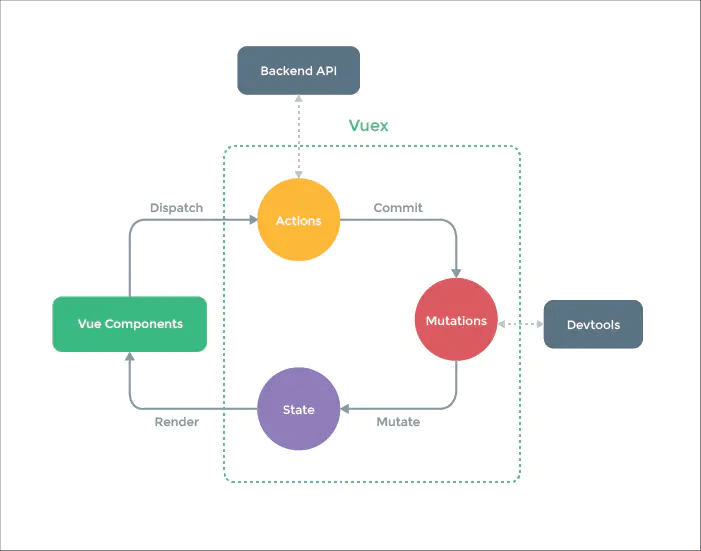

## 四、路由

### 1. Vue-Router 的懒加载如何实现

非懒加载：

```javascript
import List from '@/components/list.vue'
const router = new VueRouter({
  routes: [
    { path: '/list', component: List }
  ]
})
```

（1）方案一(常用)：使用箭头函数+import动态加载

```javascript
const List = () => import('@/components/list.vue')
const router = new VueRouter({
  routes: [
    { path: '/list', component: List }
  ]
})
```

（2）方案二：使用箭头函数+require动态加载

```javascript
const router = new Router({
  routes: [
   {
     path: '/list',
     component: resolve => require(['@/components/list'], resolve)
   }
  ]
})
```

（3）方案三：使用webpack的require.ensure技术，也可以实现按需加载。 这种情况下，多个路由指定相同的chunkName，会合并打包成一个js文件。

```javascript
// r就是resolve
const List = r => require.ensure([], () => r(require('@/components/list')), 'list');
// 路由也是正常的写法  这种是官方推荐的写的 按模块划分懒加载 
const router = new Router({
  routes: [
  {
    path: '/list',
    component: List,
    name: 'list'
  }
 ]
}))
```

### 2. 路由的hash和history模式的区别

Vue-Router有两种模式：**hash模式**和**history模式**。默认的路由模式是hash模式。

#### 1. hash模式

**简介：** hash模式是开发中默认的模式，它的URL带着一个#，例如：[http://www.abc.com/#/vue](http://www.abc.com/#/vue)，它的hash值就是`#/vue`。

**特点**：hash值会出现在URL里面，但是不会出现在HTTP请求中，对后端完全没有影响。所以改变hash值，不会重新加载页面。这种模式的浏览器支持度很好，低版本的IE浏览器也支持这种模式。hash路由被称为是前端路由，已经成为SPA（单页面应用）的标配。

**原理：** hash模式的主要原理就是**onhashchange()事件**：

```javascript
window.onhashchange = function(event){
	console.log(event.oldURL, event.newURL);
	let hash = location.hash.slice(1);
}
```

使用onhashchange()事件的好处就是，在页面的hash值发生变化时，无需向后端发起请求，window就可以监听事件的改变，并按规则加载相应的代码。除此之外，hash值变化对应的URL都会被浏览器记录下来，这样浏览器就能实现页面的前进和后退。虽然是没有请求后端服务器，但是页面的hash值和对应的URL关联起来了。

#### 2. history模式

**简介：** history模式的URL中没有#，它使用的是传统的路由分发模式，即用户在输入一个URL时，服务器会接收这个请求，并解析这个URL，然后做出相应的逻辑处理。
**特点：** 当使用history模式时，URL就像这样：[http://abc.com/user/id](http://abc.com/user/id)。相比hash模式更加好看。但是，history模式需要后台配置支持。如果后台没有正确配置，访问时会返回404。
**API：** history api可以分为两大部分，切换历史状态和修改历史状态：

- **修改历史状态**：包括了 HTML5 History Interface 中新增的 `pushState()` 和 `replaceState()` 方法，这两个方法应用于浏览器的历史记录栈，提供了对历史记录进行修改的功能。只是当他们进行修改时，虽然修改了url，但浏览器不会立即向后端发送请求。如果要做到改变url但又不刷新页面的效果，就需要前端用上这两个API。
- **切换历史状态：** 包括`forward()`、`back()`、`go()`三个方法，对应浏览器的前进，后退，跳转操作。

虽然history模式丢弃了丑陋的#。但是，它也有自己的缺点，就是在刷新页面的时候，如果没有相应的路由或资源，就会刷出404来。


如果想要切换到history模式，就要进行以下配置（后端也要进行配置）：

```javascript
const router = new VueRouter({
  mode: 'history',
  routes: [...]
})
```

#### 3. 两种模式对比

调用 history.pushState() 相比于直接修改 hash，存在以下优势:

- pushState() 设置的新 URL 可以是与当前 URL 同源的任意 URL；而 hash 只可修改 # 后面的部分，因此只能设置与当前 URL 同文档的 URL；
- pushState() 设置的新 URL 可以与当前 URL 一模一样，这样也会把记录添加到栈中；而 hash 设置的新值必须与原来不一样才会触发动作将记录添加到栈中；
- pushState() 通过 stateObject 参数可以添加任意类型的数据到记录中；而 hash 只可添加短字符串；
- pushState() 可额外设置 title 属性供后续使用。
- hash模式下，仅hash符号之前的url会被包含在请求中，后端如果没有做到对路由的全覆盖，也不会返回404错误；history模式下，前端的url必须和实际向后端发起请求的url一致，如果没有对用的路由处理，将返回404错误。


hash模式和history模式都有各自的优势和缺陷，还是要根据实际情况选择性的使用。

### 3. 如何获取页面的hash变化

**（1）监听$route的变化**

```javascript
// 监听,当路由发生变化的时候执行
watch: {
  $route: {
    handler: function(val, oldVal){
      console.log(val);
    },
    // 深度观察监听
    deep: true
  }
},
```

**（2）window.location.hash读取#值**
window.location.hash 的值可读可写，读取来判断状态是否改变，写入时可以在不重载网页的前提下，添加一条历史访问记录。

### 4. `$route 和$router` 的区别

- $route 是“路由信息对象”，包括 path，params，hash，query，fullPath，matched，name 等路由信息参数
- $router 是“路由实例”对象包括了路由的跳转方法，钩子函数等。

### 5. 如何定义动态路由？如何获取传过来的动态参数？

**（1）param方式**

- 配置路由格式：`/router/:id`
- 传递的方式：在path后面跟上对应的值
- 传递后形成的路径：`/router/123`


1）路由定义

```javascript
//在APP.vue中
<router-link :to="'/user/'+userId" replace>用户</router-link>    

//在index.js
{
   path: '/user/:userid',
   component: User,
},
```

2）路由跳转

```javascript
// 方法1：
<router-link :to="{ name: 'users', params: { uname: wade }}">按钮</router-link

// 方法2：
this.$router.push({name:'users',params:{uname:wade}})

// 方法3：
this.$router.push('/user/' + wade)
```

3）参数获取
通过 `$route.params.userid` 获取传递的值


**（2）query方式**

- 配置路由格式：`/router`，也就是普通配置
- 传递的方式：对象中使用query的key作为传递方式
- 传递后形成的路径：`/route?id=123`

1）路由定义

```javascript
//方式1：直接在router-link 标签上以对象的形式
<router-link :to="{path:'/profile',query:{name:'why',age:28,height:188}}">档案</router-link>

// 方式2：写成按钮以点击事件形式
<button @click='profileClick'>我的</button>    

profileClick(){
  this.$router.push({
    path: "/profile",
    query: {
        name: "kobi",
        age: "28",
        height: 198
    }
  });
}
```

2）跳转方法

```javascript
// 方法1：
<router-link :to="{ name: 'users', query: { uname: james }}">按钮</router-link>

// 方法2：
this.$router.push({ name: 'users', query:{ uname:james }})

// 方法3：
<router-link :to="{ path: '/user', query: { uname:james }}">按钮</router-link>

// 方法4：
this.$router.push({ path: '/user', query:{ uname:james }})

// 方法5：
this.$router.push('/user?uname=' + jsmes)
```

3）获取参数

```javascript
通过$route.query 获取传递的值
```

### 6. Vue-router 路由钩子在生命周期的体现

一、Vue-Router导航守卫

有的时候，需要通过路由来进行一些操作，比如最常见的登录权限验证，当用户满足条件时，才让其进入导航，否则就取消跳转，并跳到登录页面让其登录。
为此有很多种方法可以植入路由的导航过程：全局的，单个路由独享的，或者组件级的

1. 全局路由钩子

vue-router全局有三个路由钩子;

- router.beforeEach 全局前置守卫 进入路由之前
- router.beforeResolve 全局解析守卫（2.5.0+）在 beforeRouteEnter 调用之后调用
- router.afterEach 全局后置钩子 进入路由之后

具体使用∶

-  beforeEach（判断是否登录了，没登录就跳转到登录页）

```javascript
router.beforeEach((to, from, next) => {  
    let ifInfo = Vue.prototype.$common.getSession('userData');  // 判断是否登录的存储信息
    if (!ifInfo) { 
        // sessionStorage里没有储存user信息    
        if (to.path == '/') { 
            //如果是登录页面路径，就直接next()      
            next();    
        } else { 
            //不然就跳转到登录      
            Message.warning("请重新登录！");     
            window.location.href = Vue.prototype.$loginUrl;    
        }  
    } else {    
        return next();  
    }
})
```

- afterEach （跳转之后滚动条回到顶部）

```javascript
router.afterEach((to, from) => {  
    // 跳转之后滚动条回到顶部  
    window.scrollTo(0,0);
});
```

2. 单个路由独享钩子

**beforeEnter**
如果不想全局配置守卫的话，可以为某些路由单独配置守卫，有三个参数∶ to、from、next

```javascript
export default [    
    {        
        path: '/',        
        name: 'login',        
        component: login,        
        beforeEnter: (to, from, next) => {          
            console.log('即将进入登录页面')          
            next()        
        }    
    }
]
```

3. 组件内钩子

beforeRouteUpdate、beforeRouteEnter、beforeRouteLeave


这三个钩子都有三个参数∶to、from、next

- beforeRouteEnter∶ 进入组件前触发
- beforeRouteUpdate∶ 当前地址改变并且改组件被复用时触发，举例来说，带有动态参数的路径foo/∶id，在 /foo/1 和 /foo/2 之间跳转的时候，由于会渲染同样的foa组件，这个钩子在这种情况下就会被调用
- beforeRouteLeave∶ 离开组件被调用

注意点，beforeRouteEnter组件内还访问不到this，因为该守卫执行前组件实例还没有被创建，需要传一个回调给 next来访问，例如：

```javascript
beforeRouteEnter(to, from, next) {      
    next(target => {        
        if (from.path == '/classProcess') {          
            target.isFromProcess = true        
        }      
    })    
}
```

二、Vue路由钩子在生命周期函数的体现

1. 完整的路由导航解析流程（不包括其他生命周期）

- 触发进入其他路由。
- 调用要离开路由的组件守卫beforeRouteLeave
- 调用局前置守卫∶ beforeEach
- 在重用的组件里调用 beforeRouteUpdate
- 调用路由独享守卫 beforeEnter。
- 解析异步路由组件。
- 在将要进入的路由组件中调用 beforeRouteEnter
- 调用全局解析守卫 beforeResolve
- 导航被确认。
- 调用全局后置钩子的 afterEach 钩子。
- 触发DOM更新（mounted）。
- 执行beforeRouteEnter 守卫中传给 next 的回调函数


2. 触发钩子的完整顺序

路由导航、keep-alive、和组件生命周期钩子结合起来的，触发顺序，假设是从a组件离开，第一次进入b组件∶

- beforeRouteLeave：路由组件的组件离开路由前钩子，可取消路由离开。
- beforeEach：路由全局前置守卫，可用于登录验证、全局路由loading等。
- beforeEnter：路由独享守卫
- beforeRouteEnter：路由组件的组件进入路由前钩子。
- beforeResolve：路由全局解析守卫
- afterEach：路由全局后置钩子
- beforeCreate：组件生命周期，不能访问tAis。
- created;组件生命周期，可以访问tAis，不能访问dom。
- beforeMount：组件生命周期
- deactivated：离开缓存组件a，或者触发a的beforeDestroy和destroyed组件销毁钩子。
- mounted：访问/操作dom。
- activated：进入缓存组件，进入a的嵌套子组件（如果有的话）。
- 执行beforeRouteEnter回调函数next。


3. 导航行为被触发到导航完成的整个过程

- 导航行为被触发，此时导航未被确认。
- 在失活的组件里调用离开守卫 beforeRouteLeave。
- 调用全局的 beforeEach守卫。
- 在重用的组件里调用 beforeRouteUpdate 守卫(2.2+)。
- 在路由配置里调用 beforeEnteY。 
- 解析异步路由组件（如果有）。
- 在被激活的组件里调用 beforeRouteEnter。
- 调用全局的 beforeResolve 守卫（2.5+），标示解析阶段完成。
- 导航被确认。
- 调用全局的 afterEach 钩子。
- 非重用组件，开始组件实例的生命周期：beforeCreate&created、beforeMount&mounted
- 触发 DOM 更新。
- 用创建好的实例调用 beforeRouteEnter守卫中传给 next 的回调函数。
- 导航完成

### 7. Vue-router跳转和location.href有什么区别

- 使用 `location.href= /url `来跳转，简单方便，但是刷新了页面；
- 使用 `history.pushState( /url )` ，无刷新页面，静态跳转；
- 引进 router ，然后使用 `router.push( /url )` 来跳转，使用了 `diff` 算法，实现了按需加载，减少了 dom 的消耗。其实使用 router 跳转和使用 `history.pushState()` 没什么差别的，因为vue-router就是用了 `history.pushState()` ，尤其是在history模式下。

### 8. params和query的区别

**用法**：query要用path来引入，params要用name来引入，接收参数都是类似的，分别是 `this.$route.query.name` 和 `this.$route.params.name` 。


**url地址显示**：query更加类似于ajax中get传参，params则类似于post，说的再简单一点，前者在浏览器地址栏中显示参数，后者则不显示


**注意**：query刷新不会丢失query里面的数据 params刷新会丢失 params里面的数据。

### 9. Vue-router 导航守卫有哪些

- 全局前置/钩子：beforeEach、beforeResolve、afterEach
- 路由独享的守卫：beforeEnter
- 组件内的守卫：beforeRouteEnter、beforeRouteUpdate、beforeRouteLeave

### 10. 对前端路由的理解

在前端技术早期，一个 url 对应一个页面，如果要从 A 页面切换到 B 页面，那么必然伴随着页面的刷新。这个体验并不好，不过在最初也是无奈之举——用户只有在刷新页面的情况下，才可以重新去请求数据。


后来，改变发生了——Ajax 出现了，它允许人们在不刷新页面的情况下发起请求；与之共生的，还有“不刷新页面即可更新页面内容”这种需求。在这样的背景下，出现了 **SPA（单页面应用**）。


SPA极大地提升了用户体验，它允许页面在不刷新的情况下更新页面内容，使内容的切换更加流畅。但是在 SPA 诞生之初，人们并没有考虑到“定位”这个问题——在内容切换前后，页面的 URL 都是一样的，这就带来了两个问题：

- SPA 其实并不知道当前的页面“进展到了哪一步”。可能在一个站点下经过了反复的“前进”才终于唤出了某一块内容，但是此时只要刷新一下页面，一切就会被清零，必须重复之前的操作、才可以重新对内容进行定位——SPA 并不会“记住”你的操作。
- 由于有且仅有一个 URL 给页面做映射，这对 SEO 也不够友好，搜索引擎无法收集全面的信息


为了解决这个问题，前端路由出现了。


前端路由可以帮助我们在仅有一个页面的情况下，“记住”用户当前走到了哪一步——为 SPA 中的各个视图匹配一个唯一标识。这意味着用户前进、后退触发的新内容，都会映射到不同的 URL 上去。此时即便他刷新页面，因为当前的 URL 可以标识出他所处的位置，因此内容也不会丢失。


那么如何实现这个目的呢？首先要解决两个问题：

- 当用户刷新页面时，浏览器会默认根据当前 URL 对资源进行重新定位（发送请求）。这个动作对 SPA 是不必要的，因为我们的 SPA 作为单页面，无论如何也只会有一个资源与之对应。此时若走正常的请求-刷新流程，反而会使用户的前进后退操作无法被记录。
- 单页面应用对服务端来说，就是一个URL、一套资源，那么如何做到用“不同的URL”来映射不同的视图内容呢？


从这两个问题来看，服务端已经完全救不了这个场景了。所以要靠咱们前端自力更生，不然怎么叫“前端路由”呢？作为前端，可以提供这样的解决思路：

- 拦截用户的刷新操作，避免服务端盲目响应、返回不符合预期的资源内容。把刷新这个动作完全放到前端逻辑里消化掉。
- 感知 URL 的变化。这里不是说要改造 URL、凭空制造出 N 个 URL 来。而是说 URL 还是那个 URL，只不过我们可以给它做一些微小的处理——这些处理并不会影响 URL 本身的性质，不会影响服务器对它的识别，只有我们前端感知的到。一旦我们感知到了，我们就根据这些变化、用 JS 去给它生成不同的内容。

## 五、Vuex

### 1. Vuex 的原理

Vuex 是一个专为 Vue.js 应用程序开发的状态管理模式。每一个 Vuex 应用的核心就是 store（仓库）。“store” 基本上就是一个容器，它包含着你的应用中大部分的状态 ( state )。

- Vuex 的状态存储是响应式的。当 Vue 组件从 store 中读取状态的时候，若 store 中的状态发生变化，那么相应的组件也会相应地得到高效更新。
- 改变 store 中的状态的唯一途径就是显式地提交 (commit) mutation。这样可以方便地跟踪每一个状态的变化。


Vuex为Vue Components建立起了一个完整的生态圈，包括开发中的API调用一环。 
**（1）核心流程中的主要功能：**

- Vue Components 是 vue 组件，组件会触发（dispatch）一些事件或动作，也就是图中的 Actions;
- 在组件中发出的动作，肯定是想获取或者改变数据的，但是在 vuex 中，数据是集中管理的，不能直接去更改数据，所以会把这个动作提交（Commit）到 Mutations 中;
- 然后 Mutations 就去改变（Mutate）State 中的数据;
- 当 State 中的数据被改变之后，就会重新渲染（Render）到 Vue Components 中去，组件展示更新后的数据，完成一个流程。


**（2）各模块在核心流程中的主要功能：**

- `Vue Components`∶ Vue组件。HTML页面上，负责接收用户操作等交互行为，执行dispatch方法触发对应action进行回应。
- `dispatch`∶操作行为触发方法，是唯一能执行action的方法。
- `actions`∶ 操作行为处理模块。负责处理Vue Components接收到的所有交互行为。包含同步/异步操作，支持多个同名方法，按照注册的顺序依次触发。向后台API请求的操作就在这个模块中进行，包括触发其他action以及提交mutation的操作。该模块提供了Promise的封装，以支持action的链式触发。
- `commit`∶状态改变提交操作方法。对mutation进行提交，是唯一能执行mutation的方法。
- `mutations`∶状态改变操作方法。是Vuex修改state的唯一推荐方法，其他修改方式在严格模式下将会报错。该方法只能进行同步操作，且方法名只能全局唯一。操作之中会有一些hook暴露出来，以进行state的监控等。
- `state`∶ 页面状态管理容器对象。集中存储Vuecomponents中data对象的零散数据，全局唯一，以进行统一的状态管理。页面显示所需的数据从该对象中进行读取，利用Vue的细粒度数据响应机制来进行高效的状态更新。
- `getters`∶ state对象读取方法。图中没有单独列出该模块，应该被包含在了render中，Vue Components通过该方法读取全局state对象。

### 2. Vuex中action和mutation的区别

mutation中的操作是一系列的同步函数，用于修改state中的变量的的状态。当使用vuex时需要通过commit来提交需要操作的内容。mutation 非常类似于事件：每个 mutation 都有一个字符串的 事件类型 (type) 和 一个 回调函数 (handler)。这个回调函数就是实际进行状态更改的地方，并且它会接受 state 作为第一个参数：

```javascript
const store = new Vuex.Store({
  state: {
    count: 1
  },
  mutations: {
    increment (state) {
      state.count++      // 变更状态
    }
  }
})
```

当触发一个类型为 increment 的 mutation 时，需要调用此函数：

```javascript
store.commit('increment')
```

而Action类似于mutation，不同点在于：

- Action 可以包含任意异步操作。
- Action 提交的是 mutation，而不是直接变更状态。

```javascript
const store = new Vuex.Store({
  state: {
    count: 0
  },
  mutations: {
    increment (state) {
      state.count++
    }
  },
  actions: {
    increment (context) {
      context.commit('increment')
    }
  }
})
```

Action 函数接受一个与 store 实例具有相同方法和属性的 context 对象，因此你可以调用 context.commit 提交一个 mutation，或者通过 context.state 和 context.getters 来获取 state 和 getters。
所以，两者的不同点如下：

- Mutation专注于修改State，理论上是修改State的唯一途径；Action业务代码、异步请求。
- Mutation：必须同步执行；Action：可以异步，但不能直接操作State。
- 在视图更新时，先触发actions，actions再触发mutation
- mutation的参数是state，它包含store中的数据；store的参数是context，它是 state 的父级，包含 state、getters

### 3. Vuex 和 localStorage 的区别

**（1）最重要的区别**

- vuex存储在内存中
- localstorage 则以文件的方式存储在本地，只能存储字符串类型的数据，存储对象需要 JSON的stringify和parse方法进行处理。 读取内存比读取硬盘速度要快

**（2）应用场景**

- Vuex 是一个专为 Vue.js 应用程序开发的状态管理模式。它采用集中式存储管理应用的所有组件的状态，并以相应的规则保证状态以一种可预测的方式发生变化。vuex用于组件之间的传值。
- localstorage是本地存储，是将数据存储到浏览器的方法，一般是在跨页面传递数据时使用 。
- Vuex能做到数据的响应式，localstorage不能

**（3）永久性**

刷新页面时vuex存储的值会丢失，localstorage不会。

**注意：** 对于不变的数据确实可以用localstorage可以代替vuex，但是当两个组件共用一个数据源（对象或数组）时，如果其中一个组件改变了该数据源，希望另一个组件响应该变化时，localstorage无法做到，原因就是区别1。

### 4. Redux 和 Vuex 有什么区别，它们的共同思想

**（1）Redux 和 Vuex区别**

- Vuex改进了Redux中的Action和Reducer函数，以mutations变化函数取代Reducer，无需switch，只需在对应的mutation函数里改变state值即可
- Vuex由于Vue自动重新渲染的特性，无需订阅重新渲染函数，只要生成新的State即可
- Vuex数据流的顺序是∶View调用store.commit提交对应的请求到Store中对应的mutation函数->store改变（vue检测到数据变化自动渲染）


通俗点理解就是，vuex 弱化 dispatch，通过commit进行 store状态的一次更变;取消了action概念，不必传入特定的 action形式进行指定变更;弱化reducer，基于commit参数直接对数据进行转变，使得框架更加简易; 


**（2）共同思想**

- 单—的数据源 
- 变化可以预测


本质上：redux与vuex都是对mvvm思想的服务，将数据从视图中抽离的一种方案;
形式上：vuex借鉴了redux，将store作为全局的数据中心，进行mode管理;

### 5. 为什么要用 Vuex 或者 Redux

由于传参的方法对于多层嵌套的组件将会非常繁琐，并且对于兄弟组件间的状态传递无能为力。我们经常会采用父子组件直接引用或者通过事件来变更和同步状态的多份拷贝。以上的这些模式非常脆弱，通常会导致代码无法维护。


所以需要把组件的共享状态抽取出来，以一个全局单例模式管理。在这种模式下，组件树构成了一个巨大的"视图"，不管在树的哪个位置，任何组件都能获取状态或者触发行为。


另外，通过定义和隔离状态管理中的各种概念并强制遵守一定的规则，代码将会变得更结构化且易维护。

### 6. Vuex有哪几种属性？

有五种，分别是 State、 Getter、Mutation 、Action、 Module

- state => 基本数据(数据源存放地)
- getters => 从基本数据派生出来的数据
- mutations => 提交更改数据的方法，同步
- actions => 像一个装饰器，包裹mutations，使之可以异步。
- modules => 模块化Vuex

### 7. Vuex和单纯的全局对象有什么区别？

- Vuex 的状态存储是响应式的。当 Vue 组件从 store 中读取状态的时候，若 store 中的状态发生变化，那么相应的组件也会相应地得到高效更新。
- 不能直接改变 store 中的状态。改变 store 中的状态的唯一途径就是显式地提交 (commit) mutation。这样可以方便地跟踪每一个状态的变化，从而能够实现一些工具帮助更好地了解我们的应用。

### 8. 为什么 Vuex 的 mutation 中不能做异步操作？

- Vuex中所有的状态更新的唯一途径都是mutation，异步操作通过 Action 来提交 mutation实现，这样可以方便地跟踪每一个状态的变化，从而能够实现一些工具帮助更好地了解我们的应用。
- 每个mutation执行完成后都会对应到一个新的状态变更，这样devtools就可以打个快照存下来，然后就可以实现 time-travel 了。如果mutation支持异步操作，就没有办法知道状态是何时更新的，无法很好的进行状态的追踪，给调试带来困难。

### 9. Vuex的严格模式是什么,有什么作用，如何开启？

在严格模式下，无论何时发生了状态变更且不是由mutation函数引起的，将会抛出错误。这能保证所有的状态变更都能被调试工具跟踪到。


在Vuex.Store 构造器选项中开启,如下

```
const store = new Vuex.Store({
    strict:true,
})
```

### 10. 如何在组件中批量使用Vuex的getter属性

使用mapGetters辅助函数, 利用对象展开运算符将getter混入computed 对象中

```javascript
import {mapGetters} from 'vuex'
export default{
    computed:{
        ...mapGetters(['total','discountTotal'])
    }
}
```

### 11. 如何在组件中重复使用Vuex的mutation

使用mapMutations辅助函数,在组件中这么使用

```javascript
import { mapMutations } from 'vuex'
methods:{
    ...mapMutations({
        setNumber:'SET_NUMBER',
    })
}
```

然后调用`this.setNumber(10)`相当调用`this.$store.commit('SET_NUMBER',10)`

## 六、Vue 3.0

### 1. Vue3.0有什么更新

**（1）监测机制的改变**

- 3.0 将带来基于代理 Proxy的 observer 实现，提供全语言覆盖的反应性跟踪。
- 消除了 Vue 2 当中基于 Object.defineProperty 的实现所存在的很多限制：


**（2）只能监测属性，不能监测对象**

- 检测属性的添加和删除；
- 检测数组索引和长度的变更；
- 支持 Map、Set、WeakMap 和 WeakSet。


**（3）模板**

- 作用域插槽，2.x 的机制导致作用域插槽变了，父组件会重新渲染，而 3.0 把作用域插槽改成了函数的方式，这样只会影响子组件的重新渲染，提升了渲染的性能。
- 同时，对于 render 函数的方面，vue3.0 也会进行一系列更改来方便习惯直接使用 api 来生成 vdom 。


**（4）对象式的组件声明方式**

- vue2.x 中的组件是通过声明的方式传入一系列 option，和 TypeScript 的结合需要通过一些装饰器的方式来做，虽然能实现功能，但是比较麻烦。
- 3.0 修改了组件的声明方式，改成了类式的写法，这样使得和 TypeScript 的结合变得很容易


**（5）其它方面的更改**

- 支持自定义渲染器，从而使得 weex 可以通过自定义渲染器的方式来扩展，而不是直接 fork 源码来改的方式。
- 支持 Fragment（多个根节点）和 Protal（在 dom 其他部分渲染组建内容）组件，针对一些特殊的场景做了处理。
- 基于 tree shaking 优化，提供了更多的内置功能。

### 2. defineProperty和proxy的区别

Vue 在实例初始化时遍历 data 中的所有属性，并使用 Object.defineProperty 把这些属性全部转为 getter/setter。这样当追踪数据发生变化时，setter 会被自动调用。


Object.defineProperty 是 ES5 中一个无法 shim 的特性，这也就是 Vue 不支持 IE8 以及更低版本浏览器的原因。


但是这样做有以下问题：

1. 添加或删除对象的属性时，Vue 检测不到。因为添加或删除的对象没有在初始化进行响应式处理，只能通过`$set` 来调用`Object.defineProperty()`处理。
1. 无法监控到数组下标和长度的变化。


Vue3 使用 Proxy 来监控数据的变化。Proxy 是 ES6 中提供的功能，其作用为：用于定义基本操作的自定义行为（如属性查找，赋值，枚举，函数调用等）。相对于`Object.defineProperty()`，其有以下特点：

1. Proxy 直接代理整个对象而非对象属性，这样只需做一层代理就可以监听同级结构下的所有属性变化，包括新增属性和删除属性。
1. Proxy 可以监听数组的变化。

### 3. Vue3.0 为什么要用 proxy？

在 Vue2 中， 0bject.defineProperty 会改变原始数据，而 Proxy 是创建对象的虚拟表示，并提供 set 、get 和 deleteProperty 等处理器，这些处理器可在访问或修改原始对象上的属性时进行拦截，有以下特点∶

- 不需用使用 `Vue.$set` 或 `Vue.$delete` 触发响应式。
- 全方位的数组变化检测，消除了Vue2 无效的边界情况。
- 支持 Map，Set，WeakMap 和 WeakSet。


 Proxy 实现的响应式原理与 Vue2的实现原理相同，实现方式大同小异∶ 

- get 收集依赖
- Set、delete 等触发依赖
- 对于集合类型，就是对集合对象的方法做一层包装：原方法执行后执行依赖相关的收集或触发逻辑。

### 4.  Vue 3.0 中的 Vue Composition API？

在 Vue2 中，代码是 Options API 风格的，也就是通过填充 (option) data、methods、computed 等属性来完成一个 Vue 组件。这种风格使得 Vue 相对于 React极为容易上手，同时也造成了几个问题：

1. 由于 Options API 不够灵活的开发方式，使得Vue开发缺乏优雅的方法来在组件间共用代码。
1. Vue 组件过于依赖`this`上下文，Vue 背后的一些小技巧使得 Vue 组件的开发看起来与 JavaScript 的开发原则相悖，比如在`methods` 中的`this`竟然指向组件实例来不指向`methods`所在的对象。这也使得 TypeScript 在Vue2 中很不好用。


于是在 Vue3 中，舍弃了 Options API，转而投向 Composition API。Composition API本质上是将 Options API 背后的机制暴露给用户直接使用，这样用户就拥有了更多的灵活性，也使得 Vue3 更适合于 TypeScript 结合。


如下，是一个使用了 Vue Composition API 的 Vue3 组件：

```javascript
<template>
  <button @click="increment">
    Count: {{ count }}
  </button>
</template>
 
<script>
// Composition API 将组件属性暴露为函数，因此第一步是导入所需的函数
import { ref, computed, onMounted } from 'vue'
 
export default {
  setup() {
// 使用 ref 函数声明了称为 count 的响应属性，对应于Vue2中的data函数
    const count = ref(0)
 
// Vue2中需要在methods option中声明的函数，现在直接声明
    function increment() {
      count.value++
    }
 // 对应于Vue2中的mounted声明周期
    onMounted(() => console.log('component mounted!'))
 
    return {
      count,
      increment
    }
  }
}
</script>
```

显而易见，Vue Composition API 使得 Vue3 的开发风格更接近于原生 JavaScript，带给开发者更多地灵活性

### 5. Composition API与React Hook很像，区别是什么

从React Hook的实现角度看，React Hook是根据useState调用的顺序来确定下一次重渲染时的state是来源于哪个useState，所以出现了以下限制

- 不能在循环、条件、嵌套函数中调用Hook
- 必须确保总是在你的React函数的顶层调用Hook
- useEffect、useMemo等函数必须手动确定依赖关系


而Composition API是基于Vue的响应式系统实现的，与React Hook的相比

- 声明在setup函数内，一次组件实例化只调用一次setup，而React Hook每次重渲染都需要调用Hook，使得React的GC比Vue更有压力，性能也相对于Vue来说也较慢
- Compositon API的调用不需要顾虑调用顺序，也可以在循环、条件、嵌套函数中使用
- 响应式系统自动实现了依赖收集，进而组件的部分的性能优化由Vue内部自己完成，而React Hook需要手动传入依赖，而且必须必须保证依赖的顺序，让useEffect、useMemo等函数正确的捕获依赖变量，否则会由于依赖不正确使得组件性能下降。

虽然Compositon API看起来比React Hook好用，但是其设计思想也是借鉴React Hook的。

## 七、虚拟DOM

### 1. 对虚拟DOM的理解？

从本质上来说，Virtual Dom是一个JavaScript对象，通过对象的方式来表示DOM结构。将页面的状态抽象为JS对象的形式，配合不同的渲染工具，使跨平台渲染成为可能。通过事务处理机制，将多次DOM修改的结果一次性的更新到页面上，从而有效的减少页面渲染的次数，减少修改DOM的重绘重排次数，提高渲染性能。


虚拟DOM是对DOM的抽象，这个对象是更加轻量级的对 DOM的描述。它设计的最初目的，就是更好的跨平台，比如Node.js就没有DOM，如果想实现SSR，那么一个方式就是借助虚拟DOM，因为虚拟DOM本身是js对象。 在代码渲染到页面之前，vue会把代码转换成一个对象（虚拟 DOM）。以对象的形式来描述真实DOM结构，最终渲染到页面。在每次数据发生变化前，虚拟DOM都会缓存一份，变化之时，现在的虚拟DOM会与缓存的虚拟DOM进行比较。在vue内部封装了diff算法，通过这个算法来进行比较，渲染时修改改变的变化，原先没有发生改变的通过原先的数据进行渲染。


另外现代前端框架的一个基本要求就是无须手动操作DOM，一方面是因为手动操作DOM无法保证程序性能，多人协作的项目中如果review不严格，可能会有开发者写出性能较低的代码，另一方面更重要的是省略手动DOM操作可以大大提高开发效率。

### 2. 虚拟DOM的解析过程

虚拟DOM的解析过程：

- 首先对将要插入到文档中的 DOM 树结构进行分析，使用 js 对象将其表示出来，比如一个元素对象，包含 TagName、props 和 Children 这些属性。然后将这个 js 对象树给保存下来，最后再将 DOM 片段插入到文档中。
- 当页面的状态发生改变，需要对页面的 DOM 的结构进行调整的时候，首先根据变更的状态，重新构建起一棵对象树，然后将这棵新的对象树和旧的对象树进行比较，记录下两棵树的的差异。
- 最后将记录的有差异的地方应用到真正的 DOM 树中去，这样视图就更新了。

### 3. 为什么要用虚拟DOM

**（1）保证性能下限，在不进行手动优化的情况下，提供过得去的性能**
看一下页面渲染的流程：**解析HTML -> 生成DOM -> 生成 CSSOM -> Layout -> Paint -> Compiler**
下面对比一下修改DOM时真实DOM操作和Virtual DOM的过程，来看一下它们重排重绘的性能消耗∶

- 真实DOM∶ 生成HTML字符串＋重建所有的DOM元素
- 虚拟DOM∶ 生成vNode+ DOMDiff＋必要的dom更新


Virtual DOM的更新DOM的准备工作耗费更多的时间，也就是JS层面，相比于更多的DOM操作它的消费是极其便宜的。尤雨溪在社区论坛中说道∶ 框架给你的保证是，你不需要手动优化的情况下，依然可以给你提供过得去的性能。
**（2）跨平台**
Virtual DOM本质上是JavaScript的对象，它可以很方便的跨平台操作，比如服务端渲染、uniapp等。

### 4. 虚拟DOM真的比真实DOM性能好吗

- 首次渲染大量DOM时，由于多了一层虚拟DOM的计算，会比innerHTML插入慢。
- 正如它能保证性能下限，在真实DOM操作的时候进行针对性的优化时，还是更快的。

### 5. DIFF算法的原理

在新老虚拟DOM对比时：

- 首先，对比节点本身，判断是否为同一节点，如果不为相同节点，则删除该节点重新创建节点进行替换
- 如果为相同节点，进行patchVnode，判断如何对该节点的子节点进行处理，先判断一方有子节点一方没有子节点的情况(如果新的children没有子节点，将旧的子节点移除)
- 比较如果都有子节点，则进行updateChildren，判断如何对这些新老节点的子节点进行操作（diff核心）。
- 匹配时，找到相同的子节点，递归比较子节点


在diff中，只对同层的子节点进行比较，放弃跨级的节点比较，使得时间复杂从O(n3)降低值O(n)，也就是说，只有当新旧children都为多个子节点时才需要用核心的Diff算法进行同层级比较。

### 6. Vue中key的作用

vue 中 key 值的作用可以分为两种情况来考虑：

- 第一种情况是 v-if 中使用 key。由于 Vue 会尽可能高效地渲染元素，通常会复用已有元素而不是从头开始渲染。因此当使用 v-if 来实现元素切换的时候，如果切换前后含有相同类型的元素，那么这个元素就会被复用。如果是相同的 input 元素，那么切换前后用户的输入不会被清除掉，这样是不符合需求的。因此可以通过使用 key 来唯一的标识一个元素，这个情况下，使用 key 的元素不会被复用。这个时候 key 的作用是用来标识一个独立的元素。
- 第二种情况是 v-for 中使用 key。用 v-for 更新已渲染过的元素列表时，它默认使用“就地复用”的策略。如果数据项的顺序发生了改变，Vue 不会移动 DOM 元素来匹配数据项的顺序，而是简单复用此处的每个元素。因此通过为每个列表项提供一个 key 值，来以便 Vue 跟踪元素的身份，从而高效的实现复用。这个时候 key 的作用是为了高效的更新渲染虚拟 DOM。


key 是为 Vue 中 vnode 的唯一标记，通过这个 key，diff 操作可以更准确、更快速

- 更准确：因为带 key 就不是就地复用了，在 sameNode 函数a.key === b.key对比中可以避免就地复用的情况。所以会更加准确。
- 更快速：利用 key 的唯一性生成 map 对象来获取对应节点，比遍历方式更快

### 7. 为什么不建议用index作为key?

使用index 作为 key和没写基本上没区别，因为不管数组的顺序怎么颠倒，index 都是 0, 1, 2...这样排列，导致 Vue 会复用错误的旧子节点，做很多额外的工作。
