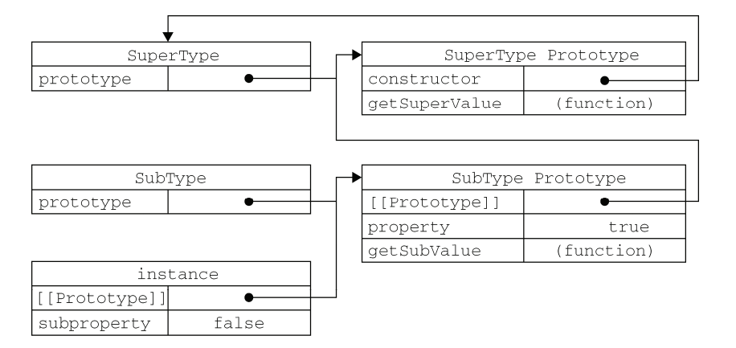

### 前言：

**代码输出结果**是面试中常考的题目，一段代码中可能涉及到很多的知识点，这就考察到了应聘者的基础能力。在前端面试中，常考的代码输出问题主要涉及到以下知识点：**异步编程、事件循环、this指向、作用域、变量提升、闭包、原型、继承**等，这些知识点往往不是单独出现的，而是在同一段代码中包含多个知识点。所以，笔者将这些问题大致分为四类进行讨论。这里不会系统的阐述基础知识，而是通过面试例题的形式，来讲述每个题目的知识点以及代码的执行过程。如果会了这些例题，在前端面试中多数代码输出问题就可以轻而易举的解决了。


## 一、异步&事件循环

### 1. 代码输出结果

```javascript
const promise = new Promise((resolve, reject) => {
  console.log(1);
  console.log(2);
});
promise.then(() => {
  console.log(3);
});
console.log(4);
```

输出结果如下：

```javascript
1 
2 
4
```

promise.then 是微任务，它会在所有的宏任务执行完之后才会执行，同时需要promise内部的状态发生变化，因为这里内部没有发生变化，一直处于pending状态，所以不输出3。

### 2. 代码输出结果

```javascript
const promise1 = new Promise((resolve, reject) => {
  console.log('promise1')
  resolve('resolve1')
})
const promise2 = promise1.then(res => {
  console.log(res)
})
console.log('1', promise1);
console.log('2', promise2);
```

输出结果如下：

```javascript
promise1
1 Promise{<resolved>: resolve1}
2 Promise{<pending>}
resolve1
```

需要注意的是，直接打印promise1，会打印出它的状态值和参数。


代码执行过程如下：

1. script是一个宏任务，按照顺序执行这些代码；
1. 首先进入Promise，执行该构造函数中的代码，打印`promise1`；
1. 碰到`resolve`函数, 将`promise1`的状态改变为`resolved`, 并将结果保存下来；
1. 碰到`promise1.then`这个微任务，将它放入微任务队列；
1. `promise2`是一个新的状态为`pending`的`Promise`；
1. 执行同步代码1， 同时打印出`promise1`的状态是`resolved`；
1. 执行同步代码2，同时打印出`promise2`的状态是`pending`；
1. 宏任务执行完毕，查找微任务队列，发现`promise1.then`这个微任务且状态为`resolved`，执行它。

### 3. 代码输出结果

```javascript
const promise = new Promise((resolve, reject) => {
  console.log(1);
  setTimeout(() => {
    console.log("timerStart");
    resolve("success");
    console.log("timerEnd");
  }, 0);
  console.log(2);
});
promise.then((res) => {
  console.log(res);
});
console.log(4);
```

输出结果如下：

```javascript
1
2
4
timerStart
timerEnd
success
```

代码执行过程如下：

- 首先遇到Promise构造函数，会先执行里面的内容，打印`1`；
- 遇到定时器`steTimeout`，它是一个宏任务，放入宏任务队列；
- 继续向下执行，打印出2；
- 由于`Promise`的状态此时还是`pending`，所以`promise.then`先不执行；
- 继续执行下面的同步任务，打印出4；
- 此时微任务队列没有任务，继续执行下一轮宏任务，执行`steTimeout`；
- 首先执行`timerStart`，然后遇到了`resolve`，将`promise`的状态改为`resolved`且保存结果并将之前的`promise.then`推入微任务队列，再执行`timerEnd`；
- 执行完这个宏任务，就去执行微任务`promise.then`，打印出`resolve`的结果。

### 4. 代码输出结果

```javascript
Promise.resolve().then(() => {
  console.log('promise1');
  const timer2 = setTimeout(() => {
    console.log('timer2')
  }, 0)
});
const timer1 = setTimeout(() => {
  console.log('timer1')
  Promise.resolve().then(() => {
    console.log('promise2')
  })
}, 0)
console.log('start');
```

输出结果如下：

```javascript
start
promise1
timer1
promise2
timer2
```

代码执行过程如下：

1. 首先，`Promise.resolve().then`是一个微任务，加入微任务队列
1. 执行timer1，它是一个宏任务，加入宏任务队列
1. 继续执行下面的同步代码，打印出`start`
1. 这样第一轮宏任务就执行完了，开始执行微任务`Promise.resolve().then`，打印出`promise1`
1. 遇到`timer2`，它是一个宏任务，将其加入宏任务队列，此时宏任务队列有两个任务，分别是`timer1`、`timer2`；
1. 这样第一轮微任务就执行完了，开始执行第二轮宏任务，首先执行定时器`timer1`，打印`timer1`；
1. 遇到`Promise.resolve().then`，它是一个微任务，加入微任务队列
1. 开始执行微任务队列中的任务，打印`promise2`；
1. 最后执行宏任务`timer2`定时器，打印出`timer2`；

### 5. 代码输出结果

```javascript
const promise = new Promise((resolve, reject) => {
    resolve('success1');
    reject('error');
    resolve('success2');
});
promise.then((res) => {
    console.log('then:', res);
}).catch((err) => {
    console.log('catch:', err);
})
```

输出结果如下：

```javascript
then：success1
```

这个题目考察的就是**Promise的状态在发生变化之后，就不会再发生变化**。开始状态由`pending`变为`resolve`，说明已经变为已完成状态，下面的两个状态的就不会再执行，同时下面的catch也不会捕获到错误。

### 6. 代码输出结果

```javascript
Promise.resolve(1)
  .then(2)
  .then(Promise.resolve(3))
  .then(console.log)
```

输出结果如下：

```javascript
1
Promise {<fulfilled>: undefined}
```

Promise.resolve方法的参数如果是一个原始值，或者是一个不具有then方法的对象，则Promise.resolve方法返回一个新的Promise对象，状态为resolved，Promise.resolve方法的参数，会同时传给回调函数。


then方法接受的参数是函数，而如果传递的并非是一个函数，它实际上会将其解释为then(null)，这就会导致前一个Promise的结果会传递下面。

### 7. 代码输出结果

```javascript
const promise1 = new Promise((resolve, reject) => {
  setTimeout(() => {
    resolve('success')
  }, 1000)
})
const promise2 = promise1.then(() => {
  throw new Error('error!!!')
})
console.log('promise1', promise1)
console.log('promise2', promise2)
setTimeout(() => {
  console.log('promise1', promise1)
  console.log('promise2', promise2)
}, 2000)
```

输出结果如下：

```javascript
promise1 Promise {<pending>}
promise2 Promise {<pending>}

Uncaught (in promise) Error: error!!!
promise1 Promise {<fulfilled>: "success"}
promise2 Promise {<rejected>: Error: error!!}
```

### 8. 代码输出结果

```javascript
Promise.resolve(1)
  .then(res => {
    console.log(res);
    return 2;
  })
  .catch(err => {
    return 3;
  })
  .then(res => {
    console.log(res);
  });
```

输出结果如下：

```javascript
1   
2
```

Promise是可以链式调用的，由于每次调用 `.then` 或者 `.catch` 都会返回一个新的 promise，从而实现了链式调用, 它并不像一般任务的链式调用一样return this。


上面的输出结果之所以依次打印出1和2，是因为`resolve(1)`之后走的是第一个then方法，并没有进catch里，所以第二个then中的res得到的实际上是第一个then的返回值。并且return 2会被包装成`resolve(2)`，被最后的then打印输出2。

### 9. 代码输出结果

```javascript
Promise.resolve().then(() => {
  return new Error('error!!!')
}).then(res => {
  console.log("then: ", res)
}).catch(err => {
  console.log("catch: ", err)
})
```

输出结果如下：

```javascript
"then: " "Error: error!!!"
```

返回任意一个非 promise 的值都会被包裹成 promise 对象，因此这里的`return new Error('error!!!')`也被包裹成了`return Promise.resolve(new Error('error!!!'))`，因此它会被then捕获而不是catch。

### 10. 代码输出结果

```javascript
const promise = Promise.resolve().then(() => {
  return promise;
})
promise.catch(console.err)
```

输出结果如下：

```javascript
Uncaught (in promise) TypeError: Chaining cycle detected for promise #<Promise>
```

这里其实是一个坑，`.then` 或 `.catch` 返回的值不能是 promise 本身，否则会造成死循环。

### 11. 代码输出结果

```javascript
Promise.resolve(1)
  .then(2)
  .then(Promise.resolve(3))
  .then(console.log)
```

输出结果如下：

```javascript
1
```

看到这个题目，好多的then，实际上只需要记住一个原则：`.then` 或`.catch` 的参数期望是函数，传入非函数则会发生**值透传**。


第一个then和第二个then中传入的都不是函数，一个是数字，一个是对象，因此发生了透传，将`resolve(1)` 的值直接传到最后一个then里，直接打印出1。

### 12. 代码输出结果

```javascript
Promise.reject('err!!!')
  .then((res) => {
    console.log('success', res)
  }, (err) => {
    console.log('error', err)
  }).catch(err => {
    console.log('catch', err)
  })
```

输出结果如下：

```javascript
error err!!!
```

我们知道，`.then`函数中的两个参数：

- 第一个参数是用来处理Promise成功的函数
- 第二个则是处理失败的函数

也就是说`Promise.resolve('1')`的值会进入成功的函数，`Promise.reject('2')`的值会进入失败的函数。


在这道题中，错误直接被`then`的第二个参数捕获了，所以就不会被`catch`捕获了，输出结果为：`error err!!!'`


但是，如果是像下面这样：

```javascript
Promise.resolve()
  .then(function success (res) {
    throw new Error('error!!!')
  }, function fail1 (err) {
    console.log('fail1', err)
  }).catch(function fail2 (err) {
    console.log('fail2', err)
  })
```

在`then`的第一参数中抛出了错误，那么他就不会被第二个参数不活了，而是被后面的`catch`捕获到。

### 13. 代码输出结果

```javascript
Promise.resolve('1')
  .then(res => {
    console.log(res)
  })
  .finally(() => {
    console.log('finally')
  })
Promise.resolve('2')
  .finally(() => {
    console.log('finally2')
  	return '我是finally2返回的值'
  })
  .then(res => {
    console.log('finally2后面的then函数', res)
  })
```

输出结果如下：

```javascript
1
finally2
finally
finally2后面的then函数 2
```

`.finally()`一般用的很少，只要记住以下几点就可以了：

- `.finally()`方法不管Promise对象最后的状态如何都会执行
- `.finally()`方法的回调函数不接受任何的参数，也就是说你在`.finally()`函数中是无法知道Promise最终的状态是`resolved`还是`rejected`的
- 它最终返回的默认会是一个上一次的Promise对象值，不过如果抛出的是一个异常则返回异常的Promise对象。
- finally本质上是then方法的特例


`.finally()`的错误捕获：

```javascript
Promise.resolve('1')
  .finally(() => {
    console.log('finally1')
    throw new Error('我是finally中抛出的异常')
  })
  .then(res => {
    console.log('finally后面的then函数', res)
  })
  .catch(err => {
    console.log('捕获错误', err)
  })
```

输出结果为：

```javascript
'finally1'
'捕获错误' Error: 我是finally中抛出的异常
```

### 14. 代码输出结果

```javascript
function runAsync (x) {
    const p = new Promise(r => setTimeout(() => r(x, console.log(x)), 1000))
    return p
}

Promise.all([runAsync(1), runAsync(2), runAsync(3)]).then(res => console.log(res))
```

输出结果如下：

```javascript
1
2
3
[1, 2, 3]
```

首先，定义了一个Promise，来异步执行函数runAsync，该函数传入一个值x，然后间隔一秒后打印出这个x。


之后再使用`Promise.all`来执行这个函数，执行的时候，看到一秒之后输出了1，2，3，同时输出了数组[1, 2, 3]，三个函数是同步执行的，并且在一个回调函数中返回了所有的结果。并且结果和函数的执行顺序是一致的。

### 15. 代码输出结果

```javascript
function runAsync (x) {
  const p = new Promise(r => setTimeout(() => r(x, console.log(x)), 1000))
  return p
}
function runReject (x) {
  const p = new Promise((res, rej) => setTimeout(() => rej(`Error: ${x}`, console.log(x)), 1000 * x))
  return p
}
Promise.all([runAsync(1), runReject(4), runAsync(3), runReject(2)])
       .then(res => console.log(res))
       .catch(err => console.log(err))
```

输出结果如下：

```javascript
// 1s后输出
1
3
// 2s后输出
2
Error: 2
// 4s后输出
4
```

可以看到。catch捕获到了第一个错误，在这道题目中最先的错误就是`runReject(2)`的结果。如果一组异步操作中有一个异常都不会进入`.then()`的第一个回调函数参数中。会被`.then()`的第二个回调函数捕获。

### 16. 代码输出结果

```javascript
function runAsync (x) {
  const p = new Promise(r => setTimeout(() => r(x, console.log(x)), 1000))
  return p
}
Promise.race([runAsync(1), runAsync(2), runAsync(3)])
  .then(res => console.log('result: ', res))
  .catch(err => console.log(err))
```

输出结果如下：

```javascript
1
'result: ' 1
2
3
```

then只会捕获第一个成功的方法，其他的函数虽然还会继续执行，但是不是被then捕获了。

### 17. 代码输出结果

```javascript
function runAsync(x) {
  const p = new Promise(r =>
    setTimeout(() => r(x, console.log(x)), 1000)
  );
  return p;
}
function runReject(x) {
  const p = new Promise((res, rej) =>
    setTimeout(() => rej(`Error: ${x}`, console.log(x)), 1000 * x)
  );
  return p;
}
Promise.race([runReject(0), runAsync(1), runAsync(2), runAsync(3)])
  .then(res => console.log("result: ", res))
  .catch(err => console.log(err));
```

输出结果如下：

```javascript
0
Error: 0
1
2
3
```

可以看到在catch捕获到第一个错误之后，后面的代码还不执行，不过不会再被捕获了。


注意：`all`和`race`传入的数组中如果有会抛出异常的异步任务，那么只有最先抛出的错误会被捕获，并且是被then的第二个参数或者后面的catch捕获；但并不会影响数组中其它的异步任务的执行。

### 18. 代码输出结果

```javascript
async function async1() {
  console.log("async1 start");
  await async2();
  console.log("async1 end");
}
async function async2() {
  console.log("async2");
}
async1();
console.log('start')
```

输出结果如下：

```javascript
async1 start
async2
start
async1 end
```

代码的执行过程如下：

1. 首先执行函数中的同步代码`async1 start`，之后遇到了`await`，它会阻塞`async1`后面代码的执行，因此会先去执行`async2`中的同步代码`async2`，然后跳出`async1`；
1. 跳出`async1`函数后，执行同步代码`start`；
1. 在一轮宏任务全部执行完之后，再来执行`await`后面的内容`async1 end`。


这里可以理解为await后面的语句相当于放到了new Promise中，下一行及之后的语句相当于放在Promise.then中。

### 19. 代码输出结果

```javascript
async function async1() {
  console.log("async1 start");
  await async2();
  console.log("async1 end");
  setTimeout(() => {
    console.log('timer1')
  }, 0)
}
async function async2() {
  setTimeout(() => {
    console.log('timer2')
  }, 0)
  console.log("async2");
}
async1();
setTimeout(() => {
  console.log('timer3')
}, 0)
console.log("start")
```

输出结果如下：

```javascript
async1 start
async2
start
async1 end
timer2
timer3
timer1
```

代码的执行过程如下：

1. 首先进入`async1`，打印出`async1 start`；
1. 之后遇到`async2`，进入`async2`，遇到定时器`timer2`，加入宏任务队列，之后打印`async2`；
1. 由于`async2`阻塞了后面代码的执行，所以执行后面的定时器`timer3`，将其加入宏任务队列，之后打印`start`；
1. 然后执行async2后面的代码，打印出`async1 end`，遇到定时器timer1，将其加入宏任务队列；
1. 最后，宏任务队列有三个任务，先后顺序为`timer2`，`timer3`，`timer1`，没有微任务，所以直接所有的宏任务按照先进先出的原则执行。

### 20. 代码输出结果

```javascript
async function async1 () {
  console.log('async1 start');
  await new Promise(resolve => {
    console.log('promise1')
  })
  console.log('async1 success');
  return 'async1 end'
}
console.log('srcipt start')
async1().then(res => console.log(res))
console.log('srcipt end')
```

输出结果如下：

```javascript
script start
async1 start
promise1
script end
```

这里需要注意的是在`async1`中`await`后面的Promise是没有返回值的，也就是它的状态始终是`pending`状态，所以在`await`之后的内容是不会执行的，包括`async1`后面的 `.then`。

### 21. 代码输出结果

```javascript
async function async1 () {
  console.log('async1 start');
  await new Promise(resolve => {
    console.log('promise1')
    resolve('promise1 resolve')
  }).then(res => console.log(res))
  console.log('async1 success');
  return 'async1 end'
}
console.log('srcipt start')
async1().then(res => console.log(res))
console.log('srcipt end')
```

这里是对上面一题进行了改造，加上了resolve。

输出结果如下：

```javascript
script start
async1 start
promise1
script end
promise1 resolve
async1 success
async1 end
```

### 22. 代码输出结果

```javascript
async function async1() {
  console.log("async1 start");
  await async2();
  console.log("async1 end");
}

async function async2() {
  console.log("async2");
}

console.log("script start");

setTimeout(function() {
  console.log("setTimeout");
}, 0);

async1();

new Promise(resolve => {
  console.log("promise1");
  resolve();
}).then(function() {
  console.log("promise2");
});
console.log('script end')
```

输出结果如下：

```javascript
script start
async1 start
async2
promise1
script end
async1 end
promise2
setTimeout
```

代码执行过程如下： 

1. 开头定义了async1和async2两个函数，但是并未执行，执行script中的代码，所以打印出script start；
1. 遇到定时器Settimeout，它是一个宏任务，将其加入到宏任务队列；
1. 之后执行函数async1，首先打印出async1 start；
1. 遇到await，执行async2，打印出async2，并阻断后面代码的执行，将后面的代码加入到微任务队列；
1. 然后跳出async1和async2，遇到Promise，打印出promise1；
1. 遇到resolve，将其加入到微任务队列，然后执行后面的script代码，打印出script end；
1. 之后就该执行微任务队列了，首先打印出async1 end，然后打印出promise2；
1. 执行完微任务队列，就开始执行宏任务队列中的定时器，打印出setTimeout。

### 23. 代码输出结果

```javascript
async function async1 () {
  await async2();
  console.log('async1');
  return 'async1 success'
}
async function async2 () {
  return new Promise((resolve, reject) => {
    console.log('async2')
    reject('error')
  })
}
async1().then(res => console.log(res))
```

输出结果如下：

```javascript
async2
Uncaught (in promise) error
```

可以看到，如果async函数中抛出了错误，就会终止错误结果，不会继续向下执行。


如果想要让错误不足之处后面的代码执行，可以使用catch来捕获：

```javascript
async function async1 () {
  await Promise.reject('error!!!').catch(e => console.log(e))
  console.log('async1');
  return Promise.resolve('async1 success')
}
async1().then(res => console.log(res))
console.log('script start')
```

这样的输出结果就是：

```javascript
script start
error!!!
async1
async1 success
```

### 24. 代码输出结果

```javascript
const first = () => (new Promise((resolve, reject) => {
    console.log(3);
    let p = new Promise((resolve, reject) => {
        console.log(7);
        setTimeout(() => {
            console.log(5);
            resolve(6);
            console.log(p)
        }, 0)
        resolve(1);
    });
    resolve(2);
    p.then((arg) => {
        console.log(arg);
    });
}));
first().then((arg) => {
    console.log(arg);
});
console.log(4);
```

输出结果如下：

```javascript
3
7
4
1
2
5
Promise{<resolved>: 1}
```

代码的执行过程如下：

1. 首先会进入Promise，打印出3，之后进入下面的Promise，打印出7；
1. 遇到了定时器，将其加入宏任务队列；
1. 执行Promise  p中的resolve，状态变为resolved，返回值为1；
1. 执行Promise first中的resolve，状态变为resolved，返回值为2；
1. 遇到p.then，将其加入微任务队列，遇到first().then，将其加入任务队列；
1. 执行外面的代码，打印出4；
1. 这样第一轮宏任务就执行完了，开始执行微任务队列中的任务，先后打印出1和2；
1. 这样微任务就执行完了，开始执行下一轮宏任务，宏任务队列中有一个定时器，执行它，打印出5，由于执行已经变为resolved状态，所以`resolve(6)`不会再执行；
1. 最后`console.log(p)`打印出`Promise{<resolved>: 1}`；

### 25. 代码输出结果

```javascript
const async1 = async () => {
  console.log('async1');
  setTimeout(() => {
    console.log('timer1')
  }, 2000)
  await new Promise(resolve => {
    console.log('promise1')
  })
  console.log('async1 end')
  return 'async1 success'
} 
console.log('script start');
async1().then(res => console.log(res));
console.log('script end');
Promise.resolve(1)
  .then(2)
  .then(Promise.resolve(3))
  .catch(4)
  .then(res => console.log(res))
setTimeout(() => {
  console.log('timer2')
}, 1000)
```

输出结果如下：

```javascript
script start
async1
promise1
script end
1
timer2
timer1
```

代码的执行过程如下：

1. 首先执行同步带吗，打印出script start；
1. 遇到定时器timer1将其加入宏任务队列；
1. 之后是执行Promise，打印出promise1，由于Promise没有返回值，所以后面的代码不会执行；
1. 然后执行同步代码，打印出script end；
1. 继续执行下面的Promise，.then和.catch期望参数是一个函数，这里传入的是一个数字，因此就会发生值渗透，将resolve(1)的值传到最后一个then，直接打印出1；
1. 遇到第二个定时器，将其加入到微任务队列，执行微任务队列，按顺序依次执行两个定时器，但是由于定时器时间的原因，会在两秒后先打印出timer2，在四秒后打印出timer1。

### 26. 代码输出结果

```javascript
const p1 = new Promise((resolve) => {
  setTimeout(() => {
    resolve('resolve3');
    console.log('timer1')
  }, 0)
  resolve('resovle1');
  resolve('resolve2');
}).then(res => {
  console.log(res)  // resolve1
  setTimeout(() => {
    console.log(p1)
  }, 1000)
}).finally(res => {
  console.log('finally', res)
})
```

执行结果为如下：

```javascript
resolve1
finally  undefined
timer1
Promise{<resolved>: undefined}
```

需要注意的是最后一个定时器打印出的p1其实是`.finally`的返回值，我们知道`.finally`的返回值如果在没有抛出错误的情况下默认会是上一个Promise的返回值，而这道题中`.finally`上一个Promise是`.then()`，但是这个`.then()`并没有返回值，所以p1打印出来的Promise的值会是`undefined`，如果在定时器的下面加上一个`return 1`，则值就会变成1。

### 27. 代码输出结果

```javascript
console.log('1');

setTimeout(function() {
    console.log('2');
    process.nextTick(function() {
        console.log('3');
    })
    new Promise(function(resolve) {
        console.log('4');
        resolve();
    }).then(function() {
        console.log('5')
    })
})
process.nextTick(function() {
    console.log('6');
})
new Promise(function(resolve) {
    console.log('7');
    resolve();
}).then(function() {
    console.log('8')
})

setTimeout(function() {
    console.log('9');
    process.nextTick(function() {
        console.log('10');
    })
    new Promise(function(resolve) {
        console.log('11');
        resolve();
    }).then(function() {
        console.log('12')
    })
})
```

输出结果如下：

```javascript
1
7
6
8
2
4
3
5
9
11
10
12
```

**（1）第一轮事件循环流程分析如下：**

- 整体script作为第一个宏任务进入主线程，遇到`console.log`，输出1。
- 遇到`setTimeout`，其回调函数被分发到宏任务Event Queue中。暂且记为`setTimeout1`。
- 遇到`process.nextTick()`，其回调函数被分发到微任务Event Queue中。记为`process1`。
- 遇到`Promise`，`new Promise`直接执行，输出7。`then`被分发到微任务Event Queue中。记为`then1`。
- 又遇到了`setTimeout`，其回调函数被分发到宏任务Event Queue中，记为`setTimeout2`。

| 宏任务Event Queue | 微任务Event Queue |
| ----------------- | ----------------- |
| setTimeout1       | process1          |
| setTimeout2       | then1             |

上表是第一轮事件循环宏任务结束时各Event Queue的情况，此时已经输出了1和7。发现了`process1`和`then1`两个微任务：

- 执行`process1`，输出6。
- 执行`then1`，输出8。

第一轮事件循环正式结束，这一轮的结果是输出1，7，6，8。


**（2）第二轮时间循环从**`**setTimeout1**`**宏任务开始：**

- 首先输出2。接下来遇到了`process.nextTick()`，同样将其分发到微任务Event Queue中，记为`process2`。
- `new Promise`立即执行输出4，`then`也分发到微任务Event Queue中，记为`then2`。

| 宏任务Event Queue | 微任务Event Queue |
| ----------------- | ----------------- |
| setTimeout2       | process2          |
|                   | then2             |

第二轮事件循环宏任务结束，发现有`process2`和`then2`两个微任务可以执行：

- 输出3。
- 输出5。

第二轮事件循环结束，第二轮输出2，4，3，5。


**（3）第三轮事件循环开始，此时只剩setTimeout2了，执行。**

- 直接输出9。
- 将`process.nextTick()`分发到微任务Event Queue中。记为`process3`。
- 直接执行`new Promise`，输出11。
- 将`then`分发到微任务Event Queue中，记为`then3`。

| 宏任务Event Queue | 微任务Event Queue |
| ----------------- | ----------------- |
|                   | process3          |
|                   | then3             |

第三轮事件循环宏任务执行结束，执行两个微任务`process3`和`then3`：

- 输出10。
- 输出12。

第三轮事件循环结束，第三轮输出9，11，10，12。


整段代码，共进行了三次事件循环，完整的输出为1，7，6，8，2，4，3，5，9，11，10，12。

### 28. 代码输出结果

```javascript
console.log(1)

setTimeout(() => {
  console.log(2)
})

new Promise(resolve =>  {
  console.log(3)
  resolve(4)
}).then(d => console.log(d))

setTimeout(() => {
  console.log(5)
  new Promise(resolve =>  {
    resolve(6)
  }).then(d => console.log(d))
})

setTimeout(() => {
  console.log(7)
})

console.log(8)
```

输出结果如下：

```javascript
1
3
8
4
2
5
6
7
```

代码执行过程如下：

1. 首先执行script代码，打印出1；
1. 遇到第一个定时器，加入到宏任务队列；
1. 遇到Promise，执行代码，打印出3，遇到resolve，将其加入到微任务队列；
1. 遇到第二个定时器，加入到宏任务队列；
1. 遇到第三个定时器，加入到宏任务队列；
1. 继续执行script代码，打印出8，第一轮执行结束；
1. 执行微任务队列，打印出第一个Promise的resolve结果：4；
1. 开始执行宏任务队列，执行第一个定时器，打印出2；
1. 此时没有微任务，继续执行宏任务中的第二个定时器，首先打印出5，遇到Promise，首选打印出6，遇到resolve，将其加入到微任务队列；
1. 执行微任务队列，打印出6；
1. 执行宏任务队列中的最后一个定时器，打印出7。

### 29. 代码输出结果

```javascript
console.log(1);
    
setTimeout(() => {
  console.log(2);
  Promise.resolve().then(() => {
    console.log(3)
  });
});

new Promise((resolve, reject) => {
  console.log(4)
  resolve(5)
}).then((data) => {
  console.log(data);
})

setTimeout(() => {
  console.log(6);
})

console.log(7);
```

代码输出结果如下：

```javascript
1
4
7
5
2
3
6
```

代码执行过程如下：

1. 首先执行scrip代码，打印出1；
1. 遇到第一个定时器setTimeout，将其加入到宏任务队列；
1. 遇到Promise，执行里面的同步代码，打印出4，遇到resolve，将其加入到微任务队列；
1. 遇到第二个定时器setTimeout，将其加入到红任务队列；
1. 执行script代码，打印出7，至此第一轮执行完成；
1. 指定微任务队列中的代码，打印出resolve的结果：5；
1. 执行宏任务中的第一个定时器setTimeout，首先打印出2，然后遇到 Promise.resolve().then()，将其加入到微任务队列；
1. 执行完这个宏任务，就开始执行微任务队列，打印出3；
1. 继续执行宏任务队列中的第二个定时器，打印出6。

### 30. 代码输出结果

```javascript
Promise.resolve().then(() => {
    console.log('1');
    throw 'Error';
}).then(() => {
    console.log('2');
}).catch(() => {
    console.log('3');
    throw 'Error';
}).then(() => {
    console.log('4');
}).catch(() => {
    console.log('5');
}).then(() => {
    console.log('6');
});
```

执行结果如下：

```javascript
1 
3 
5 
6
```

在这道题目中，我们需要知道，无论是thne还是catch中，只要throw 抛出了错误，就会被catch捕获，如果没有throw出错误，就被继续执行后面的then。

### 31. 代码输出结果

```javascript
setTimeout(function () {
  console.log(1);
}, 100);

new Promise(function (resolve) {
  console.log(2);
  resolve();
  console.log(3);
}).then(function () {
  console.log(4);
  new Promise((resove, reject) => {
    console.log(5);
    setTimeout(() =>  {
      console.log(6);
    }, 10);
  })
});
console.log(7);
console.log(8);
```

输出结果为：

```javascript
2
3
7
8
4
5
6
1
```

代码执行过程如下：

1. 首先遇到定时器，将其加入到宏任务队列；
1. 遇到Promise，首先执行里面的同步代码，打印出2，遇到resolve，将其加入到微任务队列，执行后面同步代码，打印出3；
1. 继续执行script中的代码，打印出7和8，至此第一轮代码执行完成；
1. 执行微任务队列中的代码，首先打印出4，如遇到Promise，执行其中的同步代码，打印出5，遇到定时器，将其加入到宏任务队列中，此时宏任务队列中有两个定时器；
1. 执行宏任务队列中的代码，这里我们需要注意是的第一个定时器的时间为100ms，第二个定时器的时间为10ms，所以先执行第二个定时器，打印出6；
1. 此时微任务队列为空，继续执行宏任务队列，打印出1。


做完这道题目，我们就需要格外注意，每个定时器的时间，并不是所有定时器的时间都为0哦。

## 二、this

### 1. 代码输出结果

```javascript
function foo() {
  console.log( this.a );
}

function doFoo() {
  foo();
}

var obj = {
  a: 1,
  doFoo: doFoo
};

var a = 2; 
obj.doFoo()
```

输出结果：2 

在Javascript中，this指向函数执行时的当前对象。在执行foo的时候，执行环境就是doFoo函数，执行环境为全局。所以，foo中的this是指向window的，所以会打印出2。

### 2. 代码输出结果

```javascript
var a = 10
var obj = {
  a: 20,
  say: () => {
    console.log(this.a)
  }
}
obj.say() 

var anotherObj = { a: 30 } 
obj.say.apply(anotherObj) 
```

输出结果：10  10

我么知道，箭头函数时不绑定this的，它的this来自原其父级所处的上下文，所以首先会打印全局中的 a 的值10。后面虽然让say方法指向了另外一个对象，但是仍不能改变箭头函数的特性，它的this仍然是指向全局的，所以依旧会输出10。


但是，如果是普通函数，那么就会有完全不一样的结果：

```javascript
var a = 10  
var obj = {  
  a: 20,  
  say(){
    console.log(this.a)  
  }  
}  
obj.say()   
var anotherObj={a:30}   
obj.say.apply(anotherObj)
```

输出结果：20 30


这时，say方法中的this就会指向他所在的对象，输出其中的a的值。

### 3. 代码输出结果

```javascript
function a() {
  console.log(this);
}
a.call(null);
```

打印结果：window对象


根据ECMAScript262规范规定：如果第一个参数传入的对象调用者是null或者undefined，call方法将把全局对象（浏览器上是window对象）作为this的值。所以，不管传入null 还是 undefined，其this都是全局对象window。所以，在浏览器上答案是输出 window 对象。

要注意的是，在严格模式中，null 就是 null，undefined 就是 undefined：

```javascript
'use strict';

function a() {
    console.log(this);
}
a.call(null); // null
a.call(undefined); // undefined
```

### 4. 代码输出结果

```javascript
var obj = { 
  name : 'cuggz', 
  fun : function(){ 
    console.log(this.name); 
  } 
} 
obj.fun()     // cuggz
new obj.fun() // undefined
```

使用new构造函数时，其this指向的是全局环境window。

### 6. 代码输出结果

```javascript
var obj = {
   say: function() {
     var f1 = () =>  {
       console.log("1111", this);
     }
     f1();
   },
   pro: {
     getPro:() =>  {
        console.log(this);
     }
   }
}
var o = obj.say;
o();
obj.say();
obj.pro.getPro();
```

输出结果：

```javascript
1111 window对象
1111 obj对象
window对象
```

**解析：**

1. o()，o是在全局执行的，而f1是箭头函数，它是没有绑定this的，它的this指向其父级的this，其父级say方法的this指向的是全局作用域，所以会打印出window；
1. obj.say()，谁调用say，say 的this就指向谁，所以此时this指向的是obj对象；
1. obj.pro.getPro()，我们知道，箭头函数时不绑定this的，getPro处于pro中，而对象不构成单独的作用域，所以箭头的函数的this就指向了全局作用域window。

### 7. 代码输出结果

```javascript
var myObject = {
    foo: "bar",
    func: function() {
        var self = this;
        console.log(this.foo);  
        console.log(self.foo);  
        (function() {
            console.log(this.foo);  
            console.log(self.foo);  
        }());
    }
};
myObject.func();
```

输出结果：bar bar undefined bar


**解析：**

1. 首先func是由myObject调用的，this指向myObject。又因为var self = this;所以self指向myObject。
1. 这个立即执行匿名函数表达式是由window调用的，this指向window 。立即执行匿名函数的作用域处于myObject.func的作用域中，在这个作用域找不到self变量，沿着作用域链向上查找self变量，找到了指向 myObject对象的self。

### 8. 代码输出问题

```javascript
window.number = 2;
var obj = {
 number: 3,
 db1: (function(){
   console.log(this);
   this.number *= 4;
   return function(){
     console.log(this);
     this.number *= 5;
   }
 })()
}
var db1 = obj.db1;
db1();
obj.db1();
console.log(obj.number);     // 15
console.log(window.number);  // 40
```

这道题目看清起来有点乱，但是实际上是考察this指向的:

1. 执行db1()时，this指向全局作用域，所以window.number * 4 = 8，然后执行匿名函数， 所以window.number * 5 = 40；
1. 执行obj.db1();时，this指向obj对象，执行匿名函数，所以obj.numer * 5 = 15。

### 9. 代码输出结果

```javascript
var length = 10;
function fn() {
    console.log(this.length);
}
 
var obj = {
  length: 5,
  method: function(fn) {
    fn();
    arguments[0]();
  }
};
 
obj.method(fn, 1);
```

输出结果： 10 2 


**解析：**

1. 第一次执行fn()，this指向window对象，输出10。
1. 第二次执行arguments[0]()，相当于arguments调用方法，this指向arguments，而这里传了两个参数，故输出arguments长度为2。

### 10. 代码输出结果

```javascript
var a = 1;
function printA(){
  console.log(this.a);
}
var obj={
  a:2,
  foo:printA,
  bar:function(){
    printA();
  }
}

obj.foo(); // 2
obj.bar(); // 1
var foo = obj.foo;
foo(); // 1
```

输出结果： 2 1 1 


**解析：**

1. obj.foo()，foo 的this指向obj对象，所以a会输出2；
1. obj.bar()，printA在bar方法中执行，所以此时printA的this指向的是window，所以会输出1；
1. foo()，foo是在全局对象中执行的，所以其this指向的是window，所以会输出1；

### 11. 代码输出结果

```javascript
var x = 3;
var y = 4;
var obj = {
    x: 1,
    y: 6,
    getX: function() {
        var x = 5;
        return function() {
            return this.x;
        }();
    },
    getY: function() {
        var y = 7;
        return this.y;
    }
}
console.log(obj.getX()) // 3
console.log(obj.getY()) // 6
```

输出结果：3  6


**解析：**

1. 我们知道，匿名函数的this是指向全局对象的，所以this指向window，会打印出3；
1. getY是由obj调用的，所以其this指向的是obj对象，会打印出6。

### 12. 代码输出结果

```javascript
 var a = 10; 
 var obt = { 
   a: 20, 
   fn: function(){ 
     var a = 30; 
     console.log(this.a)
   } 
 }
 obt.fn();  // 20
 obt.fn.call(); // 10
 (obt.fn)(); // 20
```

输出结果： 20  10  20 


**解析：**

1.  obt.fn()，fn是由obt调用的，所以其this指向obt对象，会打印出20；
1.  obt.fn.call()，这里call的参数啥都没写，就表示null，我们知道如果call的参数为undefined或null，那么this就会指向全局对象this，所以会打印出 10；
1.  (obt.fn)()， 这里给表达式加了括号，而括号的作用是改变表达式的运算顺序，而在这里加与不加括号并无影响；相当于  obt.fn()，所以会打印出 20；

### 13. 代码输出结果

```javascript
function a(xx){
  this.x = xx;
  return this
};
var x = a(5);
var y = a(6);

console.log(x.x)  // undefined
console.log(y.x)  // 6
```

输出结果： undefined  6


**解析：**

1. 最关键的就是var x = a(5)，函数a是在全局作用域调用，所以函数内部的this指向window对象。**所以 this.x = 5 就相当于：window.x = 5。**之后 return this，也就是说 var x = a(5) 中的x变量的值是window，这里的x将函数内部的x的值覆盖了。然后执行console.log(x.x)， 也就是console.log(window.x)，而window对象中没有x属性，所以会输出undefined。
1. 当指向y.x时，会给全局变量中的x赋值为6，所以会打印出6。

### 14. 代码输出结果

```javascript
function foo(something){
    this.a = something
}

var obj1 = {
    foo: foo
}

var obj2 = {}

obj1.foo(2); 
console.log(obj1.a); // 2

obj1.foo.call(obj2, 3);
console.log(obj2.a); // 3

var bar = new obj1.foo(4)
console.log(obj1.a); // 2
console.log(bar.a); // 4
```

输出结果： 2  3  2  4


**解析：**

1. 首先执行obj1.foo(2); 会在obj中添加a属性，其值为2。之后执行obj1.a，a是右obj1调用的，所以this指向obj，打印出2；
1. 执行 obj1.foo.call(obj2, 3) 时，会将foo的this指向obj2，后面就和上面一样了，所以会打印出3；
1. obj1.a会打印出2；
1. 最后就是考察this绑定的优先级了，new 绑定是比隐式绑定优先级高，所以会输出4。

### 15. 代码输出结果

```javascript
function foo(something){
    this.a = something
}

var obj1 = {}

var bar = foo.bind(obj1);
bar(2);
console.log(obj1.a); // 2

var baz = new bar(3);
console.log(obj1.a); // 2
console.log(baz.a); // 3
```

输出结果： 2  2  3


这道题目和上面题目差不多，主要都是考察this绑定的优先级。记住以下结论即可：**this绑定的优先级：new绑定 > 显式绑定 > 隐式绑定 > 默认绑定。**

## 三、作用域&变量提升&闭包

### 1. 代码输出结果

```javascript
(function(){
   var x = y = 1;
})();
var z;

console.log(y); // 1
console.log(z); // undefined
console.log(x); // Uncaught ReferenceError: x is not defined
```

这段代码的关键在于：var x = y = 1; 实际上这里是从右往左执行的，首先执行y = 1, 因为y没有使用var声明，所以它是一个全局变量，然后第二步是将y赋值给x，讲一个全局变量赋值给了一个局部变量，最终，x是一个局部变量，y是一个全局变量，所以打印x是报错。

### 2. 代码输出结果

```javascript
var a, b
(function () {
   console.log(a);
   console.log(b);
   var a = (b = 3);
   console.log(a);
   console.log(b);   
})()
console.log(a);
console.log(b);
```

输出结果：

```javascript
undefined 
undefined 
3 
3 
undefined 
3
```

这个题目和上面题目考察的知识点类似，b赋值为3，b此时是一个全局变量，而将3赋值给a，a是一个局部变量，所以最后打印的时候，a仍旧是undefined。

### 3. 代码输出结果

```javascript
var friendName = 'World';
(function() {
  if (typeof friendName === 'undefined') {
    var friendName = 'Jack';
    console.log('Goodbye ' + friendName);
  } else {
    console.log('Hello ' + friendName);
  }
})();
```

输出结果：Goodbye Jack


我们知道，在 JavaScript中， Function 和 var 都会被提升（变量提升），所以上面的代码就相当于：

```javascript
var name = 'World!';
(function () {
    var name;
    if (typeof name === 'undefined') {
        name = 'Jack';
        console.log('Goodbye ' + name);
    } else {
        console.log('Hello ' + name);
    }
})();
```

这样，答案就一目了然了。

### 4. 代码输出结果

```javascript
function fn1(){
  console.log('fn1')
}
var fn2
 
fn1()
fn2()
 
fn2 = function() {
  console.log('fn2')
}
 
fn2()
```

输出结果： 

```javascript
fn1
Uncaught TypeError: fn2 is not a function
fn2
```

这里也是在考察变量提升，关键在于第一个fn2()，这时fn2仍是一个undefined的变量，所以会报错fn2不是一个函数。

### 5. 代码输出结果

```javascript
function a() {
    var temp = 10;
    function b() {
        console.log(temp); // 10
    }
    b();
}
a();

function a() {
    var temp = 10;
    b();
}
function b() {
    console.log(temp); // 报错 Uncaught ReferenceError: temp is not defined
}
a();
```

在上面的两段代码中，第一段是可以正常输出，这个应该没啥问题，关键在于第二段代码，它会报错Uncaught ReferenceError: temp is not defined。这时因为在b方法执行时，temp 的值为undefined。

### 6. 代码输出结果

```javascript
 var a=3;
 function c(){
    alert(a);
 }
 (function(){
  var a=4;
  c();
 })();
```

js中变量的作用域链与定义时的环境有关，与执行时无关。执行环境只会改变this、传递的参数、全局变量等

### 7.  代码输出问题

```javascript
function fun(n, o) {
  console.log(o)
  return {
    fun: function(m){
      return fun(m, n);
    }
  };
}
var a = fun(0);  a.fun(1);  a.fun(2);  a.fun(3);
var b = fun(0).fun(1).fun(2).fun(3);
var c = fun(0).fun(1);  c.fun(2);  c.fun(3);
```

输出结果：

```javascript
undefined  0  0  0
undefined  0  1  2
undefined  0  1  1
```

这是一道关于闭包的题目，对于fun方法，调用之后返回的是一个对象。我们知道，当调用函数的时候传入的实参比函数声明时指定的形参个数要少，剩下的形参都将设置为undefined值。所以 `console.log(o);` 会输出undefined。而a就是是fun(0)返回的那个对象。也就是说，函数fun中参数 n 的值是0，而返回的那个对象中，需要一个参数n，而这个对象的作用域中没有n，它就继续沿着作用域向上一级的作用域中寻找n，最后在函数fun中找到了n，n的值是0。了解了这一点，其他运算就很简单了，以此类推。

### 8. 代码输出结果

```javascript
f = function() {return true;};   
g = function() {return false;};   
(function() {   
   if (g() && [] == ![]) {   
      f = function f() {return false;};   
      function g() {return true;}   
   }   
})();   
console.log(f());
```

输出结果： false

这里首先定义了两个变量f和g，我们知道变量是可以重新赋值的。后面是一个匿名自执行函数，在 if 条件中调用了函数 g()，由于在匿名函数中，又重新定义了函数g，就覆盖了外部定义的变量g，所以，这里调用的是内部函数 g 方法，返回为 true。第一个条件通过，进入第二个条件。

第二个条件是[] == ![]，先看 ![] ，在 JavaScript 中，当用于布尔运算时，比如在这里，对象的非空引用被视为 true，空引用 null 则被视为 false。由于这里不是一个 null, 而是一个没有元素的数组，所以 [] 被视为 true, 而 ![] 的结果就是 false 了。当一个布尔值参与到条件运算的时候，true 会被看作 1, 而 false 会被看作 0。现在条件变成了 [] == 0 的问题了，当一个对象参与条件比较的时候，它会被求值，求值的结果是数组成为一个字符串，[] 的结果就是 '' ，而 '' 会被当作 0 ，所以，条件成立。

两个条件都成立，所以会执行条件中的代码， f 在定义是没有使用var，所以他是一个全局变量。因此，这里会通过闭包访问到外部的变量 f, 重新赋值，现在执行 f 函数返回值已经成为 false 了。而 g 则不会有这个问题，这里是一个函数内定义的 g，不会影响到外部的 g 函数。所以最后的结果就是 false。

## 四、原型&继承

### 1. 代码输出结果

```javascript
function Person(name) {
    this.name = name
}
var p2 = new Person('king');
console.log(p2.__proto__) //Person.prototype
console.log(p2.__proto__.__proto__) //Object.prototype
console.log(p2.__proto__.__proto__.__proto__) // null
console.log(p2.__proto__.__proto__.__proto__.__proto__)//null后面没有了，报错
console.log(p2.__proto__.__proto__.__proto__.__proto__.__proto__)//null后面没有了，报错
console.log(p2.constructor)//Person
console.log(p2.prototype)//undefined p2是实例，没有prototype属性
console.log(Person.constructor)//Function 一个空函数
console.log(Person.prototype)//打印出Person.prototype这个对象里所有的方法和属性
console.log(Person.prototype.constructor)//Person
console.log(Person.prototype.__proto__)// Object.prototype
console.log(Person.__proto__) //Function.prototype
console.log(Function.prototype.__proto__)//Object.prototype
console.log(Function.__proto__)//Function.prototype
console.log(Object.__proto__)//Function.prototype
console.log(Object.prototype.__proto__)//null
```

这道义题目考察原型、原型链的基础，记住就可以了。

### 2. 代码输出结果

```javascript
// a
function Foo () {
 getName = function () {
   console.log(1);
 }
 return this;
}
// b
Foo.getName = function () {
 console.log(2);
}
// c
Foo.prototype.getName = function () {
 console.log(3);
}
// d
var getName = function () {
 console.log(4);
}
// e
function getName () {
 console.log(5);
}

Foo.getName();           // 2
getName();               // 4
Foo().getName();         // 1
getName();               // 1 
new Foo.getName();       // 2
new Foo().getName();     // 3
new new Foo().getName(); // 3
```

输出结果：2  4  1  1  2  3  3


**解析：**

1. **Foo.getName()，** Foo为一个函数对象，对象都可以有属性，b 处定义Foo的getName属性为函数，输出2；
1. **getName()，** 这里看d、e处，d为函数表达式，e为函数声明，两者区别在于变量提升，函数声明的 5 会被后边函数表达式的 4 覆盖；
1. ** Foo().getName()，** 这里要看a处，在Foo内部将全局的getName重新赋值为 console.log(1) 的函数，执行Foo()返回 this，这个this指向window，Foo().getName() 即为window.getName()，输出 1；
1. **getName()，** 上面3中，全局的getName已经被重新赋值，所以这里依然输出 1；
1. **new Foo.getName()，** 这里等价于 new (Foo.getName())，先执行 Foo.getName()，输出 2，然后new一个实例；
1. **new Foo().getName()，** 这 里等价于 (new Foo()).getName(), 先new一个Foo的实例，再执行这个实例的getName方法，但是这个实例本身没有这个方法，所以去原型链__protot__上边找，实例.__protot__ === Foo.prototype，所以输出 3；
1. **new new Foo().getName()，** 这里等价于new (new Foo().getName())，如上述6，先输出 3，然后new 一个 new Foo().getName() 的实例。

### 3. 代码输出结果

```javascript
var F = function() {};
Object.prototype.a = function() {
  console.log('a');
};
Function.prototype.b = function() {
  console.log('b');
}
var f = new F();
f.a();
f.b();
F.a();
F.b()
```

输出结果：

```javascript
a
Uncaught TypeError: f.b is not a function
a
b
```

**解析：**

1. f 并不是 Function 的实例，因为它本来就不是构造函数，调用的是 Function 原型链上的相关属性和方法，只能访问到 Object 原型链。所以 f.a() 输出 a  ，而 f.b() 就报错了。
1. F 是个构造函数，而 F 是构造函数 Function 的一个实例。因为 F instanceof  Object === true，F instanceof Function === true，由此可以得出结论：F 是 Object 和 Function 两个的实例，即 F 能访问到 a， 也能访问到 b。所以 F.a() 输出 a ，F.b() 输出 b。

### 4. 代码输出结果

```javascript
function Foo(){
    Foo.a = function(){
        console.log(1);
    }
    this.a = function(){
        console.log(2)
    }
}

Foo.prototype.a = function(){
    console.log(3);
}

Foo.a = function(){
    console.log(4);
}

Foo.a();
let obj = new Foo();
obj.a();
Foo.a();
```

输出结果：4 2 1


**解析：**

1. Foo.a() 这个是调用 Foo 函数的静态方法 a，虽然 Foo 中有优先级更高的属性方法 a，但 Foo 此时没有被调用，所以此时输出 Foo 的静态方法 a 的结果：4
1. let obj = new Foo(); 使用了 new 方法调用了函数，返回了函数实例对象，此时 Foo 函数内部的属性方法初始化，原型链建立。
1. obj.a() ; 调用 obj 实例上的方法 a，该实例上目前有两个 a 方法：一个是内部属性方法，另一个是原型上的方法。当这两者都存在时，首先查找 ownProperty ，如果没有才去原型链上找，所以调用实例上的 a 输出：2
1. Foo.a() ; 根据第2步可知 Foo 函数内部的属性方法已初始化，覆盖了同名的静态方法，所以输出：1

### 5. 代码输出结果

```javascript
function Dog() {
  this.name = 'puppy'
}
Dog.prototype.bark = () => {
  console.log('woof!woof!')
}
const dog = new Dog()
console.log(Dog.prototype.constructor === Dog && dog.constructor === Dog && dog instanceof Dog)
```

输出结果：true


**解析：**
因为constructor是prototype上的属性，所以dog.constructor实际上就是指向Dog.prototype.constructor；constructor属性指向构造函数。instanceof而实际检测的是类型是否在实例的原型链上。


constructor是prototype上的属性，这一点很容易被忽略掉。constructor和instanceof 的作用是不同的，感性地来说，constructor的限制比较严格，它只能严格对比对象的构造函数是不是指定的值；而instanceof比较松散，只要检测的类型在原型链上，就会返回true。

### 6. 代码输出结果

```javascript
var A = {n: 4399};
var B =  function(){this.n = 9999};
var C =  function(){var n = 8888};
B.prototype = A;
C.prototype = A;
var b = new B();
var c = new C();
A.n++
console.log(b.n);
console.log(c.n);
```

输出结果：9999  4400


**解析：**

1. console.log(b.n)，在查找b.n是首先查找 b 对象自身有没有 n 属性，如果没有会去原型（prototype）上查找，当执行var b = new B()时，函数内部this.n=9999(此时this指向 b) 返回b对象，b对象有自身的n属性，所以返回 9999。
1. console.log(c.n)，同理，当执行var c = new C()时，c对象没有自身的n属性，向上查找，找到原型 （prototype）上的 n 属性，因为 A.n++(此时对象A中的n为4400)， 所以返回4400。

### 7. 代码输出问题

```javascript
function A(){
}
function B(a){
　　this.a = a;
}
function C(a){
　　if(a){
this.a = a;
　　}
}
A.prototype.a = 1;
B.prototype.a = 1;
C.prototype.a = 1;
 
console.log(new A().a);
console.log(new B().a);
console.log(new C(2).a);
```

输出结果：1  undefined  2

**解析：**

1. console.log(new A().a)，new A()为构造函数创建的对象，本身没有a属性，所以向它的原型去找，发现原型的a属性的属性值为1，故该输出值为1；
1. console.log(new B().a)，ew B()为构造函数创建的对象，该构造函数有参数a，但该对象没有传参，故该输出值为undefined;
1. console.log(new C(2).a)，new C()为构造函数创建的对象，该构造函数有参数a，且传的实参为2，执行函数内部，发现if为真，执行this.a = 2,故属性a的值为2。

### 8 代码输出问题

```javascript
function Parent() {
    this.a = 1;
    this.b = [1, 2, this.a];
    this.c = { demo: 5 };
    this.show = function () {
        console.log(this.a , this.b , this.c.demo );
    }
}

function Child() {
    this.a = 2;
    this.change = function () {
        this.b.push(this.a);
        this.a = this.b.length;
        this.c.demo = this.a++;
    }
}

Child.prototype = new Parent();
var parent = new Parent();
var child1 = new Child();
var child2 = new Child();
child1.a = 11;
child2.a = 12;
parent.show();
child1.show();
child2.show();
child1.change();
child2.change();
parent.show();
child1.show();
child2.show();
```

输出结果：

```javascript
parent.show(); // 1  [1,2,1] 5

child1.show(); // 11 [1,2,1] 5
child2.show(); // 12 [1,2,1] 5

parent.show(); // 1 [1,2,1] 5

child1.show(); // 5 [1,2,1,11,12] 5

child2.show(); // 6 [1,2,1,11,12] 5
```

这道题目值得神帝，他涉及到的知识点很多，例如**this的指向、原型、原型链、类的继承、数据类型**等。


**解析：**

1. parent.show()，可以直接获得所需的值，没啥好说的；
1. child1.show()，`Child`的构造函数原本是指向`Child`的，题目显式将`Child`类的原型对象指向了`Parent`类的一个实例，需要注意`Child.prototype`指向的是`Parent`的实例`parent`，而不是指向`Parent`这个类。
1. child2.show()，这个也没啥好说的；
1. parent.show()，`parent`是一个`Parent`类的实例，`Child.prorotype`指向的是`Parent`类的另一个实例，两者在堆内存中互不影响，所以上述操作不影响`parent`实例，所以输出结果不变；
1. child1.show()，`child1`执行了`change()`方法后，发生了怎样的变化呢?

- **this.b.push(this.a)，**由于this的动态指向特性，this.b会指向`Child.prototype`上的**b**数组,this.a会指向`child1`的**a**属性,所以`Child.prototype.b`变成了**[1,2,1,11]**;
- **this.a = this.b.length，**这条语句中`this.a`和`this.b`的指向与上一句一致，故结果为`child1.a`变为**4**;
- **this.c.demo = this.a++，**由于`child1`自身属性并没有**c**这个属性，所以此处的`this.c`会指向`Child.prototype.c`，`this.a`值为**4**，为原始类型，故赋值操作时会直接赋值，`Child.prototype.c.demo`的结果为**4**，而`this.a`随后自增为**5(4 + 1 = 5)。**

6. `child2`执行了`change()`方法, 而`child2`和`child1`均是`Child`类的实例，所以他们的原型链指向同一个原型对象`Child.prototype`,也就是同一个`parent`实例，所以`child2.change()`中所有影响到原型对象的语句都会影响`child1`的最终输出结果。

- **this.b.push(this.a)，**由于this的动态指向特性，this.b会指向`Child.prototype`上的**b**数组,this.a会指向`child2`的**a**属性,所以`Child.prototype.b`变成了**[1,2,1,11,12]**;
- **this.a = this.b.length，**这条语句中`this.a`和`this.b`的指向与上一句一致，故结果为`child2.a`变为**5**;
- **this.c.demo = this.a++，**由于`child2`自身属性并没有**c**这个属性，所以此处的`this.c`会指向`Child.prototype.c`，故执行结果为`Child.prototype.c.demo`的值变为`child2.a`的值**5**，而`child2.a`最终自增为**6(5 + 1 = 6)。**

### 9. 代码输出结果

```javascript
function SuperType(){
    this.property = true;
}

SuperType.prototype.getSuperValue = function(){
    return this.property;
};

function SubType(){
    this.subproperty = false;
}

SubType.prototype = new SuperType();
SubType.prototype.getSubValue = function (){
    return this.subproperty;
};

var instance = new SubType();
console.log(instance.getSuperValue());
```

输出结果：true


实际上，这段代码就是在实现原型链继承，SubType继承了SuperType，本质是重写了SubType的原型对象，代之以一个新类型的实例。SubType的原型被重写了，所以instance.constructor指向的是SuperType。具体如下：


**写在最后：**

感谢您的耐心，读完了这么长的文章。读到这里，是否有一点收获呢？不得不说，这些面试题真是考验人的JavaScript基础能力，尤其是后面的原型和继承相关的题目，太绕了，值得仔细研究！

近期，笔者在忙于毕业论文，可能更新会比较慢，还望大家见谅。

如果觉得本文有帮助，记得点个赞哦。

